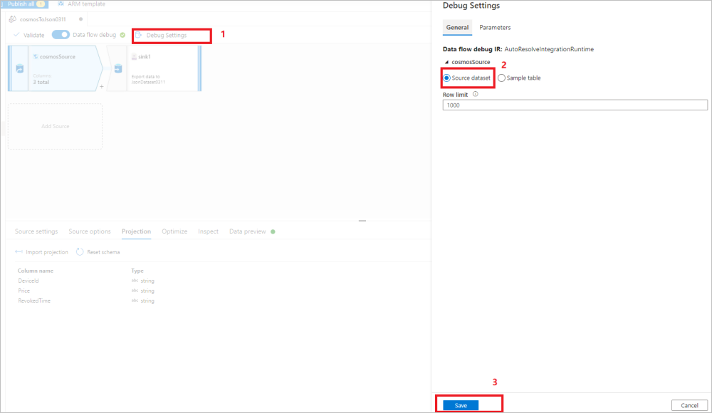
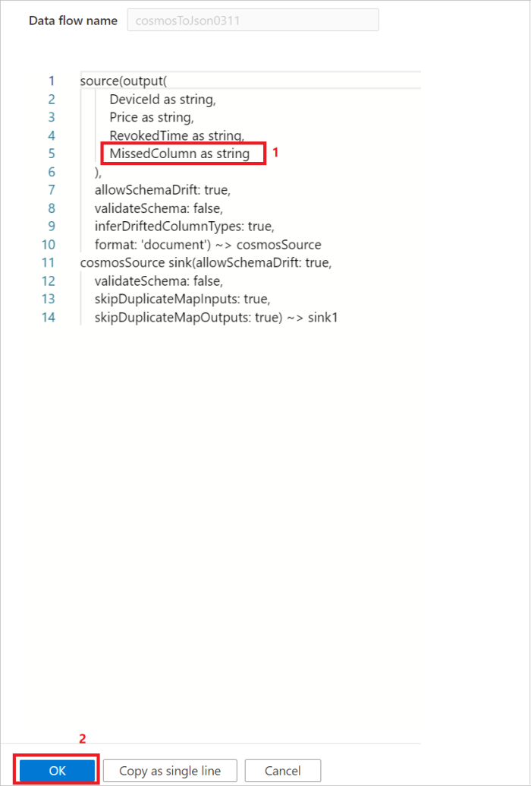
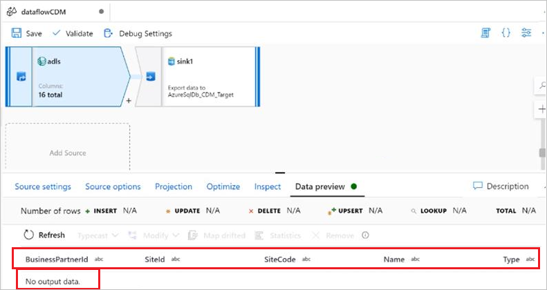
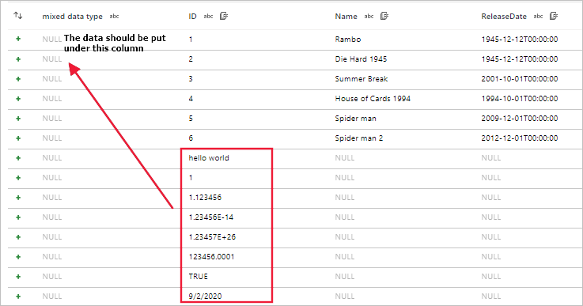
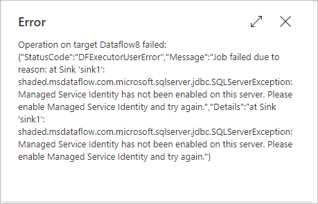

# Troubleshoot connector and format issues in mapping data flows in Azure Data Factory


This article explores troubleshooting methods related to connector and format for mapping data flows in Azure Data Factory (ADF).


## Cosmos DB & JSON

### Support customized schemas in the source

#### Symptoms
When you want to use the ADF data flow to move or transfer data from Cosmos DB/JSON into other data stores, some columns of the source data may be missed. 

#### Cause 
For the schema free connectors (the column number, column name and column data type of each row can be different when comparing with others), by default, ADF uses sample rows (for example, top 100 or 1000 rows data) to infer the schema, and the inferred result will be used as a schema to read data. So if your data stores have extra columns that don't appear in sample rows, the data of these extra columns are not read, moved or transferred into sink data stores.

#### Recommendation
To overwrite the default behavior and bring in additional fields, ADF provides options for you to customize the source schema. You can specify additional/missing columns that could be missing in schema-infer-result in the data flow source projection to read the data, and you can apply one of the following options to set the customized schema. Usually, **Option-1** is more preferred.

- **Option-1**: Compared with the original source data that may be one large file, table or container that contains millions of rows with complex schemas, you can create a temporary table/container with a few rows that contain all the columns you want to read, and then move on to the following operation: 

    1. Use the data flow source **Debug Settings** to have **Import projection** with sample files/tables to get the complete schema. You can follow the steps in the following picture:<br/>

        <br/>
         1. Select **Debug settings** in the data flow canvas.
         1. In the pop-up pane, select **Sample table** under the **cosmosSource** tab, and enter the name of your table in the **Table** block.
         1. Select **Save** to save your settings.
         1. Select **Import projection**.<br/>  
    
    1. Change the **Debug Settings** back to use the source dataset for the remaining data movement/transformation. You can move on with the steps in the following picture:<br/>

         <br/>   
         1. Select **Debug settings** in the data flow canvas.
         1. In the pop-up pane, select **Source dataset** under the **cosmosSource** tab.
         1. Select **Save** to save your settings.<br/>
    
    Afterwards, the ADF data flow runtime will honor and use the customized schema to read data from the original data store. <br/>

- **Option-2**: If you are familiar with the schema and DSL language of the source data, you can manually update the data flow source script to add additional/missed columns to read the data. An example is shown in the following picture: 

    

## CDM

### Model.Json files with special characters

#### Symptoms 
You may encounter an issue that the final name of the model.json file contains special characters.  

#### Error Message  
`at Source 'source1': java.lang.IllegalArgumentException: java.net.URISyntaxException: Relative path in absolute URI: PPDFTable1.csv@snapshot=2020-10-21T18:00:36.9469086Z. ` 

#### Recommendation  
Replace the special chars in the file name, which will work in the synapse but not in ADF.  

### No data output in the data preview or after running pipelines

#### Symptoms
When you use the manifest.json for CDM, no data is shown in the data preview or shown after running a pipeline. Only headers are shown. You can see this issue in the picture below.<br/>


#### Cause
The manifest document describes the CDM folder, for example, what entities that you have in the folder, references of those entities and the data that corresponds to this instance. Your manifest document misses the `dataPartitions` information that indicates ADF where to read the data, and  since it is empty, it returns zero data. 

#### Recommendation
Update your manifest document to have the `dataPartitions` information, and you can refer to this example manifest document to update your document: [Common Data Model metadata: Introducing manifest-Example manifest document](https://docs.microsoft.com/common-data-model/cdm-manifest#example-manifest-document).

### JSON array attributes are inferred as separate columns

#### Symptoms 
You may encounter an issue where one attribute (string type) of the CDM entity has a JSON array as data. When this data is encountered, ADF infers the data as separate columns incorrectly. As you can see from the following pictures, a single attribute presented in the source (msfp_otherproperties) is inferred as a separate column in the CDM connector’s preview.<br/> 

- In the CSV source data (refer to the second column): <br/>

    

- In the CDM source data preview: <br/>

    

 
You may also try to map drifted columns and use the data flow expression to transform this attribute as an array. But since this attribute is read as a separate column when reading, transforming to an array does not work.  

#### Cause
This issue is likely caused by the commas within your JSON object value for that column. Since your data file is expected to be a CSV file, the comma indicates that it is the end of a column’s value. 

#### Recommendation
To solve this problem, you need to double quote your JSON column and avoid any of the inner quotes with a backslash (`\`). In this way, the contents of that column’s value can be read in as a single column entirely.  
  
>[!Note]
>The CDM doesn’t inform that the data type of the column value is JSON, yet it informs that it is a string and parsed as such.

### Unable to fetch data in the data flow preview

#### Symptoms
You use CDM with model.json generated by Power BI. When you preview the CDM data using the data flow preview, you encounter an error: `No output data.`

#### Cause
 The following code exists in the partitions in the model.json file generated by the Power BI data flow.
```json
"partitions": [  
{  
"name": "Part001",  
"refreshTime": "2020-10-02T13:26:10.7624605+00:00",  
"location": "https://datalakegen2.dfs.core.windows.net/powerbi/salesEntities/salesPerfByYear.csv @snapshot=2020-10-02T13:26:10.6681248Z"  
}  
```
For this model.json file, the issue is the naming schema of the data partition file has special characters, and supporting file paths with '@' do not exist currently.  

#### Recommendation
Please remove the `@snapshot=2020-10-02T13:26:10.6681248Z` part from the data partition file name and the model.json file, and then try again. 

### The corpus path is null or empty

#### Symptoms
When you use CDM in the data flow with the model format, you cannot preview the data, and you encounter the error: `DF-CDM_005 The corpus path is null or empty`. The error is shown in the following picture:  


#### Cause
Your data partition path in the model.json is pointing to a blob storage location and not your data lake. The location should have the base URL of **.dfs.core.windows.net** for the ADLS Gen2. 

#### Recommendation
To solve this issue, you can refer to this article: [ADF Adds Support for Inline Datasets and Common Data Model to Data Flows](https://techcommunity.microsoft.com/t5/azure-data-factory/adf-adds-support-for-inline-datasets-and-common-data-model-to/ba-p/1441798), and the following picture shows the way to fix the corpus path error in this article.


### Unable to read CSV data files

#### Symptoms 
You use the inline dataset as the common data model with manifest as a source, and you have provided the entry manifest file, root path, entity name and path. In the manifest, you have the data partitions with the CSV file location. Meanwhile, the entity schema and csv schema are identical, and all validations were successful. However, in the data preview, only the schema rather than the data gets loaded and the data is invisible, which is shown in the following picture:



#### Cause
Your CDM folder is not separated into logical and physical models, and only physical models exist in the CDM folder. The following two articles describe the difference: [Logical definitions](https://docs.microsoft.com/common-data-model/sdk/logical-definitions) and [Resolving a logical entity definition](https://docs.microsoft.com/common-data-model/sdk/convert-logical-entities-resolved-entities).<br/> 

#### Recommendation
For the data flow using CDM as a source, try to use a logical model as your entity reference, and use the manifest that describes the location of the physical resolved entities and the data partition locations. You can see some samples of logical entity definitions within the public CDM github repository: [CDM-schemaDocuments](https://github.com/microsoft/CDM/tree/master/schemaDocuments)<br/>

A good starting point to forming your corpus is to copy the files within the schema documents folder (just that level inside the github repository), and put those files into a folder. Afterwards, you can use one of the predefined logical entities within the repository (as a starting or reference point) to create your logical model.<br/>

Once the corpus is set up, you are recommended to use CDM as a sink within data flows, so that a well-formed CDM folder can be properly created. You can use your CSV dataset as a source and then sink it to your CDM model that you created.

## Delta

### The sink does not support the schema drift with upsert or update

#### Symptoms
You may face the issue that the delta sink in mapping data flows does not support schema drift with upsert/update. The problem is that the schema drift does not work when the delta is the target in a mapping data flow and user configure an update/upsert. 

If a column is added to the source after an "initial" load to the delta, the subsequent jobs just fail with an error that it cannot find the new column, and this happens when you upsert/update with the alter row. It seems to work for inserts only.

#### Error Message
`DF-SYS-01 at Sink 'SnkDeltaLake': org.apache.spark.sql.AnalysisException: cannot resolve target.BICC_RV in UPDATE clause given columns target. `

#### Cause
This is an issue for delta format because of the limitation of io delta library used in the data flow runtime. PG has a backlog item to support the merged schema option for delete/update/upsert as well. 

#### Recommendation
To solve this problem, you need to update the schema firstly and then write the data. You can follow the steps below: <br/>
1. Create one data flow that includes an insert-only delta sink with the merge schema option to update the schema. 
1. After Step 1, use delete/upsert/update to modify the target sink without changing the schema. <br/>

## Azure PostgreSQL

### Encounter an error: Failed with exception: handshake_failure 

#### Symptoms
You use Azure PostgreSQL as a source or sink in the data flow such as previewing data and debugging/triggering run, and you may find the job fails with following error message: 

   `PSQLException: SSL error: Received fatal alert: handshake_failure `<br/>
   `Caused by: SSLHandshakeException: Received fatal alert: handshake_failure.`

#### Cause 
If you use the flexible server or Hyperscale (Citus) for your Azure PostgreSQL server, since the system is built via Spark upon Azure Databricks cluster, there is a limitation in Azure Databricks blocks our system to connect to the Flexible server or Hyperscale (Citus). You can review the following two links as references.
- [Handshake fails trying to connect from Azure Databricks to Azure PostgreSQL with SSL](https://docs.microsoft.com/answers/questions/170730/handshake-fails-trying-to-connect-from-azure-datab.html)
 
- [MCW-Real-time-data-with-Azure-Database-for-PostgreSQL-Hyperscale](https://github.com/microsoft/MCW-Real-time-data-with-Azure-Database-for-PostgreSQL-Hyperscale/blob/master/Hands-on%20lab/HOL%20step-by%20step%20-%20Real-time%20data%20with%20Azure%20Database%20for%20PostgreSQL%20Hyperscale.md)<br/>
    Refer to the content in the following picture in this article：<br/>

    

#### Recommendation
You can try to use copy activities to unblock this issue. 

## CSV and Excel

### Set the quote character to 'no quote char' is not supported in the CSV
 
#### Symptoms

There are several issues that are not supported in the CSV when the quote character is set to 'no quote char':

1. When the quote character is set to 'no quote char', multi-char column delimiter can't start and end with the same letters.
2. When the quote character is set to 'no quote char', multi-char column delimiter can't contain the escape character: `\`.
3. When the quote character is set to 'no quote char', column value can't contain row delimiter.
4. The quote character and the escape character cannot both be empty (no quote and no escape) if the column value contains a column delimiter.

#### Cause

Causes of the symptoms are stated below with examples respectively:
1. Start and end with the same letters.<br/>
`column delimiter: $*^$*`<br/>
`column value: abc$*^    def`<br/>
`csv sink: abc$*^$*^$*def ` <br/>
`will be read as "abc" and "^&*def"`<br/>

2. The multi-char delimiter contains escape characters.<br/>
`column delimiter: \x`<br/>
`escape char:\`<br/>
`column value: "abc\\xdef"`<br/>
The escape character will either escape the column delimiter or the escape the character.

3. The column value contains the row delimiter. <br/>
`We need quote character to tell if row delimiter is inside column value or not.`

4. The quote character and the escape character both be empty and the column value contains column delimiters.<br/>
`Column delimiter: \t`<br/>
`column value: 111\t222\t33\t3`<br/>
`It will be ambigious if it contains 3 columns 111,222,33\t3 or 4 columns 111,222,33,3.`<br/>

#### Recommendation
The first symptom and the second symptom cannot be solved currently. For the third and fourth symptoms, you can apply the following methods:
- For Symptom 3, do not use the 'no quote char' for a multiline csv file.
- For Symptom 4, set either the quote character or the escape character as non-empty, or you can remove all column delimiters inside your data.

### Read files with different schemas error

#### Symptoms

When you use data flows to read files such as CSV and Excel files with different schemas, the data flow debug, sandbox or activity run will fail.
- For CSV, the data misalignment exists when the schema of files is different. 

    

- For Excel, an error occurs when the schema of the file is different.

    

#### Cause

Reading files with different schemas in the data flow is not supported.

#### Recommendation

If you still want to transfer files such as CSV and Excel files with different schemas in the data flow, you can use the ways below to work around:

- For CSV, you need to manually merge the schema of different files to get the full schema. For example, file_1 has columns `c_1, c_2, c_3` while file_2 has columns `c_3, c_4,... c_10`, so the merged and the full schema is `c_1, c_2... c_10`. Then make other files also have the same full schema even though it does not have data, for example, file_x only has columns `c_1, c_2, c_3, c_4`, please add additional columns `c_5, c_6, ... c_10` in the file, then it can work.

- For Excel, you can solve this issue by applying one of the following options:

    - **Option-1**: You need to manually merge the schema of different files to get the full schema. For example, file_1 has columns `c_1, c_2, c_3` while file_2 has columns `c_3, c_4,... c_10`, so the merged and full schema is `c_1, c_2... c_10`. Then make other files also have the same schema even though it does not have data, for example, file_x with sheet "SHEET_1" only has columns `c_1, c_2, c_3, c_4`, please add additional columns `c_5, c_6, ... c_10` in the sheet too, and then it can work.
    - **Option-2**: Use **range (for example, A1:G100) + firstRowAsHeader=false**, and then it can load data from all Excel files even though the column name and count is different.

## Azure Synapse Analytics

### Serverless pool (SQL on-demand) related issues

#### Symptoms
You use the Azure Synapse Analytics as a source and the linked service actually is a Synapse serverless pool. It's former named is SQL on-demand pool, and it can be distinguished by the server name contains `ondemand`, for example, `space-ondemand.sql.azuresynapse.net`. You may face with several unique failures as below:<br/>

1. When you want to use Synapse serverless pool as a Sink, you face the following error:<br/>
`Sink results in 0 output columns. Please ensure at least one column is mapped`
1. When you select 'enable staging' in the Source, you face the following error:
`shaded.msdataflow.com.microsoft.sqlserver.jdbc.SQLServerException: Incorrect syntax near 'IDENTITY'.`
1. When you want to fetch data from an external table, you face the following error: `shaded.msdataflow.com.microsoft.sqlserver.jdbc.SQLServerException: External table 'dbo' is not accessible because location does not exist or it is used by another process.`
1. When you want to fetch data from Cosmos DB through Serverless pool by query/from view, you face the following error: 
 `Job failed due to reason: Connection reset.`
1. When you want to fetch data from a view, you may face with different errors.

#### Cause
Causes of the symptoms are stated below respectively:
1. Serverless pool cannot be used as a sink. It doesn't support write data into the database.
1. Serverless pool doesn't support PolyBase, so 'enable staging' is not supported.
1. The authentication method that you use doesn't have a correct permission to the external data source where the external table referring to.
1. There is a known limitation in Synapse serverless pool, blocking you to fetch Cosmos DB data from data flows.
1. View is a virtual table based on an SQL statement. The root cause is inside the statement of the view.

#### Recommendation

You can apply the following steps to solve your issues correspondingly.
1. You should better not use serverless pool as a sink.
1. Do not use 'enable staging' in Source for serverless pool.
1. Only service principal/managed identity that has the permission to the external table data can query it. You should grant 'Storage Blob Data Contributor' permission to the external data source for the authentication method that you use in the ADF.
    >[!Note]
    > The user-password authentication can not query external tables. You can refer to this article for more information: [Security model](https://docs.microsoft.com/azure/synapse-analytics/metadata/database#security-model).

1. You can use copy activity to fetch Cosmos DB data from the serverless pool.
1. You can provide the SQL statement which creates the view to the engineering support team, and they can help analyze if the statement hits an authentication issue or something else.


### Load small size data to Data Warehouse without staging is slow 

#### Symptoms
When you load small data to Data Warehouse without staging, it will take a long time to finish. For example, the data size 2 MB but it takes more than 1 hour to finish. 

#### Cause
This issue is caused by the row count rather than the size. The row count has few thousand, and each insert needs to be packaged into an independent request, go to the control node, start a new transaction, get locks and go to the distribution node repeatedly. Bulk load gets the lock once, and each distribution node performs the insert by batching into memory efficiently.

If 2 MB is inserted as just a few records, it would be fast. For example, it would be fast if each record is 500 kb * 4 rows. 

#### Recommendation
You need to enable staging to improve the performance.


### Read empty string value ("") as NULL with the enable staging 

#### Symptoms
When you use Synapse as a source in the data flow such as previewing data and debugging/triggering run and enable staging to use the PolyBase, if your column value contains empty string value (`""`), it will be changed to null.

#### Cause
The data flow back end uses Parquet as the PolyBase format, and there is a known limitation in the Synapse SQL pool gen2, which will automatically change the empty string value to null.

#### Recommendation
You can try to solve this issue by the following methods:
1. If your data size is not huge, you can disable **Enable staging** in the Source, but the performance will be affected.
1. If you need to enable staging, you can use **iifNull()** function to manually change the specific column from null to empty string value.

### Managed service identity error

#### Symptoms
When you use the Synapse as a source/sink in the data flow to preview data, debug/trigger run, etc. and enable staging to use the PolyBase, and the staging store's linked service (Blob, Gen2, etc.) is created to use the Managed Identity (MI) authentication, your job could fail with the following error shown in the picture: <br/>



#### Error Message
`shaded.msdataflow.com.microsoft.sqlserver.jdbc.SQLServerException: Managed Service Identity has not been enabled on this server. Please enable Managed Service Identity and try again.`

#### Cause
1. If the SQL pool is created from Synapse workspace, MI authentication on staging store with the PolyBase is not supported for the old SQL pool. 
1. If the SQL pool is the old Data Warehouse (DWH) version, MI of the SQL server is not assigned to the staging store.

#### Recommendation
You need to confirm if the SQL pool is created from the Synapse workspace.

- If the SQL pool is created from the Synapse workspace, you need to re-register the MI of the workspace. You can apply the following steps to work around this issue by re-registering the workspace's MI:
    1. Go to your Synapse workspace in the Azure portal.
    1. Go to the **managed identities** blade.
    1. If the **Allow pipelines** option is already to be checked, you must uncheck this setting and save.
    1. Check the **Allow pipelines** option and save.

- If the SQL pool is the old DWH version, only enable MI for your SQL server and assign the permission of the staging store to the MI of your SQL Server. You can refer to the steps in this article as an example: [Use virtual network service endpoints and rules for servers in Azure SQL Database](https://docs.microsoft.com/azure/azure-sql/database/vnet-service-endpoint-rule-overview#steps).

## Next steps
For more help with troubleshooting, see these resources:

*  [Troubleshoot mapping data flows in Azure Data Factory](data-flow-troubleshoot-guide.md)
*  [Data Factory blog](https://azure.microsoft.com/blog/tag/azure-data-factory/)
*  [Data Factory feature requests](https://feedback.azure.com/forums/270578-data-factory)
*  [Azure videos](https://azure.microsoft.com/resources/videos/index/?sort=newest&services=data-factory)
*  [Stack Overflow forum for Data Factory](https://stackoverflow.com/questions/tagged/azure-data-factory)
*  [Twitter information about Data Factory](https://twitter.com/hashtag/DataFactory)