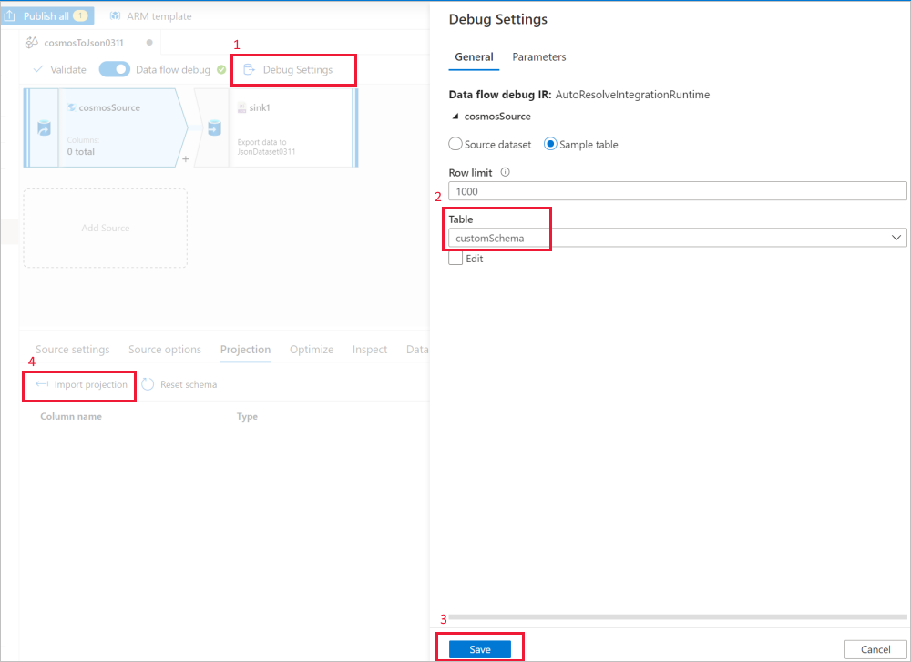

# Troubleshoot connector and format issues in mapping data flows in Azure Data Factory

This article explores troubleshooting methods related to connector and format for mapping data flows in Azure Data Factory.

## CosmosDB & JSON

### Support customized schemas in the source

#### Symptoms
When you want to use ADF dataflow to move or transfer data from CosmosDB/JSON into other data stores, some columns of the source data may be missed. 

#### Cause 
For the schema free connectors (the column number, column name and column data type of each row can be different when comparing with others), currently, Azure Data Factory uses sample rows (for example, top 100 or 1000 rows data) to infer the schema, and the inferred result will be used as a schema to read data. So if your data stores has extra columns that don't appear in sample rows, the data of these extra columns cannot be read, moved or transferred into sink data stores.

#### Recommendation
In order to solve up the known issue/limitation, a feature named "support customized schema in schema free connectivity" was enabled in ADF dataflow. You can feel free to specify additional/missing columns which could be missing in schema-infer-result in the dataflow source projection to read the data, and you can apply one of the following options to set the customized schema. Usually, **Option-1** is more preferred.

- **Option-1**: Compared with the original source data that may be one large file, table or container that contains millions of rows with complex schemas, you can create a temporary table/container with a few rows that contain all the columns you want to read, and then move on to the following operation: 

    1. Use the dataflow source **Debug Settings** to have **Import projection** with sample files/tables to get the complete schema. You can follow the steps in the following picture: 
         
         1. Select **Debug settings** in the data flow canvas.
         1. In the pop-up pane, select **Sample table** under the **cosmosSource** tab. 
         1. Enter the name of your table in the **Table** block.
         1. Select **Save** to save your settings.
         1. Select **Import projection**.   
    
    1. Change the **Debug Settings** back to use the source dataset for the remaining data movement/transformation. You can move on with the steps in the following picture: 
             
         1. Select **Debug settings** in the data flow canvas.
         1. In the pop-up pane, select **Source dataset** under the **cosmosSource** tab.
         1. Select **Save** to save your settings. 
    
    Afterwards, the ADF dataflow runtime will honor and use the customized schema to read data from the original data store.  

- **Option-2**: If you are familiar with the schema and DSL language of the source data, you can manually update the dataflow source script to add additional/missed columns to read the data. An example is shown in the following picture:   
    

## Next steps
For more help with troubleshooting, see these resources:

*  [Data Factory blog](https://azure.microsoft.com/blog/tag/azure-data-factory/)
*  [Data Factory feature requests](https://feedback.azure.com/forums/270578-data-factory)
*  [Azure videos](https://azure.microsoft.com/resources/videos/index/?sort=newest&services=data-factory)
*  [Stack Overflow forum for Data Factory](https://stackoverflow.com/questions/tagged/azure-data-factory)
*  [Twitter information about Data Factory](https://twitter.com/hashtag/DataFactory)