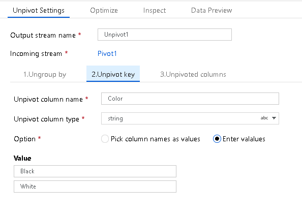
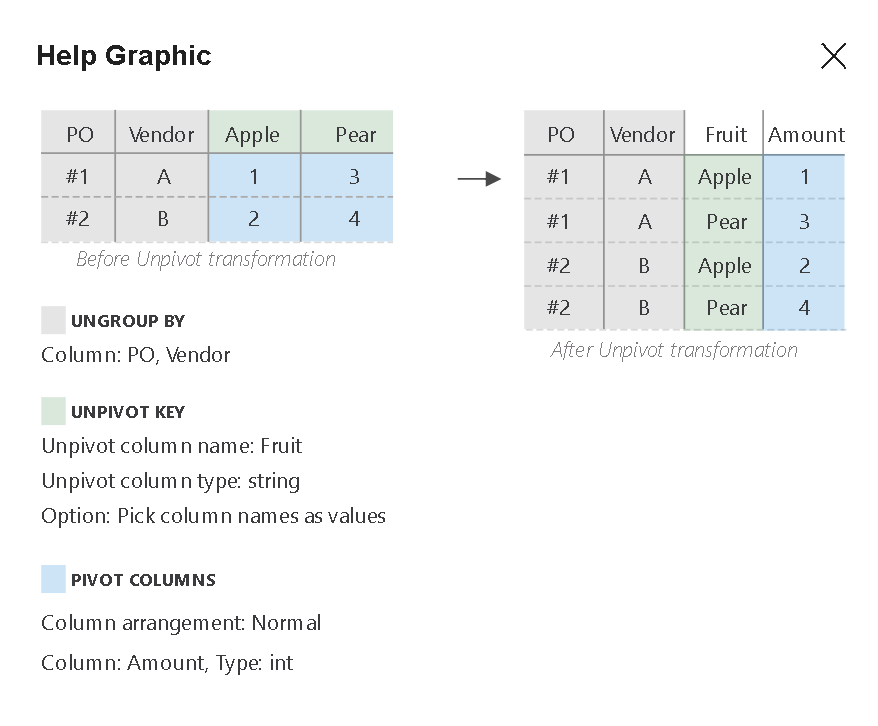

# Unpivot transformation in mapping data flow

[!INCLUDE[appliesto-adf-asa-md](includes/appliesto-adf-asa-md.md)]

Use Unpivot in ADF mapping data flow as a way to turn an unnormalized dataset into a more normalized version by expanding values from multiple columns in a single record into multiple records with the same values in a single column.

> [!VIDEO https://www.microsoft.com/en-us/videoplayer/embed/RE4B1RR]

## Ungroup By

First, set the columns that you wish to ungroup by for your unpivot aggregation. Set one or more columns for ungrouping with the + sign next to the column list.

## Unpivot Key

The Unpivot Key is the column that ADF will pivot from column to row. By default, each unique value in the dataset for this field will pivot to a row. However, you can optionally enter the values from the dataset that you wish to pivot to row values.

## Unpivoted Columns

Lastly, choose the column name for storing the values for unpivoted columns that are transformed into rows.

(Optional) You can drop rows with Null values.

For instance, SumCost is the column name that is chosen in the example shared above.

Setting the Column Arrangement to "Normal" will group together all of the new unpivoted columns from a single value. Setting the columns arrangement to "Lateral" will group together new unpivoted columns generated from an existing column.

The final unpivoted data result set shows the column totals now unpivoted into separate row values.

## Next steps

Use the [Pivot transformation](data-flow-pivot.md) to pivot rows to columns.
