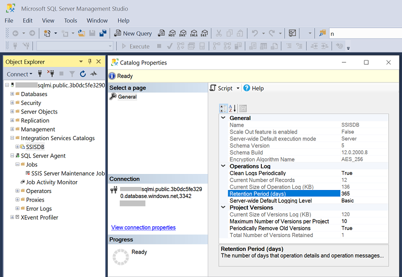
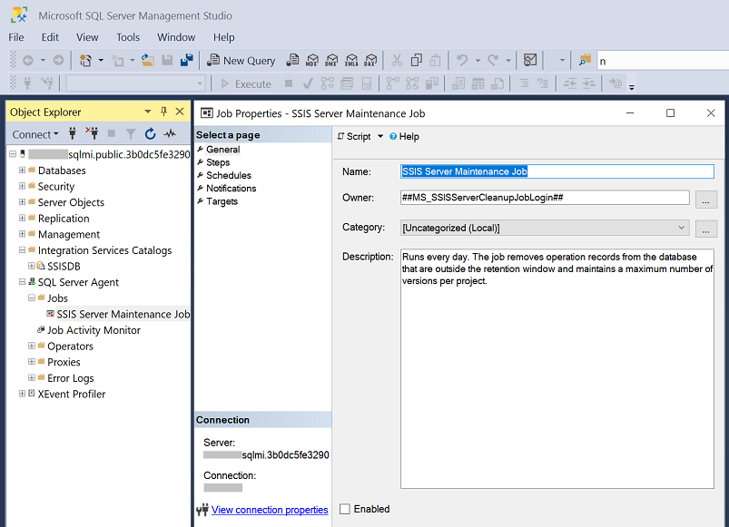
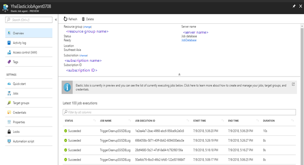

# How to clean up SSISDB logs automatically

[!INCLUDE[appliesto-adf-xxx-md](includes/appliesto-adf-xxx-md.md)]

Once you provision an Azure-SQL Server Integration Services (SSIS) integration runtime (IR) in Azure Data Factory (ADF), you can use it to run SSIS packages deployed into:

- SSIS catalog (SSISDB) hosted by Azure SQL Database server/Managed Instance (Project Deployment Model)
- file system, Azure Files, or SQL Server database (MSDB) hosted by Azure SQL Managed Instance (Package Deployment Model)

In the Project Deployment Model, your Azure-SSIS IR will deploy SSIS projects into SSISDB, fetch SSIS packages to run from SSISDB, and write package execution logs back into SSISDB. To manage the accumulated logs, we've provided relevant SSISDB properties and stored procedure that can be invoked automatically via ADF, Azure SQL Managed Instance Agent, or Elastic Database Jobs.

## SSISDB log clean-up properties and stored procedure
To configure SSISDB log clean-up properties, you can connect to SSISDB hosted by your Azure SQL Database server/Managed Instance using SQL Server Management Studio (SSMS), see [Connecting to SSISDB](/sql/integration-services/lift-shift/ssis-azure-deploy-run-monitor-tutorial?view=sql-server-ver15&preserve-view=true#connect-to-the-ssisdb-database). Once connected, on the **Object Explorer** window of SSMS, you can expand the **Integration Services Catalogs** node, right-click on the **SSISDB** subnode, and select the **Properties** menu item to open **Catalog Properties** dialog box. On the **Catalog Properties** dialog box, you can find the following SSISDB log clean-up properties:

- **Clean Logs Periodically**: Enables automatic clean-up of package execution logs, by default set to *True*.
- **Retention Period (days)**: Specifies the maximum age of retained logs (in days), by default set to *365* and older logs are deleted by automatic clean-up.
- **Periodically Remove Old Versions**: Enables automatic clean-up of stored project versions, by default set to *True*.
- **Maximum Number of Versions per Project**: Specifies the maximum number of stored project versions, by default set to *10* and older versions are deleted by automatic clean-up.



Once SSISDB log clean-up properties are configured, you can invoke the relevant SSISDB stored procedure, `[internal].[cleanup_server_retention_window_exclusive]`, to clean up logs automatically via ADF, Azure SQL Managed Instance Agent, or Elastic Database Jobs.

## Clean up SSISDB logs automatically via ADF
Regardless whether you use Azure SQL database server/Managed Instance to host SSISDB, you can always use ADF to clean up SSISDB logs automatically. To do so, you can prepare an Execute SSIS Package activity in ADF pipeline with an embedded package containing a single Execute SQL Task that invokes the relevant SSISDB stored procedure. See example 4) in our blog: [Run Any SQL Anywhere in 3 Easy Steps with SSIS in Azure Data Factory](https://techcommunity.microsoft.com/t5/sql-server-integration-services/run-any-sql-anywhere-in-3-easy-steps-with-ssis-in-azure-data/ba-p/2457244).


Once your ADF pipeline is prepared, you can attach a schedule trigger to run it periodically, see [How to trigger ADF pipeline on a schedule](quickstart-create-data-factory-portal.md#trigger-the-pipeline-on-a-schedule).

## Clean up SSISDB logs automatically via Azure SQL Managed Instance Agent
If you use Azure SQL Managed Instance to host SSISDB, you can also use its built-in job orchestrator/scheduler, Azure SQL Managed Instance Agent, to clean up SSISDB logs automatically. If SSISDB is recently created in your Azure SQL Managed Instance, we've also created a T-SQL job called **SSIS Server Maintenance Job** under Azure SQL Managed Instance Agent for this purpose. It's by default disabled and configured with a schedule to run daily.  If you want to enable it and or reconfigure its schedule, you can do so by connecting to your Azure SQL Managed Instance using SSMS. Once connected, on the **Object Explorer** window of SSMS, you can expand the **SQL Server Agent** node, expand the **Jobs** subnode, and double click on the **SSIS Server Maintenance Job** to enable/reconfigure it.



If your Azure SQL Managed Instance Agent doesn't yet have the **SSIS Server Maintenance Job** created under it, you can add it manually by running the following T-SQL script on your Azure SQL Managed Instance.

```sql
USE msdb
IF EXISTS(SELECT * FROM sys.server_principals where name = '##MS_SSISServerCleanupJobLogin##')
   DROP LOGIN ##MS_SSISServerCleanupJobLogin##

DECLARE @loginPassword nvarchar(256)
SELECT @loginPassword = REPLACE (CONVERT( nvarchar(256), CRYPT_GEN_RANDOM( 64 )), N'''', N'''''')
EXEC ('CREATE LOGIN ##MS_SSISServerCleanupJobLogin## WITH PASSWORD =''' +@loginPassword + ''', CHECK_POLICY = OFF')
ALTER LOGIN ##MS_SSISServerCleanupJobLogin## DISABLE

USE master
GRANT VIEW SERVER STATE TO ##MS_SSISServerCleanupJobLogin##

USE SSISDB
IF EXISTS (SELECT name FROM sys.database_principals WHERE name = '##MS_SSISServerCleanupJobUser##')
    DROP USER ##MS_SSISServerCleanupJobUser##
CREATE USER ##MS_SSISServerCleanupJobUser## FOR LOGIN ##MS_SSISServerCleanupJobLogin##
GRANT EXECUTE ON [internal].[cleanup_server_retention_window_exclusive] TO ##MS_SSISServerCleanupJobUser##
GRANT EXECUTE ON [internal].[cleanup_server_project_version] TO ##MS_SSISServerCleanupJobUser##

USE msdb
EXEC dbo.sp_add_job
    @job_name = N'SSIS Server Maintenance Job', 
    @enabled = 0,
    @owner_login_name = '##MS_SSISServerCleanupJobLogin##',
    @description = N'Runs every day. The job removes operation records from the database that are outside the retention window and maintains a maximum number of versions per project.'

DECLARE @IS_server_name NVARCHAR(30)
SELECT @IS_server_name = CONVERT(NVARCHAR, SERVERPROPERTY('ServerName'))
EXEC sp_add_jobserver  @job_name = N'SSIS Server Maintenance Job',
                       @server_name = @IS_server_name

EXEC sp_add_jobstep
    @job_name = N'SSIS Server Maintenance Job',
    @step_name = N'SSIS Server Operation Records Maintenance',
    @subsystem = N'TSQL',
    @command = N'
       DECLARE @role int
       SET @role = (SELECT [role] FROM [sys].[dm_hadr_availability_replica_states] hars INNER JOIN [sys].[availability_databases_cluster] adc ON hars.[group_id] = adc.[group_id] WHERE hars.[is_local] = 1 AND adc.[database_name] =''SSISDB'')
       IF DB_ID(''SSISDB'') IS NOT NULL AND (@role IS NULL OR @role = 1)
              EXEC [SSISDB].[internal].[cleanup_server_retention_window_exclusive]',
    @database_name = N'msdb',
    @on_success_action = 3,
    @retry_attempts = 3,
    @retry_interval = 3;

EXEC sp_add_jobstep
    @job_name = N'SSIS Server Maintenance Job',
    @step_name = N'SSIS Server Max Version Per Project Maintenance',
    @subsystem = N'TSQL',
    @command = N'
       DECLARE @role int
       SET @role = (SELECT [role] FROM [sys].[dm_hadr_availability_replica_states] hars INNER JOIN [sys].[availability_databases_cluster] adc ON hars.[group_id] = adc.[group_id] WHERE hars.[is_local] = 1 AND adc.[database_name] =''SSISDB'')
       IF DB_ID(''SSISDB'') IS NOT NULL AND (@role IS NULL OR @role = 1)
              EXEC [SSISDB].[internal].[cleanup_server_project_version]',
    @database_name = N'msdb',
    @retry_attempts = 3,
    @retry_interval = 3;

EXEC sp_add_jobschedule
    @job_name = N'SSIS Server Maintenance Job',
    @name = 'SSISDB Scheduler',
    @enabled = 1,
    @freq_type = 4, /*daily*/
    @freq_interval = 1,/*every day*/
    @freq_subday_type = 0x1,
    @active_start_date = 20001231,
    @active_end_date = 99991231,
    @active_start_time = 0,
    @active_end_time = 120000
```

## Clean up SSISDB logs automatically via Elastic Database Jobs
If you use Azure SQL Database server to host SSISDB, it doesn't have a built-in job orchestrator/scheduler, so you must use an external component, e.g. ADF (see above) or Elastic Database Jobs (see the rest of this section), to clean up SSISDB logs automatically.

Elastic Database Jobs is an Azure service that can automate and run jobs against a database or group of databases. You can schedule, run, and monitor these jobs by using Azure portal, Azure PowerShell, T-SQL, or REST APIs. Use Elastic Database Jobs to invoke the relevant SSISDB stored procedure for log clean-up one time or on a schedule. You can choose the schedule interval based on SSISDB resource usage to avoid heavy database load.

For more info, see [Manage groups of databases with Elastic Database Jobs](../azure-sql/database/elastic-jobs-overview.md).

The following sections describe how to invoke the relevant SSISDB stored procedure, `[internal].[cleanup_server_retention_window_exclusive]`, which removes SSISDB logs that are outside the configured retention window.

### Configure Elastic Database Jobs using Azure PowerShell

[!INCLUDE [requires-azurerm](../../includes/requires-azurerm.md)]

The following Azure PowerShell scripts create a new Elastic Job that invokes SSISDB log clean-up stored procedure. For more info, see [Create an Elastic Job agent using PowerShell](../azure-sql/database/elastic-jobs-powershell-create.md).

#### Create parameters

``` powershell
# Parameters needed to create your job database
param(
$ResourceGroupName = $(Read-Host "Please enter an existing resource group name"),
$AgentServerName = $(Read-Host "Please enter the name of an existing Azure SQL Database server, for example myjobserver, to hold your job database"),
$SSISDBLogCleanupJobDB = $(Read-Host "Please enter a name for your job database to be created in the given Azure SQL Database server"),

# Your job database should be a clean, empty S0 or higher service tier. We set S0 as default.
$PricingTier = "S0",

# Parameters needed to create your Elastic Job agent
$SSISDBLogCleanupAgentName = $(Read-Host "Please enter a name for your Elastic Job agent"),

# Parameters needed to create credentials in your job database for connecting to SSISDB
$PasswordForSSISDBCleanupUser = $(Read-Host "Please provide a new password for the log clean-up job user to connect to SSISDB"),

# Parameters needed to create the login and user for SSISDB
$SSISDBServerEndpoint = $(Read-Host "Please enter the name of target Azure SQL Database server that contains SSISDB, for example myssisdbserver") + '.database.windows.net',
$SSISDBServerAdminUserName = $(Read-Host "Please enter the target server admin username for SQL authentication"),
$SSISDBServerAdminPassword = $(Read-Host "Please enter the target server admin password for SQL authentication"),
$SSISDBName = "SSISDB",

# Parameters needed to set the job schedule for invoking SSISDB log clean-up stored procedure
$RunJobOrNot = $(Read-Host "Please indicate whether you want to run the job to clean up SSISDB logs outside the retention window immediately (Y/N). Make sure the retention window is set properly before running the following scripts as deleted logs cannot be recovered."),
$IntervalType = $(Read-Host "Please enter the interval type for SSISDB log clean-up schedule: Year, Month, Day, Hour, Minute, Second are supported."),
$IntervalCount = $(Read-Host "Please enter the count of interval type for SSISDB log clean-up schedule."),

# The start time for SSISDB log clean-up schedule is set to current time by default. 
$StartTime = (Get-Date)
```

#### Invoke SSISDB log clean-up stored procedure

```powershell
# Install the latest PowerShell PackageManagement module that PowerShellGet v1.6.5 depends on
Find-Package PackageManagement -RequiredVersion 1.1.7.2 | Install-Package -Force

# You may need to restart your PowerShell session
# Install the latest PowerShellGet module that adds the -AllowPrerelease flag to Install-Module
Find-Package PowerShellGet -RequiredVersion 1.6.5 | Install-Package -Force

# Install AzureRM.Sql preview cmdlets side by side with the existing AzureRM.Sql version
Install-Module -Name AzureRM.Sql -AllowPrerelease -Force

# Sign in to your Azure account
Connect-AzureRmAccount

# Create your job database for defining SSISDB log clean-up job and tracking the job history
Write-Output "Creating a blank SQL database to be used as your job database ..."
$JobDatabase = New-AzureRmSqlDatabase -ResourceGroupName $ResourceGroupName -ServerName $AgentServerName -DatabaseName $SSISDBLogCleanupJobDB -RequestedServiceObjectiveName $PricingTier
$JobDatabase

# Enable Elastic Database Jobs preview in your Azure subscription
Register-AzureRmProviderFeature -FeatureName sqldb-JobAccounts -ProviderNamespace Microsoft.Sql

# Create your Elastic Job agent
Write-Output "Creating your Elastic Job agent..."
$JobAgent = $JobDatabase | New-AzureRmSqlElasticJobAgent -Name $SSISDBLogCleanupAgentName
$JobAgent

# Create job credentials in your job database for connecting to SSISDB in target server
Write-Output "Creating job credentials for connecting to SSISDB..."
$JobCredSecure = ConvertTo-SecureString -String $PasswordForSSISDBCleanupUser -AsPlainText -Force
$JobCred = New-Object -TypeName "System.Management.Automation.PSCredential" -ArgumentList "SSISDBLogCleanupUser", $JobCredSecure
$JobCred = $JobAgent | New-AzureRmSqlElasticJobCredential -Name "SSISDBLogCleanupUser" -Credential $JobCred

# Create the job user login in master database of target server
Write-Output "Grant permissions on the master database of target server..."
$Params = @{
  'Database' = 'master'
  'ServerInstance' = $SSISDBServerEndpoint
  'Username' = $SSISDBServerAdminUserName
  'Password' = $SSISDBServerAdminPassword
  'OutputSqlErrors' = $true
  'Query' = "CREATE LOGIN SSISDBLogCleanupUser WITH PASSWORD = '" + $PasswordForSSISDBCleanupUser + "'"
}
Invoke-SqlCmd @Params

# Create SSISDB log clean-up user from login in SSISDB and grant it permissions to invoke SSISDB log clean-up stored procedure
Write-Output "Grant appropriate permissions on SSISDB..."
$TargetDatabase = $SSISDBName
$CreateJobUser = "CREATE USER SSISDBLogCleanupUser FROM LOGIN SSISDBLogCleanupUser"
$GrantStoredProcedureExecution = "GRANT EXECUTE ON internal.cleanup_server_retention_window_exclusive TO SSISDBLogCleanupUser"

$TargetDatabase | ForEach-Object -Process {
  $Params.Database = $_
  $Params.Query = $CreateJobUser
  Invoke-SqlCmd @Params
  $Params.Query = $GrantStoredProcedureExecution
  Invoke-SqlCmd @Params
}

# Create your target group that includes only SSISDB to clean up
Write-Output "Creating your target group that includes only SSISDB to clean up..."
$SSISDBTargetGroup = $JobAgent | New-AzureRmSqlElasticJobTargetGroup -Name "SSISDBTargetGroup"
$SSISDBTargetGroup | Add-AzureRmSqlElasticJobTarget -ServerName $SSISDBServerEndpoint -Database $SSISDBName 

# Create your job to invoke SSISDB log clean-up stored procedure
Write-Output "Creating your job to invoke SSISDB log clean-up stored procedure..."
$JobName = "CleanupSSISDBLog"
$Job = $JobAgent | New-AzureRmSqlElasticJob -Name $JobName -RunOnce
$Job

# Add your job step to invoke internal.cleanup_server_retention_window_exclusive
Write-Output "Adding your job step to invoke SSISDB log clean-up stored procedure..."
$SqlText = "EXEC internal.cleanup_server_retention_window_exclusive"
$Job | Add-AzureRmSqlElasticJobStep -Name "Step to invoke SSISDB log clean-up stored procedure" -TargetGroupName $SSISDBTargetGroup.TargetGroupName -CredentialName $JobCred.CredentialName -CommandText $SqlText

# Run your job to immediately invoke SSISDB log clean-up stored procedure once
if ($RunJobOrNot -eq 'Y')
{
Write-Output "Invoking SSISDB log clean-up stored procedure immediately..."
$JobExecution = $Job | Start-AzureRmSqlElasticJob
$JobExecution
}

# Schedule your job to invoke SSISDB log clean-up stored procedure periodically, deleting SSISDB logs outside the retention window
Write-Output "Starting your schedule to invoke SSISDB log clean-up stored procedure periodically..."
$Job | Set-AzureRmSqlElasticJob -IntervalType $IntervalType -IntervalCount $IntervalCount -StartTime $StartTime -Enable
```

### Configure Elastic Database Jobs using T-SQL

The following T-SQL scripts create a new Elastic Job that invokes SSISDB log clean-up stored procedure. For more info, see [Use T-SQL to create and manage Elastic Database Jobs](../azure-sql/database/elastic-jobs-tsql-create-manage.md).

1. Identify an empty S0/higher service tier of Azure SQL Database or create a new one for your job database. Then create an Elastic Job Agent in [Azure portal](https://ms.portal.azure.com/#create/Microsoft.SQLElasticJobAgent).

2. In your job database, create credentials for connecting to SSISDB in your target server.

    ```sql
    -- Connect to the job database specified when creating your job agent.
    -- Create a database master key if one doesn't already exist, using your own password.
    CREATE MASTER KEY ENCRYPTION BY PASSWORD= '<EnterStrongPasswordHere>';

    -- Create credentials for SSISDB log clean-up.
    CREATE DATABASE SCOPED CREDENTIAL SSISDBLogCleanupCred WITH IDENTITY = 'SSISDBLogCleanupUser', SECRET = '<EnterStrongPasswordHere>'; 
    ```

3. Define your target group that includes only SSISDB to clean up.

    ```sql
    -- Connect to your job database.
    -- Add your target group.
    EXEC jobs.sp_add_target_group 'SSISDBTargetGroup'

    -- Add SSISDB to your target group
    EXEC jobs.sp_add_target_group_member 'SSISDBTargetGroup',
    @target_type = 'SqlDatabase',
    @server_name = '<EnterSSISDBTargetServerName>',
    @database_name = 'SSISDB'

    -- View your recently created target group and its members.
    SELECT * FROM jobs.target_groups WHERE target_group_name = 'SSISDBTargetGroup';
    SELECT * FROM jobs.target_group_members WHERE target_group_name = 'SSISDBTargetGroup';
    ```
4. Create SSISDB log clean-up user from login in SSISDB and grant it permissions to invoke SSISDB log clean-up stored procedure. For detailed guidance, see [Manage logins](../azure-sql/database/logins-create-manage.md).

    ```sql
    -- Connect to the master database of target server that hosts SSISDB 
    CREATE LOGIN SSISDBLogCleanupUser WITH PASSWORD = '<strong_password>';

    -- Connect to SSISDB
    CREATE USER SSISDBLogCleanupUser FROM LOGIN SSISDBLogCleanupUser;
    GRANT EXECUTE ON internal.cleanup_server_retention_window_exclusive TO SSISDBLogCleanupUser
    ```
5. Create your job and add your job step to invoke SSISDB log clean-up stored procedure.

    ```sql
    -- Connect to your job database.
    -- Add your job to invoke SSISDB log clean-up stored procedure.
    EXEC jobs.sp_add_job @job_name='CleanupSSISDBLog', @description='Remove SSISDB logs outside the configured retention window'

    -- Add your job step to invoke internal.cleanup_server_retention_window_exclusive
    EXEC jobs.sp_add_jobstep @job_name='CleanupSSISDBLog',
    @command=N'EXEC internal.cleanup_server_retention_window_exclusive',
    @credential_name='SSISDBLogCleanupCred',
    @target_group_name='SSISDBTargetGroup'
    ```
6. Before continuing, make sure you set the retention window properly. SSISDB logs outside this window will be deleted and can't be recovered. You can then run your job immediately to start SSISDB log clean-up.

    ```sql
    -- Connect to your job database.
    -- Run your job immediately to invoke SSISDB log clean-up stored procedure.
    declare @je uniqueidentifier
    exec jobs.sp_start_job 'CleanupSSISDBLog', @job_execution_id = @je output

    -- Watch SSISDB log clean-up results 
    select @je
    select * from jobs.job_executions where job_execution_id = @je
    ```
7. Optionally, you can delete SSISDB logs outside the retention window on a schedule. Configure your job parameters as follows.

    ```sql
    -- Connect to your job database.
    EXEC jobs.sp_update_job
    @job_name='CleanupSSISDBLog',
    @enabled=1,
    @schedule_interval_type='<EnterIntervalType(Month,Day,Hour,Minute,Second)>',
    @schedule_interval_count='<EnterDetailedIntervalValue>',
    @schedule_start_time='<EnterProperStartTimeForSchedule>',
    @schedule_end_time='<EnterProperEndTimeForSchedule>'
    ```

### Monitor SSISDB log clean-up job using Azure portal

You can monitor SSISDB log clean-up job in Azure portal. For each execution, you can see its status, start time, and end time.



### Monitor SSISDB log clean-up job using T-SQL

You can also use T-SQL to view the execution history of SSISDB log clean-up job.

```sql
-- Connect to your job database.
-- View all SSISDB log clean-up job executions.
SELECT * FROM jobs.job_executions WHERE job_name = 'CleanupSSISDBLog' 
ORDER BY start_time DESC

-- View all active executions.
SELECT * FROM jobs.job_executions WHERE is_active = 1
ORDER BY start_time DESC
```

## Next steps

To manage and monitor your Azure-SSIS IR, see the following articles.

- [Reconfigure the Azure-SSIS integration runtime](manage-azure-ssis-integration-runtime.md)

- [Monitor the Azure-SSIS integration runtime](monitor-integration-runtime.md#azure-ssis-integration-runtime).
