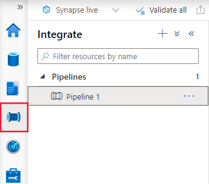
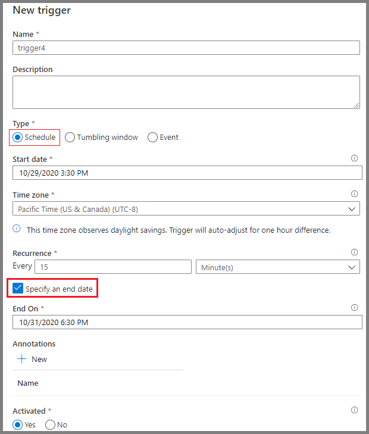
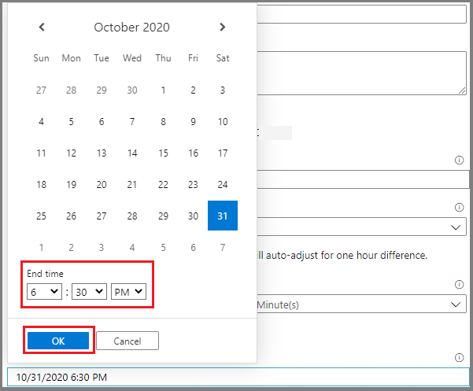
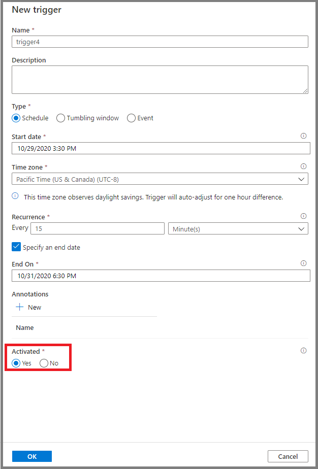
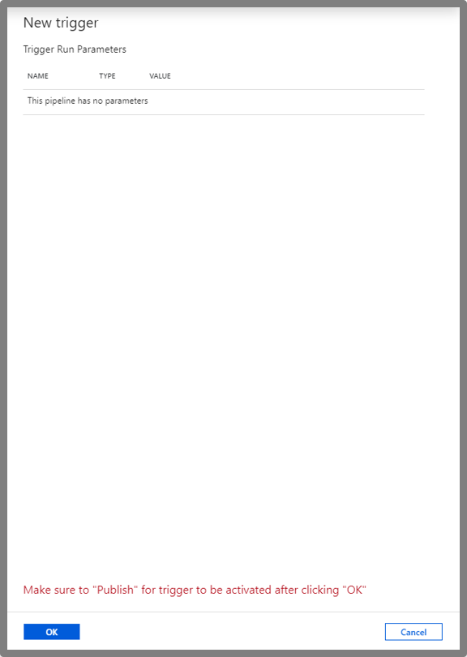
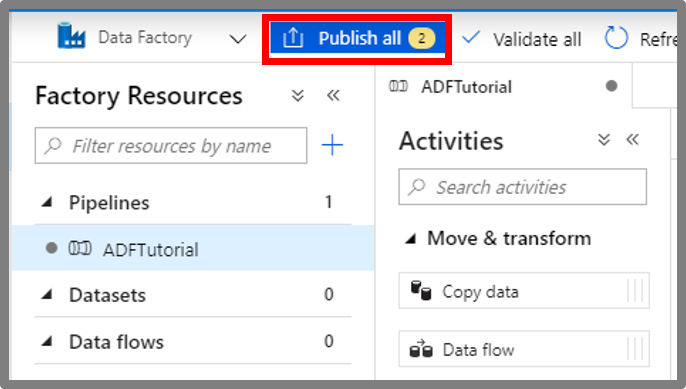

# Create a trigger that runs a pipeline on a schedule

[!INCLUDE[appliesto-adf-asa-md](includes/appliesto-adf-asa-md.md)]

This article provides information about the schedule trigger and the steps to create, start, and monitor a schedule trigger. For other types of triggers, see [Pipeline execution and triggers](concepts-pipeline-execution-triggers.md).

When creating a schedule trigger, you specify a schedule (start date, recurrence, end date etc.) for the trigger, and associate with a pipeline. Pipelines and triggers have a many-to-many relationship. Multiple triggers can kick off a single pipeline. A single trigger can kick off multiple pipelines.

The following sections provide steps to create a schedule trigger in different ways. 

## UI Experience

You can create a **schedule trigger** to schedule a pipeline to run periodically (hourly, daily, etc.). 

> [!NOTE]
> For a complete walkthrough of creating a pipeline and a schedule trigger, which associates the trigger with the pipeline, and runs and monitors the pipeline, see [Quickstart: create a data factory using Data Factory UI](quickstart-create-data-factory-portal.md).

1. Switch to the **Edit** tab in Data Factory or the Integrate tab in Azure Synapse. 

    # [Azure Data Factory](#tab/data-factory)
    

    # [Azure Synapse](#tab/synapse-analytics)
    

---
    
1. Select **Trigger** on the menu, then select **New/Edit**. 

    

1. On the **Add Triggers** page, select **Choose trigger...**, then select **+New**. 

    

1. On the **New Trigger** page, do the following steps: 

    1. Confirm that **Schedule** is selected for **Type**.
    1. Specify the start datetime of the trigger for **Start Date**. It's set to the current datetime in Coordinated Universal Time (UTC) by default.
    1. Specify the time zone that the trigger will be created in. The time zone setting will apply to **Start Date**, **End Date**, and **Schedule Execution Times** in Advanced recurrence options. Changing Time Zone setting will not automatically change your start date. Make sure the Start Date is correct in the specified time zone. Please note that Scheduled Execution time of Trigger will be considered post the Start Date (Ensure Start Date is atleast 1minute lesser than the Execution time else it will trigger pipeline in next recurrence). 

        > [!NOTE]
        > For time zones that observe daylight saving, trigger time will auto-adjust for the twice a year change. To opt out of the daylight saving change, please select a time zone that does not observe daylight saving, for instance UTC

    1. Specify **Recurrence** for the trigger. Select one of the values from the drop-down list (Every minute, Hourly, Daily, Weekly, and Monthly). Enter the multiplier in the text box. For example, if you want the trigger to run once for every 15 minutes, you select **Every Minute**, and enter **15** in the text box. 
    1. In the **Recurrence**, if you choose "Day(s), Week(s) or Month(s)" from the drop-down, you can find "Advanced recurrence options".
    :::image type="content" source="./media/how-to-create-schedule-trigger/advanced.png" alt-text="Advanced recurrence options of Day(s), Week(s) or Month(s)":::
    1. To specify an end date time, select **Specify an End Date**, and specify _Ends On_, then select **OK**. There is a cost associated with each pipeline run. If you are testing, you may want to ensure that the pipeline is triggered only a couple of times. However, ensure that there is enough time for the pipeline to run between the publish time and the end time. The trigger comes into effect only after you publish the solution, not when you save the trigger in the UI.

        

        

1. In the **New Trigger** window, select **Yes** in the **Activated** option, then select **OK**. You can use this checkbox to deactivate the trigger later. 

    

1. In the **New Trigger** window, review the warning message, then select **OK**.

    

1. Select **Publish all** to publish the changes. Until you publish the changes, the trigger doesn't start triggering the pipeline runs. 

    

1. Switch to the **Pipeline runs** tab on the left, then select **Refresh** to refresh the list. You will see the pipeline runs triggered by the scheduled trigger. Notice the values in the **Triggered By** column. If you use the **Trigger Now** option, you will see the manual trigger run in the list. 

    # [Azure Data Factory](#tab/data-factory)

    

    # [Azure Synapse](#tab/synapse-analytics)
    
    
---

1. Switch to the **Trigger Runs** \ **Schedule** view. 

    # [Azure Data Factory](#tab/data-factory)

    

    # [Azure Synapse](#tab/synapse-analytics)
    
    
---

## Azure PowerShell

[!INCLUDE [updated-for-az](../../includes/updated-for-az.md)]

This section shows you how to use Azure PowerShell to create, start, and monitor a schedule trigger. To see this sample working, first go through the [Quickstart: Create a data factory by using Azure PowerShell](quickstart-create-data-factory-powershell.md). Then, add the following code to the main method, which creates and starts a schedule trigger that runs every 15 minutes. The trigger is associated with a pipeline named **Adfv2QuickStartPipeline** that you create as part of the Quickstart.

1. Create a JSON file named **MyTrigger.json** in the C:\ADFv2QuickStartPSH\ folder with the following content:

    > [!IMPORTANT]
    > Before you save the JSON file, set the value of the **startTime** element to the current UTC time. Set the value of the **endTime** element to one hour past the current UTC time.

    ```json
    {
        "properties": {
            "name": "MyTrigger",
            "type": "ScheduleTrigger",
            "typeProperties": {
                "recurrence": {
                    "frequency": "Minute",
                    "interval": 15,
                    "startTime": "2017-12-08T00:00:00Z",
                    "endTime": "2017-12-08T01:00:00Z",
                    "timeZone": "UTC"
                }
            },
            "pipelines": [{
                    "pipelineReference": {
                        "type": "PipelineReference",
                        "referenceName": "Adfv2QuickStartPipeline"
                    },
                    "parameters": {
                        "inputPath": "adftutorial/input",
                        "outputPath": "adftutorial/output"
                    }
                }
            ]
        }
    }
    ```

    In the JSON snippet:
    - The **type** element of the trigger is set to "ScheduleTrigger".
    - The **frequency** element is set to "Minute" and the **interval** element is set to 15. As such, the trigger runs the pipeline every 15 minutes between the start and end times.
    - The **timeZone** element specifies the time zone that the trigger is created in. This setting affects both **startTime** and **endTime**.
    - The **endTime** element is one hour after the value of the **startTime** element. As such, the trigger runs the pipeline 15 minutes, 30 minutes, and 45 minutes after the start time. Don't forget to update the start time to the current UTC time, and the end time to one hour past the start time. 

        > [!IMPORTANT]
        > For UTC timezone, the startTime and endTime need to follow format 'yyyy-MM-ddTHH:mm:ss**Z**', while for other timezones, startTime and endTime follow 'yyyy-MM-ddTHH:mm:ss'. 
        > 
        > Per ISO 8601 standard, the _Z_ suffix to timestamp mark the datetime to UTC timezone, and render timeZone field useless. While missing _Z_ suffix for UTC time zone will result in an error upon trigger _activation_.

    - The trigger is associated with the **Adfv2QuickStartPipeline** pipeline. To associate multiple pipelines with a trigger, add more **pipelineReference** sections.
    - The pipeline in the Quickstart takes two **parameters** values: **inputPath** and **outputPath**. And you pass values for these parameters from the trigger.

1. Create a trigger by using the **Set-AzDataFactoryV2Trigger** cmdlet:

    ```powershell
    Set-AzDataFactoryV2Trigger -ResourceGroupName $ResourceGroupName -DataFactoryName $DataFactoryName -Name "MyTrigger" -DefinitionFile "C:\ADFv2QuickStartPSH\MyTrigger.json"
    ```

1. Confirm that the status of the trigger is **Stopped** by using the **Get-AzDataFactoryV2Trigger** cmdlet:

    ```powershell
    Get-AzDataFactoryV2Trigger -ResourceGroupName $ResourceGroupName -DataFactoryName $DataFactoryName -Name "MyTrigger"
    ```

1. Start the trigger by using the **Start-AzDataFactoryV2Trigger** cmdlet:

    ```powershell
    Start-AzDataFactoryV2Trigger -ResourceGroupName $ResourceGroupName -DataFactoryName $DataFactoryName -Name "MyTrigger"
    ```

1. Confirm that the status of the trigger is **Started** by using the **Get-AzDataFactoryV2Trigger** cmdlet:

    ```powershell
    Get-AzDataFactoryV2Trigger -ResourceGroupName $ResourceGroupName -DataFactoryName $DataFactoryName -Name "MyTrigger"
    ```

1.  Get the trigger runs in Azure PowerShell by using the **Get-AzDataFactoryV2TriggerRun** cmdlet. To get the information about the trigger runs, execute the following command periodically. Update the **TriggerRunStartedAfter** and **TriggerRunStartedBefore** values to match the values in your trigger definition:

    ```powershell
    Get-AzDataFactoryV2TriggerRun -ResourceGroupName $ResourceGroupName -DataFactoryName $DataFactoryName -TriggerName "MyTrigger" -TriggerRunStartedAfter "2017-12-08T00:00:00" -TriggerRunStartedBefore "2017-12-08T01:00:00"
    ```
    
    > [!NOTE]
    > Trigger time of Schedule triggers are specified in UTC timestamp. _TriggerRunStartedAfter_ and _TriggerRunStartedBefore_ also expects UTC timestamp

    To monitor the trigger runs and pipeline runs in the Azure portal, see [Monitor pipeline runs](quickstart-create-data-factory-resource-manager-template.md#monitor-the-pipeline).

## .NET SDK

This section shows you how to use the .NET SDK to create, start, and monitor a trigger. To see this sample working, first go through the [Quickstart: Create a data factory by using the .NET SDK](quickstart-create-data-factory-dot-net.md). Then, add the following code to the main method, which creates and starts a schedule trigger that runs every 15 minutes. The trigger is associated with a pipeline named **Adfv2QuickStartPipeline** that you create as part of the Quickstart.

To create and start a schedule trigger that runs every 15 minutes, add the following code to the main method:

```csharp
            // Create the trigger
            Console.WriteLine("Creating the trigger");

            // Set the start time to the current UTC time
            DateTime startTime = DateTime.UtcNow;

            // Specify values for the inputPath and outputPath parameters
            Dictionary<string, object> pipelineParameters = new Dictionary<string, object>();
            pipelineParameters.Add("inputPath", "adftutorial/input");
            pipelineParameters.Add("outputPath", "adftutorial/output");

            // Create a schedule trigger
            string triggerName = "MyTrigger";
            ScheduleTrigger myTrigger = new ScheduleTrigger()
            {
                Pipelines = new List<TriggerPipelineReference>()
                {
                    // Associate the Adfv2QuickStartPipeline pipeline with the trigger
                    new TriggerPipelineReference()
                    {
                        PipelineReference = new PipelineReference(pipelineName),
                        Parameters = pipelineParameters,
                    }
                },
                Recurrence = new ScheduleTriggerRecurrence()
                {
                    // Set the start time to the current UTC time and the end time to one hour after the start time
                    StartTime = startTime,
                    TimeZone = "UTC",
                    EndTime = startTime.AddHours(1),
                    Frequency = RecurrenceFrequency.Minute,
                    Interval = 15,
                }
            };

            // Now, create the trigger by invoking the CreateOrUpdate method
            TriggerResource triggerResource = new TriggerResource()
            {
                Properties = myTrigger
            };
            client.Triggers.CreateOrUpdate(resourceGroup, dataFactoryName, triggerName, triggerResource);

            // Start the trigger
            Console.WriteLine("Starting the trigger");
            client.Triggers.Start(resourceGroup, dataFactoryName, triggerName);
```

To create triggers in a different time zone, other than UTC, following settings are required:
```csharp
<<ClientInstance>>.SerializationSettings.DateFormatHandling = Newtonsoft.Json.DateFormatHandling.IsoDateFormat;
<<ClientInstance>>.SerializationSettings.DateTimeZoneHandling = Newtonsoft.Json.DateTimeZoneHandling.Unspecified;
<<ClientInstance>>.SerializationSettings.DateParseHandling = DateParseHandling.None;
<<ClientInstance>>.DeserializationSettings.DateParseHandling = DateParseHandling.None;
<<ClientInstance>>.DeserializationSettings.DateFormatHandling = Newtonsoft.Json.DateFormatHandling.IsoDateFormat;
<<ClientInstance>>.DeserializationSettings.DateTimeZoneHandling = Newtonsoft.Json.DateTimeZoneHandling.Unspecified;
```

To monitor a trigger run, add the following code before the last `Console.WriteLine` statement in the sample:

```csharp
            // Check that the trigger runs every 15 minutes
            Console.WriteLine("Trigger runs. You see the output every 15 minutes");

            for (int i = 0; i < 3; i++)
            {
                System.Threading.Thread.Sleep(TimeSpan.FromMinutes(15));
                List<TriggerRun> triggerRuns = client.Triggers.ListRuns(resourceGroup, dataFactoryName, triggerName, DateTime.UtcNow.AddMinutes(-15 * (i + 1)), DateTime.UtcNow.AddMinutes(2)).ToList();
                Console.WriteLine("{0} trigger runs found", triggerRuns.Count);

                foreach (TriggerRun run in triggerRuns)
                {
                    foreach (KeyValuePair<string, string> triggeredPipeline in run.TriggeredPipelines)
                    {
                        PipelineRun triggeredPipelineRun = client.PipelineRuns.Get(resourceGroup, dataFactoryName, triggeredPipeline.Value);
                        Console.WriteLine("Pipeline run ID: {0}, Status: {1}", triggeredPipelineRun.RunId, triggeredPipelineRun.Status);
                        List<ActivityRun> runs = client.ActivityRuns.ListByPipelineRun(resourceGroup, dataFactoryName, triggeredPipelineRun.RunId, run.TriggerRunTimestamp.Value, run.TriggerRunTimestamp.Value.AddMinutes(20)).ToList();
                    }
                }
            }
```

To monitor the trigger runs and pipeline runs in the Azure portal, see [Monitor pipeline runs](quickstart-create-data-factory-resource-manager-template.md#monitor-the-pipeline).

## Python SDK

This section shows you how to use the Python SDK to create, start, and monitor a trigger. To see this sample working, first go through the [Quickstart: Create a data factory by using the Python SDK](quickstart-create-data-factory-python.md). Then, add the following code block after the "monitor the pipeline run" code block in the Python script. This code creates a schedule trigger that runs every 15 minutes between the specified start and end times. Update the **start_time** variable to the current UTC time, and the **end_time** variable to one hour past the current UTC time.

```python
    # Create a trigger
    tr_name = 'mytrigger'
    scheduler_recurrence = ScheduleTriggerRecurrence(frequency='Minute', interval='15',start_time='2017-12-12T04:00:00Z', end_time='2017-12-12T05:00:00Z', time_zone='UTC')
    pipeline_parameters = {'inputPath':'adftutorial/input', 'outputPath':'adftutorial/output'}
    pipelines_to_run = []
    pipeline_reference = PipelineReference('copyPipeline')
    pipelines_to_run.append(TriggerPipelineReference(pipeline_reference, pipeline_parameters))
    tr_properties = ScheduleTrigger(description='My scheduler trigger', pipelines = pipelines_to_run, recurrence=scheduler_recurrence)    
    adf_client.triggers.create_or_update(rg_name, df_name, tr_name, tr_properties)

    # Start the trigger
    adf_client.triggers.start(rg_name, df_name, tr_name)
```

To monitor the trigger runs and pipeline runs in the Azure portal, see [Monitor pipeline runs](quickstart-create-data-factory-resource-manager-template.md#monitor-the-pipeline).

## Azure Resource Manager template

You can use an Azure Resource Manager template to create a trigger. For step-by-step instructions, see [Create an Azure data factory by using a Resource Manager template](quickstart-create-data-factory-resource-manager-template.md).  

## Pass the trigger start time to a pipeline

Azure Data Factory version 1 supports reading or writing partitioned data by using the system variables: **SliceStart**, **SliceEnd**, **WindowStart**, and **WindowEnd**. In the current version of Azure Data Factory and Synapse pipelines, you can achieve this behavior by using a pipeline parameter. The start time and scheduled time for the trigger are set as the value for the pipeline parameter. In the following example, the scheduled time for the trigger is passed as a value to the pipeline **scheduledRunTime** parameter:

```json
"parameters": {
    "scheduledRunTime": "@trigger().scheduledTime"
}
```

## JSON schema

The following JSON definition shows you how to create a schedule trigger with scheduling and recurrence:

```json
{
  "properties": {
    "type": "ScheduleTrigger",
    "typeProperties": {
      "recurrence": {
        "frequency": <<Minute, Hour, Day, Week, Month>>,
        "interval": <<int>>,             // Optional, specifies how often to fire (default to 1)
        "startTime": <<datetime>>,
        "endTime": <<datetime - optional>>,
        "timeZone": "UTC"
        "schedule": {                    // Optional (advanced scheduling specifics)
          "hours": [<<0-23>>],
          "weekDays": [<<Monday-Sunday>>],
          "minutes": [<<0-59>>],
          "monthDays": [<<1-31>>],
          "monthlyOccurrences": [
               {
                    "day": <<Monday-Sunday>>,
                    "occurrence": <<1-5>>
               }
           ]
        }
      }
    },
   "pipelines": [
            {
                "pipelineReference": {
                    "type": "PipelineReference",
                    "referenceName": "<Name of your pipeline>"
                },
                "parameters": {
                    "<parameter 1 Name>": {
                        "type": "Expression",
                        "value": "<parameter 1 Value>"
                    },
                    "<parameter 2 Name>" : "<parameter 2 Value>"
                }
           }
      ]
  }
}
```

> [!IMPORTANT]
>  The **parameters** property is a mandatory property of the **pipelines** element. If your pipeline doesn't take any parameters, you must include an empty JSON definition for the **parameters** property.


### Schema overview

The following table provides a high-level overview of the major schema elements that are related to recurrence and scheduling of a trigger:

| JSON property | Description |
|:--- |:--- |
| **startTime** | A Date-Time value. For simple schedules, the value of the **startTime** property applies to the first occurrence. For complex schedules, the trigger starts no sooner than the specified **startTime** value. <br> For UTC time zone, format is `'yyyy-MM-ddTHH:mm:ssZ'`, for other time zone, format is `'yyyy-MM-ddTHH:mm:ss'`. |
| **endTime** | The end date and time for the trigger. The trigger doesn't execute after the specified end date and time. The value for the property can't be in the past. This property is optional.  <br> For UTC time zone, format is `'yyyy-MM-ddTHH:mm:ssZ'`, for other time zone, format is `'yyyy-MM-ddTHH:mm:ss'`. |
| **timeZone** | The time zone the trigger is created in. This setting impact **startTime**, **endTime**, and **schedule**. See [list of supported time zone](#time-zone-option) |
| **recurrence** | A recurrence object that specifies the recurrence rules for the trigger. The recurrence object supports the **frequency**, **interval**, **endTime**, **count**, and **schedule** elements. When a recurrence object is defined, the **frequency** element is required. The other elements of the recurrence object are optional. |
| **frequency** | The unit of frequency at which the trigger recurs. The supported values include "minute," "hour," "day," "week," and "month." |
| **interval** | A positive integer that denotes the interval for the **frequency** value, which determines how often the trigger runs. For example, if the **interval** is 3 and the **frequency** is "week," the trigger recurs every 3 weeks. |
| **schedule** | The recurrence schedule for the trigger. A trigger with a specified **frequency** value alters its recurrence based on a recurrence schedule. The **schedule** property contains modifications for the recurrence that are based on minutes, hours, weekdays, month days, and week number.

> [!IMPORTANT]
> For UTC timezone, the startTime and endTime need to follow format 'yyyy-MM-ddTHH:mm:ss**Z**', while for other timezones, startTime and endTime follow 'yyyy-MM-ddTHH:mm:ss'. 
> 
> Per ISO 8601 standard, the _Z_ suffix to timestamp mark the datetime to UTC timezone, and render timeZone field useless. While missing _Z_ suffix for UTC time zone will result in an error upon trigger _activation_.

### Schema defaults, limits, and examples

| JSON property | Type | Required | Default value | Valid values | Example |
|:--- |:--- |:--- |:--- |:--- |:--- |
| **startTime** | String | Yes | None | ISO-8601 Date-Times | for UTC time zone `"startTime" : "2013-01-09T09:30:00-08:00Z"` <br> for other time zone `"2013-01-09T09:30:00-08:00"` |
| **timeZone** | String | Yes | None | [Time Zone Values](#time-zone-option)  | `"UTC"` |
| **recurrence** | Object | Yes | None | Recurrence object | `"recurrence" : { "frequency" : "monthly", "interval" : 1 }` |
| **interval** | Number | No | 1 | 1 to 1,000 | `"interval":10` |
| **endTime** | String | Yes | None | A Date-Time value that represents a time in the future. | for UTC time zone `"endTime" : "2013-02-09T09:30:00-08:00Z"` <br> for other time zone `"endTime" : "2013-02-09T09:30:00-08:00"`|
| **schedule** | Object | No | None | Schedule object | `"schedule" : { "minute" : [30], "hour" : [8,17] }` |

### Time zone option

Here are some of time zones supported for Schedule triggers:

| Time Zone | UTC Offset (Non-Daylight Saving) | timeZone Value | Observe Daylight Saving | Time Stamp Format |
| :--- | :--- | :--- | :--- | :--- |
| Coordinated Universal Time | 0 | `UTC` | No | `'yyyy-MM-ddTHH:mm:ssZ'`|
| Pacific Time (PT) | -8 | `Pacific Standard Time` | Yes | `'yyyy-MM-ddTHH:mm:ss'` |
| Central Time (CT) | -6 | `Central Standard Time` | Yes | `'yyyy-MM-ddTHH:mm:ss'` |
| Eastern Time (ET) | -5 | `Eastern Standard Time` | Yes | `'yyyy-MM-ddTHH:mm:ss'` |
| Greenwich Mean Time (GMT) | 0 | `GMT Standard Time` | Yes | `'yyyy-MM-ddTHH:mm:ss'` |
| Central European Standard Time | +1 | `W. Europe Standard Time` | Yes | `'yyyy-MM-ddTHH:mm:ss'` |
| India Standard Time (IST) | +5:30 | `India Standard Time` | No | `'yyyy-MM-ddTHH:mm:ss'` |
| China Standard Time | +8 | `China Standard Time` | No | `'yyyy-MM-ddTHH:mm:ss'` |

This list is incomplete. For complete list of time zone options, explore in the portal [Trigger creation page](#ui-experience)

### startTime property
The following table shows you how the **startTime** property controls a trigger run:

| startTime value | Recurrence without schedule | Recurrence with schedule |
|:--- |:--- |:--- |
| Start time in past | Calculates the first future execution time after the start time and runs at that time.<br/><br/>Runs subsequent executions based on calculating from the last execution time.<br/><br/>See the example that follows this table. | The trigger starts _no sooner than_ the specified start time. The first occurrence is based on the schedule that's calculated from the start time.<br/><br/>Runs subsequent executions based on the recurrence schedule. |
| Start time in future or at present | Runs once at the specified start time.<br/><br/>Runs subsequent executions based on calculating from the last execution time. | The trigger starts _no sooner_ than the specified start time. The first occurrence is based on the schedule that's calculated from the start time.<br/><br/>Runs subsequent executions based on the recurrence schedule. |

Let's see an example of what happens when the start time is in the past, with a recurrence, but no schedule. Assume that the current time is `2017-04-08 13:00`, the start time is `2017-04-07 14:00`, and the recurrence is every two days. (The **recurrence** value is defined by setting the **frequency** property to "day" and the **interval** property to 2.) Notice that the **startTime** value is in the past and occurs before the current time.

Under these conditions, the first execution is at `2017-04-09` at `14:00`. The Scheduler engine calculates execution occurrences from the start time. Any instances in the past are discarded. The engine uses the next instance that occurs in the future. In this scenario, the start time is `2017-04-07` at `2:00pm`, so the next instance is two days from that time, which is `2017-04-09` at `2:00pm`.

The first execution time is the same even if the **startTime** value is `2017-04-05 14:00` or `2017-04-01 14:00`. After the first execution, subsequent executions are calculated by using the schedule. Therefore, the subsequent executions are at `2017-04-11` at `2:00pm`, then `2017-04-13` at `2:00pm`, then `2017-04-15` at `2:00pm`, and so on.

Finally, when the hours or minutes aren’t set in the schedule for a trigger, the hours or minutes of the first execution are used as the defaults.

### schedule property

On one hand, the use of a schedule can limit the number of trigger executions. For example, if a trigger with a monthly frequency is scheduled to run only on day 31, the trigger runs only in those months that have a 31st day.

Whereas, a schedule can also expand the number of trigger executions. For example, a trigger with a monthly frequency that's scheduled to run on month days 1 and 2, runs on the 1st and 2nd days of the month, rather than once a month.

If multiple **schedule** elements are specified, the order of evaluation is from the largest to the smallest schedule setting. The evaluation starts with week number, and then month day, weekday, hour, and finally, minute.

The following table describes the **schedule** elements in detail:

| JSON element | Description | Valid values |
|:--- |:--- |:--- |
| **minutes** | Minutes of the hour at which the trigger runs. | <ul><li>Integer</li><li>Array of integers</li></ul>
| **hours** | Hours of the day at which the trigger runs. | <ul><li>Integer</li><li>Array of integers</li></ul> |
| **weekDays** | Days of the week on which the trigger runs. The value can be specified with a weekly frequency only. | <ul><li>Monday, Tuesday, Wednesday, Thursday, Friday, Saturday, Sunday</li><li>Array of day values (maximum array size is 7)</li><li>Day values are not case-sensitive</li></ul> |
| **monthlyOccurrences** | Days of the month on which the trigger runs. The value can be specified with a monthly frequency only. | <ul><li>Array of **monthlyOccurrence** objects: `{ "day": day,  "occurrence": occurrence }`.</li><li>The **day** attribute is the day of the week on which the trigger runs. For example, a **monthlyOccurrences** property with a **day** value of `{Sunday}` means every Sunday of the month. The **day** attribute is required.</li><li>The **occurrence** attribute is the occurrence of the specified **day** during the month. For example, a **monthlyOccurrences** property with **day** and **occurrence** values of `{Sunday, -1}` means the last Sunday of the month. The **occurrence** attribute is optional.</li></ul> |
| **monthDays** | Day of the month on which the trigger runs. The value can be specified with a monthly frequency only. | <ul><li>Any value <= -1 and >= -31</li><li>Any value >= 1 and <= 31</li><li>Array of values</li></ul> |

## Examples of trigger recurrence schedules

This section provides examples of recurrence schedules and focuses on the **schedule** object and its elements.

The examples assume that the **interval** value is 1, and that the **frequency** value is correct according to the schedule definition. For example, you can't have a **frequency** value of "day" and also have a "monthDays" modification in the **schedule** object. Restrictions such as these are mentioned in the table in the previous section.

| Example | Description |
|:--- |:--- |
| `{"hours":[5]}` | Run at 5:00 AM every day. |
| `{"minutes":[15], "hours":[5]}` | Run at 5:15 AM every day. |
| `{"minutes":[15], "hours":[5,17]}` | Run at 5:15 AM and 5:15 PM every day. |
| `{"minutes":[15,45], "hours":[5,17]}` | Run at 5:15 AM, 5:45 AM, 5:15 PM, and 5:45 PM every day. |
| `{"minutes":[0,15,30,45]}` | Run every 15 minutes. |
| `{hours":[0, 1, 2, 3, 4, 5, 6, 7, 8, 9, 10, 11, 12, 13, 14, 15, 16, 17, 18, 19, 20, 21, 22, 23]}` | Run every hour. This trigger runs every hour. The minutes are controlled by the **startTime** value, when a value is specified. If a value not specified, the minutes are controlled by the creation time. For example, if the start time or creation time (whichever applies) is 12:25 PM, the trigger runs at 00:25, 01:25, 02:25, ..., and 23:25.<br/><br/>This schedule is equivalent to having a trigger with a **frequency** value of "hour," an **interval** value of 1, and no **schedule**.  This schedule can be used with different **frequency** and **interval** values to create other triggers. For example, when the **frequency** value is "month," the schedule runs only once a month, rather than every day, when the **frequency** value is "day." |
| `{"minutes":[0]}` | Run every hour on the hour. This trigger runs every hour on the hour starting at 12:00 AM, 1:00 AM, 2:00 AM, and so on.<br/><br/>This schedule is equivalent to a trigger with a **frequency** value of "hour" and a **startTime** value of zero minutes, or no **schedule** but a **frequency** value of "day." If the **frequency** value is "week" or "month," the schedule executes one day a week or one day a month only, respectively. |
| `{"minutes":[15]}` | Run at 15 minutes past every hour. This trigger runs every hour at 15 minutes past the hour starting at 00:15 AM, 1:15 AM, 2:15 AM, and so on, and ending at 11:15 PM. |
| `{"hours":[17], "weekDays":["saturday"]}` | Run at 5:00 PM on Saturdays every week. |
| `{"hours":[17], "weekDays":["monday", "wednesday", "friday"]}` | Run at 5:00 PM on Monday, Wednesday, and Friday every week. |
| `{"minutes":[15,45], "hours":[17], "weekDays":["monday", "wednesday", "friday"]}` | Run at 5:15 PM and 5:45 PM on Monday, Wednesday, and Friday every week. |
| `{"minutes":[0,15,30,45], "weekDays":["monday", "tuesday", "wednesday", "thursday", "friday"]}` | Run every 15 minutes on weekdays. |
| `{"minutes":[0,15,30,45], "hours": [9, 10, 11, 12, 13, 14, 15, 16] "weekDays":["monday", "tuesday", "wednesday", "thursday", "friday"]}` | Run every 15 minutes on weekdays between 9:00 AM and 4:45 PM. |
| `{"weekDays":["tuesday", "thursday"]}` | Run on Tuesdays and Thursdays at the specified start time. |
| `{"minutes":[0], "hours":[6], "monthDays":[28]}` | Run at 6:00 AM on the 28th day of every month (assuming a **frequency** value of "month"). |
| `{"minutes":[0], "hours":[6], "monthDays":[-1]}` | Run at 6:00 AM on the last day of the month. To run a trigger on the last day of a month, use -1 instead of day 28, 29, 30, or 31. |
| `{"minutes":[0], "hours":[6], "monthDays":[1,-1]}` | Run at 6:00 AM on the first and last day of every month. |
| `{monthDays":[1,14]}` | Run on the first and 14th day of every month at the specified start time. |
| `{"minutes":[0], "hours":[5], "monthlyOccurrences":[{"day":"friday", "occurrence":1}]}` | Run on the first Friday of every month at 5:00 AM. |
| `{"monthlyOccurrences":[{"day":"friday", "occurrence":1}]}` | Run on the first Friday of every month at the specified start time. |
| `{"monthlyOccurrences":[{"day":"friday", "occurrence":-3}]}` | Run on the third Friday from the end of the month, every month, at the specified start time. |
| `{"minutes":[15], "hours":[5], "monthlyOccurrences":[{"day":"friday", "occurrence":1},{"day":"friday", "occurrence":-1}]}` | Run on the first and last Friday of every month at 5:15 AM. |
| `{"monthlyOccurrences":[{"day":"friday", "occurrence":1},{"day":"friday", "occurrence":-1}]}` | Run on the first and last Friday of every month at the specified start time. |
| `{"monthlyOccurrences":[{"day":"friday", "occurrence":5}]}` | Run on the fifth Friday of every month at the specified start time. When there's no fifth Friday in a month, the pipeline doesn't run, since it's scheduled to run only on fifth Fridays. To run the trigger on the last occurring Friday of the month, consider using -1 instead of 5 for the **occurrence** value. |
| `{"minutes":[0,15,30,45], "monthlyOccurrences":[{"day":"friday", "occurrence":-1}]}` | Run every 15 minutes on the last Friday of the month. |
| `{"minutes":[15,45], "hours":[5,17], "monthlyOccurrences":[{"day":"wednesday", "occurrence":3}]}` | Run at 5:15 AM, 5:45 AM, 5:15 PM, and 5:45 PM on the third Wednesday of every month. |

## Next steps

- For detailed information about triggers, see [Pipeline execution and triggers](concepts-pipeline-execution-triggers.md#trigger-execution).
- Learn how to reference trigger metadata in pipeline, see [Reference Trigger Metadata in Pipeline Runs](how-to-use-trigger-parameterization.md)
