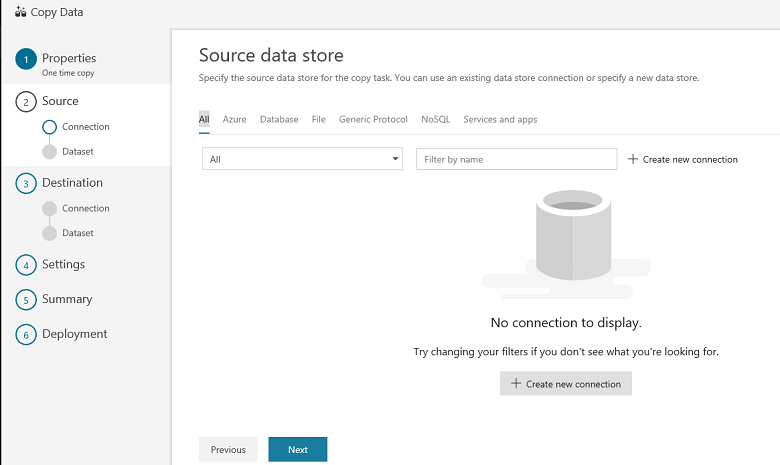
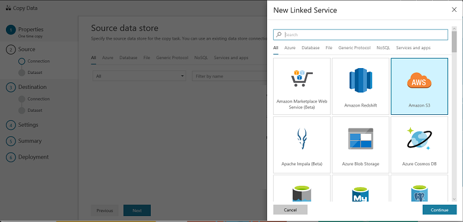
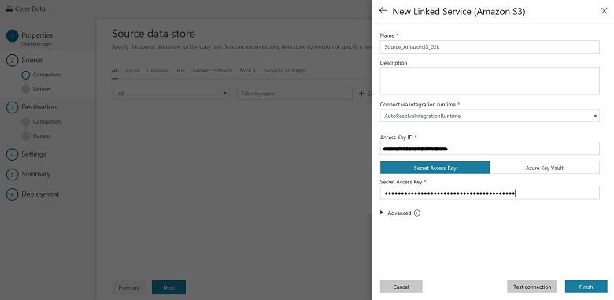
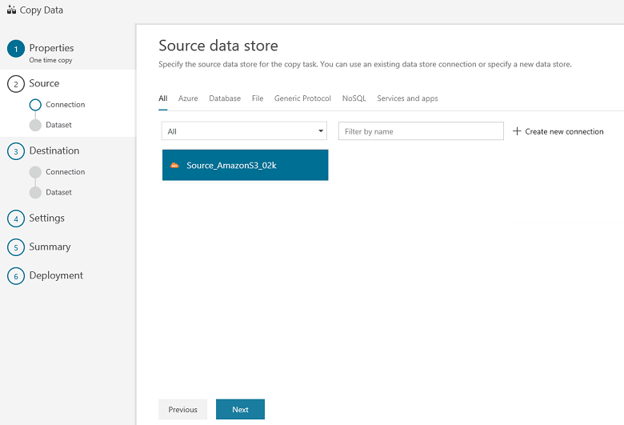
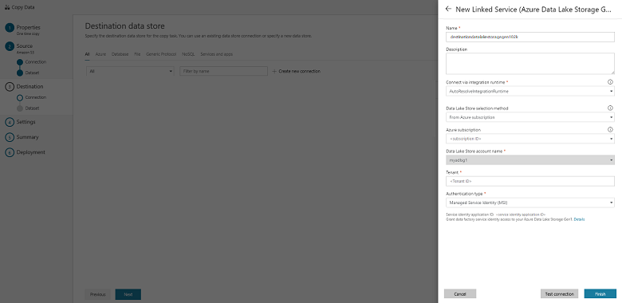
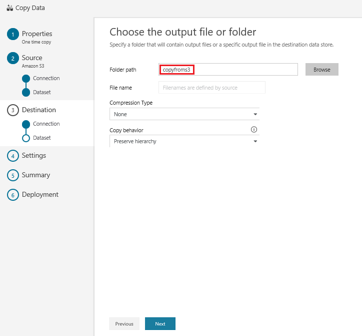
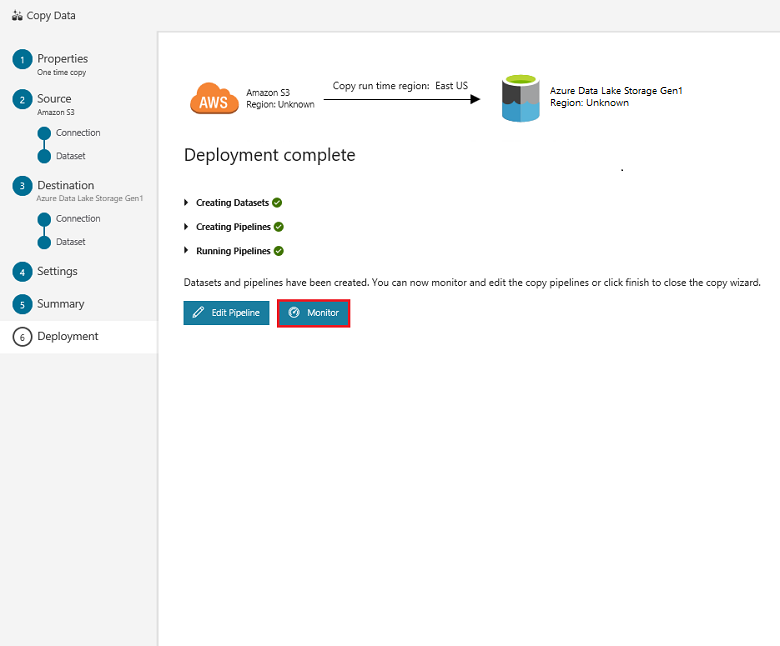
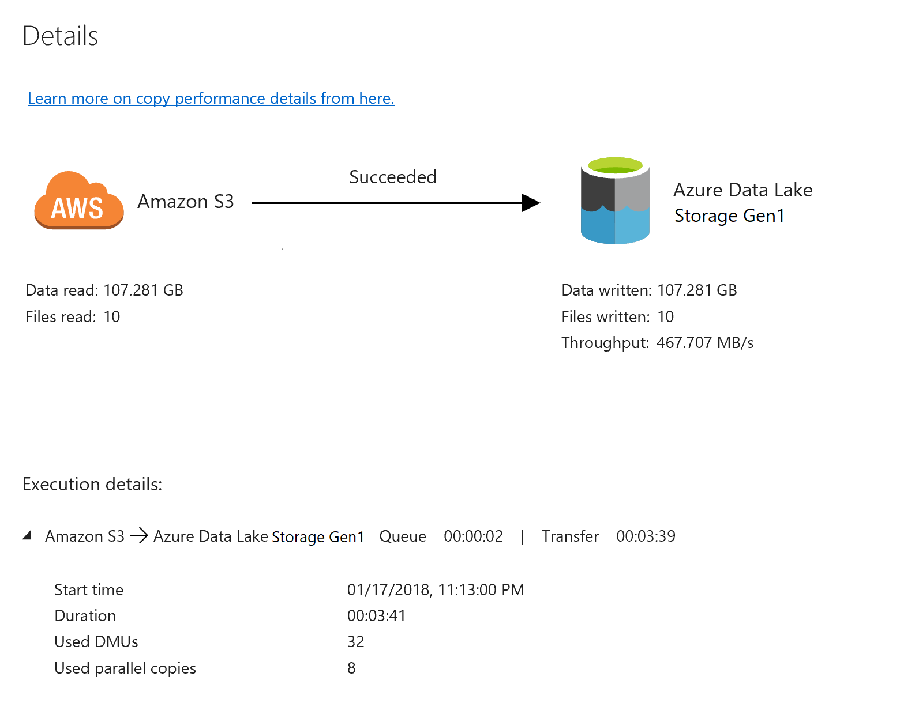

# Load data into Azure Data Lake Storage Gen1 by using Azure Data Factory

[!INCLUDE[appliesto-adf-asa-md](includes/appliesto-adf-asa-md.md)]

[Azure Data Lake Storage Gen1](../data-lake-store/data-lake-store-overview.md) (previously known as Azure Data Lake Store) is an enterprise-wide hyper-scale repository for big data analytic workloads. Data Lake Storage Gen1 lets you capture data of any size, type, and ingestion speed. The data is captured in a single place for operational and exploratory analytics.

Azure Data Factory is a fully managed cloud-based data integration service. You can use the service to populate the lake with data from your existing system and save time when building your analytics solutions.

Azure Data Factory offers the following benefits for loading data into Data Lake Storage Gen1:

* **Easy to set up**: An intuitive 5-step wizard with no scripting required.
* **Rich data store support**: Built-in support for a rich set of on-premises and cloud-based data stores. For a detailed list, see the table of [Supported data stores](copy-activity-overview.md#supported-data-stores-and-formats).
* **Secure and compliant**: Data is transferred over HTTPS or ExpressRoute. The global service presence ensures that your data never leaves the geographical boundary.
* **High performance**: Up to 1-GB/s data loading speed into Data Lake Storage Gen1. For details, see [Copy activity performance](copy-activity-performance.md).

This article shows you how to use the Data Factory Copy Data tool to _load data from Amazon S3 into Data Lake Storage Gen1_. You can follow similar steps to copy data from other types of data stores.

> [!NOTE]
> For more information, see [Copy data to or from Data Lake Storage Gen1 by using Azure Data Factory](connector-azure-data-lake-store.md).

## Prerequisites

* Azure subscription: If you don't have an Azure subscription, create a [free account](https://azure.microsoft.com/free/) before you begin.
* Data Lake Storage Gen1 account: If you don't have a Data Lake Storage Gen1 account, see the instructions in [Create a Data Lake Storage Gen1 account](../data-lake-store/data-lake-store-get-started-portal.md#create-a-data-lake-storage-gen1-account).
* Amazon S3: This article shows how to copy data from Amazon S3. You can use other data stores by following similar steps.

## Create a data factory

1. On the left menu, select **Create a resource** > **Analytics** > **Data Factory**:
   
   

2. In the **New data factory** page, provide values for the fields that are shown in the following image: 
      
   
 
    * **Name**: Enter a globally unique name for your Azure data factory. If you receive the error "Data factory name \"LoadADLSG1Demo\" is not available," enter a different name for the data factory. For example, you could use the name _**yourname**_**ADFTutorialDataFactory**. Try creating the data factory again. For the naming rules for Data Factory artifacts, see [Data Factory naming rules](naming-rules.md).
    * **Subscription**: Select your Azure subscription in which to create the data factory. 
    * **Resource Group**: Select an existing resource group from the drop-down list, or select the **Create new** option and enter the name of a resource group. To learn about resource groups, see [Using resource groups to manage your Azure resources](../azure-resource-manager/management/overview.md).  
    * **Version**: Select **V2**.
    * **Location**: Select the location for the data factory. Only supported locations are displayed in the drop-down list. The data stores that are used by data factory can be in other locations and regions. These data stores include Azure Data Lake Storage Gen1, Azure Storage, Azure SQL Database, and so on.

3. Select **Create**.
4. After creation is complete, go to your data factory. You see the **Data Factory** home page as shown in the following image: 
   
   

   Select the **Author & Monitor** tile to launch the Data Integration Application in a separate tab.

## Load data into Data Lake Storage Gen1

1. In the home page, select the **Ingest** tile to launch the Copy Data tool: 

   
2. In the **Properties** page, specify **CopyFromAmazonS3ToADLS** for the **Task name** field, and select **Next**:

    
3. In the **Source data store** page, click **+ Create new connection**:

    
	
	Select **Amazon S3**, and select **Continue**
	
	
	
4. In the **Specify Amazon S3 connection** page, do the following steps: 
   1. Specify the **Access Key ID** value.
   2. Specify the **Secret Access Key** value.
   3. Select **Finish**.
   
      
   
   4. You will see a new connection. Select **Next**.
   
   
   
5. In the **Choose the input file or folder** page, browse to the folder and file that you want to copy over. Select the folder/file, select **Choose**, and then select **Next**:

    

6. Choose the copy behavior by selecting the **Copy files recursively** and **Binary copy** (copy files as-is) options. Select **Next**:

    
	
7. In the **Destination data store** page, click **+ Create new connection**, and then select **Azure Data Lake Storage Gen1**, and select **Continue**:

    

8. In the **New Linked Service (Azure Data Lake Storage Gen1)** page, do the following steps: 

   1. Select your Data Lake Storage Gen1 account for the **Data Lake Store account name**.
   2. Specify the **Tenant**, and select Finish.
   3. Select **Next**.
   
   > [!IMPORTANT]
   > In this walkthrough, you use a managed identity for Azure resources to authenticate your Data Lake Storage Gen1 account. Be sure to grant the MSI the proper permissions in Data Lake Storage Gen1 by following [these instructions](connector-azure-data-lake-store.md#managed-identity).
   
   
9. In the **Choose the output file or folder** page, enter **copyfroms3** as the output folder name, and select **Next**: 

    

10. In the **Settings** page, select **Next**:

    
11. In the **Summary** page, review the settings, and select **Next**:

    
12. In the **Deployment page**, select **Monitor** to monitor the pipeline (task):

    
13. Notice that the **Monitor** tab on the left is automatically selected. The **Actions** column includes links to view activity run details and to rerun the pipeline:

    
14. To view activity runs that are associated with the pipeline run, select the **View Activity Runs** link in the **Actions** column. There's only one activity (copy activity) in the pipeline, so you see only one entry. To switch back to the pipeline runs view, select the **Pipelines** link at the top. Select **Refresh** to refresh the list. 

    

15. To monitor the execution details for each copy activity, select the **Details** link under **Actions** in the activity monitoring view. You can monitor details like the volume of data copied from the source to the sink, data throughput, execution steps with corresponding duration, and used configurations:

    

16. Verify that the data is copied into your Data Lake Storage Gen1 account: 

    

## Next steps

Advance to the following article to learn about Data Lake Storage Gen1 support: 

> [!div class="nextstepaction"]
>[Azure Data Lake Storage Gen1 connector](connector-azure-data-lake-store.md)
