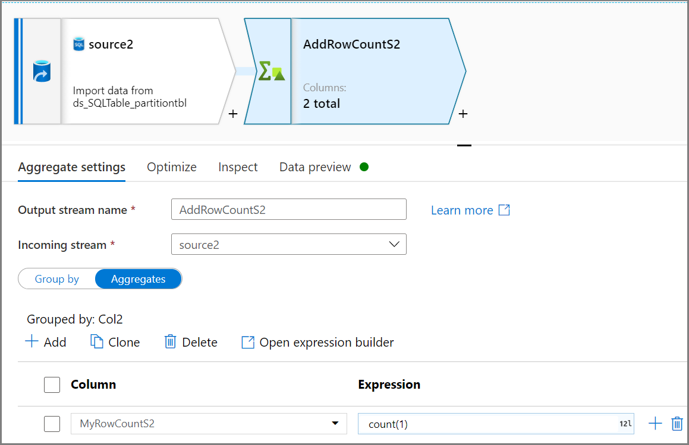
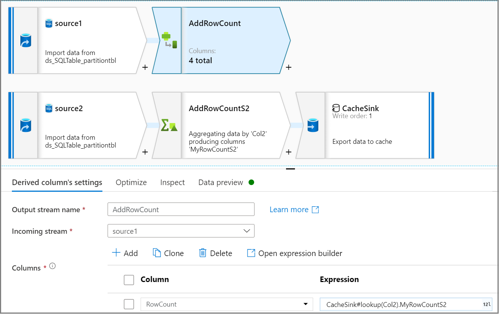
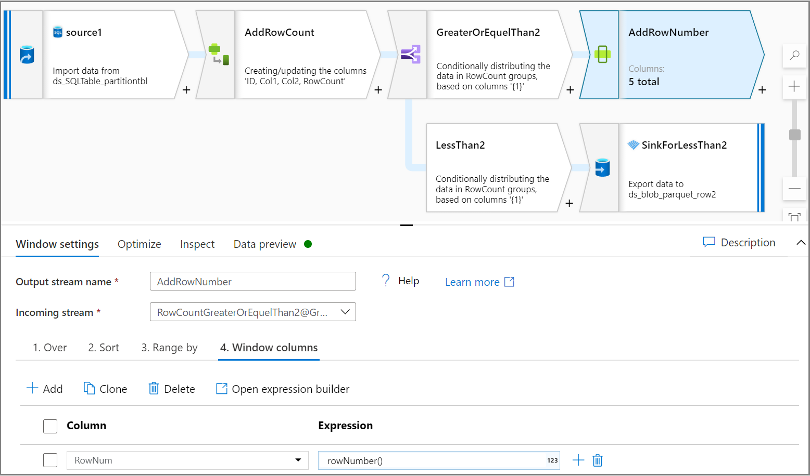
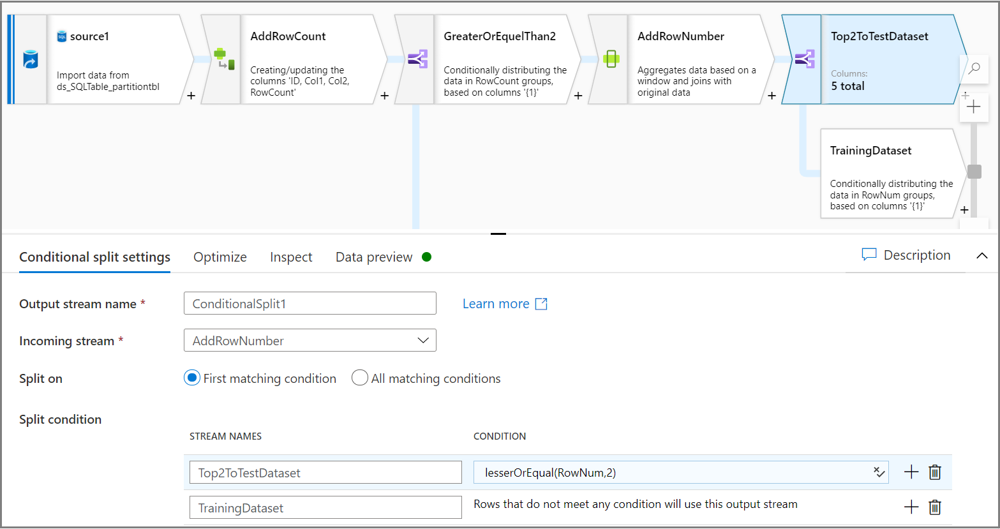
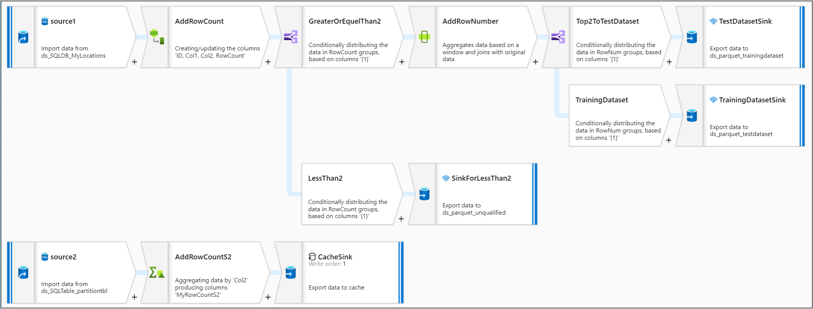

# Process data from automated machine learning models by using data flows

Automated machine learning (AutoML) is adopted by machine learning projects to train, tune, and gain the best model automatically by using target metrics you specify for classification, regression, and time-series forecasting.

One challenge for AutoML is that raw data from a data warehouse or a transactional database would be a huge dataset, possibly 10 GB. A large dataset requires a longer time to train models, so we recommend that you optimize data processing before you train Azure Machine Learning models. This tutorial will go through how to use Azure Data Factory to partition a dataset into AutoML files for a Machine Learning dataset.

The AutoML project includes the following three data processing scenarios:

* Partition large data to AutoML files before you train models.

     The [Pandas data frame](https://pandas.pydata.org/pandas-docs/stable/getting_started/overview.html) is commonly used to process data before you train models. The Pandas data frame works well for data sizes less than 1 GB, but if data is larger than 1 GB, a Pandas data frame slows down to process data. Sometimes you might even get an out-of-memory error message. We recommend using a [Parquet file](https://parquet.apache.org/) format for machine learning because it's a binary columnar format.
    
     Data Factory mapping data flows are visually designed data transformations that free up data engineers from writing code. Mapping data flows are a powerful way to process large data because the pipeline uses scaled-out Spark clusters.

* Split the training dataset and the test dataset.
    
    The training dataset will be used for a training model. The test dataset will be used to evaluate models in a machine learning project. The mapping data flows Conditional split activity would split training data and test data.

* Remove unqualified data.

    You might want to remove unqualified data, such as a Parquet file with zero rows. In this tutorial, we'll use the Aggregate activity to get a count of the number of rows. The row count will be a condition to remove unqualified data.

## Preparation

Use the following Azure SQL Database table.

```
CREATE TABLE [dbo].[MyProducts](
	[ID] [int] NULL,
	[Col1] [char](124) NULL,
	[Col2] [char](124) NULL,
	[Col3] datetime NULL,
	[Col4] int NULL

) 

```

## Convert data format to Parquet

The following data flow will convert a SQL Database table to a Parquet file format:

- **Source dataset**: Transaction table of SQL Database
- **Sink dataset**: Blob storage with Parquet format

## Remove unqualified data based on row count

Let's suppose we need to remove a row count that's less than two.

1. Use the Aggregate activity to get a count of the number of rows. Use **Grouped by** based on Col2 and **Aggregates** with `count(1)` for the row count.

    

1. Using the Sink activity, select the **Sink type** as **Cache** on the **Sink** tab. Then select the desired column from the **Key columns** drop-down list on the **Settings** tab.

    

1. Use the Derived column activity to add a row count column in the source stream. On the **Derived column's settings** tab, use the `CacheSink#lookup` expression to get a row count from CacheSink.

    

1. Use the Conditional split activity to remove unqualified data. In this example, the row count is based on the Col2 column. The condition is to remove a row count less than two, so two rows (ID=2 and ID=7) will be removed. You would save unqualified data to blob storage for data management.

    

> [!NOTE]
>    * Create a new source for getting a count of the number of rows that will be used in the original source in later steps.
>    * Use CacheSink from a performance standpoint.

## Split training data and test data

We want to split the training data and test data for each partition. In this example, for the same value of Col2, get the top two rows as test data and the rest of the rows as training data.

1. Use the Window activity to add one column row number for each partition. On the **Over** tab, select a  column for partition. In this tutorial, we'll partition for Col2. Give an order on the **Sort** tab, which in this tutorial will be based on ID. Give an order on the **Window columns** tab to add one column as a row number for each partition.

    

1. Use the Conditional split activity to split each partition's top two rows into the test dataset and the rest of the rows into the training dataset. On the **Conditional split settings** tab, use the expression `lesserOrEqual(RowNum,2)` as the condition.

    

## Partition the training and test datasets with Parquet format

Using the Sink activity, on the **Optimize** tab, use **Unique value per partition** to set a column as a column key for partition.


Let's look back at the entire pipeline logic.



## Next steps

Build the rest of your data flow logic by using mapping data flow [transformations](concepts-data-flow-overview.md).
