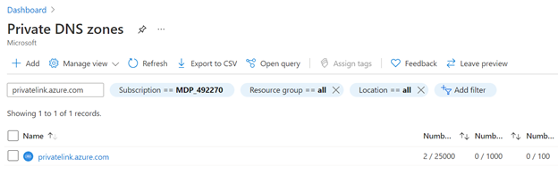
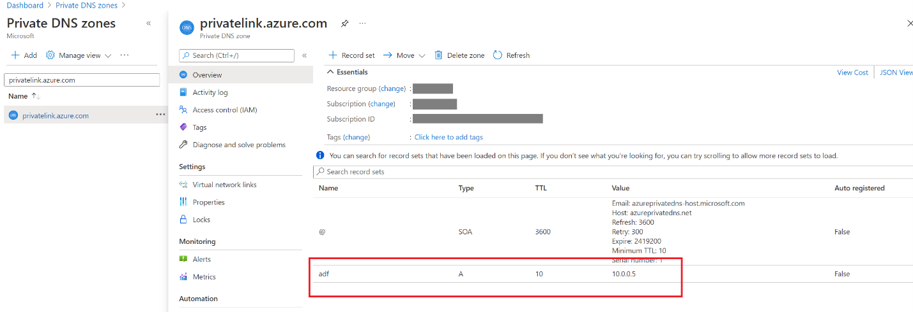
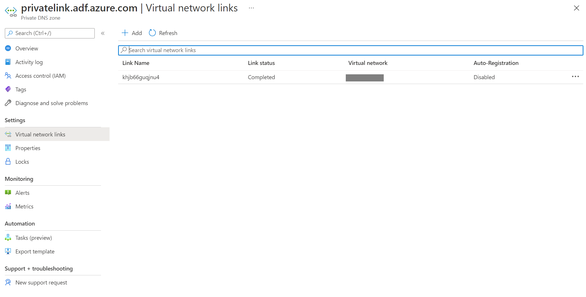
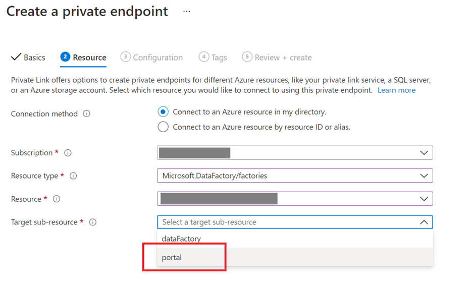
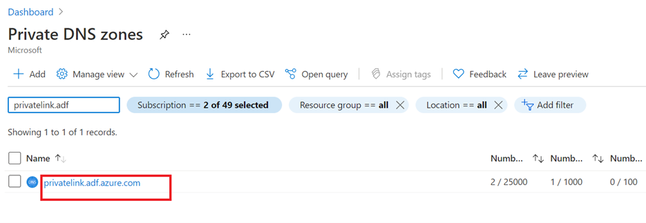

# Troubleshoot Azure Data Factory and Synapse Analytics security and access control issues

[!INCLUDE[appliesto-adf-asa-md](includes/appliesto-adf-asa-md.md)]

This article explores common troubleshooting methods for security and access control in Azure Data Factory and Synapse Analytics pipelines.

## Common errors and messages

### Connectivity issue in the copy activity of the cloud datastore

#### Symptoms

Various error messages might be returned when connectivity issues occur in the source or sink datastore.

#### Cause 

The problem is usually caused by one of the following factors:

* The proxy setting in the self-hosted integration runtime (IR) node, if you're using a self-hosted IR.

* The firewall setting in the self-hosted IR node, if you're using a self-hosted IR.

* The firewall setting in the cloud datastore.

#### Resolution

* To ensure that this is a connectivity issue, check the following points:

   - The error is thrown from the source or sink connectors.
   - The failure is at the start of the copy activity.
   - The failure is consistent for Azure IR or the self-hosted IR with one node, because it could be a random failure in a multiple-node self-hosted IR if only some of the nodes have the issue.

* If you're using a **self-hosted IR**, check your proxy, firewall, and network settings, because connecting to the same datastore could succeed if you're using an Azure IR. To troubleshoot this scenario, see:

   * [Self-hosted IR ports and firewalls](./create-self-hosted-integration-runtime.md#ports-and-firewalls)
   * [Azure Data Lake Storage connector](./connector-azure-data-lake-store.md)
  
* If you're using an **Azure IR**, try to disable the firewall setting of the datastore. This approach can resolve the issues in the following two situations:
  
   * [Azure IR IP addresses](./azure-integration-runtime-ip-addresses.md) are not in the allow list.
   * The *Allow trusted Microsoft services to access this storage account* feature is turned off for [Azure Blob Storage](./connector-azure-blob-storage.md#supported-capabilities) and [Azure Data Lake Storage Gen 2](./connector-azure-data-lake-storage.md#supported-capabilities).
   * The *Allow access to Azure services* setting isn't enabled for Azure Data Lake Storage Gen1.

If none of the preceding methods works, contact Microsoft for help.


### Invalid or empty authentication key issue after public network access is disabled

#### Symptoms

After you disable public network access for the service, the self-hosted integration runtime throws the following error: “The Authentication key is invalid or empty.”

#### Cause

The problem is most likely caused by a Domain Name System (DNS) resolution issue, because disabling public connectivity and establishing a private endpoint prevents reconnection.

To verify whether the service's fully qualified domain name (FQDN) is resolved to the public IP address, do the following:

1. Confirm that you've created the Azure virtual machine (VM) in the same virtual network as the service's private endpoint.

2. Run PsPing and Ping from the Azure VM to the service FQDN:

   `psping.exe <dataFactoryName>.<region>.datafactory.azure.net:443`
   `ping <dataFactoryName>.<region>.datafactory.azure.net`

   > [!Note]
   > You must specify a port for the PsPing command. Port 443 is shown here but is not required.

3. Check to see whether both commands resolve to an Azure Data Factory public IP that's based on a specified region. The IP should be in the following format: `xxx.xxx.xxx.0`

#### Resolution

To resolve the issue, do the following:

- As option, we would like to suggest you to manually add a "Virtual Network link" under the "Private link DNS Zone" for the service. For details, refer to the [Azure Private Link](./data-factory-private-link.md#dns-changes-for-private-endpoints) article. The instruction is for configuring the private DNS zone or custom DNS server to resolve the service FQDN to a private IP address. 

- However, if you don't want to configure the private DNS zone or custom DNS server, try the following temporary solution:

  1. Change the host file in Windows, and map the private IP (the service's private endpoint) to the service FQDN.
  
     In the Azure VM, go to `C:\Windows\System32\drivers\etc`, and then open the *host* file in Notepad. Add the line that maps the private IP to the FQDN at the end of the file, and save the change.
     
     

  1. Rerun the same commands as in the preceding verification steps to check the response, which should contain the private IP.

  1. Re-register the self-hosted integration runtime, and the issue should be resolved.

### Unable to register IR authentication key on Self-hosted VMs due to private link

#### Symptoms

You're unable to register the IR authentication key on the self-hosted VM because the private link is enabled. You receive the following error message:

"Failed to get service token from ADF service with key *************** and time cost is: 0.1250079 second, the error code is: InvalidGatewayKey, activityId is: XXXXXXX and detailed error message is Client IP address is not valid private ip Cause Data factory couldn’t access the public network thereby not able to reach out to the cloud to make the successful connection."

#### Cause

The issue could be caused by the VM in which you're trying to install the self-hosted IR. To connect to the cloud, ensure that public network access is enabled.

#### Resolution

**Solution 1**
 
To resolve the issue, do the following:

1. Go to the [Factories - Update](/rest/api/datafactory/Factories/Update) page.

1. At the upper right, select the **Try it** button.
1. Under **Parameters**, complete the required information. 
1. Under **Body**, paste the following property:

    ```
    { "tags": { "publicNetworkAccess":"Enabled" } }
    ```
1. Select **Run** to run the function. 

1. Under **Parameters**, complete the required information. 

1. Under **Body**, paste the following property:
    ```
    { "tags": { "publicNetworkAccess":"Enabled" } }
    ``` 

1. Select **Run** to run the function. 
1. Confirm that **Response Code: 200** is displayed. The property you pasted should be displayed in the JSON definition as well.

1. Add the IR authentication key again in the integration runtime.

**Solution 2**

To resolve the issue, go to [Azure Private Link](./data-factory-private-link.md).

Try to enable public network access on the user interface, as shown in the following screenshot:

# [Azure Data Factory](#tab/data-factory)
:::image type="content" source="media/self-hosted-integration-runtime-troubleshoot-guide/enable-public-network-access.png" alt-text="Screenshot of the 'Enabled' control for 'Allow public network access' on the Networking pane.":::

# [Synapse Analytics](#tab/synapse-analytics)
:::image type="content" source="media/self-hosted-integration-runtime-troubleshoot-guide/enable-public-network-access-synapse.png" alt-text="Screenshot of the 'Enabled' control for 'Allow public network access' on the Networking pane.":::

---

### Service private DNS zone overrides Azure Resource Manager DNS resolution causing ‘Not found’ error

#### Cause
Both Azure Resource Manager and the service are using the same private zone creating a potential conflict on customer’s private DNS with a scenario where the Azure Resource Manager records will not be found.

#### Solution
1. Find Private DNS zones **privatelink.azure.com** in Azure portal.

2. Check if there is an A record **adf**.

3.	Go to **Virtual network links**, delete all records.

4.	Navigate to your service in Azure portal and recreate the private endpoint for the portal.

5.	Go back to Private DNS zones, and check if there is a new private DNS zone **privatelink.adf.azure.com**.


### Connection error in public endpoint

#### Symptoms

When copying data with Azure Blob Storage account public access, pipeline runs randomly fail with following error.

For example: The Azure Blob Storage sink was using Azure IR (public, not Managed VNet) and the Azure SQL Database source was using the Managed VNet IR. Or source/sink use Managed VNet IR only with storage public access.

`
<LogProperties><Text>Invoke callback url with req:
"ErrorCode=UserErrorFailedToCreateAzureBlobContainer,'Type=Microsoft.DataTransfer.Common.Shared.HybridDeliveryException,Message=Unable to create Azure Blob container. Endpoint: XXXXXXX/, Container Name: test.,Source=Microsoft.DataTransfer.ClientLibrary,''Type=Microsoft.WindowsAzure.Storage.StorageException,Message=Unable to connect to the remote server,Source=Microsoft.WindowsAzure.Storage,''Type=System.Net.WebException,Message=Unable to connect to the remote server,Source=System,''Type=System.Net.Sockets.SocketException,Message=A connection attempt failed because the connected party did not properly respond after a period of time, or established connection failed because connected host has failed to respond public ip:443,Source=System,'","Details":null}}</Text></LogProperties>.
`

#### Cause

The service may still use Managed VNet IR, but you could encounter such error because the public endpoint to Azure Blob Storage in Managed VNet is not reliable based on the testing result, and Azure Blob Storage and Azure Data Lake Gen2 are not supported to be connected through public endpoint from the service's Managed Virtual Network according to [Managed virtual network & managed private endpoints](./managed-virtual-network-private-endpoint.md#outbound-communications-through-public-endpoint-from-adf-managed-virtual-network).

#### Solution

- Having private endpoint enabled on the source and also the sink side when using the Managed VNet IR.
- If you still want to use the public endpoint, you can switch to public IR only instead of using the Managed VNet IR for the source and the sink. Even if you switch back to public IR, the service may still use the Managed VNet IR if the Managed VNet IR is still there.

### Internal error while trying to Delete a data factory or Synapse workspace with Customer Managed Key (CMK) and User Assigned Managed Identity (UA-MI)

#### Symptoms
`{\"error\":{\"code\":\"InternalError\",\"message\":\"Internal error has occurred.\"}}`

#### Cause

If you are performing any operations related to CMK, you should complete all operations related to the service first, and then external operations (like Managed Identities or Key Vault operations). For example, if you  want to delete all resources, you need to delete the service instance first, and then delete the key vault.  If you delete the key vault first, this error will occur since the service can't read the required objects anymore, and it won't be able to validate if deletion is possible or not. 

#### Solution

There are three possible ways to solve the issue. They are as follows:

* You revoked the service's access to Key vault where the CMK key was stored. 
You can reassign access to the following permissions: **Get, Unwrap Key, and Wrap Key**. These permissions are required to enable customer-managed keys. Please refer to [Grant access to customer-managed keys](enable-customer-managed-key.md#grant-data-factory-access-to-azure-key-vault). Once the permission is provided, you should be able to delete the service.
 
* Customer deleted Key Vault / CMK before deleting the service. 
CMK in the service should have "Soft Delete" enabled and "Purge Protect" enabled which has default retention policy of 90 days. You can restore the deleted key.  
Please review [Recover deleted Key](../key-vault/general/key-vault-recovery.md?tabs=azure-portal#list-recover-or-purge-soft-deleted-secrets-keys-and-certificates ) and [Deleted Key Value](../key-vault/general/key-vault-recovery.md?tabs=azure-portal#list-recover-or-purge-a-soft-deleted-key-vault)

* User Assigned Managed Identity (UA-MI) was deleted before the service. 
You can recover from this by using REST API calls, you can do this in an http client of your choice in any programming language. If you have not anything already set up for REST API calls with Azure authentication, the easiest way to do this would be by using POSTMAN/Fiddler. Please follow following steps.

   1.  Make a GET call using Method: GET Url like   `https://management.azure.com/subscriptions/YourSubscription/resourcegroups/YourResourceGroup/providers/Microsoft.DataFactory/factories/YourFactoryName?api-version=2018-06-01`

   2. You need to create a new User Managed Identity with a different Name (same name may work, but just to be sure, it's safer to use a different name than the one in the GET response)

   3. Modify the encryption.identity property and identity.userassignedidentities to point to the newly created managed identity. Remove the clientId and principalId from the userAssignedIdentity object. 

   4.  Make a PUT call to the same url passing the new body. It is very important that you are  passing whatever you got in the GET response, and only modify the identity. Otherwise they would override other settings unintentionally. 

   5.  After the call succeeds, you  will be able to see the entities again and retry deleting. 

## Sharing Self-hosted Integration Runtime

### Sharing a self-hosted IR from a different tenant is not supported 

#### Symptoms

You might notice other data factories (on different tenants) as you're attempting to share the self-hosted IR from the UI, but you can't share it across data factories that are on different tenants.

#### Cause

The self-hosted IR can't be shared across tenants.


## Next steps

For more help with troubleshooting, try the following resources:

*  [Private Link for Data Factory](data-factory-private-link.md)
*  [Data Factory blog](https://azure.microsoft.com/blog/tag/azure-data-factory/)
*  [Data Factory feature requests](https://feedback.azure.com/forums/270578-data-factory)
*  [Azure videos](https://azure.microsoft.com/resources/videos/index/?sort=newest&services=data-factory)
*  [Microsoft Q&A page](/answers/topics/azure-data-factory.html)
*  [Stack overflow forum for Data Factory](https://stackoverflow.com/questions/tagged/azure-data-factory)
*  [Twitter information about Data Factory](https://twitter.com/hashtag/DataFactory)
