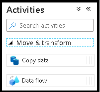
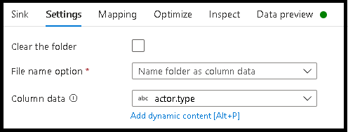

# Dynamically set column names in data flows

[!INCLUDE[appliesto-adf-asa-md](includes/appliesto-adf-asa-md.md)]

Many times, when processing data for ETL jobs, you will need to change the column names before writing the results. Sometimes this is needed to align column names to a well-known target schema. Other times, you may need to set column names at runtime based on evolving schemas. In this tutorial, you'll learn how to use data flows to set column names for your destination files and database tables dynamically using configuration files and parameters.

If you're new to Azure Data Factory, see [Introduction to Azure Data Factory](introduction.md).

## Prerequisites
* **Azure subscription**. If you don't have an Azure subscription, create a [free Azure account](https://azure.microsoft.com/free/) before you begin.
* **Azure storage account**. You use ADLS storage as a *source* and *sink* data stores. If you don't have a storage account, see [Create an Azure storage account](../storage/common/storage-account-create.md) for steps to create one.

The steps in this tutorial will assume that you have 

## Create a data factory

In this step, you create a data factory and open the Data Factory UX to create a pipeline in the data factory.

1. Open **Microsoft Edge** or **Google Chrome**. Currently, Data Factory UI is supported only in the Microsoft Edge and Google Chrome web browsers.
1. On the left menu, select **Create a resource** > **Integration** > **Data Factory**
1. On the **New data factory** page, under **Name**, enter **ADFTutorialDataFactory**
1. Select the Azure **subscription** in which you want to create the data factory.
1. For **Resource Group**, take one of the following steps:

    a. Select **Use existing**, and select an existing resource group from the drop-down list.
    
    b. Select **Create new**, and enter the name of a resource group.To learn about resource groups, see [Use resource groups to manage your Azure resources](../azure-resource-manager/management/overview.md).
    
1. Under **Version**, select **V2**.
1. Under **Location**, select a location for the data factory. Only locations that are supported are displayed in the drop-down list. Data stores (for example, Azure Storage and SQL Database) and computes (for example, Azure HDInsight) used by the data factory can be in other regions.
1. Select **Create**.
1. After the creation is finished, you see the notice in Notifications center. Select **Go to resource** to navigate to the Data factory page.
1. Select **Author & Monitor** to launch the Data Factory UI in a separate tab.

## Create a pipeline with a data flow activity

In this step, you'll create a pipeline that contains a data flow activity.

1. From the ADF home page, select **Create pipeline**.
1. In the **General** tab for the pipeline, enter **DeltaLake** for **Name** of the pipeline.
1. In the factory top bar, slide the **Data Flow debug** slider on. Debug mode allows for interactive testing of transformation logic against a live Spark cluster. Data Flow clusters take 5-7 minutes to warm up and users are recommended to turn on debug first if they plan to do Data Flow development. For more information, see [Debug Mode](concepts-data-flow-debug-mode.md).

    
1. In the **Activities** pane, expand the **Move and Transform** accordion. Drag and drop the **Data Flow** activity from the pane to the pipeline canvas.

    
1. In the **Adding Data Flow** pop-up, select **Create new Data Flow** and then name your data flow **DynaCols**. Click Finish when done.

    

## Build dynamic column mapping in data flows

For this tutorial, we're going to use a sample movies rating file and renaming a few of the fields in the source to a new set of target columns that can change over time. The datasets you'll create below should point to this movies CSV file in your Blob Storage or ADLS Gen2 storage account. [Download the movies file here](https://github.com/kromerm/adfdataflowdocs/blob/master/sampledata/moviesDB.csv) and store the file in your Azure storage account.


### Tutorial objectives

1. Create a source dataset for the movies CSV file
1. Create a lookup dataset for a field mapping JSON configuraiton file
1. Convert the columns from the source to your target column names

### Start from a blank data flow canvas

First, let's set up the data flow environment for each of the mechanisms described below for landing data in ADLS Gen2

1. Click on the source transformation and call it ```movies1```.
1. Click the new button next to dataset in the bottom panel.
1. Choose either Blob or ADLS Gen2 depending on where you stored the moviesDB.csv file from above.
1. Add a 2nd source, which we will use to source the configuration JSON file to lookup field mappings.
1. Call this as ```columnmappings```.
1. Add a 3rd source and call it ```movies2```. Configure this exactly the same as ```movies1```.
   
### Parameterized column mapping

In this first scenario, you will set output column names in you data flow by setting the column mapping based on matching incoming fields with a parameter that is a string array of columns and match each array index with the incoming column ordinal position. When executing this data flow from a pipeline, you will be able to set different column names on each pipeline execution by sending in this string array parameter to the data flow activity.


1. Go back to the data flow designer and edit the data flow created above.
1. Click on the parameters tab
1. Create a new parameter and choose string array data type
1. For the default value, enter ```['a','b','c']```
1. Use the top ```movies1``` source to modify the column names to map to these array values
1. Add a Select transformation
1. We're going to change the first 3 column names to the new names defined in the parameter
1. To do this, add 3 rule-based mapping entries in the bottom pane
1. For the first column, the matching rule will be ```position==1``` and the name will be ```$parameter1[1]```
1. Follow the same pattern for column 2 and 3
 


1. Click on the Inspect and Data Flow tabs of the Select transformation to view the new column name values ```(a,b,c)``` replace the original movie, title, genres column names
   
### Create a cached lookup of external column mappings

Next, we'll create a cached sink for a later lookup. The cache will read an external JSON configuration file that can be used to rename columns dynamically on each pipeline execution of your data flow.

1. Go back to the data flow designer and edit the data flow create above. Click on the sink transformation.
1. Click Optimize > Set partitioning > Use current partitioning.
1. Click Settings > Name folder as column data.
1. Pick the column that you wish to use for generating folder names.
1. To manipulate the data values, or even if need to generate synthetic values for folder names, use the Derived Column transformation to create the values you wish to use in your folder names.



### Name file as data values

The techniques listed in the above tutorials are good use cases for creating folder categories in your data lake. The default file naming scheme being employed by those techniques is to use the Spark executor job ID. Sometimes you may wish to set the name of the output file in a data flow text sink. This technique is only suggested for use with small files. The process of merging partition files into a single output file is a long-running process.

1. Go back to the data flow designer and edit the data flow create above. Click on the sink transformation.
1. Click Optimize > Set partitioning > Single partition. It is this single partition requirement that creates a bottleneck in the execution process as files are merged. This option is only recommended for small files.
1. Click Settings > Name file as column data.
1. Pick the column that you wish to use for generating file names.
1. To manipulate the data values, or even if need to generate synthetic values for file names, use the Derived Column transformation to create the values you wish to use in your file names.

## Next steps

Learn more about [data flow sinks](data-flow-sink.md).
