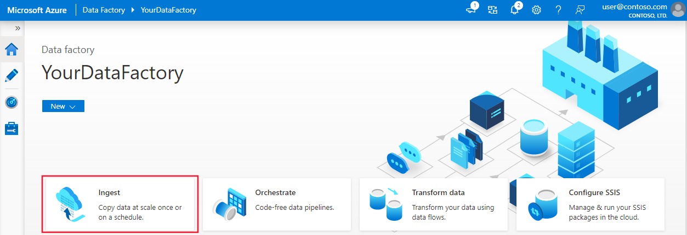
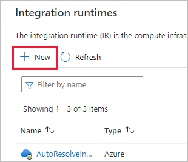
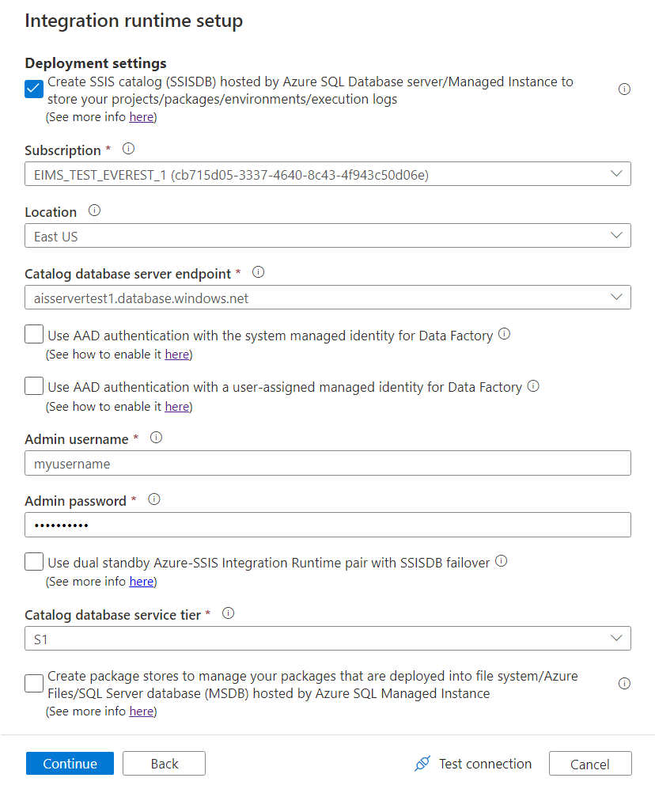
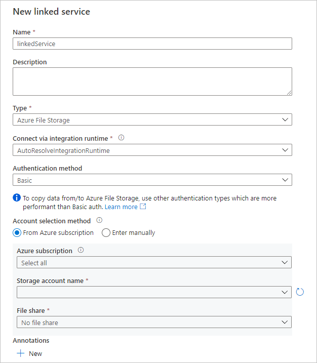
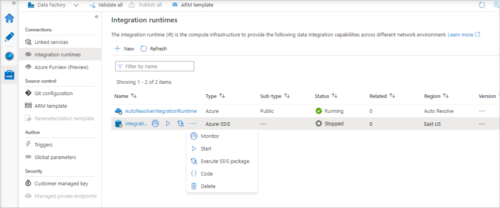

# Provision the Azure-SSIS integration runtime in Azure Data Factory

[!INCLUDE[appliesto-adf-xxx-md](includes/appliesto-adf-xxx-md.md)]

This tutorial provides steps for using the Azure portal to provision an Azure-SQL Server Integration Services (SSIS) integration runtime (IR) in Azure Data Factory (ADF). An Azure-SSIS IR supports:

- Running packages deployed into SSIS catalog (SSISDB) hosted by Azure SQL Database server/Managed Instance (Project Deployment Model)
- Running packages deployed into file system, Azure Files, or SQL Server database (MSDB) hosted by Azure SQL Managed Instance (Package Deployment Model)

After an Azure-SSIS IR is provisioned, you can use familiar tools to deploy and run your packages in Azure. These tools are already Azure-enabled and include SQL Server Data Tools (SSDT), SQL Server Management Studio (SSMS), and command-line utilities like [dtutil](/sql/integration-services/dtutil-utility) and [AzureDTExec](./how-to-invoke-ssis-package-azure-enabled-dtexec.md).

For conceptual information on Azure-SSIS IRs, see [Azure-SSIS integration runtime overview](concepts-integration-runtime.md#azure-ssis-integration-runtime).

In this tutorial, you complete the following steps:

> [!div class="checklist"]
> * Create a data factory.
> * Provision an Azure-SSIS integration runtime.

## Prerequisites

[!INCLUDE [updated-for-az](../../includes/updated-for-az.md)]

- **Azure subscription**. If you don't have an Azure subscription, create a [free account](https://azure.microsoft.com/free/) before you begin.

- **Azure SQL Database server (optional)**. If you don't already have a database server, create one in the Azure portal before you get started. Data Factory will in turn create an SSISDB instance on this database server. 

  We recommend that you create the database server in the same Azure region as the integration runtime. This configuration lets the integration runtime write execution logs into SSISDB without crossing Azure regions.

  Keep these points in mind:

  - Based on the selected database server, the SSISDB instance can be created on your behalf as a single database, as part of an elastic pool, or in a managed instance. It can be accessible in a public network or by joining a virtual network. For guidance in choosing the type of database server to host SSISDB, see [Compare SQL Database and SQL Managed Instance](../data-factory/create-azure-ssis-integration-runtime.md#comparison-of-sql-database-and-sql-managed-instance). 
  
    If you use an Azure SQL Database server with IP firewall rules/virtual network service endpoints or a managed instance with private endpoint to host SSISDB, or if you require access to on-premises data without configuring a self-hosted IR, you need to join your Azure-SSIS IR to a virtual network. For more information, see [Create an Azure-SSIS IR in a virtual network](./create-azure-ssis-integration-runtime.md).

  - Confirm that the **Allow access to Azure services** setting is enabled for the database server. This setting is not applicable when you use an Azure SQL Database server with IP firewall rules/virtual network service endpoints or a managed instance with private endpoint to host SSISDB. For more information, see [Secure Azure SQL Database](../azure-sql/database/secure-database-tutorial.md#create-firewall-rules). To enable this setting by using PowerShell, see [New-AzSqlServerFirewallRule](/powershell/module/az.sql/new-azsqlserverfirewallrule).

  - Add the IP address of the client machine, or a range of IP addresses that includes the IP address of the client machine, to the client IP address list in the firewall settings for the database server. For more information, see [Azure SQL Database server-level and database-level firewall rules](../azure-sql/database/firewall-configure.md).

  - You can connect to the database server by using SQL authentication with your server admin credentials, or by using Azure AD authentication with the managed identity for your data factory. For the latter, you need to add the managed identity for your data factory into an Azure AD group with access permissions to the database server. For more information, see [Create an Azure-SSIS IR with Azure AD authentication](./create-azure-ssis-integration-runtime.md).

  - Confirm that your database server does not have an SSISDB instance already. The provisioning of an Azure-SSIS IR does not support using an existing SSISDB instance.

> [!NOTE]
> For a list of Azure regions in which Data Factory and an Azure-SSIS IR are currently available, see [Data Factory and SSIS IR availability by region](https://azure.microsoft.com/global-infrastructure/services/?products=data-factory&regions=all). 

## Create a data factory

To create your data factory via the Azure portal, follow the step-by-step instructions in [Create a data factory via the UI](./quickstart-create-data-factory-portal.md#create-a-data-factory). Select **Pin to dashboard** while doing so, to allow quick access after its creation. 

After your data factory is created, open its overview page in the Azure portal. Select the **Author & Monitor** tile to open the **Let's get started** page on a separate tab. There, you can continue to create your Azure-SSIS IR.

## Create an Azure-SSIS integration runtime

### From the Data Factory overview

1. On the home page, select the **Configure SSIS** tile. 

   

1. For the remaining steps to set up an Azure-SSIS IR, see the [Provision an Azure-SSIS integration runtime](#provision-an-azure-ssis-integration-runtime) section. 

### From the authoring UI

1. In the Azure Data Factory UI, switch to the **Manage** tab, and then switch to the **Integration runtimes** tab to view existing integration runtimes in your data factory. 

   

1. Select **New** to create an Azure-SSIS IR and open the **Integration runtime setup** pane. 

   

1. In the **Integration runtime setup** pane, select the **Lift-and-shift existing SSIS packages to execute in Azure** tile, and then select **Continue**.

   

1. For the remaining steps to set up an Azure-SSIS IR, see the [Provision an Azure-SSIS integration runtime](#provision-an-azure-ssis-integration-runtime) section. 

## Provision an Azure-SSIS integration runtime

The **Integration runtime setup** pane has three pages where you successively configure general, deployment, and advanced settings.

### General settings page

On the **General settings** page of **Integration runtime setup** pane, complete the following steps. 

   

   1. For **Name**, enter the name of your integration runtime. 

   1. For **Description**, enter the description of your integration runtime. 

   1. For **Location**, select the location of your integration runtime. Only supported locations are displayed. We recommend that you select the same location of your database server to host SSISDB. 

   1. For **Node Size**, select the size of node in your integration runtime cluster. Only supported node sizes are displayed. Select a large node size (scale up) if you want to run many compute-intensive or memory-intensive packages. 

   1. For **Node Number**, select the number of nodes in your integration runtime cluster. Only supported node numbers are displayed. Select a large cluster with many nodes (scale out) if you want to run many packages in parallel. 

   1. For **Edition/License**, select the SQL Server edition for your integration runtime: Standard or Enterprise. Select Enterprise if you want to use advanced features on your integration runtime. 

   1. For **Save Money**, select the Azure Hybrid Benefit option for your integration runtime: **Yes** or **No**. Select **Yes** if you want to bring your own SQL Server license with Software Assurance to benefit from cost savings with hybrid use. 

   1. Select **Continue**. 

### Deployment settings page

On the **Deployment settings** page of **Integration runtime setup** pane, you have the options to create SSISDB and or Azure-SSIS IR package stores.

#### Creating SSISDB

On the **Deployment settings** page of **Integration runtime setup** pane, if you want to deploy your packages into SSISDB (Project Deployment Model), select the **Create SSIS catalog (SSISDB) hosted by Azure SQL Database server/Managed Instance to store your projects/packages/environments/execution logs** check box. Alternatively, if you want to deploy your packages into file system, Azure Files, or SQL Server database (MSDB) hosted by Azure SQL Managed Instance (Package Deployment Model), no need to create SSISDB nor select the check box.

Regardless of your deployment model, if you want to use SQL Server Agent hosted by Azure SQL Managed Instance to orchestrate/schedule your package executions, it's enabled by SSISDB, so select the check box anyway. For more information, see [Schedule SSIS package executions via  Azure SQL Managed Instance Agent](./how-to-invoke-ssis-package-managed-instance-agent.md).
   
If you select the check box, complete the following steps to bring your own database server to host SSISDB that we'll create and manage on your behalf.

   
   
   1. For **Subscription**, select the Azure subscription that has your database server to host SSISDB. 

   1. For **Location**, select the location of your database server to host SSISDB. We recommend that you select the same location of your integration runtime.

   1. For **Catalog Database Server Endpoint**, select the endpoint of your database server to host SSISDB. 
   
      Based on the selected database server, the SSISDB instance can be created on your behalf as a single database, as part of an elastic pool, or in a managed instance. It can be accessible in a public network or by joining a virtual network. For guidance in choosing the type of database server to host SSISDB, see [Compare SQL Database and SQL Managed Instance](../data-factory/create-azure-ssis-integration-runtime.md#comparison-of-sql-database-and-sql-managed-instance).   

      If you select an Azure SQL Database server with IP firewall rules/virtual network service endpoints or a managed instance with private endpoint to host SSISDB, or if you require access to on-premises data without configuring a self-hosted IR, you need to join your Azure-SSIS IR to a virtual network. For more information, see [Create an Azure-SSIS IR in a virtual network](./create-azure-ssis-integration-runtime.md).

   1. Select the **Use Azure AD authentication with the managed identity for your ADF** check box to choose the authentication method for your database server to host SSISDB. You'll choose either SQL authentication or Azure AD authentication with the managed identity for your data factory.

      If you select the check box, you'll need to add the managed identity for your data factory into an Azure AD group with access permissions to your database server. For more information, see [Create an Azure-SSIS IR with Azure AD authentication](./create-azure-ssis-integration-runtime.md).
   
   1. For **Admin Username**, enter the SQL authentication username for your database server to host SSISDB. 

   1. For **Admin Password**, enter the SQL authentication password for your database server to host SSISDB. 

   1. Select the **Use dual standby Azure-SSIS Integration Runtime pair with SSISDB failover** check box to configure a dual standby Azure SSIS IR pair that works in sync with Azure SQL Database/Managed Instance failover group for business continuity and disaster recovery (BCDR).
   
      If you select the check box, enter a name to identify your pair of primary and secondary Azure-SSIS IRs in the **Dual standby pair name** text box. You need to enter the same pair name when creating your primary and secondary Azure-SSIS IRs.

      For more information, see [Configure your Azure-SSIS IR for BCDR](./configure-bcdr-azure-ssis-integration-runtime.md).

   1. For **Catalog Database Service Tier**, select the service tier for your database server to host SSISDB. Select the Basic, Standard, or Premium tier, or select an elastic pool name.

Select **Test connection** when applicable and if it's successful, select **Continue**.

#### Creating Azure-SSIS IR package stores

On the **Deployment settings** page of **Integration runtime setup** pane, if you want to manage your packages that are deployed into MSDB, file system, or Azure Files (Package Deployment Model) with Azure-SSIS IR package stores, select the **Create package stores to manage your packages that are deployed into file system/Azure Files/SQL Server database (MSDB) hosted by Azure SQL Managed Instance** check box.
   
Azure-SSIS IR package store allows you to import/export/delete/run packages and monitor/stop running packages via SSMS similar to the [legacy SSIS package store](/sql/integration-services/service/package-management-ssis-service). For more information, see [Manage SSIS packages with Azure-SSIS IR package stores](./azure-ssis-integration-runtime-package-store.md).
   
If you select this check box, you can add multiple package stores to your Azure-SSIS IR by selecting **New**. Conversely, one package store can be shared by multiple Azure-SSIS IRs.

On the **Add package store** pane, complete the following steps.
   
   1. For **Package store name**, enter the name of your package store. 

   1. For **Package store linked service**, select your existing linked service that stores the access information for file system/Azure Files/Azure SQL Managed Instance where your packages are deployed or create a new one by selecting **New**. On the **New linked service** pane, complete the following steps. 

      > [!NOTE]
      > You can use either **Azure File Storage** or **File System** linked services to access Azure Files. If you use **Azure File Storage** linked service, Azure-SSIS IR package store supports only **Basic** (not **Account key** nor **SAS URI**) authentication method for now. 

      

      1. For **Name**, enter the name of your linked service. 
         
      1. For **Description**, enter the description of your linked service. 
         
      1. For **Type**, select **Azure File Storage**, **Azure SQL Managed Instance**, or **File System**.

      1. You can ignore **Connect via integration runtime**, since we always use your Azure-SSIS IR to fetch the access information for package stores.
      
      1. If you select **Azure File Storage**,  for **Authentication method**, select **Basic**, and then complete the following steps. 

         1. For **Account selection method**, select **From Azure subscription** or **Enter manually**.
         
         1. If you select **From Azure subscription**, select the relevant **Azure subscription**, **Storage account name**, and **File share**.
            
         1. If you select **Enter manually**, enter `\\<storage account name>.file.core.windows.net\<file share name>` for **Host**, `Azure\<storage account name>` for **Username**, and `<storage account key>` for **Password** or select your **Azure Key Vault** where it's stored as a secret.

      1. If you select **Azure SQL Managed Instance**, complete the following steps. 

         1. Select **Connection string** or your **Azure Key Vault** where it's stored as a secret.
         
         1. If you select **Connection string**, complete the following steps. 
             1. For **Account selection method**, if you choose **From Azure subscription**, select the relevant **Azure subscription**, **Server name**, **Endpoint type** and **Database name**. If you choose **Enter manually**, complete the following steps. 
                1.  For **Fully qualified domain name**, enter `<server name>.<dns prefix>.database.windows.net` or `<server name>.public.<dns prefix>.database.windows.net,3342` as the private or public endpoint of your Azure SQL Managed Instance, respectively. If you enter the private endpoint, **Test connection** isn't applicable, since ADF UI can't reach it.

                1. For **Database name**, enter `msdb`.
               
            1. For **Authentication type**, select **SQL Authentication**, **Managed Identity**, or **Service Principal**.

                - If you select **SQL Authentication**, enter the relevant **Username** and **Password** or select your **Azure Key Vault** where it's stored as a secret.

                -  If you select **Managed Identity**, grant your ADF managed identity access to your Azure SQL Managed Instance.

                - If you select **Service Principal**, enter the relevant **Service principal ID** and **Service principal key** or select your **Azure Key Vault** where it's stored as a secret.

      1. If you select **File system**, enter the UNC path of folder where your packages are deployed for **Host**, as well as the relevant **Username** and **Password** or select your **Azure Key Vault** where it's stored as a secret.

      1. Select **Test connection** when applicable and if it's successful, select **Create**.

   1. Your added package stores will appear on the **Deployment settings** page. To remove them, select their check boxes, and then select **Delete**.

Select **Test connection** when applicable and if it's successful, select **Continue**.

### Advanced settings page

On the **Advanced settings** page of **Integration runtime setup** pane, complete the following steps. 

   

   1. For **Maximum Parallel Executions Per Node**, select the maximum number of packages to run concurrently per node in your integration runtime cluster. Only supported package numbers are displayed. Select a low number if you want to use more than one core to run a single large package that's compute or memory intensive. Select a high number if you want to run one or more small packages in a single core. 

   1. Select the **Customize your Azure-SSIS Integration Runtime with additional system configurations/component installations** check box to choose whether you want to add standard/express custom setups on your Azure-SSIS IR. For more information, see [Custom setup for an Azure-SSIS IR](./how-to-configure-azure-ssis-ir-custom-setup.md).
   
   1. Select the **Select a VNet for your Azure-SSIS Integration Runtime to join, allow ADF to create certain network resources, and optionally bring your own static public IP addresses** check box to choose whether you want to join your Azure-SSIS IR to a virtual network.

      Select it if you use an Azure SQL Database server with IP firewall rules/virtual network service endpoints or a managed instance with private endpoint to host SSISDB, or if you require access to on-premises data without configuring a self-hosted IR. For more information, see [Create an Azure-SSIS IR in a virtual network](./create-azure-ssis-integration-runtime.md). 
   
   1. Select the **Set up Self-Hosted Integration Runtime as a proxy for your Azure-SSIS Integration Runtime** check box to choose whether you want to configure a self-hosted IR as proxy for your Azure-SSIS IR. For more information, see [Set up a self-hosted IR as proxy](./self-hosted-integration-runtime-proxy-ssis.md).   

   1. Select **Continue**. 

On the **Summary** page of **Integration runtime setup** pane, review all provisioning settings, bookmark the recommended documentation links, and select **Create** to start the creation of your integration runtime. 

   > [!NOTE]
   > Excluding any custom setup time, this process should finish within 5 minutes.
   >
   > If you use SSISDB, the Data Factory service will connect to your database server to prepare SSISDB. 
   > 
   > When you provision an Azure-SSIS IR, Access Redistributable and Azure Feature Pack for SSIS are also installed. These components provide connectivity to Excel files, Access files, and various Azure data sources, in addition to the data sources that built-in components already support. For more information about built-in/preinstalled components, see [Built-in/preinstalled components on Azure-SSIS IR](./built-in-preinstalled-components-ssis-integration-runtime.md). For more information about additional components that you can install, see [Custom setups for Azure-SSIS IR](./how-to-configure-azure-ssis-ir-custom-setup.md).

### Connections pane

On the **Connections** pane of **Manage** hub, switch to the **Integration runtimes** page and select **Refresh**. 

   

   You can edit/reconfigure your Azure-SSIS IR by selecting its name. You can also select the relevant buttons to monitor/start/stop/delete your Azure-SSIS IR, auto-generate an ADF pipeline with Execute SSIS Package activity to run on your Azure-SSIS IR, and view the JSON code/payload of your Azure-SSIS IR.  Editing/deleting your Azure-SSIS IR can only be done when it's stopped.

## Deploy SSIS packages

If you use SSISDB, you can deploy your packages into it and run them on your Azure-SSIS IR by using the Azure-enabled SSDT or SSMS tools. These tools connect to your database server via its server endpoint: 

- For an Azure SQL Database server, the server endpoint format is `<server name>.database.windows.net`.
- For a managed instance with private endpoint, the server endpoint format is `<server name>.<dns prefix>.database.windows.net`.
- For a managed instance with public endpoint, the server endpoint format is `<server name>.public.<dns prefix>.database.windows.net,3342`. 

If you don't use SSISDB, you can deploy your packages into file system, Azure Files, or MSDB hosted by your Azure SQL Managed Instance and run them on your Azure-SSIS IR by using [dtutil](/sql/integration-services/dtutil-utility) and [AzureDTExec](./how-to-invoke-ssis-package-azure-enabled-dtexec.md) command-line utilities. 

For more information, see [Deploy SSIS projects/packages](/sql/integration-services/packages/deploy-integration-services-ssis-projects-and-packages).

In both cases, you can also run your deployed packages on Azure-SSIS IR by using the Execute SSIS Package activity in Data Factory pipelines. For more information, see [Invoke SSIS package execution as a first-class Data Factory activity](./how-to-invoke-ssis-package-ssis-activity.md).

See also the following SSIS documentation: 

- [Deploy, run, and monitor SSIS packages in Azure](/sql/integration-services/lift-shift/ssis-azure-deploy-run-monitor-tutorial) 
- [Connect to SSISDB in Azure](/sql/integration-services/lift-shift/ssis-azure-connect-to-catalog-database) 
- [Schedule package executions in Azure](/sql/integration-services/lift-shift/ssis-azure-schedule-packages) 
- [Connect to on-premises data sources with Windows authentication](/sql/integration-services/lift-shift/ssis-azure-connect-with-windows-auth) 

## Next steps

To learn about customizing your Azure-SSIS integration runtime, advance to the following article: 

> [!div class="nextstepaction"]
> [Customize an Azure-SSIS IR](./how-to-configure-azure-ssis-ir-custom-setup.md)