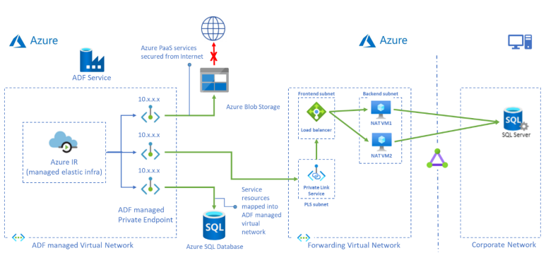
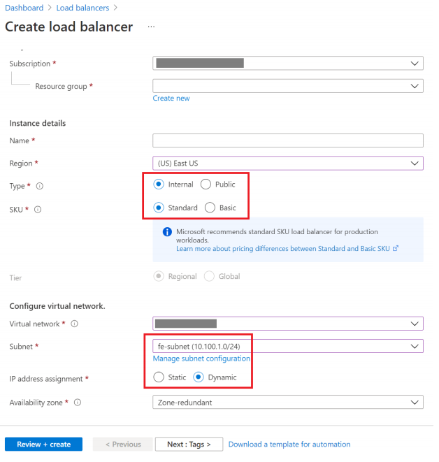
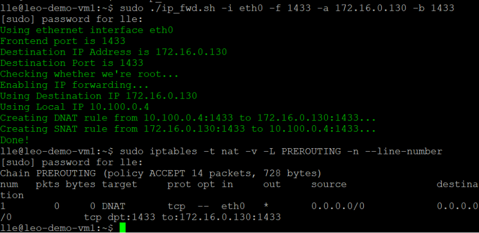
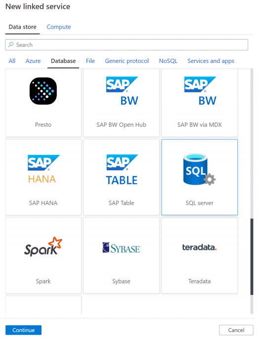
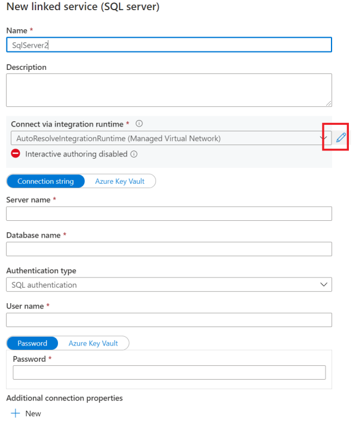
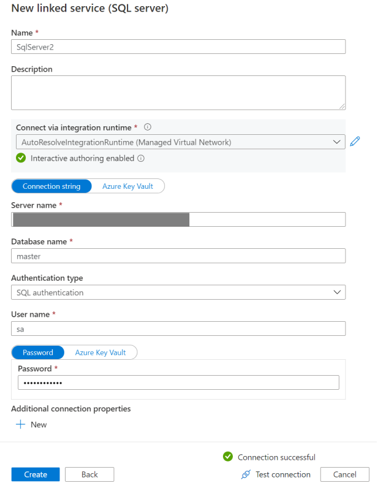

# Tutorial: How to access on premises SQL Server from Data Factory Managed VNET using Private Endpoint

This tutorial provides steps for using the Azure portal to setup Private Link Service and access on-prem SQL Server from Managed VNET using Private Endpoint.

## Prerequisites

* **Azure subscription**. If you don't have an Azure subscription, create a [free account](https://azure.microsoft.com/free/) before you begin.
* **Virtual Network**. If you don’t have a Virtual Network, create one following [Create Virtual Network](https://docs.microsoft.com/azure/virtual-network/quick-create-portal).
* **Virtual network to on-premises network**. Create a connection between virtual network and on-premises network either using [ExpressRoute](https://docs.microsoft.com/azure/expressroute/expressroute-howto-linkvnet-portal-resource-manager?toc=/azure/virtual-network/toc.json) or [VPN](https://docs.microsoft.com/azure/vpn-gateway/tutorial-site-to-site-portal?toc=/azure/virtual-network/toc.json).
* **Data Factory with Managed VNET enabled**. If you don’t have a Data Factory or Managed VNET is not enabled, create one following [Create Data Factory with Managed VNET](https://docs.microsoft.com/azure/data-factory/tutorial-copy-data-portal-private).

## Create subnets for resources

**Use the portal to create subnets in your virtual network.**

| Subnet | Description |
|:--- |:--- |
|be-subnet |subnet for backend servers|
|fe-subnet |subnet for standard internal load balancer|
|pls-subnet|subnet for Private Link Service|

## Create a standard load balancer

Use the portal to create a standard internal load balancer.

1. On the top left-hand side of the screen, select **Create a resource > Networking > Load Balancer**.
2. In the **Basics** tab of the **Create load balancer** page, enter, or select the following information:

    | Setting | Value |
    |:--- |:--- |
    |Subscription|Select your subscription.|
    |Resource group|Select your resource group.|
    |Name|Enter **myLoadBalancer**.|
    |Region|Select **East US**.|
    |Type|Select **Internal**.|
    |SKU|Select **Standard**.|
    |Virtual network|Select your virtual network.|
    |Subnet|Select **fe-subnet** created in the previous step.|
    |IP address assignment|Select **Dynamic**.|
    |Availability zone|Select **Zone-redundant**.|

3. Accept the defaults for the remaining settings, and then select **Review + create**.
4. In the **Review + create** tab, select **Create**.

    

## Create load balancer resources

### Create a backend pool

A backend address pool contains the IP addresses of the virtual (NICs) connected to the load balancer.

Create the backend address pool **myBackendPool** to include virtual machines for load-balancing internet traffic.

1. Select **All services** in the left-hand menu, select **All resources**, and then select **myLoadBalancer** from the resources list.
2. Under **Settings**, select **Backend pools**, then select **Add**.
3. On the **Add a backend pool** page, for name, type **myBackendPool**, as the name for your backend pool, and then select **Add**.

### Create a health probe

The load balancer monitors the status of your app with a health probe.

The health probe adds or removes VMs from the load balancer based on their response to health checks.

Create a health probe named **myHealthProbe** to monitor the health of the VMs.

1. Select **All services** in the left-hand menu, select **All resources**, and then select **myLoadBalancer** from the resources list.
2. Under **Settings**, select **Health probes**, then select **Add**.

    | Setting | Value |
    |:--- |:--- |
    |Name|Enter **myHealthProbe**.|
    |Protocol|Select **TCP**.|
    |Port|Enter 22.|
    |Interval|Enter **15** for number of **Interval** in seconds between probe attempts.|
    |Unhealthy threshold|Select **2** for number of **Unhealthy threshold** or consecutive probe failures that must occur before a VM is considered unhealthy.|

3. Leave the rest the defaults and select **OK**.

### Create a load balancer rule

A load balancer rule is used to define how traffic is distributed to the VMs. You define 
the frontend IP configuration for the incoming traffic and the backend IP pool to receive 
the traffic. The source and destination port are defined in the rule.

In this section, you'll create a load balancer rule:

1. Select **All services** in the left-hand menu, select **All resources**, and then select **myLoadBalancer** from the resources list.
2. Under **Settings**, select **Load-balancing rules**, then select **Add**.
3. Use these values to configure the load-balancing rule:

    | Setting | Value |
    |:--- |:--- |
    |Name|Enter **myRule**.|
    |IP Version|Select **IPv4**.|
    |Frontend IP address|Select **LoadBalancerFrontEnd**.|
    |Protocol|Select **TCP**.|
    |Port|Enter **1433**.|
    |Backend port|Enter **1433**.|
    |Backend pool|Select **myBackendPool**.|
    |Health probe|Select **myHealthProbe**.|
    |Idle timeout (minutes)|Move the slider to **15** minutes.|
    |TCP reset|Select **Disabled**.|

4. Leave the rest of the defaults and then select **OK**.

## Create a private link service

In this section, you'll create a Private Link service behind a standard load balancer.

1. On the upper-left part of the page in the Azure portal, select **Create a resource**.
2. Search for **Private Link** in the **Search the Marketplace** box.
3. Select **Create**.
4. In **Overview** under **Private Link Center**, select the blue **Create private link service** button.
5. In the **Basics** tab under **Create private link service**, enter, or select the following 
information:

    |Setting |Value |
    |---------|--------|
    |**Project details**||
    |Subscription |Select your subscription.|
    |Resource Group |Select your resource group.|
    |**Instance details**||
    |Name  |Enter **myPrivateLinkService**.|
    |Region  |Select **East US**.|

6. Select the **Outbound settings** tab or select **Next: Outbound settings** at the 
bottom of the page.
7. In the **Outbound settings** tab, enter or select the following information:

    | Setting | Value |
    |:--- |:--- |
    |Load balancer|Select **myLoadBalancer**.|
    |Load balancer frontend IP address|Select **LoadBalancerFrontEnd**.|
    |Source NAT subnet|Select **pls-subnet**.|
    |Enable TCP proxy V2|Leave the default of **No**.|
    |**Private IP address settings**||
    |Leave the default settings.||

8. Select the **Access security** tab or select **Next: Access security** at the bottom of 
the page.
9. Leave the default of **Role-based access control only** in the **Access security** tab.
10. Select the **Tags** tab or select **Next: Tags** at the bottom of the page.
11. Select the **Review + create** tab or select **Next: Review + create** at the bottom of 
the page.
12. Select **Create** in the **Review + create** tab.

## Create backend servers

1. On the upper-left side of the portal, select **Create a resource > Compute > Virtual machine**.
2. In **Create a virtual machine**, type or select the values in the **Basics** tab:

    |Setting |Value|
    |---------|--------|
    |**Project details**||
    |Subscription |Select your Azure subscription.|
    |Resource Group |Select your resource group.|
    |**Instance details**||
    |Virtual machine name  |Enter **myVM1**.|
    |Region  |Select **East US**.|
    |Availability Options  |Select **Availability zones**.|
    |Availability zone  |Select **1**.| 
    |Image  |Select **Ubuntu Server 18.04LTS – Gen1**.| 
    |Azure Spot instance  |Select **No**.| 
    |Size   |Choose VM size or take default setting.| 
    |**Administrator account**||
    |Username |Enter a username.|
    |SSH public key source  |Generate new key pair.|
    |Key pair name  |mySSHKey.|    
    |**Inbound port rules**||
    |Public inbound ports |None|   

3. Select the **Networking** tab, or select **Next: Disks**, then **Next: Networking**.
4. In the Networking tab, select or enter:

    | Setting |Value|
    |---------|--------|
    |**Network interface**||
    |Virtual network |Select your virtual network.|
    |Subnet |**be-subnet**.|
    |Public IP |Select **None**.|
    |NIC network security group |Select **None**.|
    |**Load balancing**||
    |Place this virtual machine behind an existing load balancing solution?|Select **Yes**.|
    |**Load balancing settings**||
    |Load balancing options |Select **Azure load balancing**.|
    |Select a load balancer |Select **myLoadBalancer**.|
    |Select a backend pool |Select **myBackendPool**.|    

5. Select **Review + create**.
6. Review the settings, and then select **Create**.
7. You can repeat step 1 to 6 to have more than 1 backend server VM for HA.

## Creating Forwarding Rule to Endpoint

1. Login and copy script [ip_fwd.sh](https://github.com/sajitsasi/az-ip-fwd/blob/main/ip_fwd.sh) to your backend server VMs. 
2. Run the script on with the following options: 
    **sudo ./ip_fwd.sh -i eth0 -f 1433 -a <FQDN/IP> -b 1433** 
    <FQDN/IP> is your target SQL Server IP. 
    >[!Note] 
    >FQDN doesn’t work for on premise SQL Server unless you add a record in Azure DNS zone.
3. Run below command and check the iptables in your backend server VMs. You can see one record in your iptables with your target IP. 
    **sudo iptables -t nat -v -L PREROUTING -n --line-number**
    
    

    >[!Note]
    > If you have more than one SQL Server or data sources, you need to define multiple load balancer rules and IP table records with different ports. Otherwise, there will be some conflict. For example, 
    >
    >|                  |Port in load balancer rule|Backend port in load balance rule|Command run in backend server VM|
    >|------------------|---------|--------|---------|
    >|**SQL Server 1**|1433 |1433 |sudo ./ip_fwd.sh -i eth0 -f 1433 -a <FQDN/IP> -b 1433|
    >|**SQL Server 2**|1434 |1434 |sudo ./ip_fwd.sh -i eth0 -f 1434 -a <FQDN/IP> -b 1433|
    
## Create a Private Endpoint to Private Link Service in your Data Factory

1. Select All services in the left-hand menu, select All resources, and then select your 
data factory from the resources list.
2. Select **Author & Monitor** to launch the Data Factory UI in a separate tab.
3. Add feature flag **&feature.enablePrivateLink=true** to data factory browser.
4. Go to the **Manage** tab and then go to the **Managed private endpoints** section.
5. Select + **New** under **Managed private endpoints.**
6. Select the **Private Link Service** tile from the list and select **Continue**.
7. Enter the name of private endpoint and select **myPrivateLinkService** in private link service list.
8. Add FQDN of your target on premises SQL Server and NAT IPs of your private link Service.
    
     
    
    
9. Create private endpoint.

## Create a linked service and test the connection

1. Go to the **Manage** tab and then go to the **Managed private endpoints** section.
2. Select + **New** under **Linked Service**.
3. Select the **SQL Server** tile from the list and select **Continue**.    

    

4. Enable **Interactive Authoring**.

    

5. Input the **FQDN** of your on-prem SQL Server, **user name** and **password**.
6. Then click **Test connection**.

    

## Troubleshooting

Go to the backend server VM, confirm telnet the SQL Server works: **telnet <FQDN> 1433**.

## Next steps

Advance to the following tutorial to learn about accessing SQL Managed Instance from Data Factory Managed VNET using Private Endpoint：

> [!div class="nextstepaction"]
> [Access SQL Managed Instance from Data Factory Managed VNET](tutorial-managed-virtual-network-sql-mi.md)
