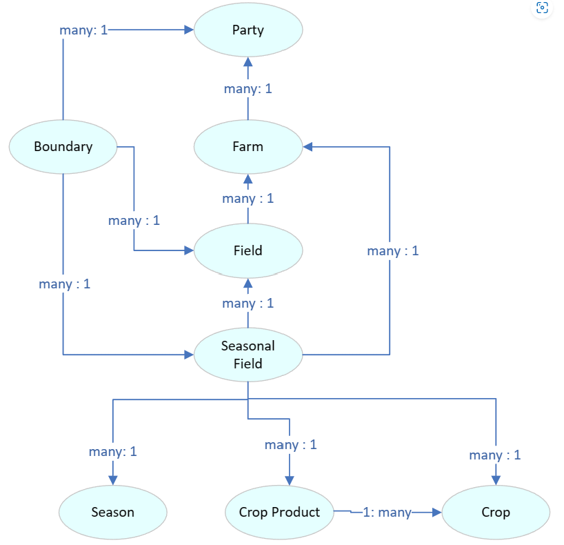

# Our Hierarchy Model

Agriculture needs data related to Growers, farms, and fields to be organized in a well defined manner to enhance the ease of farming and also to keep data in an analysis ready state. Firms operating in the Agri space often perform longitudinal studies and need high quality data to generate insights. Data Manager for Agriculture  organizes agronomic data in the below manner.

> [!NOTE]
> Microsoft Azure Data Manager for Agriculture is currently in preview. For legal terms that apply to features that are in beta, in preview, or otherwise not yet released into general availability, see the [**Supplemental Terms of Use for Microsoft Azure Previews**](https://azure.microsoft.com/en-us/support/legal/preview-supplemental-terms/).
> Microsoft Azure Data Manager for Agriculture requires registration and is available to only approved customers and partners during the preview period. To request access to Microsoft Data Manager for Agriculture during the preview period, use this [**form**](https://forms.office.com/r/SDR0m3yjeS).

## Understanding farm hierarchy

### Party  
* Party is the de facto owner and custodian of any data related to his/her farm. Party is the central authority to which all the data refers to (directly or indirectly). 
* The onus of defining who is a Party is with the application building on top of Data Manager for Agriculture. In most cases, owners of the land or their nominees are an incorporated Party that runs the operations. 

### Farm
* Farms are logical entities. A farm is a collection of fields. 
* Farms do not have any geometry associated with them. These are logical entities to help you organize your growing operations.

### Field
* Fields denote a stable boundary that is in general agnostic to seasons and other temporal constructs. For example, field could be the boundary denoted in government records.
* Fields are multi-polygon. For example, a road might divide the farm in two or more parts
* Fields are multi-boundary. Agriculture is a team sport. There are multiple parties, trusted advisors in the farming ecosystem (retailers, agronomists, farm equipment operators) who define the boundary of a field. Hence, at any point in time there could be various boundaries for a field. Only one among them will be designated as a primary boundary.
* For any calculation where boundary is not explicitly defined, primary boundary will be used as the default boundary.    
* For few customers the concept of field does not exist. In such a scenario, farms will be a collection of seasonal fields. 

### Seasonal field
* This is the most important construct in the farming world. A seasonal field is defined by following things
     * Boundary
     * Season 
     * Crop
* A seasonal field is associated with a field or a farm
* In Data Manager for Agriculture, seasonal fields are mono crop entities. In cases where farmers are cultivating different crops simultaneously, they have to create one seasonal field per crop.
* A seasonal field is associated with one season. If a farmer cultivates across multiple seasons, s/he has to create one seasonal field per season.
* It is multi-polygon. Same crop can be planted in different areas within the farm.
* It is multi-boundary. There are multiple entities in the farming ecosystem (farmers, retailers, agronomists, farm equipment operators, applications) who define the boundary of a seasonal field. Hence, at any point in time there could be various boundaries for a seasonal field. Only one among them will be designated as a primary boundary.
* For any calculation where boundary is not explicitly defined, primary boundary will be used as the default boundary.

### Boundary
* Boundary represents the geometry of a field or a seasonal field.
* It is represented as a multi-polygon GeoJSON consisting of vertices (lat/long).

### Season
* Season represents the temporal aspect of farming. It is a function of local agronomic practices, procedures and weather.

### Crop
* This provides the phenotypic details of the planted crop.

### Crop Product
* This refers to the commercial variety (brand, product) of the planted seeds. A seasonal field can contain information about various varieties of seeds planted (belonging to the same crop).