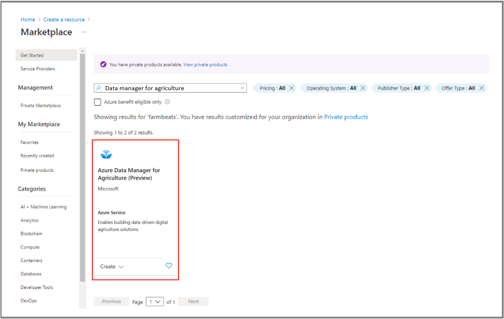
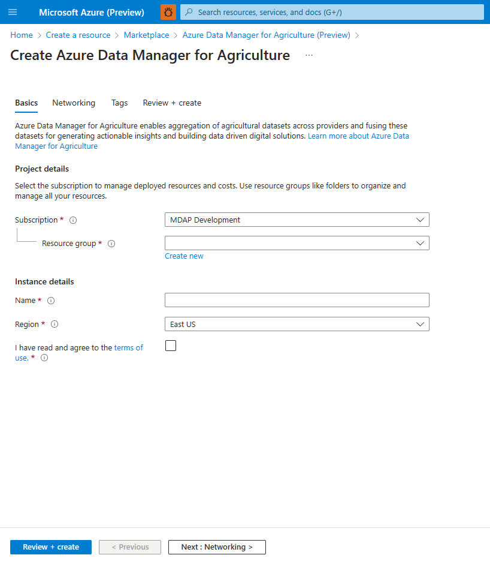

# Quickstart install Azure Data Manager for Agriculture Preview

> [!NOTE]
> Microsoft Azure Data Manager for Agriculture is currently in preview. For legal terms that apply to features that are in beta, in preview, or otherwise not yet released into general availability, see the [**Supplemental Terms of Use for Microsoft Azure Previews**](https://azure.microsoft.com/support/legal/preview-supplemental-terms/).
> Microsoft Azure Data Manager for Agriculture requires registration and is available to only approved customers and partners during the preview period. To request access to Microsoft Data Manager for Agriculture during the preview period, use this [**form**](https://aka.ms/agridatamanager).

## 1: Register resource provider

After you have confirmation that your Azure subscription ID is in our allowlist, then use the below steps to install Data Manager for Agriculture through Azure portal UI.

Follow steps 1-5 in Resource Provider [documentation](https://docs.microsoft.com/azure/azure-resource-manager/management/resource-providers-and-types#register-resource-provider).

In step 5 in the above documentation, search for `Microsoft.AgFoodPlatform` and register the same.

## 2: Search in marketplace

> [!IMPORTANT]
> Access the  Azure Portal using <a href="https://portal.azure.com/?microsoft_azure_marketplace_ItemHideKey=Microsoft_Azure_AgFoodPlatformHidden#create/hub" target="_blank">**this link**</a> . This link enables visibility of the Azure Data Manager for Agriculture installation card in the Marketplace for our preview customers.

Enter Data manager for agriculture in the marketplace search bar. Then select 'create' on the listing tile as shown below.



## 3: Create Data Manager for Agriculture instance 

Provide the required details for creating an Azure Data Manager for Agriculture instance and resource group in a selected region. Provide the following details:

* **Subscription Id** : Choose the allow listed subscription Id for your tenant
* **Resource Group**: Choose an existing resource group or create a new one
* **Instance Name**: Give the Data Manager for Agriculture instance a name
* **Region**: Choose the region where you want the instance deployed 
* **Tags**: Choose to categorize the resource with a tag

After providing the details and accepting terms and conditions, click on "review + create" followed by the create button. This starts the process of deploying the Azure Data Manager for Agriculture resource.



## 4: Azure app registration

You can access Data Manager for Agriculture resource through an app registered in Azure Active Directory. Use the Azure portal for App registration, this enables Microsoft identity platform to provide authentication and authorization services for your app accessing Data Manager for Agriculture.

Follow the steps provided in <a href="https://docs.microsoft.com/azure/active-directory/develop/quickstart-register-app#register-an-application" target="_blank">App Registration</a> **until step 8** to generate the following information:

1. **Application (client) ID**
2. **Directory (tenant) ID**
3. **App Name**

Write down these three values,  you would need them in the next step.

The Application (client) ID created is like the User ID of the application, and now you need to create its corresponding Application password (client secret) for the application to identify itself.

Follow the steps provided in <a href="https://docs.microsoft.com/azure/active-directory/develop/quickstart-register-app#add-a-client-secret" target="_blank">Add a client secret</a> to generate **Client Secret** and copy the client secret generated.

## 5: Role assignment

Once the App registration is done, the next step is to assign roles in the Azure portal to provide Authorization to the newly created application. Data Manager for Agriculture uses Azure RBAC to manage Authorization requests.

Log in to Azure portal and navigate to the newly created resource (`<Name>-resource-name` created in step 5) under the resource group (`resource-group-name`).

> [!NOTE]
> Inside the resource group tab, if you do not find the created Data Manager for Agriculture resource, you need to enable the **show hidden types** checkbox to see the Data Manager for Agriculture resource that you created.

Click on the Azure Data Manager for Agriculture resource tab, you can find the IAM menu option on the left hand side of the option pane as shown in the image:


Click **Add > Add role assignment**, and this opens up a pane the right side of the portal, choose one of the three roles from the dropdown:

- **AgFood Platform Service Admin** - has all privileges in the CRUD (Create, Read, Update and Delete) operations.
- **AgFood Platform Service Contributor** - has restricted privileges in the CRUD operations (Can't delete).
- **AgFood Platform Service Reader** - has only access to read operations.

To complete the role assignment do the following steps:

1. Choose a role from the above mentioned three roles.

2. Choose **User, group, or service principal** in the Assign access to section.

3. **Paste the newly created App Name** in the Select section (as shown in the image below).

4. Click **Save** to assign the role.


This ensures that the App (registered in the previous step) has been granted access (based on the role assigned) to Azure Data Manager for Agriculture Resource.

> [!NOTE]
> You need to create three different Apps (App registrations) to be able to assign all three roles (Admin, Contributor and Reader).

## 6: Generate an access token 

The next step is to generate access token, which contains the security credentials required to identify the application against the Azure Role assignments done in the previous step.

To access Azure Data Manager for Agriculture REST APIs with the service principal, you need to get an Azure AD access token for the service principal.

Replace the following parameters in the request:

| Parameter | Description | 
|:---|:---|
| Tenant ID |  Tenant ID in Azure AD generated in the app registration (step 1) |
| Client ID |  The application (service principal) ID of the application you registered |
| Client Secret |  The secret generated for the application. |

The ``resource`` parameter is the identifier for the Azure Data Manager for Agriculture login application. This identifier is a constant value set to ``https://farmbeats.azure.net``.

For Bash:
```bash
curl -X POST -H 'Content-Type: application/x-www-form-urlencoded' \
-d 'grant_type=client_credentials&client_id=<client-id>&resource=https://farmbeats.azure.net&client_secret=<application-secret>' \
https://login.microsoftonline.com/<tenant-id>/oauth2/token
```

For PowerShell:
```powershell
$headers = New-Object "System.Collections.Generic.Dictionary[[String],[String]]"
$headers.Add("Content-Type", "application/x-www-form-urlencoded")
$body = "grant_type=client_credentials&client_id=<client-id>&client_secret=<application-secret>&resource=https%3A%2F%2Ffarmbeats.azure.net"
$response = Invoke-RestMethod 'https://login.microsoftonline.com/<tenant-id>/oauth2/token' -Method 'POST' -Headers $headers -Body $body
$response | ConvertTo-Json
```

The response should look like:

```json
{
  "token_type": "Bearer",
  "expires_in": "3599",
  "ext_expires_in": "3599",
  "expires_on": "1622530779",
  "not_before": "1622526879",
  "resource": "https://farmbeats.azure.net",
  "access_token": "eyJ0eXAiOiJKV1QiLC......tpZCI6InZhcF9"
}
```

With working **API endpoint (instanceUri)** and **access_token**, you now can start making requests to our service  APIs. If there are any queries in setting up the environment write to us at madma@microsoft.com.

## Next steps

1. See the Hierarchy Model and learn how to create and organize your agriculture data  [here](./concepts-hierarchy-model.md)
2. Test our APIs [here](https://review.learn.microsoft.com/rest/api/data-manager-for-agri/?branch=main)
