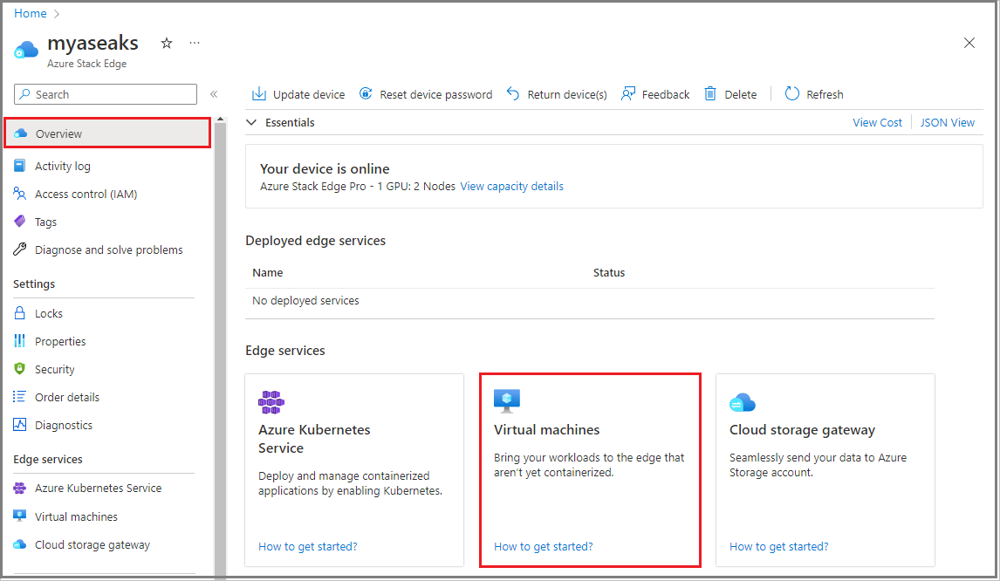
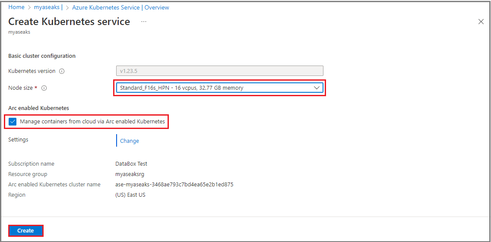
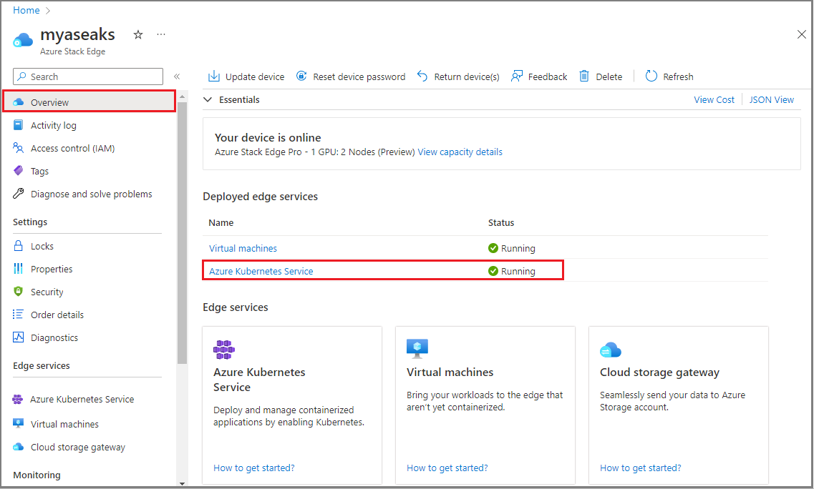
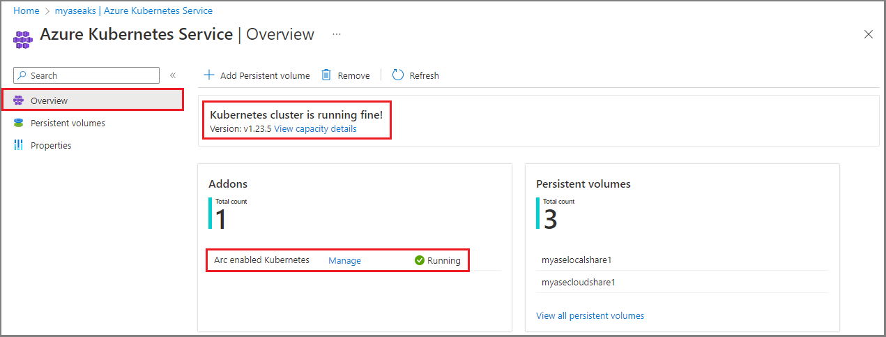
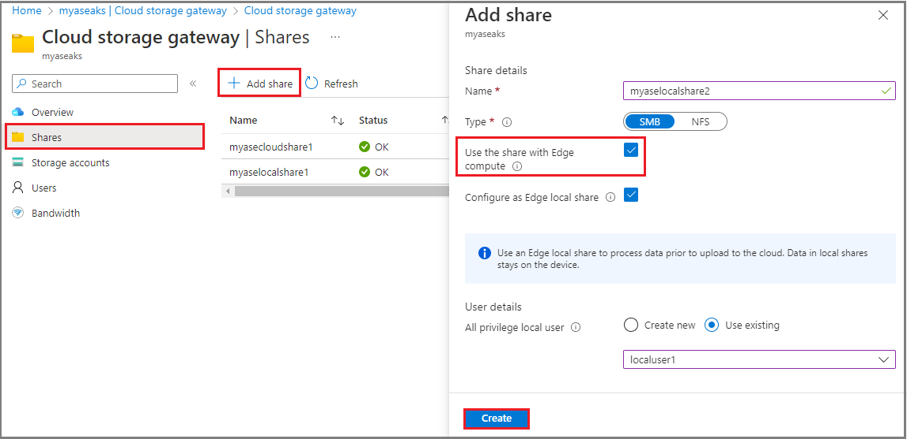
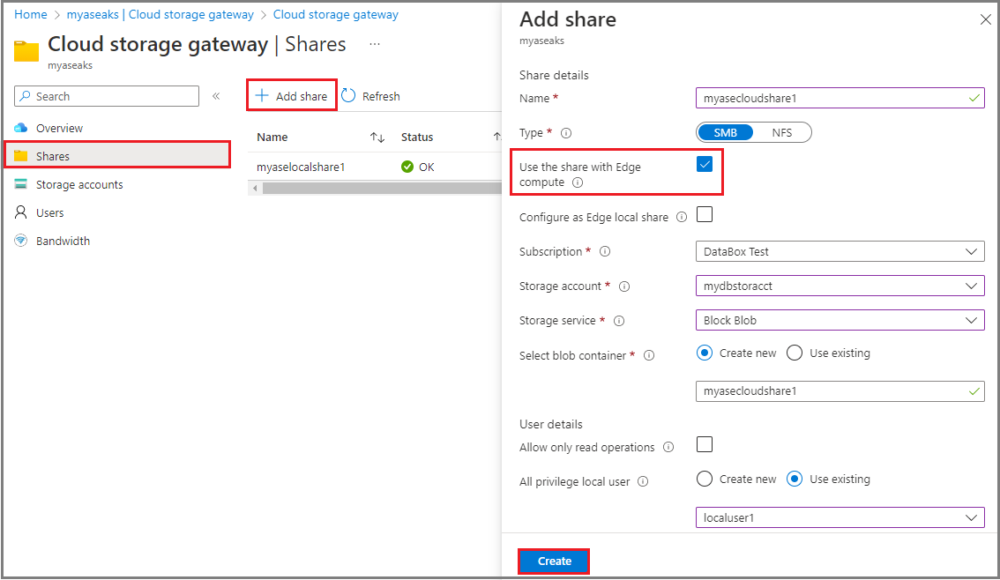
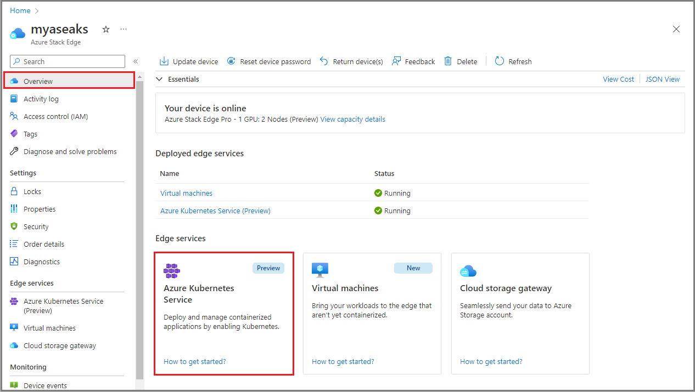
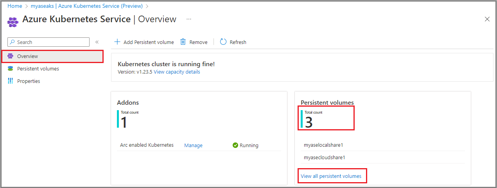
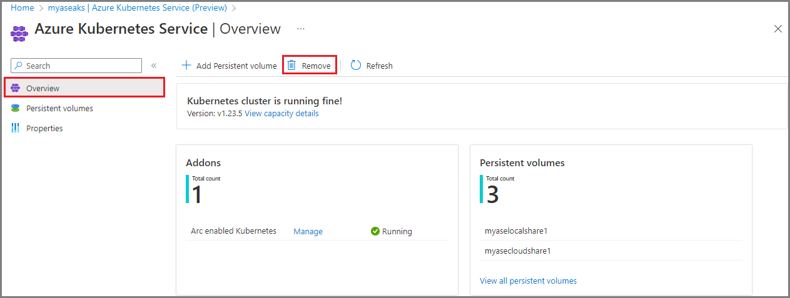

# Deploy Azure Kubernetes service on Azure Stack Edge

[!INCLUDE [applies-to-GPU-and-pro-r-and-mini-r-skus](../../includes/azure-stack-edge-applies-to-gpu-pro-r-mini-r-sku.md)]

> [!NOTE]
> Use this procedure only if you are an SAP or a PMEC customer.

This article describes how to deploy and manage Azure Kubernetes Service (AKS) on your Azure Stack Edge device. You can also use this article to create persistent volumes, use GitOps to manage an Arc-enabled Kubernetes cluster, and remove AKS and Azure Arc.

The intended audience for this article is IT administrators who are familiar with setup and deployment of workloads on the Azure Stack Edge device.

## About Azure Kubernetes Service on Azure Stack Edge

Azure Stack Edge is an AI-enabled edge computing device with high performance network I/O capabilities. After you configure compute on your Azure Stack Edge device, you can use the Azure portal to deploy Azure Kubernetes service, including infrastructure VMs. The AKS cluster is then used for workload deployment via Azure Arc.

## Prerequisites

Before you begin, ensure that:

- You have a Microsoft account with credentials to access Azure portal, and access to an Azure Stack Edge Pro GPU device. The Azure Stack Edge device will be configured and activated using the instructions in [Set up and activate your device](azure-stack-edge-gpu-deploy-checklist.md).
- You have at least one virtual switch created and enabled for compute on your Azure Stack Edge device. For detailed steps, see [Create virtual switches](azure-stack-edge-gpu-deploy-configure-network-compute-web-proxy.md?pivots=single-node#configure-virtual-switches).
- You have a client to access your device that is running a supported operating system. If using a Windows client, make sure that it's running PowerShell 5.0 or later.
- Before you enable Azure Arc on the Kubernetes cluster, make sure that you’ve enabled and registered `Microsoft.Kubernetes` and `Microsoft.KubernetesConfiguration` resource providers against your subscription. For detailed steps, see [Register resource providers via Azure CLI](../azure-arc/kubernetes/quickstart-connect-cluster.md?tabs=azure-cli#register-providers-for-azure-arc-enabled-kubernetes).
- If you intend to deploy Azure Arc for Kubernetes cluster, you’ll need to create a resource group. You must have owner level access to the resource group.

  To verify the access level for the resource group, go to **Resource group** > **Access control (IAM)** > **View my access**. Under **Role assignments**, you should be listed as an Owner.

    lightbox="./media/azure-stack-edge-deploy-aks-on-azure-stack-edge/azure-stack-edge-access-control-my-assignments.png"

Depending on the workloads you intend to deploy, you may need to ensure the following **optional** steps are also completed:
 
- If you intend to deploy [custom locations](../azure-arc/platform/conceptual-custom-locations.md) on your Arc-enabled cluster, you’ll need to register the `Microsoft.ExtendedLocation` resource provider against your subscription. You'll also need to fetch the custom location object ID and use it to enable custom locations via the PowerShell interface of your device.

   Here's a sample output using the Azure CLI. You can run the same commands via the Cloud Shell in the Azure portal.

   ```azurepowershell
   az login
   az ad sp show --id 'bc313c14-387c-4e7d-a58e-70417303ee3b' --query objectId -o tsv
   ```

  For more information, see [Create and manage custom locations in Arc-enabled Kubernetes](../azure-arc/kubernetes/custom-locations.md).

- If deploying Kubernetes or PMEC workloads, you may need virtual networks that you’ve added using the instructions in [Create virtual networks](azure-stack-edge-gpu-deploy-configure-network-compute-web-proxy.md?pivots=single-node#configure-virtual-network).

- Get the logical processor indexes for HPN VMs:

     ```azurepowershell
     Get-HcsNumaLpMapping -MapType HighPerformanceCapable -NodeName (hostname)
     ```
     Here's an example output where all the vCPUs were reserved:

     ```azurepowershell
     [10.126.77.42]: PS>hostname
     1DGNHQ2
     [10.126.77.42]: PS>Get-HcsNumaLpMapping -MapType HighPerformanceCapable -NodeName 1DGNHQ2
     { Numa Node #0 : CPUs [4, 5, 6, 7, 8, 9, 10, 11, 12, 13, 14, 15, 16, 17, 18, 19] }
     { Numa Node #1 : CPUs [24, 25, 26, 27, 28, 29, 30, 31, 32, 33, 34, 35, 36, 37, 38, 39] }
     [10.126.77.42]: PS>Set-HcsNumaLpMapping -CpusForHighPerfVmsCommaSeperated "4, 5, 6, 7, 8, 9, 10, 11, 12, 13, 14, 15, 16, 17, 18, 19, 24, 25, 26, 27, 28, 29, 30, 31, 32, 33, 34, 35, 36, 37, 38, 39" -AssignAllCpusToRoot $false
    ```

## Deploy Azure Kubernetes Service on your Azure Stack Edge device

Use the following steps for single node or two node deployments.
 
## Enable AKS and custom locations

1.	[Connect to the PowerShell interface of the device](azure-stack-edge-gpu-connect-powershell-interface.md).

1.	**Optionally** you can run the following command to set custom locations. Input the custom location object ID that you fetched when completing your prerequisites.

    ```azurepowershell
    Set-HcsKubeClusterArcInfo –CustomLocationsObjectId <custom_location_object_id>
    ```

1.	Run the following command to enable AKS:

    ```azurepowershell
    Enable-HcsAzureKubernetesService –f
    ```

    This step doesn't deploy the Kubernetes cluster. The cluster is deployed later in the section for [Set up Kubernetes cluster and enable Arc](azure-stack-edge-deploy-aks-on-azure-stack-edge.md#set-up-kubernetes-cluster-and-enable-arc).

1.	To verify that AKS is enabled, go to your Azure Stack Edge resource in the Azure portal. In the **Overview** pane, select the **Azure Kubernetes Service** tile.

    

## Specify static IP pools for Kubernetes pods

This is an optional step where you can assign IP pools for the virtual network that will be used by Kubernetes pods. 

You can specify a static IP address pool for each virtual network that is enabled for Kubernetes. The virtual network enabled for Kubernetes will generate a `NetworkAttachmentDefinition` that's created for the Kubernetes cluster.

During application provisioning, Kubernetes pods can use static IP addresses in the IP pool for container network interfaces, like container single root I/O virtualization (SR-IOV) interfaces. This can be done by pointing to a `NetworkAttachmentDefinition` in the PodSpec.

Use the following steps to assign static IP pools in the local UI of your device.

1. Go to the **Advanced networking** page in Azure portal.

1. If you didn’t create virtual networks earlier, select **Add virtual network** to create a Virtual network. You’ll need to specify the virtual switch associated with the virtual network, VLAN ID, subnet mask, and gateway.

1. In an example shown here, we've configured three virtual networks. In each of these virtual networks, VLAN is **0** and subnet mask and gateway match the external values; for example, **255.255.0.0** and **192.168.0.1**.
   1. **First virtual network** – Name is **N2** and associated with **vswitch-port5**.
   1. **Second virtual network** – Name is **N3** and associated with **vswitch-port5**.
   1. **Third virtual network** – Name is **N6** and associated with **vswitch-port6**.
 
      

    1. Once all three virtual networks are configured, they'll be listed under the virtual networks, as follows: 
 
       

1. Assign IP address pools to the virtual networks:

   1. On the **Kubernetes** page, select a virtual network that you created and **enable it for Kubernetes**.
   
   1. Specify a contiguous range of static IPs for Kubernetes pods in the virtual network. In this example, a range of one IP address was provided for each of the three virtual networks that we created.

1. Select **Apply** to apply the changes for all virtual networks. 
 
   > [!NOTE]
   > You can't modify the IP pool settings once the AKS cluster is deployed.

    

## Configure the compute virtual switch

You’ll now configure the virtual switch that you create for Kubernetes compute traffic.

1. In the local UI of your device, go to the **Kubernetes** page.

1. Select **Modify** to configure a virtual switch for Kubernetes compute traffic. 

1. Enable the compute on a port that has internet access. For example, in this case, port 2 that was connected to the internet is enabled for compute. Internet access allows you to retrieve container images from AKS. 

1. For Kubernetes nodes, specify a contiguous range of six static IPs in the same subnet as the network for this port. 

   As part of the AKS deployment, two clusters are created, a management cluster and a target cluster. The IPs that you specified are used as follows:

   - The management cluster needs two IPs = 1 IP for management control plane network interface + 1 IP for API server (VIP).

   - The target cluster needs (2+n) IPs = 1 IP for target cluster control plane network interface + 1 IP for API server (VIP) + number of nodes, n.

   - An extra IP is used for rolling updates.

     For a single node device, the above results in six IPs to deploy a Kubernetes cluster. For a two node cluster, you need seven IPs.

1. For the Kubernetes external service IPs, supply static IPs for services that are exposed outside the Kubernetes cluster. Each such service would need one IP. 

    

   The page will update as shown below:

   

## Enable a cloud management VM role through Azure portal

This step is required to allow the Azure Stack Edge portal to deploy the infrastructure VMs on Azure Stack Edge device for AKS; for example, for the target cluster worker node.

1. In the Azure portal, go to your Azure Stack Edge resource.

1. Go to **Overview** and select the **Virtual machines** tile.

   

1. In the **Virtual machines** > **Overview** page, select **Enable** for **Virtual machines cloud management**.

   

## Set up Kubernetes cluster and enable Arc

You’ll now set up and deploy the Kubernetes cluster and enable it for management via Arc.

   > [!IMPORTANT]
   > Before you proceed to create the Kubernetes cluster, keep in mind that:
   >- You can't modify the IP pool settings after the AKS cluster is deployed.
   >- As part of Arc-enabling the AKS target cluster, custom locations will be enabled if the object ID was passed using the optional command in the section for [Enable AKS and custom locations](#enable-aks-and-custom-locations) in this article. If you didn’t enable custom locations, you can still choose to do this before the Kubernetes cluster is created. After the cluster deployment has started, you won’t be able to set custom locations.

Follow these steps to deploy the AKS cluster.

1. In the Azure portal, go to your Azure Stack Edge resource.

1. Select the **Azure Kubernetes Services** tile.

1. Select **Add** to configure AKS.

1. On the **Create Kubernetes service** dialog, select the Kubernetes **Node size** for the infrastructure VM. In this example, we have selected VM size **Standard_F16s_HPN – 16 vCPUs, 32.77 GB memory**.

   > [!NOTE]
   > If the node size dropdown isn’t populated, wait a few minutes so that it's synchronized after VMs are enabled in the preceding step.

1. Check **Manage container from cloud via Arc enabled Kubernetes**. This option, when checked, will enable Arc when the Kubernetes cluster is created.

1. If you select **Change**, then you’ll need to provide a subscription, resource group, cluster name, and region.

   

   1. The subscription name should be automatically populated.

   1. Specify a unique resource group name. You can also choose to use the same resource group in which you deployed your Azure Stack Edge resource. **You must have owner level access to this resource group.** To verify the access level for the resource group, go to **Resource group** > **Access control (IAM)** > **View my access**. Under **Role assignments**, you must be listed as an Owner.

      

   1. Specify a name for your Arc enabled Kubernetes cluster or accept the provided default.

   1. Select a region where the resource for your Arc enabled Kubernetes cluster will be created. A filtered list of supported regions is displayed in the dropdown list. For more information, see [supported regions for Azure Arc enabled Kubernetes](../azure-arc/kubernetes/overview.md).  
   1. Select **Configure**. You can also reset the Arc settings by selecting the **Reset to default** option.

1. Select **Create** to create the Kubernetes service.

   

1. You're notified when the cluster creation starts.

   

   > [!IMPORTANT]
   > The creation of Kubernetes cluster takes about 20 minutes. During the creation, a critical alert is displayed in the Azure portal for your Azure Stack Edge resource. This alert will resolve itself in a few minutes.

   

   1. Once the Kubernetes cluster is created, you’ll see that the Azure Kubernetes Service is **Running**.

      

      The **Arc-enabled Kubernetes** will also show up as **Running**.

      

   If you're planning to deploy Kubernetes workloads, you may next need to create Persistent Volumes to allocate storage.

## Add a persistent volume

**PersistentVolume (PV)** refers to a piece of storage in the Kubernetes cluster. Kubernetes storage can be statically provisioned as `PersistentVolume`. It can also be dynamically provisioned as `StorageClass`. For more information, see [Storage requirements for Kubernetes pods](azure-stack-edge-gpu-kubernetes-storage.md#storage-requirements-for-kubernetes-pods). 

There are two different workflows for creating PVs depending on whether the compute is enabled inline when the share is created, or not. Each of these workflows is discussed in the following sections.

### Create a persistent volume with compute enabled inline during share creation

On your Azure Stack Edge Pro device, statically provisioned `PersistentVolumes` are created using the device's storage capabilities. When you provision a share and the **Use the share with Edge compute** option is enabled, this action automatically creates a PV resource in the Kubernetes cluster.



To use cloud tiering, you can create an Edge cloud share with the **Use the share with Edge compute** option enabled. A PV is again created automatically for this share. If you enable this option, any application data that you write to the Edge share will be tiered to the cloud.




### Create a persistent volume with compute not enabled inline during share creation

For the shares that were created with the **Use the share with Edge compute** option unchecked, you can add a persistent volume using the following steps.

1. In the Azure portal, go to the Azure Stack Edge resource for your device. Go to **Cloud storage gateway** > **Shares**. You can see that the device currently has shares with the **Used for compute** status enabled.

   

1. Select **+ Add share**. For this share, make sure that the **Use the share with Edge compute** option is unchecked.

   

1. You can see the newly created share in the list of shares and the **Used for compute** status is **Disabled**.

   

1. Go back to the **Azure Stack Edge resource** > **Overview**. In the right-pane, select the **Azure Kubernetes Service** tile. 

   

1. In the **Azure Kubernetes Service** > **Overview** page, the **Persistent volumes** tile shows the persistent volumes that exist. These volumes were created automatically when the shares were created with the **Use the share with Edge compute** option enabled. To create a new persistent volume, select **+ Add persistent volume**.

1. In the **Add Persistent volumes** dialog, select the share for which you want to create the persistent volume.

   

1. You’ll see a notification that the persistent volume is being created. This operation may take a couple of minutes to complete.

   

1. After the persistent volume is created, the **Overview** page updates to include the newly added persistent volume. 

   

1. Select **View all persistent volumes** to see the newly created persistent volume.

## Remove the Azure Kubernetes Service

Use the following steps in the Azure portal to remove AKS.

1. In your Azure Stack Edge resource, go to **Azure Kubernetes Service** > **Overview**.

1. From the top command bar, select **Remove**.

   

1. Select the configured addon that you want to remove along with AKS. Azure Arc enabled Kubernetes is an addon. Once you select **Remove**, all Kubernetes configurations and the selected addon will be removed. The operation is irreversible and can’t be undone.

1.  Select **OK** to confirm the operation.

   

## Next steps

To install Fusion Core, follow the instructions in the article for Fusion Core along with this article.
 