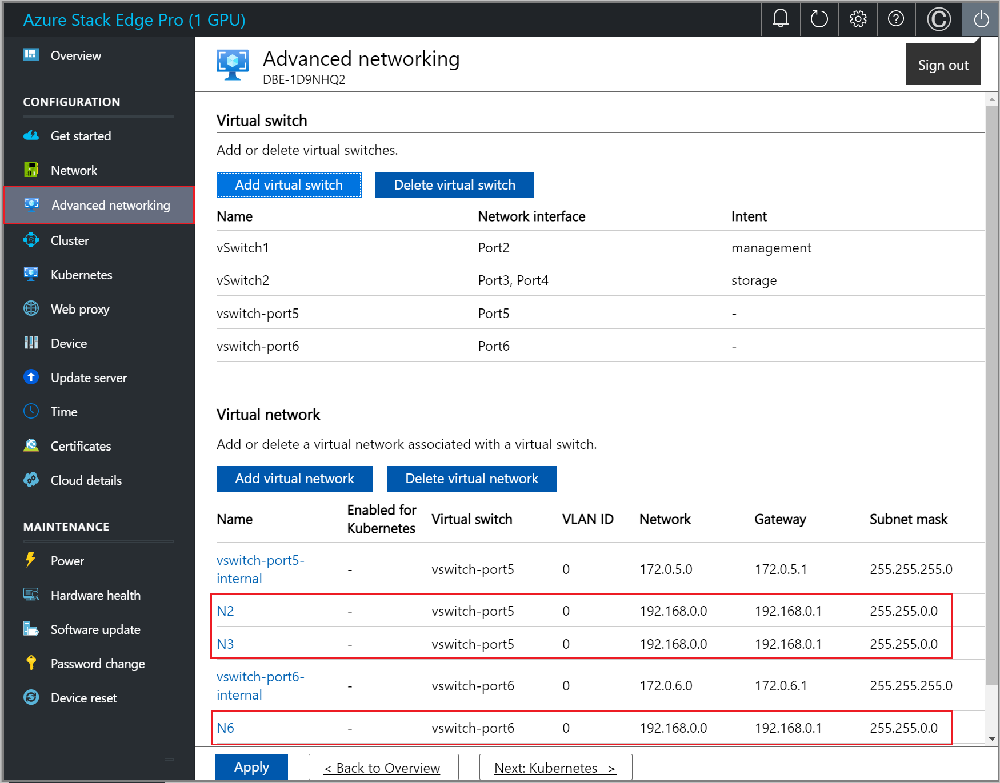
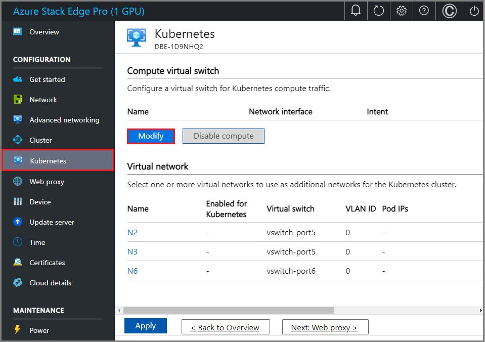
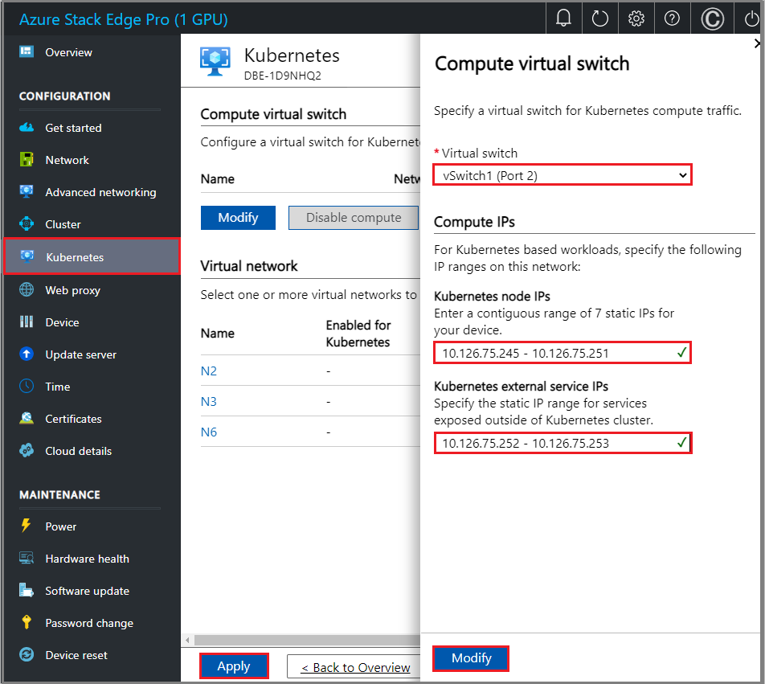
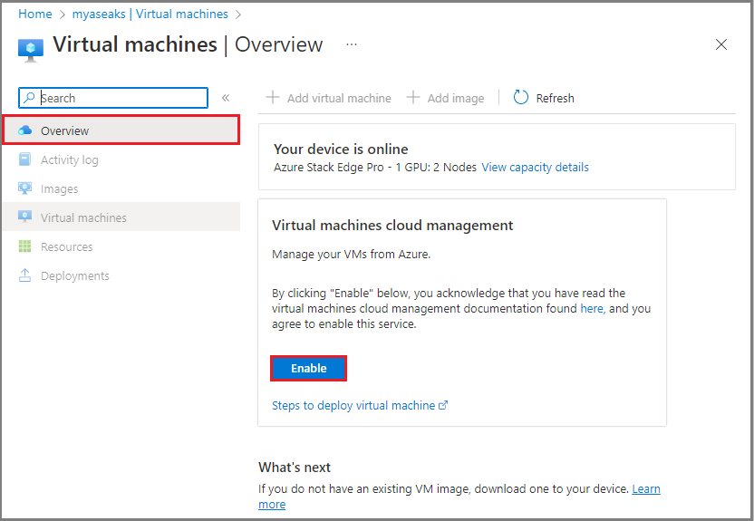

# Deploy Azure Kubernetes Service on Azure Stack Edge

[!INCLUDE [applies-to-GPU-and-pro-r-and-mini-r-skus](../../includes/azure-stack-edge-applies-to-gpu-pro-r-mini-r-sku.md)]

This article describes how to deploy and manage Azure Kubernetes Service (AKS) on your Azure Stack Edge device.

## About Azure Kubernetes Service on Azure Stack Edge

Azure Stack Edge Pro with GPU is an AI-enabled edge computing device with high performance network I/O capabilities. Microsoft ships you a cloud-managed device that acts as network storage gateway and has a built-in Graphical Processing Unit (GPU) that enables accelerated AI-inferencing.

On your Azure Stack Edge device, you can configure compute. With compute configured, you can then use the Azure portal to deploy the Kubernetes cluster including the infrastructure VMs. This cluster is then used for workload deployment via kubectl or Azure Arc.

## Scenarios covered in this article

The following scenarios are described in this article:

1. **Deploy AKS on your device.** This can be done with or without configuring the Azure Arc for Kubernetes clusters as an addon. 
   - If you enable Azure Arc on Kubernetes cluster, use Azure Arc to manage your cluster. 
   - If you disable Azure Arc, you can use kubectl to manage your cluster.

2. **Remove AKS.** When you remove the Azure Kubernetes Service, this action also removes the Azure Arc for Kubernetes cluster option.

3. **Create Persistent Volumes (PVs).** Allocate storage for your Kubernetes workload deployments by creating Persistent Volumes.

4. **Manage via Arc-enabled Kubernetes.** You can use the GitOps configuration to manage Arc-enabled Kubernetes cluster.

This guide provides a step-by-step procedure of the preceding scenarios.  The target audience for this guide is IT administrators who are familiar with setup and deployment of workloads on the Azure Stack Edge device.

## Prerequisites

Before you begin, ensure that:

- You have your Microsoft account with access credentials to access Azure portal.
- You have access to an Azure Stack Edge Pro GPU device. This device will be configured and activated as per the detailed instructions in [Set up and activate your device](azure-stack-edge-gpu-deploy-checklist.md).
- You have at least one virtual switch created and enabled for compute on your Azure Stack Edge device as per the instructions in [Create virtual switches](azure-stack-edge-gpu-deploy-configure-network-compute-web-proxy.md?pivots=single-node#configure-virtual-switches-and-compute-ips).
- You have a client to access your device. The client system is running a supported operating system. If using a Windows client, make sure that it is running PowerShell 5.0 or later.
- Before you enable Azure Arc on the Kubernetes cluster, make sure that you’ve enabled and registered `Microsoft.Kubernetes` and `Microsoft.KubernetesConfiguration` resource providers against your subscription as per the detailed instructions in [Register resource providers via Azure CLI](../../azure-arc/kubernetes/quickstart-connect-cluster?tabs=azure-cli#register-providers-for-azure-arc-enabled-kubernetes).
- If you intend to deploy Azure Arc for Kubernetes cluster, you’ll need to create a resource group. You must have owner level access to this resource group.
- To verify the access level for the resource group, go to **Resource group** > **Access control (IAM)** > **View my access**. Under **Role assignments**, you should be listed as an Owner.

    

Depending on the workloads you intend to deploy, you may need to ensure the following **optional** steps are also completed: 
- If you intend to deploy [custom locations](../../azure-arc/platform/conceptual-custom-locations.md) on your Arc-enabled cluster, you’ll need to register the `Microsoft.ExtendedLocation` resource provider against your subscription. You would also need to fetch the custom location object ID and use it to enable custom locations via the PowerShell interface of your device.

   Here is a sample output using the Azure CLI. You can run the same commands via the Cloud Shell in the Azure portal.

   ```azurepowershell
   az login
   az ad sp show --id 'bc313c14-388c-4e7d-a58e-70017303ee3b' --query objectId -o tsv
   ```

  For more information, see [Create and manage custom locations in Arc-enabled Kubernetes](../../azure-arc/kubernetes/custom-locations.md).

- If deploying Kubernetes or PMEC workloads, you may need virtual networks that you’ve added as per the instructions in [Create virtual networks](azure-stack-edge-gpu-deploy-configure-network-compute-web-proxy.md?pivots=single-node#configure-virtual-network).
- If using a high performance network VM as your Kubernetes VM, you would need to reserve the vCPUs as described in the steps to [reserve vCPUs on HPN VMs](azure-stack-edge-gpu-deploy-virtual-machine-high-performance-network.md?tabs=2210#prerequisites) with the following differences:
   - Skip steps 1 to 3 that include the start and stop VM commands as we don’t have any VMs.
   - Get the logical processor indexes to reserve for HPN VMs.

     ```azurepowershell
     Get-HcsNumaLpMapping -MapType HighPerformanceCapable -NodeName (hostname)
     ```

   - Reserve all the supplied vCPUs that you got from the preceding step into `Set-HcsNumaLpMapping` command. The device will automatically reboot at this point. Wait for the reboot to complete.
   Here is an example output where all the vcpus were reserved:

     ```azurepowershell
     [10.126.77.42]: PS>hostname
     1DGNHQ2
     [10.126.77.42]: PS>Get-HcsNumaLpMapping -MapType HighPerformanceCapable -NodeName 1DGNHQ2
     { Numa Node #0 : CPUs [4, 5, 6, 7, 8, 9, 10, 11, 12, 13, 14, 15, 16, 17, 18, 19] }
     { Numa Node #1 : CPUs [24, 25, 26, 27, 28, 29, 30, 31, 32, 33, 34, 35, 36, 37, 38, 39] }
     [10.126.77.42]: PS>Set-HcsNumaLpMapping -CpusForHighPerfVmsCommaSeperated "4, 5, 6, 7, 8, 9, 10, 11, 12, 13, 14, 15, 16, 17, 18, 19, 24, 25, 26, 27, 28, 29, 30, 31, 32, 33, 34, 35, 36, 37, 38, 39" -AssignAllCpusToRoot $false
    ```

## Step 1. Enable Azure Kubernetes Service (AKS) and custom locations

1.	[Connect to the PowerShell interface of the device](azure-stack-edge-gpu-connect-powershell-interface.md).

1.	**Optionally** you can run the following command to set custom locations. Input the custom location object ID that you fetched when completing your prerequisites.

    ```azurepowershell
    Set-HcsKubeClusterArcInfo –CustomLocationsObjectId <custom_location_object_id>
    ```

1.	Run the following command to enable AKS:

    ```azurepowershell
    Enable-HcsAzureKubernetesService –f
    ```

    This step doesn't deploy the Kubernetes cluster. The cluster is deployed later in [Step 5. Set up Kubernetes cluster and enable Arc](azure-stack-edge-deploy-aks-on-azure-stack-edge.md#step-5-set-up-kubernetes-cluster-and-enable-arc).

1.	To verify that AKS is enabled, go to your Azure Stack Edge resource in the Azure portal. In the **Overview** pane, select the **Azure Kubernetes Service** tile.

    

## Step 2. Specify static IP pools for Kubernetes pods

This is an optional step where you can assign IP pools for the virtual network that are used by Kubernetes pods. 

For each virtual network that is enabled for Kubernetes, a static IP address pool can be specified. The virtual network enabled for Kubernetes will generate a `NetworkAttachmentDefinition` that'ss created for the Kubernetes cluster. During application provisioning, Kubernetes pods can use static IP addresses in the IP pool for container network interfaces, like container SR-IOV interfaces. This can be done by pointing to a `NetworkAttachmentDefinition` in the PodSpec.

Use the following steps to assign static IP pools in the local UI of your device.

1. Go to the **Advanced networking** page in Azure portal.

1. If you didn’t create virtual networks earlier, select **Add virtual network** to create a Virtual network. You’ll need to specify the virtual switch associated with the virtual network, VLAN ID, and subnet mask and gateway.

1. In an example shown here, we have configured three virtual networks. In each of these virtual networks, VLAN is **0** and subnet mask and gateway match the external values; for example, **255.255.0.0** and **192.168.0.1**.
   1. **First virtual network** – Name is **N2** and associated with **vswitch-port5**.
   1. **Second virtual network** – Name is **N3** and associated with **vswitch-port5**.
   1. **Third virtual network** – Name is **N6** and associated with **vswitch-port6**.
 
      

    1. Once all three virtual networks are configured, they will be listed under the virtual networks as shown below. 
 
       

1. Assign IP address pools to the virtual networks:

   1. On the **Kubernetes** page, select a virtual network that you created and **enable it for Kubernetes**.
   
   1. Specify a contiguous range of static IPs for Kubernetes pods in this virtual network. In this example, a range of one IP address was provided for each of the three virtual networks that we created.

      ```azurepowershell
      Enable-HcsAzureKubernetesService –f
      ```
1. Select **Apply** to apply the changes for all virtual networks. 
 
   > [!NOTE]
   > You can't modify the IP pool settings once the AKS cluster is deployed.

    

## Step 3. Configure compute virtual switch

You’ll now configure the virtual switch that you create for Kubernetes compute traffic.

1. In the local UI of your device, go to the **Kubernetes** page.

1. Select **Modify** to configure a virtual switch for Kubernetes compute traffic. 

1. Enable the compute on a port that has internet access. For example, in this case, port 2 that was connected to the internet is enabled for compute. The internet access allows you to retrieve container images from AKS. 

1. For Kubernetes nodes, specify a contiguous range of six static IPs in the same subnet as the network for this port. 

As part of the AKS deployment, two clusters are created, a management cluster and a target cluster. The IPs that you specified are used as follows:

 - The management cluster needs two IPs = 1 IP for management control plane network interface + 1 IP for API server (VIP).

 - The target cluster needs (2+n) IPs = 1 IP for target cluster control plane network interface + 1 IP for API server (VIP) + number of nodes, n.

 - An extra IP is used for rolling updates.

   For a single node device, the above results in six IPs to deploy a Kubernetes cluster. For a 2-node cluster, you need seven IPs.

1. For the Kubernetes external service IPs, supply static IPs for services that are exposed outside the Kubernetes cluster. Each such service would need one IP. 

    

   The page updates as shown below:

   

## Step 4. Enable cloud management VM role through Azure portal

This step is required to allow the Azure Stack Edge portal to deploy the infrastructure VMs on Azure Stack Edge device for AKS; for example, for the target cluster worker node.

1. In the Azure portal, go to your Azure Stack Edge resource.

1. Go to **Overview** and select the **Virtual machines** tile.


1. In the **Virtual machines** > **Overview** page, select **Enable for virtual machines cloud management**.



## Step 5. Set up Kubernetes cluster and enable Arc

You’ll now set up and deploy the Kubernetes cluster and enable it for management via Arc.

   > [!IMPORTANT]
   > Before you proceed to create the Kubernetes cluster, keep in mind that:
   >- You can't modify the IP pool settings after the AKS cluster is deployed.
   >- As part of Arc-enabling the AKS target cluster, custom locations will be enabled if the object ID was passed using the optional command in Step 1 of this article. If you didn’t enable custom location, you can still choose to do this before the Kubernetes cluster is created. After the cluster deployment has started, you won’t be able to set custom locations.

Follow these steps to deploy the AKS cluster.

1. In the Azure portal, go to your Azure Stack Edge resource.

1. Select the **Azure Kubernetes Services** tile.

1. Select **Add** to configure the Azure Kubernetes Service.

1. On the **Create Kubernetes service** blade, select the Kubernetes **Node size** for the infrastructure VM. In this example, we have chosen a VM size for **Standard_F16s_HPN – 16 vCPUs, 32.77 GB memory**.

   > [!NOTE]
   > If the node size dropdown isn’t populated, wait a few minutes so that it is synchronized after VMs are enabled in the preceding step.

1. Check **Manage container from cloud via Arc enabled Kubernetes**. This option, when checked, will enable Arc when the Kubernetes cluster is created.

1. If you select **Change**, then you’ll need to provide a subscription, resource group, cluster name, and region.


## Add a persistent volume


## Manage via Azure Arc enabled Kubernetes


## Remove the Kubernetes Service


## Next steps

