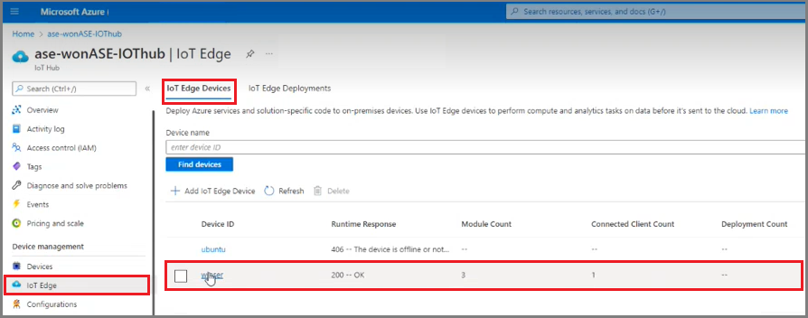
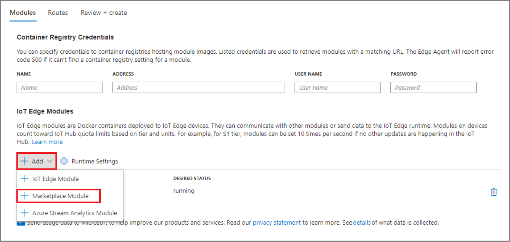
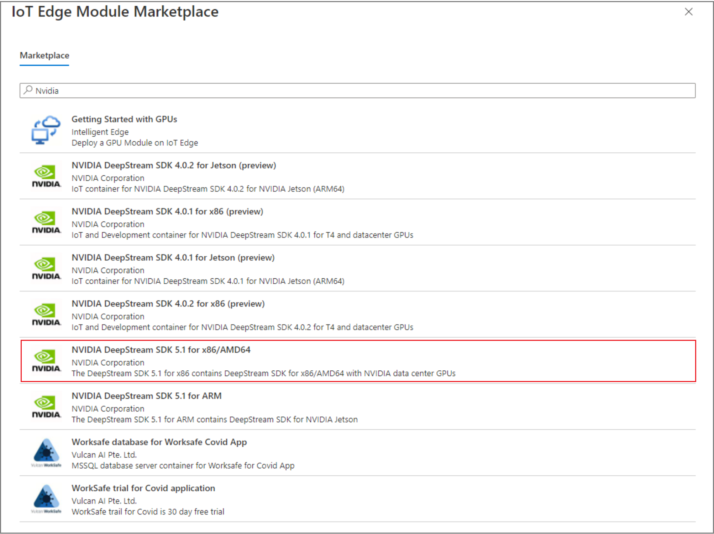

# Deploy the Nvidia DeepStream module on Ubuntu VM on Azure Stack Edge Pro with GPU

[!INCLUDE [applies-to-pro-gpu-and-pro-2-and-pro-r-skus](../../includes/azure-stack-edge-applies-to-gpu-pro-pro-2-pro-r-sku.md)]

This article walks you through deploying Nvidia’s DeepStream module on an Ubuntu VM running on your Azure Stack Edge device. The DeepStream module is supported only on GPU devices. 

## Prerequisites

Before you begin, make sure you have:

- Deployed an IoT Edge runtime on a GPU VM running on an Azure Stack Edge device. For detailed steps, see [Deploy IoT Edge on an Ubuntu VM on Azure Stack Edge](azure-stack-edge-gpu-deploy-iot-edge-linux-vm.md).

## Get module from IoT Edge Module Marketplace

1. In the [Azure portal](https://portal.azure.com), go to **Device management** > **IoT Edge**.
1. Select the IoT Hub device that you configured while deploying the IoT Edge runtime

    

1. Select **Set modules**.

    

1. Select **Add** > **Marketplace Module**.

    

1. Search for **NVIDIA DeepStream SDK 5.1 for x86/AMD64** and then select it. 

    

1. Select **Review + Create**, and then select **Create module**.

## Verify module runtime status

1. Verify that the module is running.  

     

1. Verify that the module provides the following output in the troubleshooting page of the IoT Edge device on IoT Hub:

    

After a certain period of time, the module runtime will complete and quit, causing the module status to return an error. This error condition is expected behavior.

