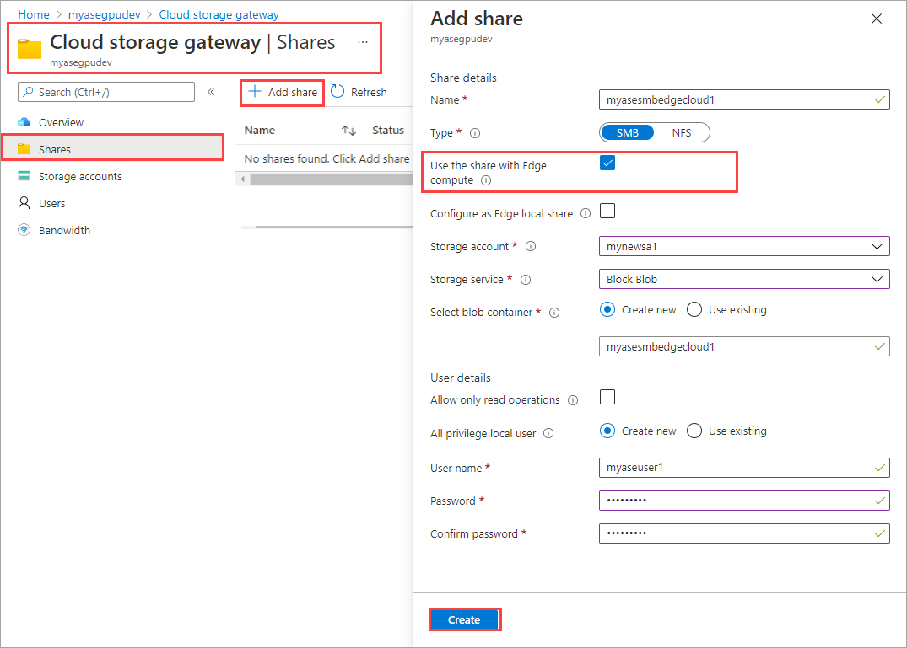
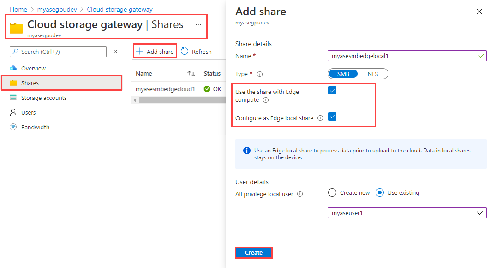
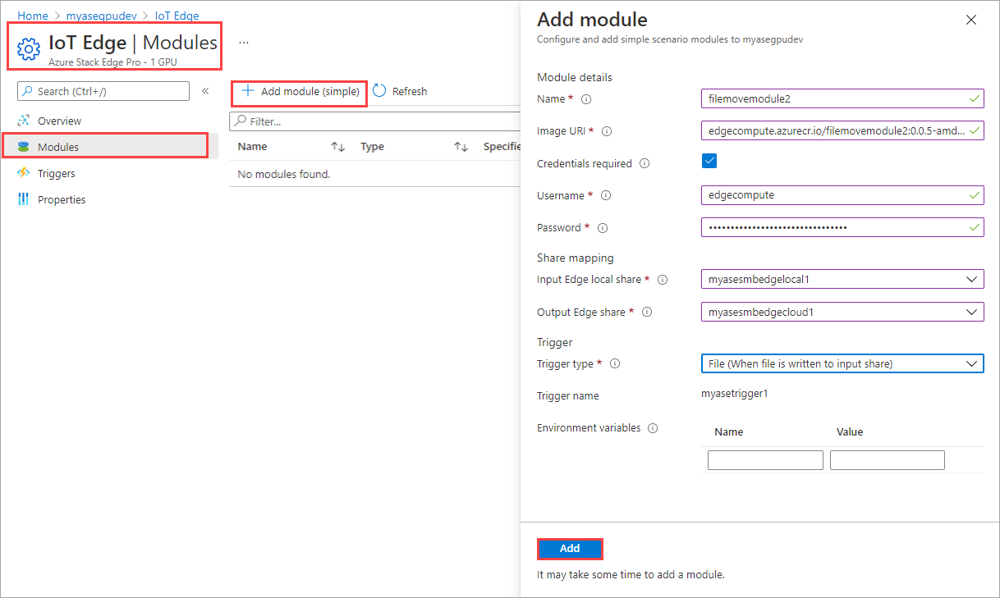
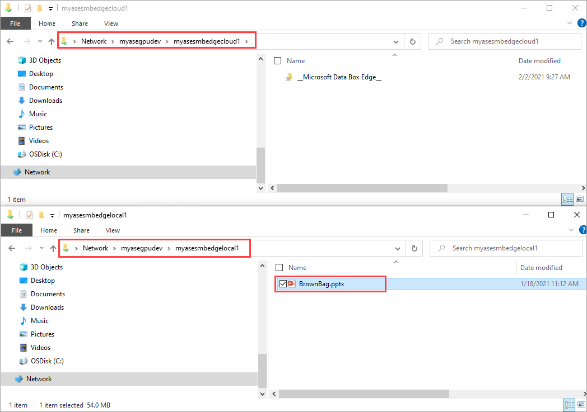
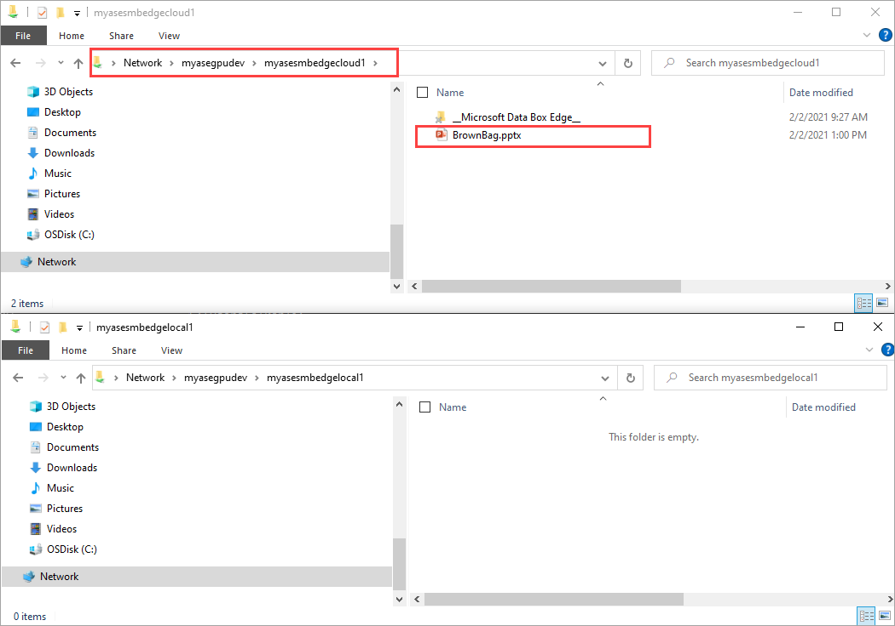

# Tutorial: Run a compute workload with IoT Edge module on Azure Stack Edge Pro

<!--[!INCLUDE [applies-to-skus](../../includes/azure-stack-edge-applies-to-all-sku.md)]-->

This tutorial describes how to run a compute workload using an IoT Edge module on your Azure Stack Edge Pro device. After you configure the compute, the device will transform the data before sending it to Azure.

This procedure can take around 10 to 15 minutes to complete.

In this tutorial, you learn how to:

> [!div class="checklist"]
> * Configure compute
> * Add shares
> * Add a compute module
> * Verify data transform and transfer

 
## Prerequisites

Before you set up a compute role on your Azure Stack Edge Pro device, make sure that:

- You've activated your Azure Stack Edge Pro device as described in [Activate your Azure Stack Edge Pro](azure-stack-edge-gpu-deploy-activate.md).

## Configure compute

[!INCLUDE [configure-compute](../../includes/azure-stack-edge-gateway-configure-compute.md)]

## Add shares

For the simple deployment in this tutorial, you'll need two shares: one Edge share and another Edge local share.

1. To add an Edge share on the device, do the following steps:

    1. In your Azure Stack Edge resource, go to **Cloud storage gateway > Shares**.
    2. From the command bar, select **+ Add share**.

         

    3. On the **Add share** blade, provide the share name and select the share type.
    4. To mount the Edge share, select the check box for **Use the share with Edge compute**.
    5. Select the **Storage account**, **Storage service**, an existing user, and then select **Create**.

         

    > [!NOTE]
    > To mount NFS share to compute, the compute network must be configured on same subnet as NFS Virtual IP address. For details on how to configure compute network, go to [Enable compute network on your Azure Stack Edge Pro](azure-stack-edge-gpu-deploy-configure-network-compute-web-proxy.md).

    The Edge share is created, and you'll receive a successful creation notification. The share list might be updated, but you must wait for the share creation to be completed.

2. To add an Edge local share on the device, repeat all the steps in the preceding step and select the check box for **Configure as Edge local share**. The data in the local share stays on the device.

    

    If you created a local NFS share, use the following remote sync (rsync) command option to copy files onto the share:

    `rsync <source file path> < destination file path>`

    For more information about the `rsync` command, go to [Rsync documentation](https://www.computerhope.com/unix/rsync.htm).
 
3. Go to **Cloud storage gateway > Shares** to see the updated list of shares.

     
 

## Add a module

You could add a custom or a pre-built module. The device does not come with pre-built or custom modules. To learn how to create a custom module, go to [Develop a C# module for your Azure Stack Edge Pro device](azure-stack-edge-j-series-create-iot-edge-module.md).

In this section, you add a custom module to the IoT Edge device that you created in [Develop a C# module for your Azure Stack Edge Pro](azure-stack-edge-j-series-create-iot-edge-module.md). This custom module takes files from an Edge local share on the Edge device and moves them to an Edge (cloud) share on the device. The cloud share then pushes the files to the Azure storage account that's associated with the cloud share.

To add a module, do the following steps:

1. Go to **IoT Edge > Modules**. From the command bar, select **+ Add module**. 

2. In the **Add module** blade, input the following values:

    
    |Field  |Value  |
    |---------|---------|
    |Name     | A unique name for the module. This module is a docker container that you can deploy to the IoT Edge device that's associated with your Azure Stack Edge Pro.        |
    |Image URI     | The image URI for the corresponding container image for the module.        |
    |Credentials required     | If checked, username and password are used to retrieve modules with a matching URL.        |
    |Input share     | Select an input share. The Edge local share is the input share in this case. The module used here moves files from the Edge local share to an Edge share where they are uploaded into the cloud.        |
    |Output share     | Select an output share. The Edge share is the output share in this case.        |
    |Trigger type     | Select from **File** or **Schedule**. A file trigger fires whenever a file event occurs such as a file is written to the input share. A scheduled trigger fires up based on a schedule defined by you.         |
    |Trigger name     | A unique name for your trigger.         |
    |Environment variables| Optional information that will help define the environment in which your module will run.   |

    

3. Select **Add**. The module gets added. The **IoT Edge > Modules** page updates to indicate that the module is deployed.

    

### Verify data transform and transfer

The final step is to ensure that the module is connected and running as expected. The run-time status of the module should be running for your IoT Edge device in the IoT Hub resource.

To verify that the module is running, do the following:

1. Select the **Add module** tile. This takes you to the **Modules** blade. In the list of modules, identify the module you deployed. The runtime status of the module you added should be *running*.

    
 
1. In File Explorer, connect to both the Edge local and Edge shares you created previously.

     
 
1. Add data to the local share.

     
 
   The data gets moved to the cloud share.

      

   The data is then pushed from the cloud share to the storage account. To view the data, you can use Storage Explorer.

    <!---->
 
You have completed the validation process.

## Next steps

In this tutorial, you learned how to:

> [!div class="checklist"]
> * Configure compute
> * Add shares
> * Add a compute module
> * Verify data transform and transfer

To learn how to administer your Azure Stack Edge Pro device, see:

> [!div class="nextstepaction"]
> [Use local web UI to administer an Azure Stack Edge Pro](azure-stack-edge-manage-access-power-connectivity-mode.md)
