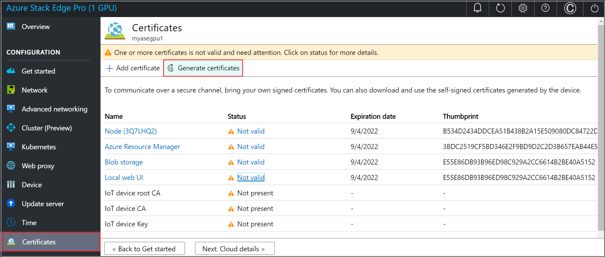
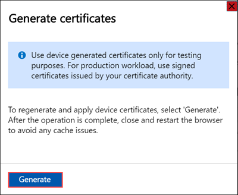
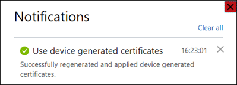
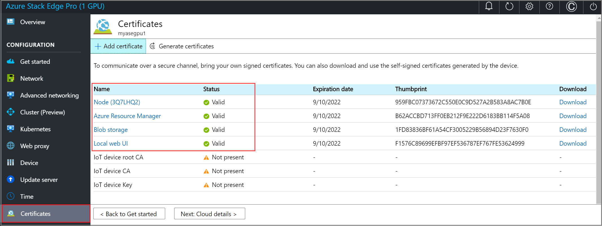
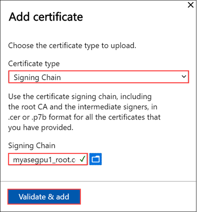
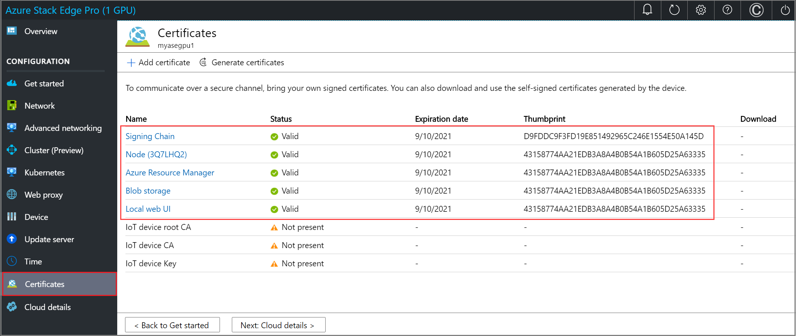

# Tutorial: Configure certificates for your Azure Stack Edge Pro with GPU

This tutorial describes how to configure certificates for your Azure Stack Edge Pro with device onboard GPU using the local web UI.

The time taken for this step will vary depending on the option you choose and how the certificate flow is established in your environment.

In this tutorial, you learn about:

> [!div class="checklist"]
>
> * Prerequisites
> * Configure certificates for the physical device

## Prerequisites

Before you configure and set up your Azure Stack Edge Pro device with GPU, make sure that:

* You've installed the physical device as detailed in [Install Azure Stack Edge Pro GPU](azure-stack-edge-gpu-deploy-install.md).
* If you plan to bring your own certificates:
    - You should have your certificates ready in the appropriate format including the signing chain certificate. For details on certificate, go to [Manage certificates](azure-stack-edge-gpu-manage-certificates.md)

    - If your device is deployed in Azure Government and not deployed in Azure public cloud, a signing chain certificate is required before you can activate your device. 
    For details on certificates, go to [Manage certificates](azure-stack-edge-gpu-manage-certificates.md).

## Configure certificates for device

1. In the **Certificates** page, you will configure your certificates. Depending on whether you changed the device name or the DNS domain in the **Device** page, you can choose one of the following options for your certificates.

    - If you have not changed the device name or the DNS domain in the earlier step and do not wish to bring your own certificates, then you can skip this step and proceed to the next step. The device has automatically generated self-signed certificates to begin with. 

        

    - If you changed the device name or DNS domain, you will see that the status of certificates will show as **Not valid**. 

        

        Select a certificate to view the details of the status.

          

        This is because the certificates do not reflect the updated device name and DNS domain (that are used in subject name and subject alternative). To successfully activate your device, choose one of the following options: 
    
        - **Generate all the device certificates**. These device certificates should only be used for testing and not used with production workloads. For more information, go to [Generate device certificates on your Azure Stack Edge Pro GPU](#generate-device-certificates).

        - **Bring your own certificates**. You can bring your own signed endpoint certificates and the corresponding signing chains. You first add the signing chain and then upload the endpoint certificates. **We recommend that you always bring your own certificates for production workloads.** For more information, go to [Bring your own certificates on your Azure Stack Edge Pro GPU device](#bring-your-own-certificates).
    
        - You can bring some of your own certificates and generate some device certificates. The **Generate certificates** option will only regenerate the device certificates.

    - If you changed the device name or DNS domain, and you do not generate certificates or bring your own certificates, then the **activation will be blocked**.

## Generate device certificates

Use this procedure if you're using the device certificates that are generated automatically on your Azure Stack Edge device and you need to generate new certificates. For example, if you change the device name or domain name server (DNS) domain for your device, you'll need to generate new certificates.<!--Lead rewritten. Verify the context.-->

Use these steps to regenerate and download the Azure Stack Edge Pro GPU device certificates:

1. In the local web UI of your device, go to **CONFIGURATION > Certificates**. Select **Generate certificates**.

    

2. On the **Generate device certificates** pane, select **Generate**.

    

    The device certificates are now generated and applied. It takes a few minutes to generate and apply the certificates.
    
    > [!IMPORTANT]
    > While the certificate generation operation is in progress, do not bring your own certificates and try to add those via the **+ Add certificate** option.

    You are notified when the operation is successfully completed. **To avoid any potential cache issues, restart your browser.**
    
    

3. After the certificates are generated: 

    - The status of all the certificates shows as **Valid**. 

        

    - You can select a specific certificate name, and view the certificate details. 

        

    - The **Download** column is now populated. This column has links to download the regenerated certificates. 

        

4. Select the download link for a certificate and, when prompted, save the certificate.

    

5. Repeat this process for all the certificates that you wish to download.

    

    The device-generated certificates are saved as DER certificates with the following name format: 

    `<Device name>_<Endpoint name>.cer`. These certificates contain the public key for the corresponding certificates installed on the device. 

You'll need to install these certificates on the client that you're using to access the endpoints on the Azure Stack Edge device. These certificates establish trust between the client and the device. Follow the steps in [Import certificates on the clients accessing your Azure Stack Edge Pro GPU device](azure-stack-edge-gpu-manage-certificates.md#import-certificates-on-the-client-accessing-the-device).

If you're using Azure Storage Explorer, you'll need to install certificates on your client in PEM format, and you'll' need to convert the device-generated certificates into PEM format.

> [!IMPORTANT]
> - The download link is only available for device-generated certificates. It's not available if you bring your own certificates.
> - You can decide to have a mix of device-generated certificates and bring your own certificates as long as other certificate requirements are met. For more information, go to [Certificate requirements](azure-stack-edge-gpu-certificate-requirements.md).

## Bring your own certificates

To use your own certificates instead the automatically generated device certificates with your Azure Stack Edge device, use the following procedures.

### Prepare your certificates

Complete these steps to prepare your certificates for upload to the device:

1. Understand certificate requirements:
    - [Review the types of certificates to use with your Azure Stack Edge device](azure-stack-edge-gpu-certificates-overview.md).
    - [Review certificate requirements for each certificate type](azure-stack-edge-gpu-certificate-requirements.md).
2. [Create your certificates via Azure PowerShell](azure-stack-edge-gpu-create-certificates-powershell.md), or [use the Readiness Checker tool](azure-stack-edge-gpu-create-certificates-tool.md).
3. [Convert the certificates to the required format](azure-stack-edge-gpu-prepare-certificates-device-upload.md).

### Upload your certificates to the device

Follow these steps to upload your own certificates, including the signing chain, to your device:

1. To upload a certificate, on the **Certificates** page of the local web UI, select **+ Add certificate**. Then use the **Add certificate** pane to upload your certificate.

    

2. If you didn't include all certificates in the certification path when you exported certificates, upload the **Signing Chain** certificate chain first using the Browse button by **Signing Chain**. Then select **Validate & add**.

   If you included all certificates in your export, you can skip this step. For more information, see [Export certificates as .pfx format with private key](azure-stack-edge-gpu-prepare-certificates-device-upload.md#export-certificates-as-pfx-format-with-private-key).

    

3. Upload your remaining certificates.

    After you select a certificate type, use the **Add certificates** pane to upload each certificate and provide the password that you assigned when you exported the certificate. Then select **Validate & add** to add the certificates to the device. 

    - Select the **Endpoints** certificate type, and add a certificate for each endpoint that the device exposes. For example, upload the Azure Resource Manager and Blob storage endpoint certificates.

      

    - Select the **Local web UI** certificate type, and add the certificate you'll use to access the local web UI via a browser. 
    
      After you upload this certificate, you'll need to start your browser and clear the cache. You'll then need to connect to the device local web UI.  

      

    - On a multi-node device, select the **Node** certificate type, and add the certificate(s) you'll use to establish a trust relationship among nodes.<!--Verify description.-->

      

4. As you add certificates, the **Certificates** page shows the newly added certificates.

      

    At any time, you can select a certificate and view the details to ensure that these match with the certificate that you uploaded.

    

    > [!NOTE]
    > Except for Azure public cloud, signing chain certificates must be brought in before activation for all cloud configurations (Azure Government or Azure Stack).

When you finish [generating device certificates](#generate-device-certificates) or [adding your own certificates](#bring-your-own-certificates), your device is ready to be activated. Select **< Back to Get started** on the **Certificates** page.

## Next steps

In this tutorial, you learn about:

> [!div class="checklist"]
>
> * Prerequisites
> * Configure certificates for the physical device

To learn how to activate your Azure Stack Edge Pro GPU device, see:

> [!div class="nextstepaction"]
> [Activate Azure Stack Edge Pro GPU device](./azure-stack-edge-gpu-deploy-activate.md)
