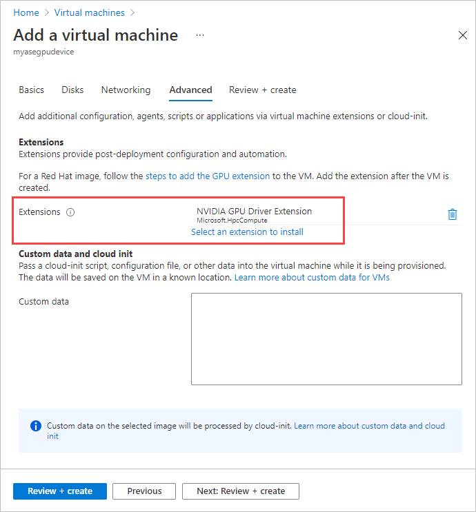
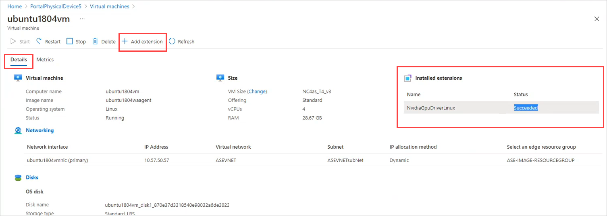
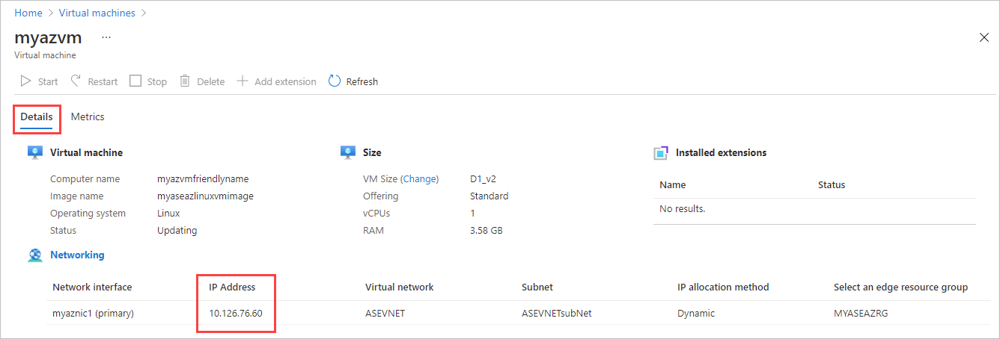

# Deploy GPU VMs on your Azure Stack Edge Pro GPU device

[!INCLUDE [applies-to-GPU-and-pro-r-skus](../../includes/azure-stack-edge-applies-to-gpu-pro-r-sku.md)]

This article how to create a GPU VM in the Azure portal or by using the Azure Resource Manager templates.

Use the Azure portal to quickly deploy a single GPU VM. You can install the GPU extension during or after VM creation. Or use Azure Resource Manager templates to efficiently deploy and manage multiple GPU VMs.


---

## Create GPU VMs

You can deploy a GPU VM via the portal or using Azure Resource Manager templates.

For a list of supported operating systems, drivers, and VM sizes for GPU VMs, see [GPU virtual machines on Azure Stack Edge Pro with GPU](azure-stack-edge-gpu-overview-gpu-virtual-machines.md). For deployment considerations, see [GPU VMs and Kubernetes](For supported operating systems, drivers, and VM sizes for GPU,  see [GPU virtual machines on Azure Stack Edge Pro with GPU](azure-stack-edge-gpu-overview-gpu-virtual-machines.md).


> [!IMPORTANT]
> If your device will be running Kubernetes, do not configure Kubernetes before you deploy your GPU VMs. If you configure Kubernetes first, it claims all the available GPU resources, and GPU VM creation will fail. For Kubernetes deployment considerations on 1-GPU and 2-GPU devices, see [GPU VMs and Kubernetes](azure-stack-edge-gpu-virtual-machines-gpu-overview.md#gpu-vms-and-kubernetes).

### [Portal](#tab/portal)

Follow these steps when deploying GPU VMs on your device via the Azure portal:

1. To create GPU VMs, follow all the steps in [Deploy VM on your Azure Stack Edge using Azure portal](azure-stack-edge-gpu-deploy-virtual-machine-portal.md), with these configuration requirements:

    1. On the **Basics** tab, select a [VM size from NCasT4-v3-series](azure-stack-edge-gpu-virtual-machine-sizes.md#ncast4_v3-series-preview).

       

    1. To install the GPU extension during deployment, on the **Advanced** tab, choose **Select an extension to install**. Then select a GPU extension to install. GPU extensions are only available for a virtual machine with a [VM size from NCasT4-v3-series](azure-stack-edge-gpu-virtual-machine-sizes.md#ncast4_v3-series-preview).
        
        > [!NOTE]
        > If you're using a Red Hat image, you'll need to install the GPU extension after VM deployment. Follow the steps in [Install GPU extension](azure-stack-edge-gpu-deploy-virtual-machine-install-gpu-extension.md).
    
       

       The **Advanced** tab shows the extension you selected.

       

1. Once the GPU VM is successfully created, you can view this VM in the list of virtual machines in your Azure Stack Edge resource in the Azure portal.

    

    Select the VM, and drill down to the details. Make sure the GPU extension has **Succeeded** status.

    


### [Templates](#tab/templates)

Follow these steps when deploying GPU VMs on your device using Azure Resource Manager templates:

1. [Download the VM templates and parameters files](https://aka.ms/ase-vm-templates) to your client machine. Unzip it into a directory you’ll use as a working directory.

1. Before you can deploy VMs on your Azure Stack Edge device, you must configure your client to connect to the device via Azure Resource Manager over Azure PowerShell. For detailed instructions, see [Connect to Azure Resource Manager on your Azure Stack Edge device](azure-stack-edge-gpu-connect-resource-manager.md).

1. To create GPU VMs, follow all the steps in [Deploy VM on your Azure Stack Edge using templates](azure-stack-edge-gpu-deploy-virtual-machine-templates.md), with these configuration requirements: 
            
    - When specifying GPU VM sizes, make sure to use the NCasT4-v3-series in the `CreateVM.parameters.json`, which are supported for GPU VMs. For more information, see [Supported VM sizes for GPU VMs](azure-stack-edge-gpu-virtual-machine-sizes.md#ncast4_v3-series-preview).

       ```json
           "vmSize": {
         "value": "Standard_NC4as_T4_v3"
       },
       ```

    Once the GPU VM is successfully created, you can view this VM in the list of virtual machines in your Azure Stack Edge resource in the Azure portal.

    

1. Select the VM, and drill down to the details. Copy the IP address allocated to the VM.

    

<!--1. If needed, you can switch the compute network back to whatever you need.-->

After the VM is created, you can [deploy the GPU extension using the extension template](azure-stack-edge-gpu-deploy-virtual-machine-install-gpu-extension.md?tabs=linux).

---

> [!NOTE]
> When updating your device software version from 2012 to later, you will need to manually stop the GPU VMs.

## Install GPU extension after deployment

After you create a virtual machine for use with GPU, you must install a GPU extension. From the portal, you can install the GPU extension during or after VM deployment. If you're using templates, you'll install the GPU extension after you create the VM.

---

### [Portal](#tab/portal)

If you didn't install the GPU extension when you created the VM, you can install it after deployment. 

Follow these steps to install a GPU extension on a VM in the Azure portal:

1. Go to the virtual machine you want to add the GPU extension to.

    
  
1. In **Details**, select **+ Add extension**. Then select a GPU extension to install.

    GPU extensions are only available for a virtual machine with a [VM size from NCasT4-v3-series](azure-stack-edge-gpu-virtual-machine-sizes.md#ncast4_v3-series-preview). If you prefer, you can [install the GPU extension after deployment](azure-stack-edge-gpu-deploy-gpu-virtual-machine.md#install-gpu-extension-after-deployment).

    

> [!Note]
> You can't remove a GPU extension via the portal. Instead, use the [Remove-AzureRmVMExtension](/powershell/module/azurerm.compute/remove-azurermvmextension?view=azurermps-6.13.0&preserve-view=true) cmdlet in Azure PowerShell. For instructions, see [Remove GPU extension](azure-stack-edge-gpu-deploy-virtual-machine-install-gpu-extension.md#remove-gpu-extension)

### [Templates](#tab/templates)

When you create a GPU VM using templates, you install the GPU extension after deployment. For detailed steps for using templates to deploy a GPU extension on a Windows virtual machine or a Linux virtual machine, see [Install GPU extension](azure-stack-edge-gpu-deploy-virtual-machine-install-gpu-extension.md).

---

## Next steps

- Learn how to [Install the GPU extension](azure-stack-edge-gpu-deploy-virtual-machine-install-gpu-extension.md) on the GPU VMs running on your device.
