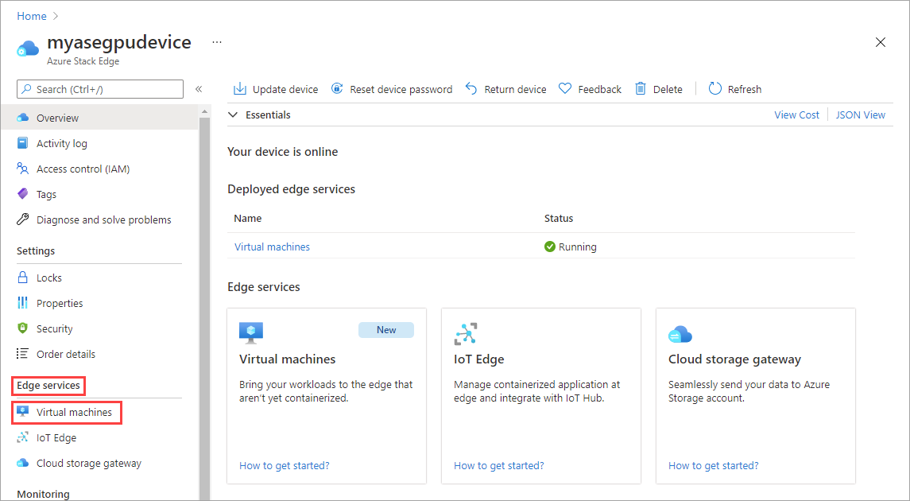
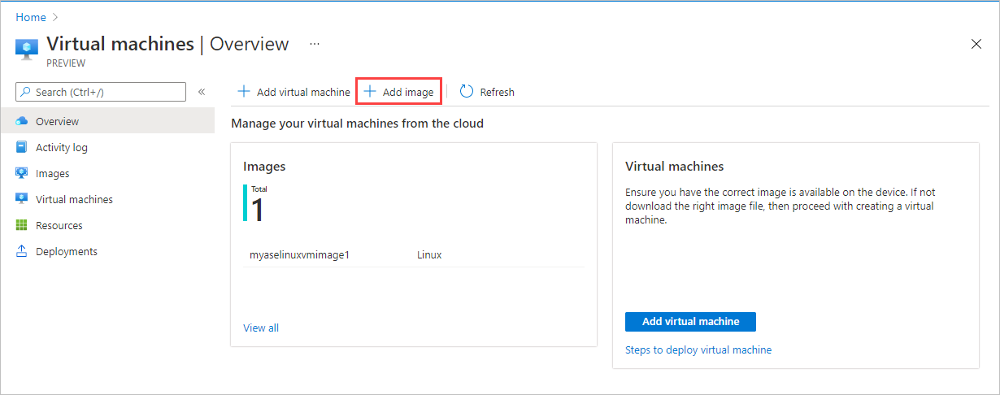
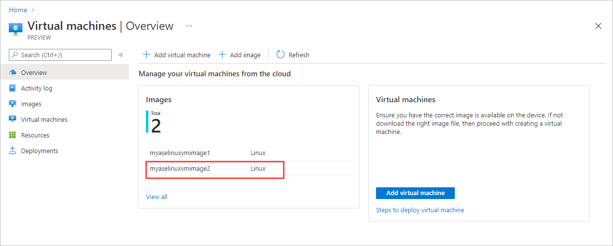
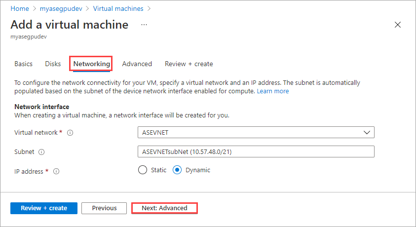
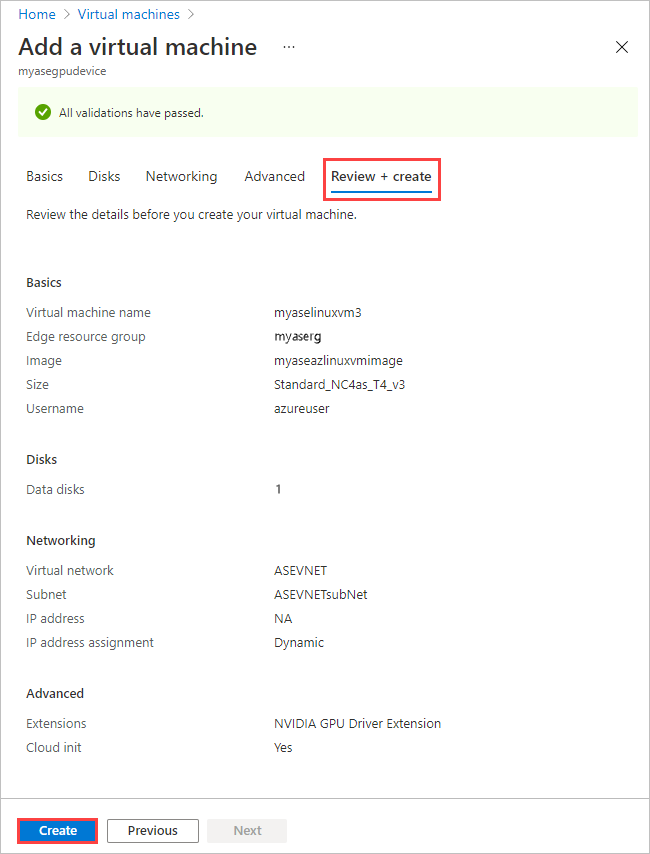

# Deploy VMs on your Azure Stack Edge Pro GPU device via the Azure portal

[!INCLUDE [applies-to-GPU-and-pro-r-and-mini-r-skus](../../includes/azure-stack-edge-applies-to-gpu-pro-r-mini-r-sku.md)]

You can create and manage virtual machines (VMs) on an Azure Stack Edge device using Azure portal, templates, Azure PowerShell cmdlets and via Azure CLI/Python scripts. This article describes how to create and manage a VM on your Azure Stack Edge device using the Azure portal. 

This article applies to Azure Stack Edge Pro GPU, Azure Stack Edge Pro R, and Azure Stack Edge Mini R devices. 

> [!IMPORTANT] 
> We recommend that you enable multifactor authentication for the user who manages VMs that are deployed on your device from the cloud.
        
## VM deployment workflow

The high-level summary of the deployment workflow is as follows:

1. Enable a network interface for compute on your Azure Stack Edge device. This creates a virtual switch on the specified network interface.
1. Enable cloud management of virtual machines from Azure portal.
1. Upload a VHD to an Azure Storage account using Storage Explorer. 
1. Use the uploaded VHD to download the VHD onto the device and create a VM image from the VHD. 
1. Use the resources created in the previous steps:
    1. VM image that you created.
    1. VSwitch associated with the network interface on which you enabled compute.
    1. Subnet associated with the VSwitch.

    And create or specify the following resources inline:
    1. VM name, choose a supported VM size, sign-in credentials for the VM. 
    1. Create new data disks or attach existing data disks.
    1. Configure static or dynamic IP for the VM. If providing a static IP, choose from a free IP in the subnet range of the network interface enabled for compute.

    Use the resources from above to create a virtual machine.

## Prerequisites

Before you begin to create and manage VMs on your device via the Azure portal, make sure that:

1. You have completed the network settings on your Azure Stack Edge Pro device as described in [Step 1: Configure Azure Stack Edge Pro device](./azure-stack-edge-gpu-connect-resource-manager.md#step-1-configure-azure-stack-edge-pro-device).

    1. You have enabled a network interface for compute. This network interface IP is used to create a virtual switch for the VM deployment. In the local UI of your device, go to **Compute**. Select the network interface that you will use to create a virtual switch.

        > [!IMPORTANT] 
        > You can only configure one port for compute.

    1. Enable compute on the network interface. Azure Stack Edge Pro creates and manages a virtual switch corresponding to that network interface.

1. You have access to a Windows or Linux VHD that you will use to create the VM image for the virtual machine you intend to create.

## Deploy a VM

Follow these steps to create a virtual machine on your Azure Stack Edge device.

### Add a VM image

1. Upload a VHD to an Azure Storage account. Follow the steps in [Upload a VHD using Azure Storage Explorer](../devtest-labs/devtest-lab-upload-vhd-using-storage-explorer.md).

1. In the Azure portal, go to the Azure Stack Edge resource for your Azure Stack Edge device. Go to **Edge compute > Virtual Machines**.

    

1. Select **Virtual Machines** to go to the **Overview** page. **Enable** virtual machine cloud management.
    

1. The first step is to add a VM image. You have already uploaded a VHD into the storage account in the earlier step. You will use this VHD to create a VM image.

    Select **Add image** to download the VHD from the storage account and add to the device. The download process takes several minutes depending upon the size of the VHD and the internet bandwidth available for the download. 

    

1. In the **Add image** blade, input the following  parameters. Select **Add**.

    |Parameter  |Description  |
    |---------|---------|
    |Download from storage blob    |Browse to the location of the storage blob in the storage account where you uploaded the VHD.         |
    |Download to    | Automatically set to the current device where you are deploying the virtual machine.        |
    |Save image as      | The name for the VM image that you are creating from the VHD you uploaded to the storage account.        |
    |OS type     |Choose from Windows or Linux as the operating system of the VHD you will use to create the VM image.         |
   

    

1. The VHD is downloaded and the VM image is created. The image creation takes several minutes to complete. You see a notification for the successful completion of the VM image.

    

1. After the VM image is successfully created, it is added to the list of images in the **Images** blade.
    

    The **Deployments** blade updates to indicate the status of the deployment.

    

    The newly added image is also displayed in the **Overview** page.
    

### Add a VM

Follow these steps to create a VM after you have created a VM image.

1. In the **Overview** page, select **Add virtual machine**.

    

1. In the **Basics** tab, input the following parameters.

    |Parameter |Description  |
    |---------|---------|
    |Virtual machine name     |         |
    |Edge resource group     | Select from an existing resource group available on the device.        |
    |Image     | Select from the VM images available on the device.        |
    |Size     | Choose from the [Supported VM sizes](azure-stack-edge-gpu-virtual-machine-sizes.md).        |
    |Username     | Use the default username *azureuser* for the admin to sign into the VM.        |
    |Authentication type    | Choose from SSH public key or a user-defined password.       |
    |Password     | Enter a password to sign into the virtual machine. The password must be at least 12 characters long and meet the defined [Complexity requirements](../virtual-machines/windows/faq.md#what-are-the-password-requirements-when-creating-a-vm).        |
    |Confirm password    | Enter the password again.        |

    

    Select **Next: Disks**.

1. In the **Disks** tab, you will attach disks to your VM. 
    
    1. You can choose to **Create and attach a new disk** or **Attach an existing disk**.

        

    1. Select **Create and attach a new disk**. In the **Create new disk** blade, provide a name for the disk and the size in GiB.

        

    1.  Repeat the above to process to add more disks. After the disks are created, they show up in the **Disks** tab. Select **Next: Networking**.

1. In the **Networking** tab, you will configure the network connectivity for your VM.

    
    |Parameter  |Description |
    |---------|---------|
    |Virtual network    | From the dropdown list, select the virtual switch created on your Azure Stack Edge device when you enabled compute on the network interface.    |
    |Subnet     | This field is automatically populated with the subnet associated with the network interface on which you enabled compute.         |
    |IP address     | Provide a static or a dynamic IP for your VM. The static IP should be an available, free IP from the specified subnet range.        |

    

    Select **Next: Review + Create**.

1. In the **Advanced** tab, you can specify the custom data or the cloud-init to customize your VM. 

    You can use cloud-init to customize a VM on its first boot. Use the cloud-init to install packages and write files, or to configure users and security. As cloud-init runs during the initial boot process, no additional steps are requires to apply your configuration. For detailed information on cloud-init, see [Cloud-init overview](../virtual-machines/linux/tutorial-automate-vm-deployment.md#cloud-init-overview).

        

1. In the **Review + Create** tab, review the specifications for the VM and select **Create**.

    

1. The VM creation starts and can take up to 20 minutes. You can go to **Deployments** to monitor the VM creation.

    

    
1. After the VM is successfully created, the **Overview** page updates to display the new VM.

    

1. Select the newly created VM to go to **Virtual machines**.

    

    Select the VM to see the details. 

    

## Connect to a VM

Depending on whether you created a Windows or a Linux VM, the steps to connect can be different. You can't connect to the VMs deployed on your device via the Azure portal. You need to take the following steps to connect to your Linux or Windows VM.

### Connect to Linux VM

Follow these steps to connect to a Linux VM.

[!INCLUDE [azure-stack-edge-gateway-connect-vm](../../includes/azure-stack-edge-gateway-connect-virtual-machine-linux.md)]

### Connect to Windows VM

Follow these steps to connect to a Windows VM.

[!INCLUDE [azure-stack-edge-gateway-connect-vm](../../includes/azure-stack-edge-gateway-connect-virtual-machine-windows.md)]

## Next steps

To learn how to administer your Azure Stack Edge Pro device, see[Use local web UI to administer a Azure Stack Edge Pro](azure-stack-edge-manage-access-power-connectivity-mode.md).