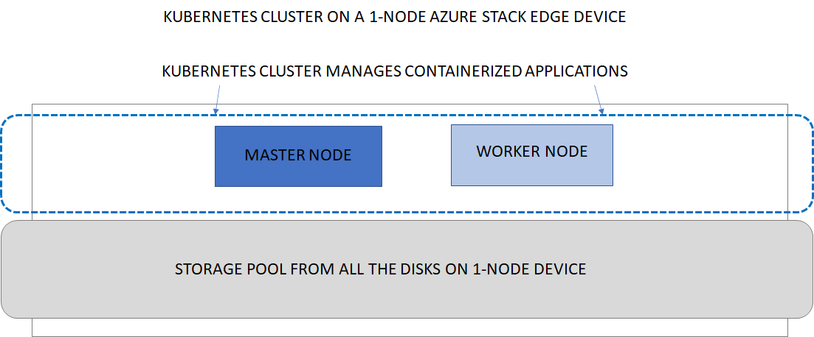

# Kubernetes on a clustered Azure Stack Edge Pro GPU device

[!INCLUDE [applies-to-GPU-and-pro-r-and-mini-r-skus](../../includes/azure-stack-edge-applies-to-gpu-pro-r-mini-r-sku.md)]

Kubernetes is a popular open-source platform to orchestrate containerized applications. This article provides an overview of Kubernetes and then describes how Kubernetes works on your Azure Stack Edge device. 

## About Kubernetes on Azure Stack Edge 

On your Azure Stack Edge device, you can create a Kubernetes cluster by configuring the compute. When the compute role is configured, the Kubernetes cluster including the master and worker nodes are all deployed and configured for you. This cluster is then used for workload deployment via `kubectl`, IoT Edge, or Azure Arc.

The Azure Stack Edge device is available as a 1-node configuration or a 2-node configuration that constitutes the infrastructure cluster. The Kubernetes cluster is separate from the infrastructure cluster and is deployed on top of the infrastructure cluster. The infrastructure cluster provides the persistent storage for your Azure Stack Edge device while the Kubernetes cluster is responsible solely for application orchestration. 

The Kubernetes cluster master node and worker nodes. The Kubernetes nodes in a cluster are virtual machines that run your applications and cloud workflows. 

The Kubernetes master node is responsible for maintaining the desired state for your cluster. The master node also controls the worker node which in turn runs the containerized applications.

### Kubernetes cluster on two-node device

The following diagram illustrates the implementation of Kubernetes on a 2-node Azure Stack Edge device. The 2-node device has one master node and two worker nodes. The 2-node device is highly available and if one of the node fails, the master node and worker nodes fail over to the other node. Both the device and the Kubernetes cluster keep running. 

For more information on the Kubernetes cluster architecture, go to [Kubernetes core concepts](https://kubernetes.io/docs/concepts/architecture/).

 
The Kubernetes master VM and a Kubernetes worker VM are running on node A of your device. On the node B, a single Kubernetes worker VM is running.

Each worker VM in the Kubernetes cluster, is a pinned Hyper-V VM. A pinned VM is tied to the specific node it is running on. If the node A on the device fails, the master VM fails over to node B. But the worker VM on node A which is a pinned VM does not fail over to node B and vice-versa. Instead, the pods from the worker VM on node A are rebalanced onto node B. 

In order for the rebalanced pods to have enough capacity to run on the device node B, the system enforces that no more than 50% of each ASE node’s capacity be used during regular 2-node Azure Stack Edge cluster operations. This capacity usage is done on a best effort basis and there are circumstances (for example, workloads requiring unavailable GPU resources when they are rebalanced to ASE Node B) in which rebalanced pods may not have sufficient resources to run. These scenarios are covered in detail in the next section on Failure Modes and Behavior.

## Failure modes and behavior

| Node                                                   | Failures                                                                                                                               | Responses                                                                                                                                                                                                                                                                       |
|--------------------------------------------------------|----------------------------------------------------------------------------------------------------------------------------------------|---------------------------------------------------------------------------------------------------------------------------------------------------------------------------------------------------------------------------------------------------------------------------------|
| <li>Node A has failures</li><li>(Node B has no failures)</li>       | Following possible failures can occur: <ul><li>Both PSUs fail</li><li>One or both Port 3, Port 4 fail</li><li>Core component fails, includes motherboard, DIMM, OS disk</li><li>Entire node fails</li><ul> | Following responses are seen for each of these failures:<ul><li>Kubernetes master VM fails over from node A to node B</li><li>Master VM takes few minutes to come up on node B</li><li>Pods from node A are rebalanced on node B</li><li>GPU workloads keep running if GPU is available on node B</ul> |
| <li>Node A reboots</li><li>(Node B has no failures)</li> | Node reboots                                                                                                                           | After node A completes rebooting and the worker VM is available, master VM will rebalance the pods from node B.                                                                                                                                                                 |
| <li>Node B has failures</li><li>(Node A has no failures)</li>   | Following possible failures can occur: <ul><li>Both PSUs fail</li><li>One or both Port 3, Port 4 fail</li><li>Core component fails, includes motherboard, DIMM, OS disk</li><li>Entire node fails</li><ul> | Following responses are seen for each of these failures: <ul><li>Kubernetes master VM rebalances pods from node B. This could take a few minutes.</li></ul>         |
| <li>Node B reboots</li><li>(Node A has no failures)</li>      | Node reboots  | After node B completes rebooting and the worker VM is available, master VM will rebalance the pods from node B.                                                                                                                                                                 |

## Next steps

- Learn more about Kubernetes storage on [Azure Stack Edge device](azure-stack-edge-gpu-kubernetes-storage.md).
- Understand the Kubernetes networking model on [Azure Stack Edge device](azure-stack-edge-gpu-kubernetes-networking.md).
- Deploy [Azure Stack Edge](azure-stack-edge-gpu-deploy-prep.md) in Azure portal.
