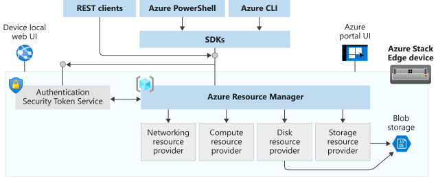

# What is local Azure Resource Manager on Azure Stack Edge?

[!INCLUDE [applies-to-GPU-and-pro-r-and-mini-r-skus](../../includes/azure-stack-edge-applies-to-gpu-pro-r-mini-r-sku.md)]

Azure Resource Manager provides a management layer that enables you to create, update, and delete resources in your Azure subscription. The Azure Stack Edge devices support the same Azure Resource Manager APIs to create, update, and delete VMs in a local subscription. This support lets you manage the device in a manner consistent with the cloud. 

This article provides an overview of the local Azure Resource Manager that can be used to connect to the local APIs on your Azure Stack Edge devices.

## About local Azure Resource Manager

The local Azure Resource Manager provides a consistent management layer to call the Azure Stack Edge device APIs and perform operations such as create, update, and delete VMs. 

1. When you send a request from REST APIs or SDKs, the local Azure Resource Manager on the device receives the request. 
1. The local Azure Resource Manager uses the Security Token Service (STS) to authenticate and authorize the request. 
1. The Resource Manager then sends the request to the resource providers that take the requested action. The resource providers are responsible for providing resources. For example, the Compute resource provider supplies the virtual machine resource.  

Because all requests are handled through the same API, you see consistent results and capabilities in all the different tools.

The following image shows the mechanism of handling all the API requests and the role the local Azure Resource Manager plays in providing a consistent management layer to handle those requests.

## Connect to the local Azure Resource Manager

To create virtual machines or shares or storage accounts on your Azure Stack Edge device, you will need to create the corresponding resources. For example, for virtual machines, you will need resources such as network interface, OS and data disks on VM, from the networking, disk, and storage resource providers. 

To request the creation of any resources from the resource providers, you will need to first connect to the local Azure Resource Manager. For detailed steps, see Connect to Azure Resource Manager on your Azure Stack Edge device.

The first time you connect to Azure Resource Manager, you would also need to add reset your password. For detailed steps, see [Reset your Azure Resource Manager password](azure-stack-edge-gpu-set-azure-resource-manager-password.md).

## Next steps

[Connect to the local Azure Resource Manager on your Azure Stack Edge Pro GPU device](azure-stack-edge-gpu-deploy-virtual-machine-powershell.md).
