# Manage alert notifications for Azure Stack Edge Pro resources

This article describes how to create action rules in the Azure portal to trigger or suppress alert notifications for events that occur within a resource group, an Azure subscription, or an individual Azure Stack Edge resource. This article applies to all models of Azure Stack Edge.  

## About action rules

An action rule can trigger or suppress alert notifications. The action rule is added to an *action group* - a set of notification preferences that's used to notify users who need to act on alerts triggered in different contexts for a resource or set of resources.

For more information about action rules, see [Configuring an action rule](/azure/azure-monitor/platform/alerts-action-rules?tabs=portal#configuring-an-action-rule). For more information about action groups, see [Create and manage action groups in the Azure portal](/blob/master/articles/azure-monitor/platform/action-groups).

> [!NOTE]
> The action rules feature is in preview. Some screens and steps might change as the process is refined.

## Create an action rule

Take the following steps in the Azure portal to create an action rule for your Azure Stack Edge device.

> [!NOTE]
> These steps create an action rule that sends notifications to an action group. For details about creating an action rule to suppress notifications, see [Configuring an action rule](/azure/azure-monitor/platform/alerts-action-rules?tabs=portal#configuring-an-action-rule).

1. Go to the Azure Stack Edge device in the Azure portal, and then go to **Monitoring > Alerts**. Select **Manage actions**.

   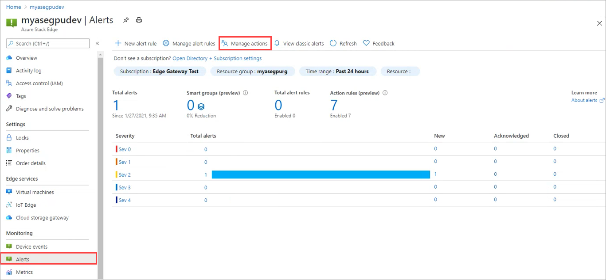

2. Select **Action rules (preview)**, and then select **+ New action rule**.

   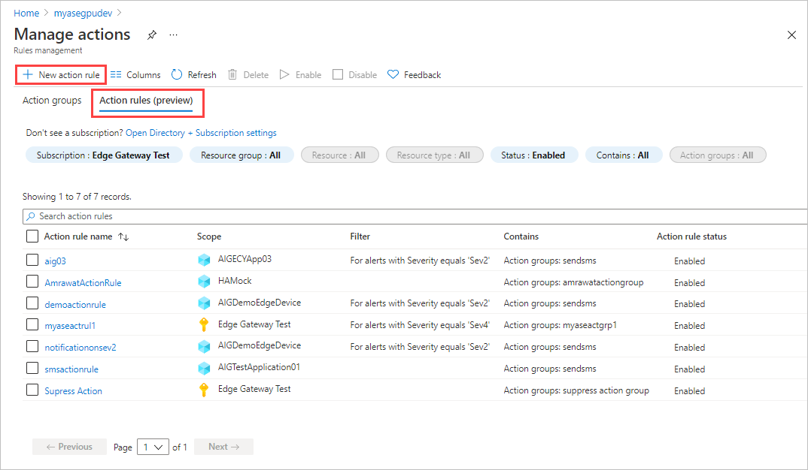

3. On the **Create action rule** screen, use **Scope** to select an Azure subscription, resource group, or target resource. The action rule will act on all alerts generated within that scope.

   1. Choose **Select** by **Scope**.

      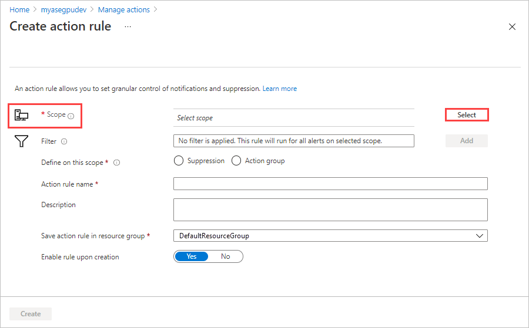

   2. Select the **Subscription** for the action rule, optionally filter by a **Resource** type. To filter to Azure Stack Edge resources, select **Data Box Edge devices (dataBoxEdge)**.

      The **Resource** area lists the available resources based on your selections.
  
      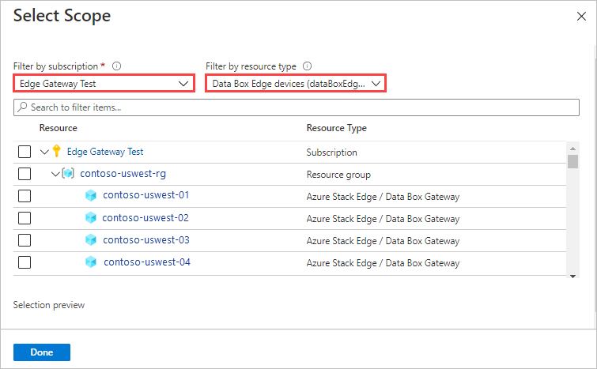

   3. Select the check box by each resource you want to apply the rule to. You can select the subscription, resource groups, or individual resources. Then select **Done**.

      

      The **Create action rule** screen shows the selected scope.

      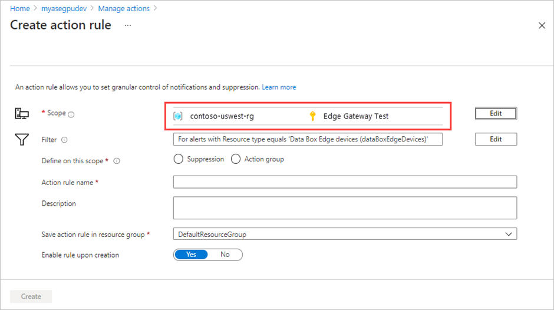

4. Use **Filter** options to narrow the application of the rule to subset of alerts within the selected scope.

   1. Select **Add** to open the **Add filters** pane.

      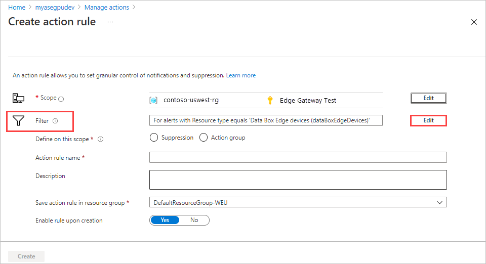

   2. Under **Filters**, add each filter you want to apply. For each filter, select the filter type, **Operator**, and **Value**.
   
      For a list of filter options, see [Filter criteria](/azure/azure-monitor/platform/alerts-action-rules?tabs=portal#filter-criteria).

      The sample filters below apply to all alerts at Severity levels 2, 3, and 4 that the Monitor service raises for Azure Stack Edge resources.

      When you finish adding filters, select **Done**.
   
      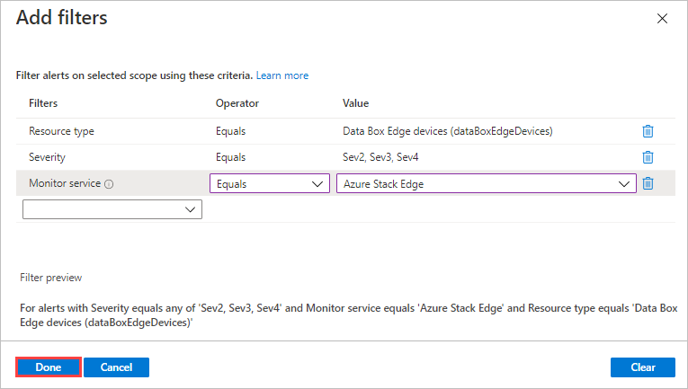

5. On the **Create action rule** screen, select **Action group** to create a rule that sends notifications. Then, by **Actions**, choose **Select**.

   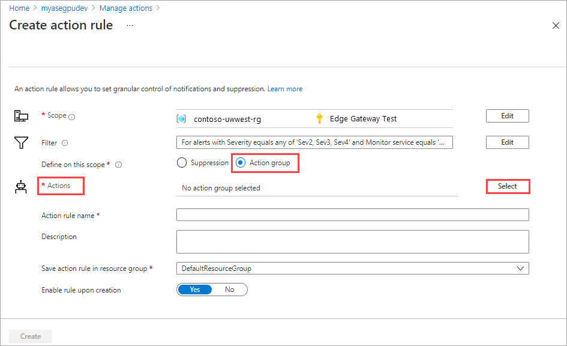

   > [!NOTE]
   > To create a rule that suppresses notifications, you would choose **Suppression**. For more information, see [Configuring an action rule](/azure/azure-monitor/platform/alerts-action-rules?tabs=portal#configuring-an-action-rule).

6. Select the action group that you want to use with this action rule. Then choose **Select**. Your new action rule will be added to the notification preferences of the selected action group.

   If you need to create a new action group, select **+ Create action group**, and follow the steps in [Create an action group by using the Azure portal](/azure/azure-monitor/platform/action-groups#create-an-action-group-by-using-the-azure-portal).

   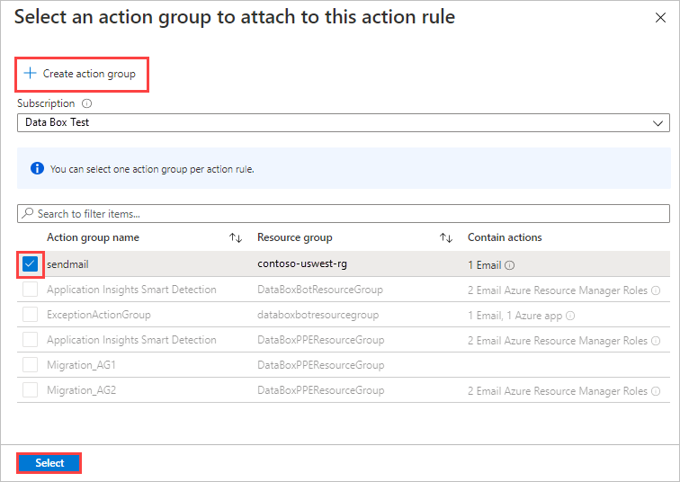

7. Give the new action rule a **Name** and **Description**, and assign the rule to a resource group.

9. The new rule is enabled by default. If you don't want to start using the rule immediately, select **No** for **Enable rule update creation**.

10. When you finish your settings, select **Create**.

    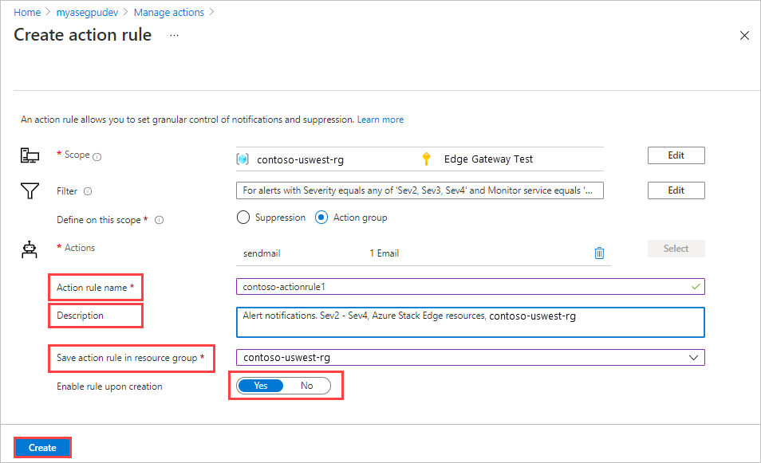

    The **Action rules (Preview)** screen opens, but you might not see your new action rule immediately. The focus is **All** resource groups.

11. To see your new action rule, select the resource group for the rule.

    

## View notifications

Notifications go out when a new event triggers an alert for a resource that's within the scope of an action rule.

The action group for a rule sets who receives a notification and the type of notification that's sent - email, a Short Message Service (SMS) message, or both.

It might take a few minutes to receive notifications after an alert is triggered.

The email notification will look similar to this one.

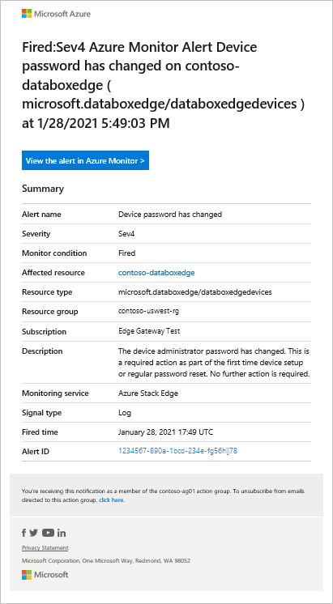

## Next steps

<!-- - See [Create and manage action groups in the Azure portal](/blob/master/articles/azure-monitor/platform/action-groups) for guidance on creating a new action group.
- See [Configure an action rule](/azure/azure-monitor/platform/alerts-action-rules?tabs=portal#configuring-an-action-rule) for more info about creating action rules that send or suppress alert notifications. -2 bullets referenced above. Making room for local tasks in "Next Steps." --> 
- See [Monitor your Azure Stack Edge Pro](azure-stack-edge-monitor.md) for info about reviewing device events, hardware status, and metrics charts. 
- See [Using Azure Monitor](azure-stack-edge-gpu-enable-azure-monitor) for info about optimizing Azure Monitor for monitoring your Azure Stack Edge Pro GPU devices.
- See [Create, view, and manage metric alerts using Azure Monitor Link target](/../azure-monitor/platform/alerts-metric.md) for info about managing individual alerts.
