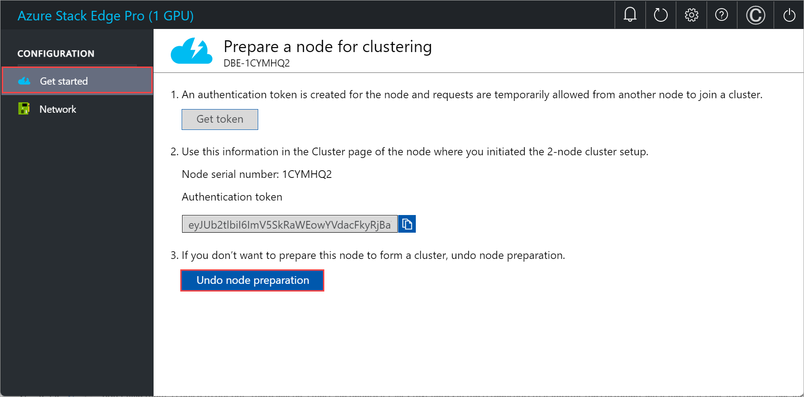
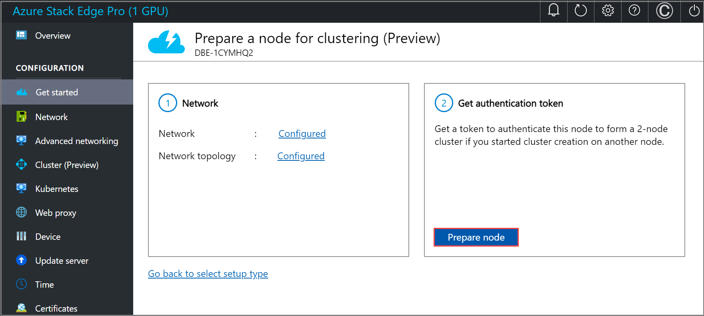
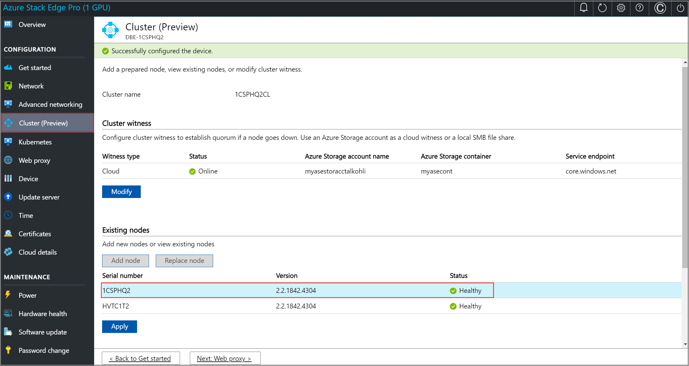
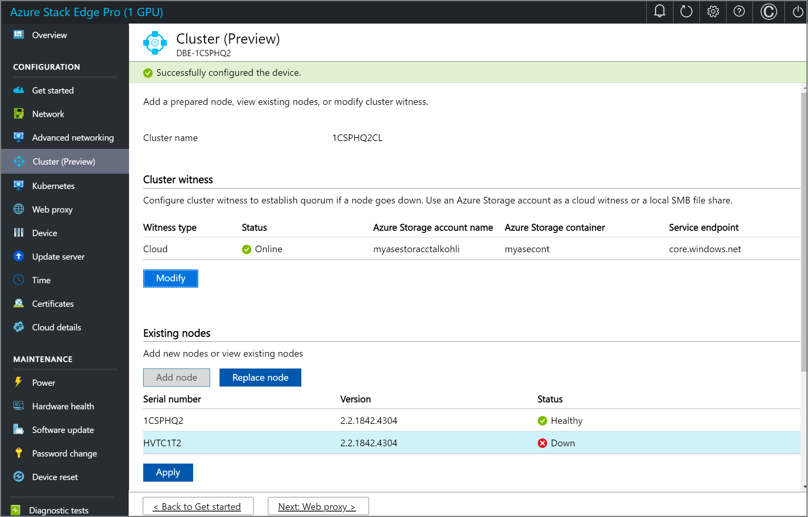
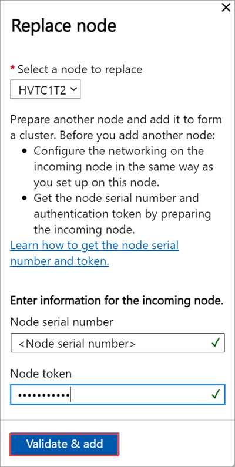
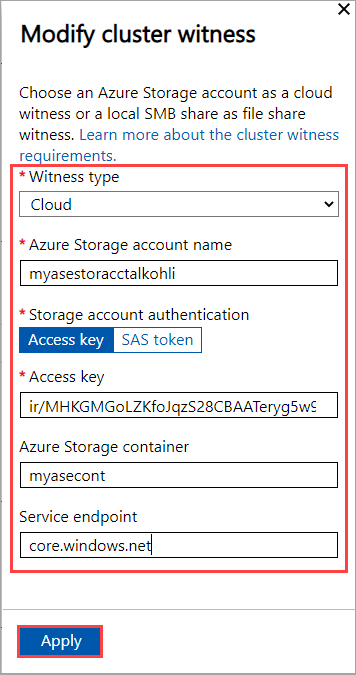
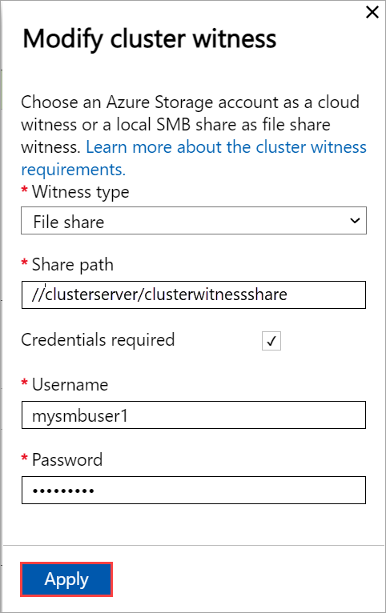
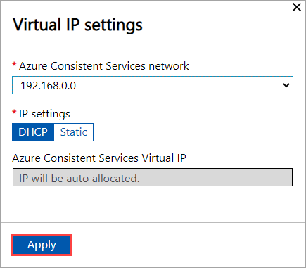
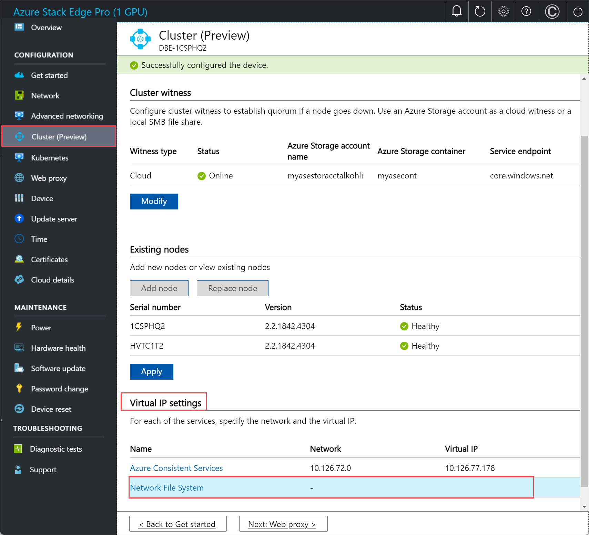
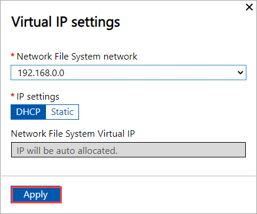

# Manage your Azure Stack Edge cluster

This article provides a brief overview of clustering-related management tasks on your Azure Stack Edge device. Some of these tasks include how to add a node, configure or modify a cluster witness or remove the cluster. The cluster can be managed via the local UI of your device. 

## Undo node preparation

Perform these steps on the node of the device that you were trying to prepare. You may use the undo node preparation option when you decide not to proceed with preparing this node to form a cluster.

1. In the local UI, go to the **Get started** page. Under **Prepare a node for clustering**, select **Undo node preparation**.

    

1. When you select **Undo node preparation**, you'll go back to the **Get authentication token** tile and **Prepare node** option will be available. If you decide to prepare this node again, you'll need to select **Prepare node** again.

    

## View existing nodes

1. In the local UI, go to the **Cluster** page. 
1. Under **Existing nodes**, you can view the existing nodes for your cluster.

    

## Replace a node

You may need to replace a node if one of the nodes on your device is down or not healthy. Perform these steps on the node that you are trying to replace.

1. In the local UI, go to the **Cluster** page. Under **Existing nodes**, view the status of the nodes. You'll want to replace the node that shows the status as **Down**.

    

1. Select **Replace node** and enter the following inputs.

    1. Choose the node to replace. This should be automatically selected as the node, which is down. 
    1. Prepare another node. Configure the networking on this node in the same way as you set up on the first node. Get the node serial number and authentication token from the new incoming node.
    1. Provide the **Node serial number** for the incoming replacement node.
    1. Supply the **Node token** for the incoming replacement node.
    1. Select **Validate & add**. The credentials of the incoming node are now validated.
    
        

    1. Once the validation has successfully completed, select **Add node** to complete the node replacement. It may take several minutes for the replacement node to get added to form the cluster.

## Configure cluster witness

Follow these steps to configure the cluster witness.

### Configure cloud witness

Perform these steps on the first node of the device.

1. In the local UI, go to the **Cluster** page. Under **Cluster witness type**, select **Modify**.

    

1. In the **Modify cluster witness** blade, enter the following inputs.
    1. Choose the **Witness type** as **Cloud.**
    1. Enter the **Azure Storage account name**.
    1. Specify Storage account authentication from Access key or SAS token.
    1. If you chose Access key as the authentication mechanism, enter the Access key of the Storage account, Azure Storage container where the witness lives, and the service endpoint. 
    1. Select **Apply**.

    

### Configure local witness

Perform these steps on the first node of the device.

1. In the local UI, go to the **Cluster** page. Under **Cluster witness type**, select **Modify**.

    

1. In the **Modify cluster witness** blade, enter the following inputs.
    1. Choose the **Witness type** as **Local.**
    1. Enter the file share path as *//server/fileshare* format.
    1. Select **Apply**. 

    

## Configure virtual IPs

For Azure consistent services and NFS, you'll also need to define a virtual IP that allows you to connect to a clustered device as opposed to a specific node. A virtual IP is an available IP in the cluster network and any client connecting to the cluster network on the two-node device should be able to access this IP.

### For Azure Consistent Services

For Azure Consistent Services, follow these steps to configure virtual IP.

1. In the local UI on the **Cluster** page, under the **Virtual IP settings** section, select **Azure Consistent Services**. 

    

1. In the **Virtual IP settings** blade, input the following.

    1. From the dropdown list, select the **Azure Consistent Services network**. 
    1. Choose IP settings from **DHCP** or **static**.
    1. If you chose IP settings as static, enter a virtual IP. This should be a free IP from within the Azure Consistent Services network that you specified. If you selected DHCP, a virtual IP is automatically picked from the Azure Consistent Services network that you selected.
1. Select **Apply**.

    

### For Network File System

For clients connecting via NFS protocol to the two-node device, follow these steps to configure virtual IP.

1. In the local UI on the **Cluster** page, under the **Virtual IP settings** section, select **Network File System**.

    

1. In the **Virtual IP settings** blade, input the following.

    1. From the dropdown list, select the **NFS network**.
    1. Choose IP settings from **DHCP** or **Static**.
    1. If you chose IP settings as static, enter a virtual IP. This should be a free IP from within the NFS network that you specified. If you selected DHCP, a virtual IP is automatically picked from the NFS network that you selected.
1. Select **Apply**.

    

> [!NOTE]
> Virtual IP settings are required. If you do not configure this IP, you will be blocked when configuring the **Device settings** in the next step.

## Remove the cluster

In this release, the only way to remove or destroy the cluster is to reset the device.

> [!NOTE]
> To remove the cluster, you need to reset only one device node. In this release, if a reset is triggered on one node in a two-node cluster, it will trigger reset on both the nodes in the cluster.

Follow these steps to reset the device:

1. In the local web UI of your first device node, go to **Maintenance > Device reset**.
1. Select **Reset device**.
1. On the **Confirm  reset** dialog, enter **Yes** and select **Yes** to continue with the device reset. Resetting the device will delete all the local data on the device.

The reset process will take approximately 35-40 minutes. 

## Next steps

- Learn about [VM sizes and types for Azure Stack Edge Pro GPU](azure-stack-edge-gpu-virtual-machine-sizes.md).

