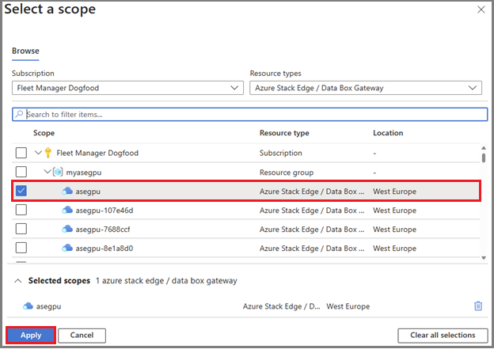
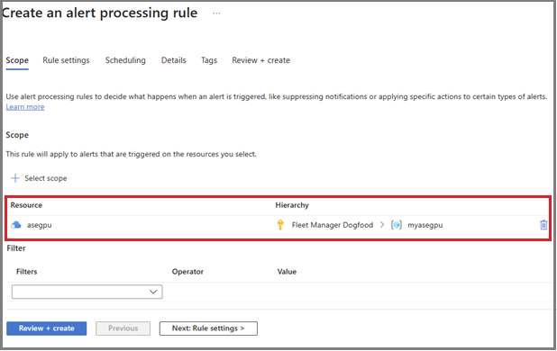
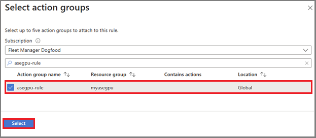

# Use alert processing rules to manage alert notifications on Azure Stack Edge devices

[!INCLUDE [applies-to-GPU-and-pro-r-and-mini-r-skus](../../includes/azure-stack-edge-applies-to-gpu-pro-r-mini-r-sku.md)]

This article describes how to create alert processing rules in the Azure portal. Alert processing rules trigger or suppress notifications for device events that occur within a resource group, an Azure subscription, or an individual Azure Stack Edge resource.  

## About alert processing rules

An alert processing rule can trigger or suppress alert notifications. The alert processing rule is added to an *action group*, a set of notification preferences used to notify users to act on alerts triggered in different contexts.

For more information about alert processing rules, see [Alert processing rules](../azure-monitor/alerts/alerts-processing-rules.md?tabs=portal). For more information about action groups, see [Create and manage action groups in the Azure portal](../azure-monitor/alerts/action-groups.md).

## Create an alert processing rule

Use the following steps in the Azure portal to create an alert processing rule for your Azure Stack Edge device.

> [!NOTE]
> These steps create an alert processing rule that sends notifications to an action group. For details about creating an alert processing rule to suppress notifications, see [Alert processing rules](../azure-monitor/alerts/alerts-action-rules.md?tabs=portal).

1. Go to the Azure Stack Edge device in the [Azure portal](https://portal.azure.com), and select the **Alerts** menu item (under **Monitoring**). Then select **Alert processing rules**.

   

2. On the **Alert processing rules** page, select **+ Create** to launch the **Create an alert processing rule** wizard.

   

3. On the **Scope** page, select **+ Select scope**.

    

1. Select a **Subscription** and optionally filter by **Resource types**. To filter by Azure Stack Edge resources, select **Resource types** for **Azure Stack Edge / Data Box Gateway** as shown in the following example.

   

1. The **Resource type** option lists the available resources based on your selection. Use the filter option to reduce the list of options. Select the **Checkbox** for the scope option you want to work with and then select **Apply**.

   

1. You can also use the **Filter** control in the following example to reduce the list of options to a subset of alerts within the selected scope.

   
   
1. On the **Add filters** pane, under **Filters**, add each filter you want to apply. For each filter, select the **Filter** type, **Operator**, and **Value**.

   For a list of filter options, see [Filter criteria](../azure-monitor/alerts/alerts-processing-rules.md?tabs=portal##scope-and-filters-for-alert-processing-rules).

   The filters in the following example apply to all alerts at Severity levels 2, 3, and 4 that the Monitor service raises for Azure Stack Edge resources. 

   

1. On the **Rule Settings** page, select **Apply action group** to create a rule that sends notifications.

   Select an option to **+ Select action group** for an existing group or **+ Create action group** to create a new one.

    To create a new action group, select **+ Create action group** and follow the steps in [Alert processing rules](../azure-monitor/alerts/alerts-processing-rules.md#add-action-groups-to-all-alert-types).

   >[!NOTE]
   >Select the **Suppress notifications** option if you don't want to invoke notifications for alerts. For more information, see [Alert processing rules](../azure-monitor/alerts/alerts-processing-rules.md?tabs=portal#suppress-notifications-during-planned-maintenance).

   

1. On the **Select action groups** page, select up to five action groups to attach to the alert processing rule, and then choose **Select**. 

   The new alert processing rule is added to the notification preferences of the action group.

    

1. On the **Details** tab, assign the alert processing rule to a **Resource group** and then specify a **Name** and a **Description** (optional) for the new rule.

   The new rule is enabled by default. If you don't want to start using the rule immediately, leave the **Enable rule upon creation** option unchecked.

   

1. To continue, select **Review+Create**.

   

1. Review your selections and then select **Create**.

   The **Alert processing rules** page launches, but you may not see the new rule immediately. The default view is **All** resource groups.

1. To view your new alert processing rule, select the resource group that contains the rule.

      

## View notifications

Notifications go out when an event triggers an alert for a resource within the scope of an alert processing rule.

The action group for an alert processing rule determines who receives a notification and the type of notification to send. Notifications can be sent via email, SMS message, or both.

It may take a few minutes to receive notifications after an alert is triggered.

The email notification looks similar to the following example.

## Next steps

- [View device alerts](azure-stack-edge-alerts.md).
- [Work with alert metrics](../azure-monitor/alerts/alerts-metric.md).
- [Set up Azure Monitor](azure-stack-edge-gpu-enable-azure-monitor.md).
