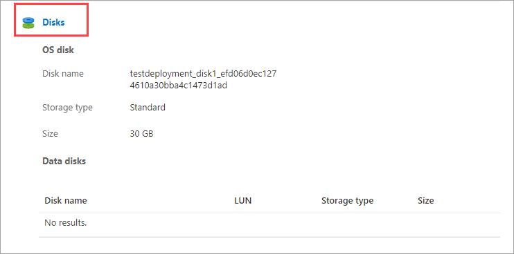
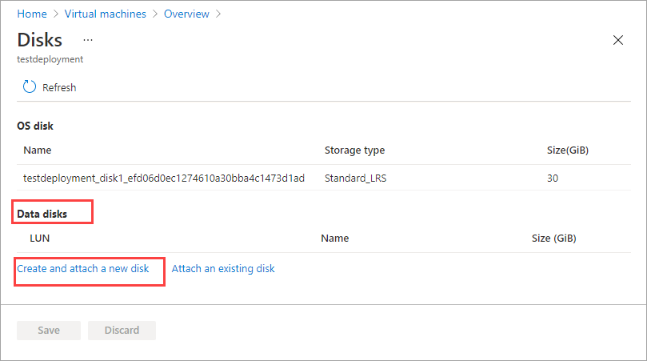
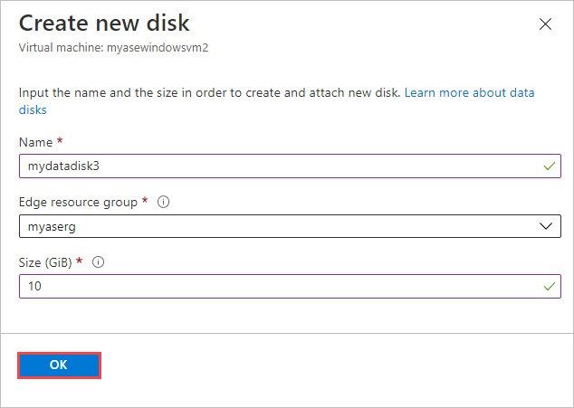
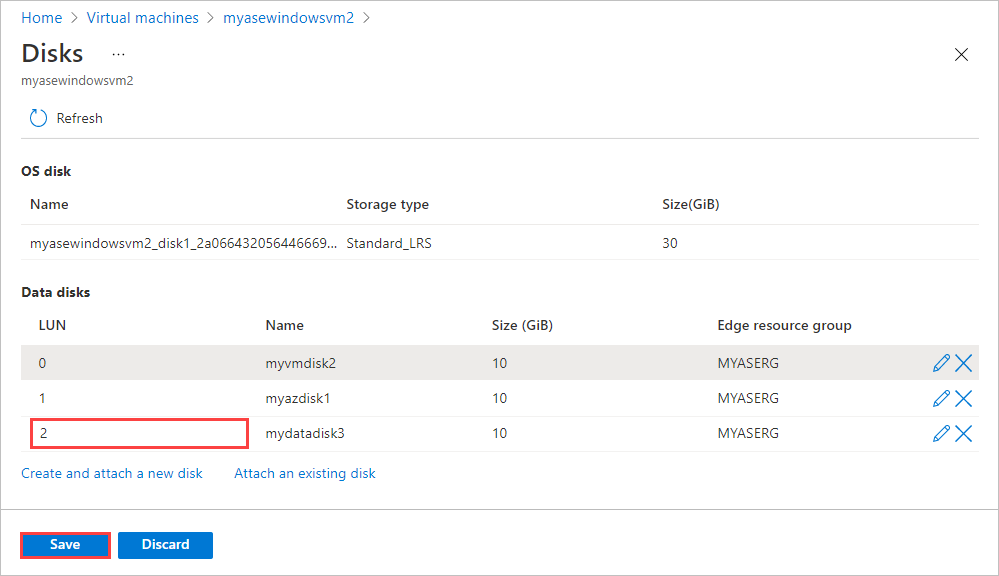
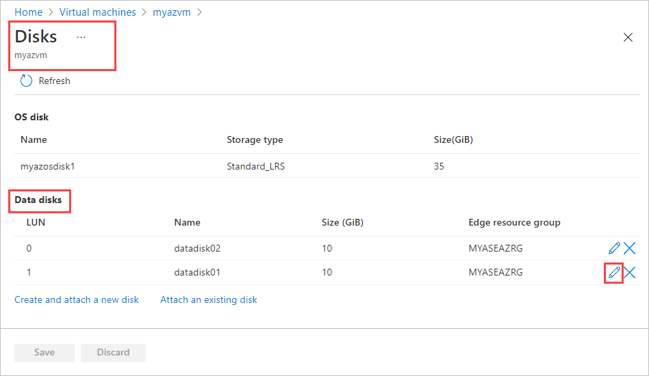
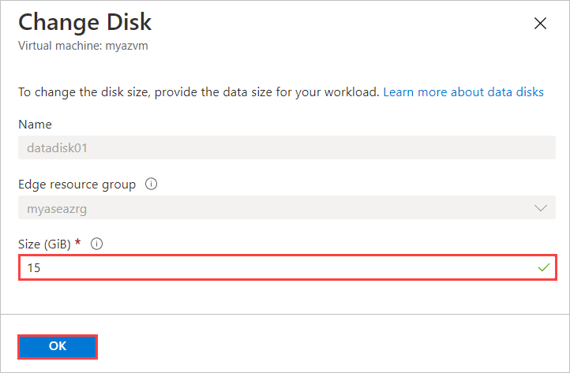
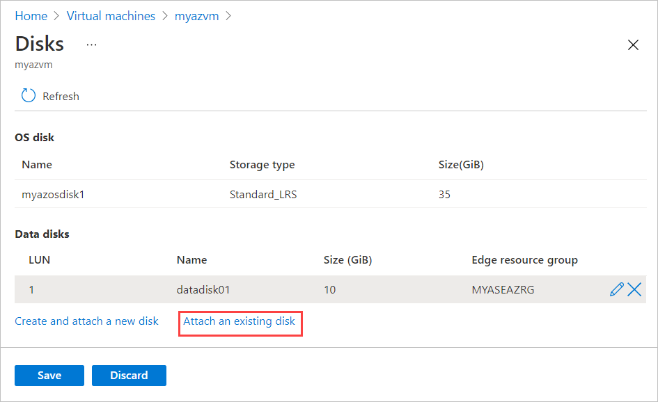
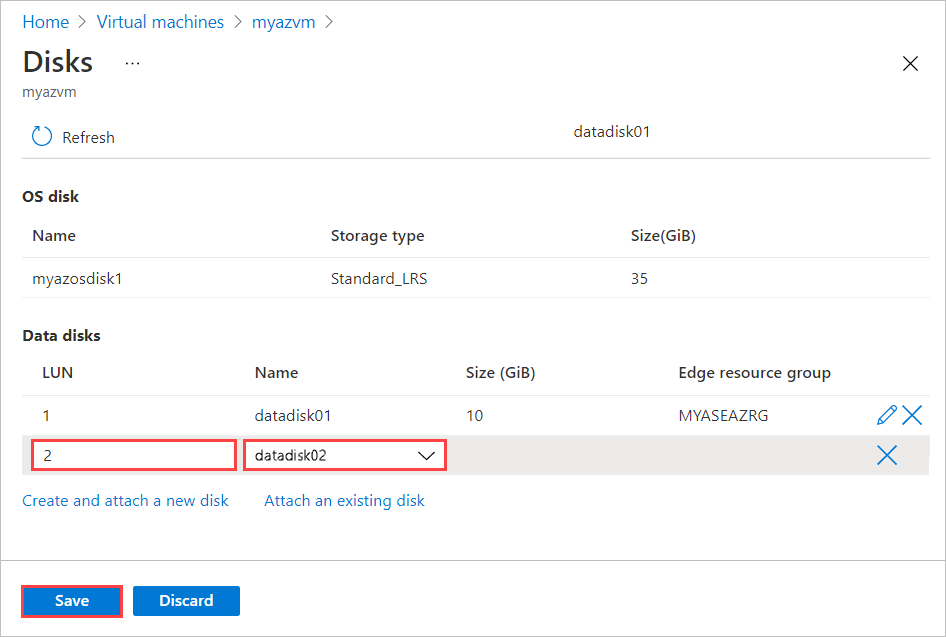
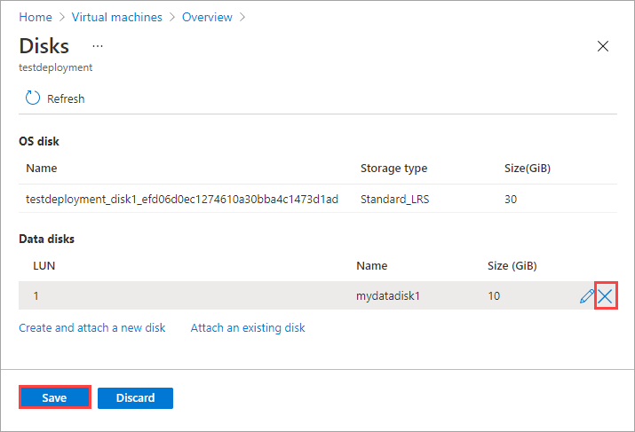

# Use the Azure portal to manage disks on the VMs on your Azure Stack Edge Pro GPU

[!INCLUDE [applies-to-GPU-and-pro-r-and-mini-r-skus](../../includes/azure-stack-edge-applies-to-gpu-pro-r-mini-r-sku.md)]

You can provision disks on the virtual machines (VMs) deployed on your Azure Stack Edge Pro device using the Azure portal. The disks are provisioned on the device via the local Azure Resource Manager and consume the device capacity. The operations such as adding a disk, detaching a disk can be done via the Azure portal, which in turn makes calls to the local Azure Resource Manager to provision the storage. <!--Disks are provisioned in local ARM via the portal. Use the Storage RP/Disk RP-->

This article explains how to add a data disk to an existing VM, detach a data disk, and finally resize the VM itself via the Azure portal. 

        
## About disks on VMs

Your VM can have an OS disk and a data disk. Every virtual machine deployed on your device has one attached operating system disk. This OS disk has a pre-installed OS, which was selected when the VM was created. This disk contains the boot volume.

> [!NOTE]
> You cannot change the OS disk size for the VM on your device. The OS disk size is determined by the VM size that you have selected. 

A data disk on the other hand, is a managed disk attached to the VM running on your device. A data disk is used to store application data. Data disks are typically SCSI drives. The size of the VM determines how many data disks you can attach to a VM. By default, premium storage is used to host the disks.

<!-- Do we have temp disk on VMs that run on ASE?-->
<!--do we allow features such as encryption or BitLocker for these disks.Didn't see anything in portal.-->
A VM deployed on your device may sometimes contain a temporary disk. The temporary disk provides short-term storage for applications and processes, and is intended to only store data such as page or swap files. Data on the temporary disk may be lost during a maintenance event or when you redeploy a VM. During a successful standard reboot of the VM, data on the temporary disk will persist. 

## Prerequisites

Before you begin to manage disks on the VMs running on your device via the Azure portal, make sure that:
<!--Does the VM needs to be stopped or in running state when adding a disk like Azure VM? I was able to add a data disk while the VM was stopped and also when it was running -->

1. You've access to an activated Azure Stack Edge Pro GPU device. You have also enabled a network interface for compute on your device. This action creates a virtual switch on that network interface on your VM. 
    1. In the local UI of your device, go to **Compute**. Select the network interface that you will use to create a virtual switch.

        > [!IMPORTANT] 
        > You can only configure one port for compute.

    1. Enable compute on the network interface. Azure Stack Edge Pro GPU creates and manages a virtual switch corresponding to that network interface.

1. You have at least one VM deployed on your device. To create this VM, see the instructions in [Deploy VM on your Azure Stack Edge Pro via the Azure portal](azure-stack-edge-gpu-deploy-virtual-machine-portal.md).

1. Your VM should be in **Stopped** state. To stop your VM, go to **Virtual machines > Overview** and select the VM you want to stop. In the **Overview** page, select **Stop** and then select **Yes** when prompted for confirmation. Before you add, edit, or detach disks, you must stop the VM.

    

## Add a data disk

Follow these steps to add a disk to a virtual machine deployed on your device. 

1. Go to the virtual machine that you have stopped and then go to the **Overview** page. Select **Disks**.
    
    

1. In the **Disks** blade, under **Data Disks**, select **Create and attach a new disk**.

    

1. In the **Create a new disk** blade, enter the following parameters:

    
    |Field  |Description  |
    |---------|---------|
    |Name     | A unique name within the resource group. The name cannot be changed after the data disk is created.     |
    |Size| The size of your data disk in GiB. The maximum size of a data disk is determined by the VM size that you have selected. When provisioning a disk, you should also consider the actual space on your device and other VM workloads that are running that consume capacity.  |         

    

    Select **OK** and proceed.

1. In the **Overview** page, under **Disks**, you'll see an entry corresponding to the new disk. Accept the default or assign a valid Logical Unit Number (LUN) to the disk and select **Save**. A LUN is a unique identifier for a SCSI disk. For more information, see [What is a LUN?](../virtual-machines/linux/azure-to-guest-disk-mapping.md#what-is-a-lun).

    

1. You'll see a notification that disk creation is in progress. After the disk is successfully created, the virtual machine is updated. 

    

1. Navigate back to the **Overview** page. The list of disks updates to display the newly created data disk.

    

## Change a data disk

Follow these steps to change a disk associated with a virtual machine deployed on your device.

1. Go to the virtual machine that you have stopped and go to the **Overview** page. Select **Disks**.

1. In the list of data disks, select the disk that you wish to change. In the far right of the disk selected, select the edit icon (pencil).  

    

1. In the **Change disk** blade, you can only change the size of the disk. The name associated with the disk can't be changed once it is created. Change the **Size** and save the changes.

    

    >![NOTE]
    > You can only expand a data disk, you can't shrink the disk.

1. On the **Overview** page, the list of disks refreshes to display the updated disk.

## Attach an existing disk

Follow these steps to attach an existing disk to the virtual machine deployed on your device.

1. Go to the virtual machine to which you wish to attach the existing disk and then go to the **Overview** page. Select **Disks**.
    
    

1. In the **Disks** blade, under **Data Disks**, select **Attach an existing disk**.

    

1. Accept default LUN or assign a valid LUN. Choose an existing data disk from the dropdown list. Select Save.

    

    Select **Save** and proceed.

1. You'll see a notification that the virtual machine is updated. After the VM is updated, navigate back to the **Overview** page. Refresh the page to view the newly attached disk in the list of data disks.

    

## Detach a data disk

Follow these steps to detach or remove a data disk associated with a virtual machine deployed on your device.

1. Go to the virtual machine from which you wish to detach a data disk and go to the **Overview** page. Select **Disks**.

    

1. In the list of disks, select the disk that you wish to detach. In the far right of the disk selected, select the detach icon (cross). The selected entry will be detached. Select **Save**. 

    

1. After the disk is detached, the virtual machine is updated. Refresh the **Overview** page to view the updated list of data disks.

    

## Next steps

To learn how to deploy virtual machines on your Azure Stack Edge Pro device, see [Deploy virtual machines via the Azure portal](azure-stack-edge-gpu-deploy-virtual-machine-portal.md).
