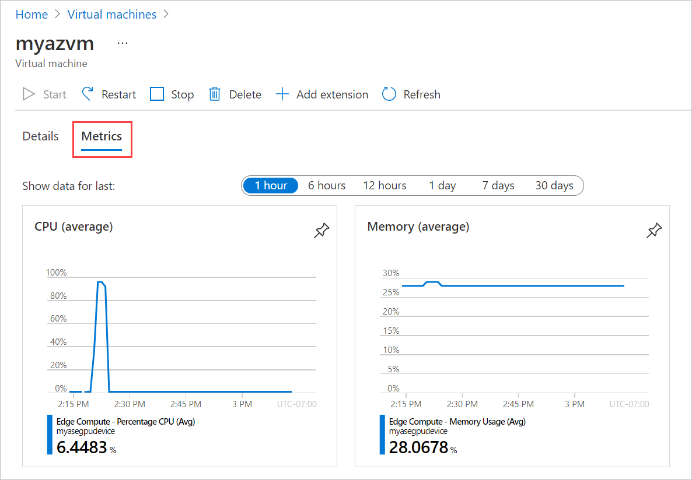
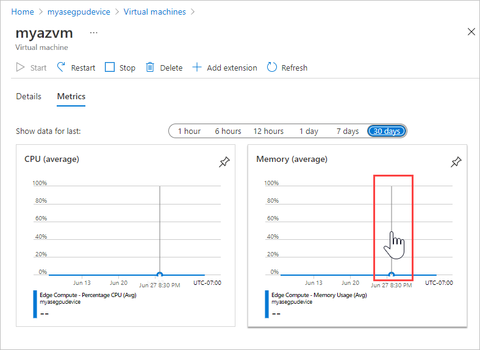

# Monitor VM metrics for CPU, memory on Azure Stack Edge Pro GPU

[!INCLUDE [applies-to-GPU-and-pro-r-and-mini-r-skus](../../includes/azure-stack-edge-applies-to-gpu-pro-r-mini-r-sku.md)]

This article describes how to monitor CPU and memory metrics for a virtual machine on your Azure Stack Edge Pro GPU device.

## About VM metrics

You can view CPU and memory metrics for a virtual machine in the Azure portal. 

The VM metrics are based on performance data collected from the Azure Stack Edge device. VM memory usage is based on memory used during VM operations. *QUERY: CPU usage also? What agent/service is used to collect the data? This is guest OS data collected by what?*

*QUERY: What's the sampling interval for the data?*

Metrics aren't limited to any length of time, but they are limited by the size of data that can be cached. *QUERY: What factors affect the cache space - the number of VMs deployed on the device?*

If a device is disconnected, metrics are cached on the device. As soon as the device is reconnected, the metrics are pushed from the cache and displayed in the VM details.

*QUERY: Are there any costs associated with these metrics?*

*QUERY: If they want more comprehensive performance data/diagnostics, where do we expect the customer to go next? They can view VM activity on the device. Then what?*

## Monitor CPU and memory metrics

1. Open the device in the Azure portal, and go to **Virtual Machines**. Select the virtual machine, and select **Metrics**.

    

2. By default, the graphs show average CPU and memory usage for the previous hour. To see data for a different time period, select a different option beside **Show data for last**.

    

3. Point anywhere in either chart with your mouse to display a vertical line with a hand that you can move left or right to view an earlier or later data sample.

    

## Next steps

- [Monitor VM activity on your device](azure-stack-edge-gpu-monitor-virtual-machine-activity.md)
- TBD: More comprehensive diagnostics for an ASE VM
