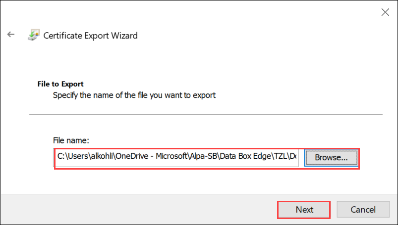
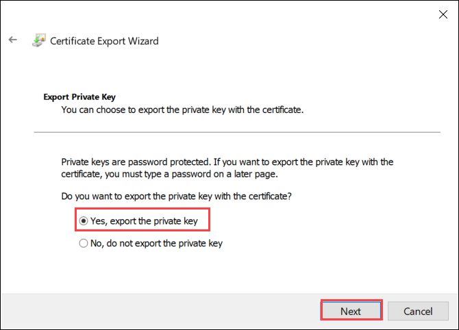
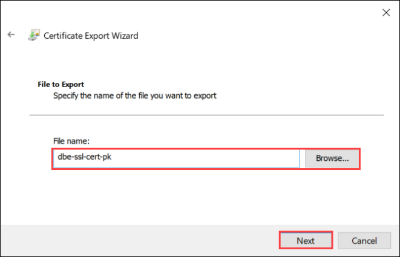

# Prepare certificates to upload on your Azure Stack Edge Pro GPU

[!INCLUDE [applies-to-GPU-and-pro-r-and-mini-r-skus](../../includes/azure-stack-edge-applies-to-gpu-pro-r-mini-r-sku.md)]

This article describes how to convert the certificates into appropriate format so these are ready to upload on your Azure Stack Edge device. This procedure is typically required when your bring your own certificates.

To know more about how to create these certificates, see [Create certificates using Azure PowerShell](azure-stack-edge-gpu-create-certificates-powershell.md).

## Prepare certificates

If you bring your own certificates, then the certificates that you created for your device by default reside in the **Personal store** on your client. These certificates need to be exported on your client into appropriate format files that can then be uploaded to your device.

- **Prepare root certificates**: The root certificate must be exported as DER format with `.cer` extension. For detailed steps, see [Export certificates as DER format](#export-certificates-as-der-format).

- **Prepare endpoint certificates**: The endpoint certificates must be exported as *.pfx* files with private keys. For detailed steps, see [Export certificates as *.pfx* file with private keys](#export-certificates-as-pfx-format-with-private-key). 

## Export certificates as DER format

1. Run *certlm.msc* to launch the local machine certificate store.

1. In the Personal certificate store, select the root certificate. Right-click and select **All Tasks > Export...**

    

2. The certificate wizard opens up. Select the format as **DER encoded binary X.509 (.cer)**. Select **Next**.

    

3. Browse and select the location where you want to export the .cer format file.

    

4. Select **Finish**.

    

## Export certificates as .pfx format with private key

Take the following steps to export an SSL certificate with private key on a Windows machine. 

> [!IMPORTANT]
> Perform these steps on the same machine that you used to create the certificate. 

1. Run *certlm.msc* to launch the local machine certificate store.

1. Double click on the **Personal** folder, and then on **Certificates**.

    
 
2. Right-click on the certificate you would like to back up and choose **All tasks > Export...**

    

3. Follow the Certificate Export Wizard to back up your certificate to a .pfx file.

    

4. Choose **Yes, export the private key**.

    

5. Choose **Include all certificates in certificate path if possible**, **Export all extended properties** and **Enable certificate privacy**. 

    > [!IMPORTANT]
    > DO NOT select the **Delete Private Key option if export is successful**.

    

6. Enter a password you will remember. Confirm the password. The password protects the private key.

    

7. Choose to save file on a set location.

    
  
8. Select **Finish**.

    

9. You receive a message The export was successful. Select **OK**.

    

The .pfx file backup is now saved in the location you selected and is ready to be moved or stored for your safe keeping.

## Next steps

Learn how to [Upload certificates on your device](azure-stack-edge-gpu-manage-certificates.md)