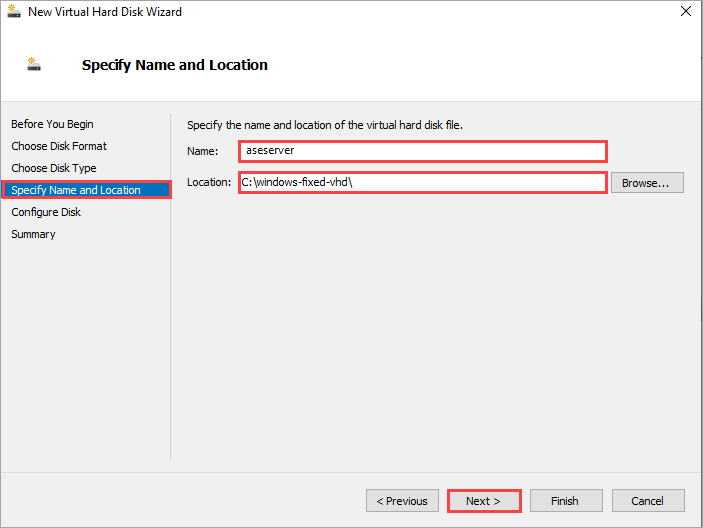
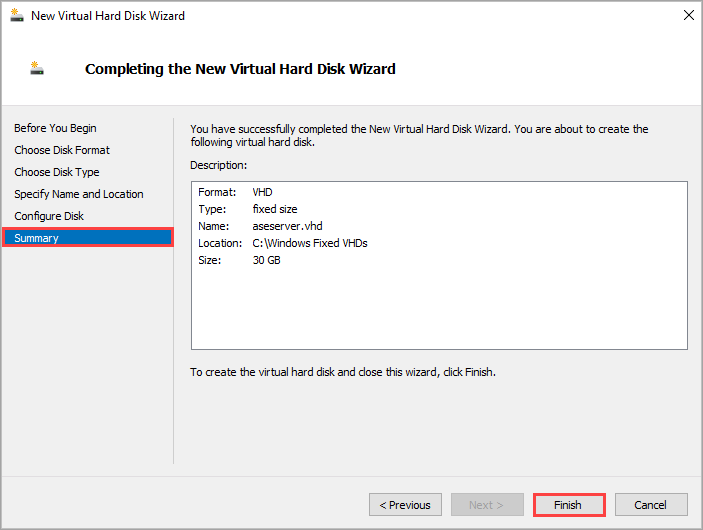
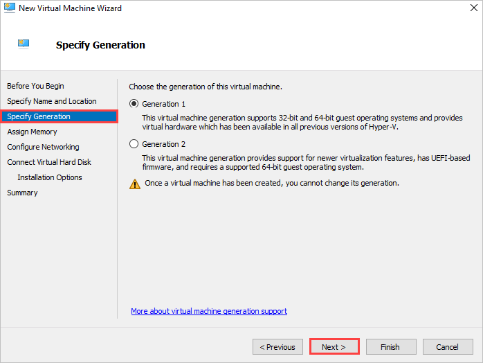

# Create a generalized Windows VHD from an ISO 

This article describes the steps to create a Windows VHD from an ISO installation media so that it can be used to create a generalized image on Azure Stack Edge. A ‘generalized’ image requires setup to be completed on first boot of the VM. For example, it needs to set the hostname, admin user, and other VM-specific configurations. This is useful when you want to create multiple new VMs from the same image.

This is different than a "specialized" image, which is completely pre-configured and does not require special provisioning or parameters. The platform will just turn the VM on. Specialized images are useful for migrating a specific machine or restoring a VM from a previous backup. o deploy from a specialized image, see [Use specialized Windows VHD](azure-stack-edge-placeholder.md) for your device.<!--Get target!-->

## Workflow 

The high-level workflow to create a generalized Windows VHD from an ISO is: 

1. Create a new fixed-size VHD in Hyper-V Manager 

1. Create a new VM in Hyper-V using the VHD 

1. Mount the ISO as a DVD drive on the new VM 

1. Start the VM and install the Windows operating system 

1. Generalize the VHD using the ‘sysprep’ utility  

1. Copy the generalized image to blob storage 

1. Proceed to the steps to deploy a VM from a generalized image via Azure Portal or PowerShell 
 

## Prerequisites 

Before you can create a generalized Windows VHD from an ISO, make sure that: 

- You have an ISO for supported version of Windows that you want to turn into a generalized VHD. Windows ISO images can be downloaded from the Microsoft Evaluation Center. 

- You have access to a local machine with Hyper-V Manager installed. 

- You have an Azure blob storage account to store your VHD once it is finished preparing 

## Create a new fixed-size VHD in Hyper-V Manager 

1. In the Hyper-V Manager “Actions” menu, select New -> Hard Disk 

   

1. Under **Choose Disk Format**, select **VHD**. 

   

1. Under **Choose Disk Type**, select **Fixed size**.

   

1. Enter a name and location for your new VHD.

1. Under **Configure Disk**, select **Create a new blank virtual hard disk** and enter the size of disk you would like to create (generally 20 GB and above for Windows Server).

   

1. Review your selections and click **Finish** to create the new VHD. The process will take five or more minutes depending on the size of the VHD created.

## Create a new Hyper-V VM using the VHD 

1. Open Hyper-V manager on your local machine 

1. In the right menu, click **New** > **Virtual Machine**. 

   

1. In the New Virtual Machine Wizard, specify the name and location of your VM.

   

1. Under **Specify Generation**, select **Generation 1**. 

   

1. Assign your desired memory and networking configurations. 

1. In the **Connect Virtual Hard Disk** menu, select **Use an existing virtual hard disk** and point to the fixed VHD you created in the previous step.

   

1. Create the VM. 
 
## Mount the ISO image as a DVD drive on the VM

1. In Hyper-V Manager, select the VM you just created, and click **Settings**. 

1. Under the **DVD Drive** menu, select **Image file** and point to your ISO image.  

   

1. Under the **BIOS** menu, ensure that **CD** is at the top of the **Startup order** list. 

   

1. Click **OK** to save your VM settings.

## Connect to the Hyper-V VM 

Using Hyper-V manager, connect to the new VM you created. 

[!INCLUDE [Connect to Hyper-V VM](../../includes/azure-stack-edge-connect-to-hyperv-vm.md)]

After you are connected to the VM, complete the Machine setup wizard and then sign into the VM.<!--What does this mean? Doesn't correspond to the procedures/steps that follow.-->

## Generalize the VHD  

[!INCLUDE [Generalize the VHD](../../includes/azure-stack-edge-generalize-vhd.md)]

### Upload the VHD to Azure blob storage

## Upload the VHD to Azure Blob storage

Your VHD can now be used to create a generalized image on Azure Stack Edge.

[!INCLUDE [Upload VHD to Blob storage](../../includes/azure-stack-edge-upload-vhd-to-blob-storage.md)]

<!--If you experience any issues creating VMs from your new image, you can use VM console access to help troubleshoot. For information on console access, see [link].-->

## Next steps

TBD
