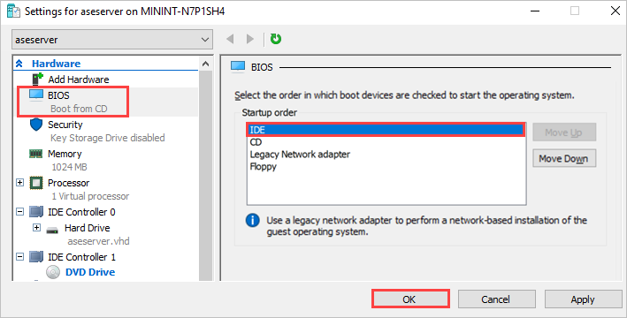
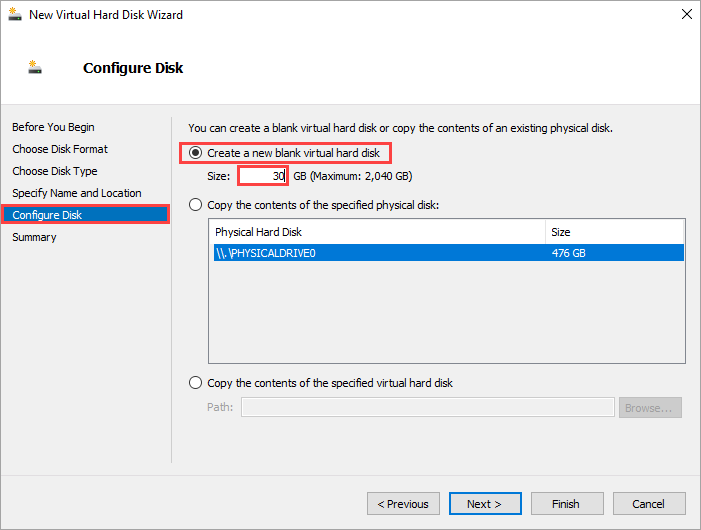
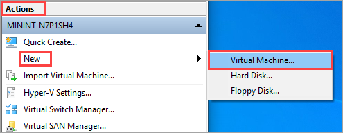
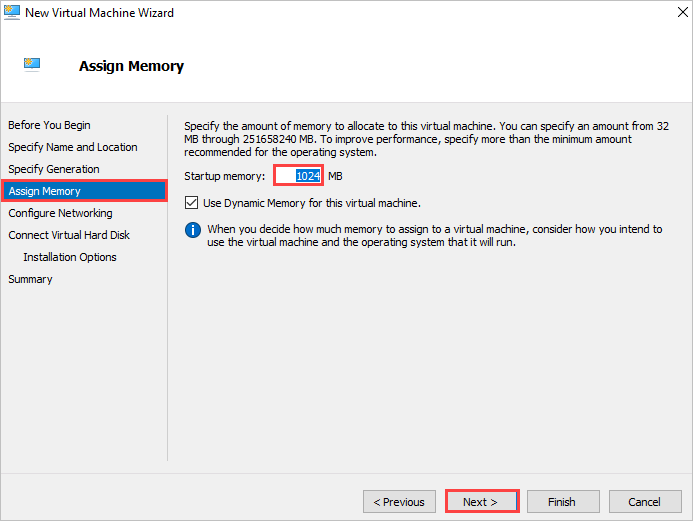
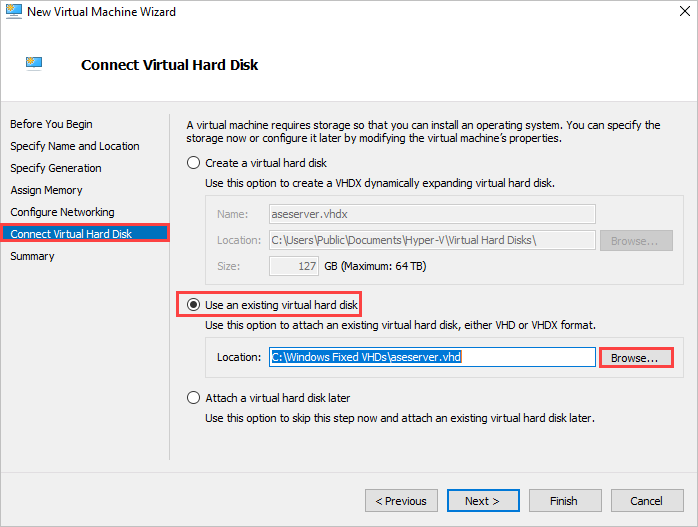

# Use generalized image from an ISO to create a VM image for your Azure Stack Edge Pro device 

[!INCLUDE [applies-to-GPU-and-pro-r-and-mini-r-skus](../../includes/azure-stack-edge-applies-to-gpu-pro-r-mini-r-sku.md)]

This article describes how to create a VM image starting from ISO installation media and then generalize that image so you can use it to create multiple new virtual machines (VMs) on multiple systems in Azure Stack Edge.

When you use a generalized image to create a VM, you complete the setup on first boot of the machine, configuring the hostname, admin user, other settings specific to that virtual machine.

Describes how to create VM images from generalized images starting from a Windows VHD or a VHDX. Use this generalized image to create VM images to use with VMs deployed on your Azure Stack Edge Pro GPU device.

> [!NOTE]
> By contrast, you can use a *specialized image* to create a fully pre-configured VM targeted to a specific system. To compare use of the two image types in Azure Stack Edge, see [About preparing a Windows VHD](./azure-stack-edge-gpu-prepare-windows-vhd-generalized-image.md#about-preparing-windows-vhd).

## Workflow 

The high-level workflow to create a generalized Windows VHD from an ISO is:

1. Create a new, blank, fixed-size VHD in Hyper-V Manager.
1. Create a new VM in Hyper-V using the VHD.
1. Mount the ISO as a DVD drive on the new VM.
1. Start the VM, and install the Windows operating system.
1. Generalize the VHD  using the 'sysprep' utility.
1. Copy the generalized image to Azure Blob storage.

## Prerequisites 

Before you can create a generalized Windows VHD from an ISO image, make sure that:

- You have an ISO image for the supported Windows version that you want to turn into a generalized VHD. Windows ISO images can be downloaded from the Microsoft Evaluation Center. 

- You have access to a Windows client with Hyper-V Manager installed.

- You have access to an Azure blob storage account to store your VHD after it is prepared.

## Create new VHD in Hyper-V Manager

1. Open Hyper-V Manager on your client system. On the **Action** menu, select **New** and then **Hard Disk**.<!--To get to View, they have to first select the server (?) under the Hyper-V Manager?-->

   

1. Under **Choose Disk Format**, select **VHD**. Then select **Next >**. 

   

2. Under **Choose Disk Type**, select **Fixed size**. Then select **Next >**.

   

3. Under **Specify Name and Location**, enter a name and location for your new VHD. Then select **Next >**.

   

4. Under **Configure Disk**, select **Create a new blank virtual hard disk**, and enter the size of disk you would like to create (generally 20 GB and above for Windows Server). Then select **Next >**.

   

5. Under **Summary**, review your selections, and select **Finish** to create the new VHD. The process will take five or more minutes depending on the size of the VHD created.

   

## Create Hyper-V VM from VHD 

1. Open Hyper-V Manager on your Windows client.

2. On the **Actions** pane, select **New** and then **Virtual Machine**.

   

3. In the New Virtual Machine Wizard, specify the name and location of your VM.

   

4. Under **Specify Generation**, select **Generation 1**. Then select **Next >**. 

   

5. Under **Assign Memory**, assign the desired memory to the virtual machine. Then select **Next >**.

   

6. Under **Configure Networking**, enter your network configuration. Then select **Next >**.

   

7. Under **Connect Virtual Hard Disk**, select **Use an existing virtual hard disk** and browse to the fixed VHD you created in the previous procedure. Then select **Next >**. 

   

8. Review the summary, and select **Finish** to create the virtual machine. 

 
## Mount ISO image as DVD drive on VM

1. In Hyper-V Manager, select the VM you just created, and then select **Settings**.
 
   

2. Under **BIOS**, ensure that **CD** is at the top of the **Startup order** list.

   

3. Under **DVD Drive**, select **Image file**, and browse to your ISO image.  

   

4. Select **OK** to save your VM settings.

## Start VM, and complete OS installation 

To finish building your virtual machine, you need to start the virtual machine and walk through the operating system installation.

[!INCLUDE [Connect to Hyper-V VM](../../includes/azure-stack-edge-connect-to-hyperv-vm.md)]

## Generalize the VHD  

[!INCLUDE [Generalize the VHD](../../includes/azure-stack-edge-generalize-vhd.md)]

Your VHD can now be used to create a generalized image in Azure Stack Edge.

## Upload generalized VHD to Azure Blob storage

[!INCLUDE [Upload VHD to Blob storage](../../includes/azure-stack-edge-upload-vhd-to-blob-storage.md)]

<!--If you experience any issues creating VMs from your new image, you can use VM console access to help troubleshoot. For information on console access, see [link].-->

## Next steps

- [Deploy VMs on your Azure Stack Edge Pro GPU device via the Azure portal](azure-stack-edge-gpu-deploy-virtual-machine-portal.md)
- [Deploy VMs on your Azure Stack Edge device via Azure PowerShell](azure-stack-edge-gpu-deploy-virtual-machine-powershell.md)
