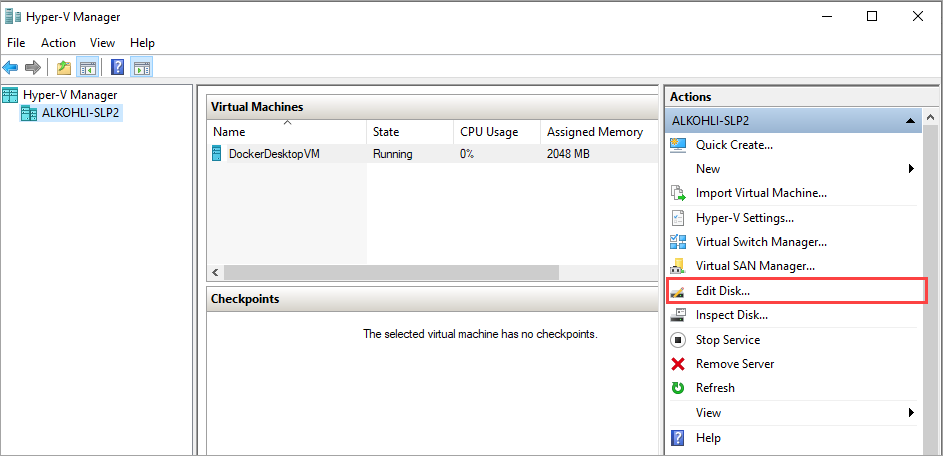
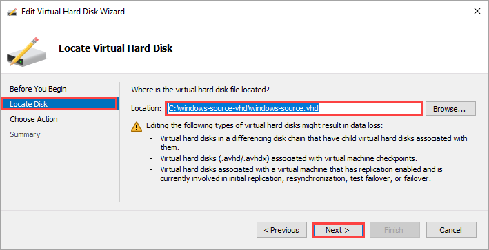
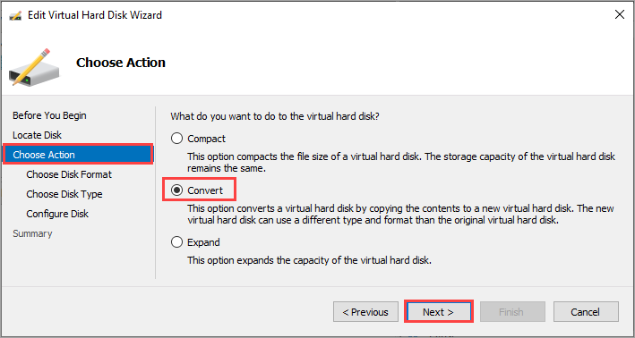
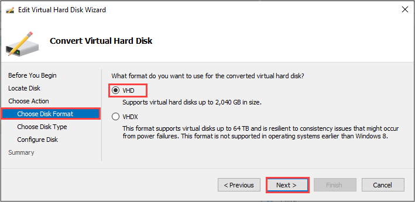

# Use generalized Windows VHDs to create VM images for your Azure Stack Edge Pro device

[!INCLUDE [applies-to-GPU-and-pro-r-and-mini-r-skus](../../includes/azure-stack-edge-applies-to-gpu-pro-r-mini-r-sku.md)]

To deploy VMs on your Azure Stack Edge Pro device, you need to be able to create custom VM images that you can use to create VMs. This article describes the steps required to prepare a Windows VHD or VHDX to create a generalized image. This generalized image is then used to create a VM image for your Azure Stack Edge Pro device. 

## About preparing Windows VHD

A Windows VHD or VHDX can be used to create a *generalized* image or a *specialized* image. 


|Image type  |Generalized  |Specialized  |
|---------|---------|---------|
|Target     |Deployed on any system         | Targeted to a specific system        |
|Setup after boot     | Setup required at first boot of the VM.          | Setup not needed. <br> Platform turns the VM on.        |
|Configuration     |Hostname, admin-user, and other VM-specific settings required.         |Completely pre-configured.         |
|Used when     |Creating multiple new VMs from the same image.         |Migrating a specific machine or restoring a VM from previous backup.         |


This article covers steps required to deploy from a generalized image. To deploy from a specialized image, see [Use specialized Windows VHD](azure-stack-edge-gpu-placeholder.md) for your device.

> [!IMPORTANT]
> Azure Stack Edge Pro shares requirements with Azure when it comes to preparing generalized images. The following procedure does not cover all cases where the source VHD is configured with custom configurations and settings. For example, additional actions are required to generalize a VHD containing custom firewall rules or proxy settings. For more information on additional actions that may be required, see [Prepare a Windows VHD to upload to Azure - Azure Virtual Machines]().


## VM image workflow

The high-level workflow to prepare a Windows VHD for use as a generalized image has the following steps:

1. Convert the source VHD or VHDX to a fixed size VHD.
1. Create a VM in Hyper-V using the fixed VHD.
1. Connect to the Hyper-V VM.
1. Generalize the VHD using the *sysprep* utility. 
1. Copy the generalized image to Blob storage.
1. Use generalized image to deploy VMs on your device. For more information, see how to [deploy a VM via Azure portal](azure-stack-edge-gpu-deploy-virtual-machine-portal.md) or [deploy a VM via PowerShell](azure-stack-edge-gpu-deploy-virtual-machine-powershell.md).


## Prerequisites

Before you prepare a Windows VHD for use as a generalized image on Azure Stack Edge, make sure that:

- You have a VHD or a VHDX containing a supported version of Windows. See Supported Operating Systems for ... 
- You have access to a Windows client with Hyper-V Manager installed. This client system should be running PowerShell 5.0 or later.
- You have an Azure Blob storage account to store your VHD after it is prepared.

## Prepare a generalized Windows image from VHD

### Convert to a fixed VHD 

For your device, you'll need fixed-size VHDs to create VM images. You'll need to convert your source Windows VHD or VHDX to a fixed VHD. Follow these steps:

1. Open Hyper-V Manager on your client system. Go to **Edit Disk**.

    

1. On the **Before you begin** page, select **Next>**.

1. On the **Locate virtual hard disk** page, browse to the location of the source Windows VHD or VHDX that you wish to convert. Select **Next>**.

    

1. On the **Choose action** page, select **Convert** and select **Next>**.

    

1. On the **Choose disk format** page, select **VHD** format and then select **Next>**.

   


1. On the **Choose disk type** page, choose **Fixed size** and select **Next>**.

   


1. On the **Configure disk** page, browse to the location and specify a name for the fixed size VHD disk. Select **Next>**.

   


1. Review the summary and select **Finish**. The VHD or VHDX conversion takes a few minutes. The time for conversion depends on the size of the source disk. 

<!--
1. Run PowerShell on your Windows client.
1. Run the following command:

    ```powershell
    Convert-VHD -Path <source VHD path> -DestinationPath <destination-path.vhd> -VHDType Fixed 
    ```
-->
    Use this fixed VHD for all the subsequent steps in this article.


## Create a Hyper-V VM from fixed VHD

In the Hyper-V manager, in the **Actions** pane, go to **New > Virtual Machine**.
	 
In the New Virtual Machine Wizard, specify the name and location of your VM
	 
Specify Generation 1 (required)

Assign your desired memory and networking configurations

In the “Connect Virtual Hard Disk” menu, select “Use an existing virtual hard disk” and point to the fixed VHD you created in the previous step
	 
Create the VM

## Connect to the Hyper-V VM

Using Hyper-V manager, connect to the new VM you created. Complete the machine setup wizard and log in.

Generalize the VHD using the ‘sysprep’ utility 
Inside the VM, open a command prompt and run the following command to generalize the VHD. The VM will shut down once the command is complete. Do not restart it.
o	c:\windows\system32\sysprep\sysprep.exe /oobe /generalize /shutdown /mode:vm

## Upload the VHD to Azure blob storage

Your VHD can now be used to create a generalized image on Azure Stack Edge. Upload the VHD to Azure blob storage, where it can be used to create images and VMs using the following procedures.
o	Deploy a VM from a generalized image via Azure Portal [link]
o	Deploy a VM from a generalized image via Azure PowerShell [link]  
If you experience any issues creating VMs from your new image, you can use VM console access to help troubleshoot. For information on console access, see [link].


## Create a Windows custom VM image

Do the following steps to create a Windows VM image.

1. Create a Windows Virtual Machine. For more information, go to [Tutorial: Create and manage Windows VMs with Azure PowerShell](../virtual-machines/windows/tutorial-manage-vm.md)

2. Download an existing OS disk.

    - Follow the steps in [Download a VHD](../virtual-machines/windows/download-vhd.md).

    - Use the following `sysprep` command instead of what is described in the preceding procedure.
    
        `c:\windows\system32\sysprep\sysprep.exe /oobe /generalize /shutdown /mode:vm`
   
       You can also refer to [Sysprep (system preparation) overview](/windows-hardware/manufacture/desktop/sysprep--system-preparation--overview).

Use this VHD to now create and deploy a VM on your Azure Stack Edge Pro device.

## Create a Linux custom VM image

Do the following steps to create a Linux VM image.

1. Create a Linux Virtual Machine. For more information, go to [Tutorial: Create and manage Linux VMs with the Azure CLI](../virtual-machines/linux/tutorial-manage-vm.md).

1. Deprovision the VM. Use the Azure VM agent to delete machine-specific files and data. Use the `waagent` command with the `-deprovision+user` parameter on your source Linux VM. For more information, see [Understanding and using Azure Linux Agent](../virtual-machines/extensions/agent-linux.md).

    1. Connect to your Linux VM with an SSH client.
    2. In the SSH window, enter the following command:
       
        ```bash
        sudo waagent -deprovision+user
        ```
       > [!NOTE]
       > Only run this command on a VM that you'll capture as an image. This command does not guarantee that the image is cleared of all sensitive information or is suitable for redistribution. The `+user` parameter also removes the last provisioned user account. To keep user account credentials in the VM, use only `-deprovision`.
     
    3. Enter **y** to continue. You can add the `-force` parameter to avoid this confirmation step.
    4. After the command completes, enter **exit** to close the SSH client.  The VM will still be running at this point.


1. [Download existing OS disk](../virtual-machines/linux/download-vhd.md).

Use this VHD to now create and deploy a VM on your Azure Stack Edge Pro device. You can use the following two Azure Marketplace images to create Linux custom images:

|Item name  |Description  |Publisher  |
|---------|---------|---------|
|[Ubuntu Server](https://azuremarketplace.microsoft.com/marketplace/apps/canonical.ubuntuserver) |Ubuntu Server is the world's most popular Linux for cloud environments.|Canonical|
|[Debian 8 "Jessie"](https://azuremarketplace.microsoft.com/marketplace/apps/credativ.debian) |Debian GNU/Linux is one of the most popular Linux distributions.     |credativ|

For a full list of Azure Marketplace images that could work (presently not tested), go to [Azure Marketplace items available for Azure Stack Hub](/azure-stack/operator/azure-stack-marketplace-azure-items?view=azs-1910&preserve-view=true).


## Next steps

[Deploy VMs on your Azure Stack Edge Pro device](azure-stack-edge-gpu-deploy-virtual-machine-powershell.md).