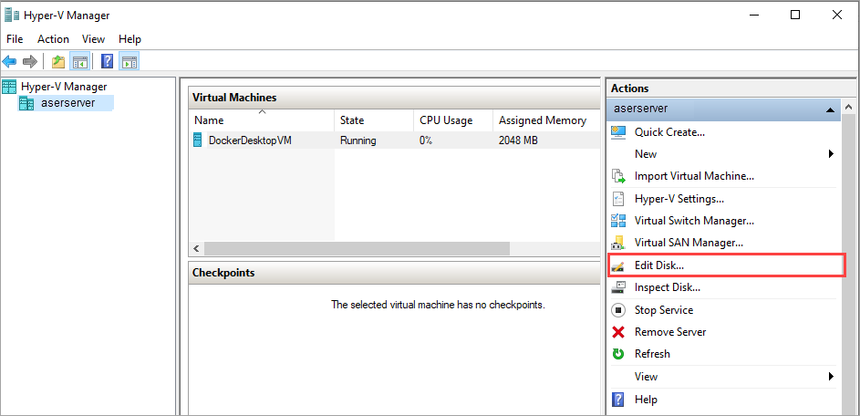
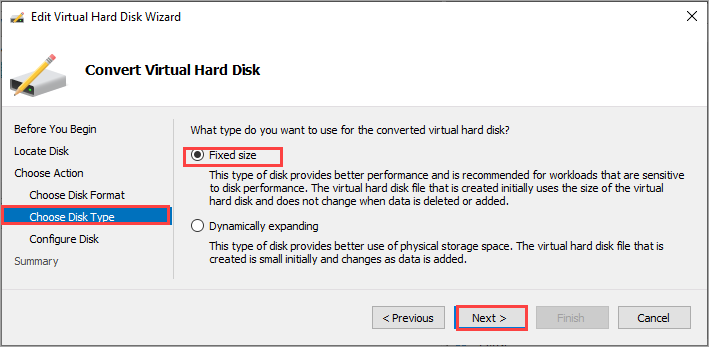
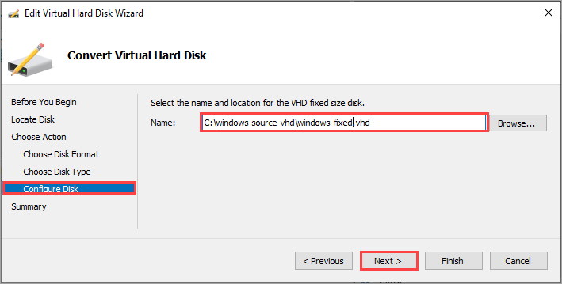
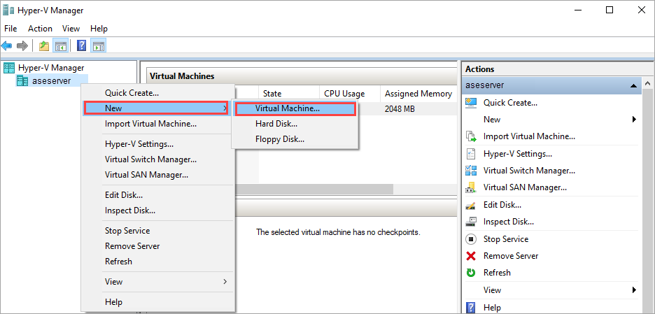
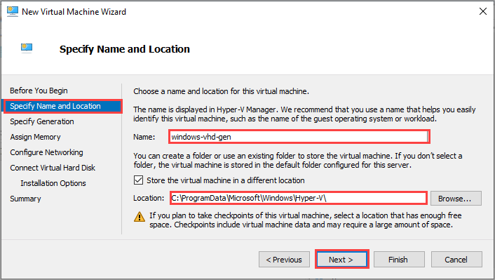
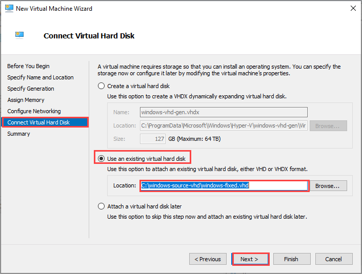

# Use generalized image from Windows VHD to create a VM image for your Azure Stack Edge Pro device

[!INCLUDE [applies-to-GPU-and-pro-r-and-mini-r-skus](../../includes/azure-stack-edge-applies-to-gpu-pro-r-mini-r-sku.md)]

To deploy VMs on your Azure Stack Edge Pro device, you need to be able to create custom VM images that you can use to create VMs. This article describes the steps required to prepare a Windows VHD or VHDX to create a generalized image. This generalized image is then used to create a VM image for your Azure Stack Edge Pro device. 

## About preparing Windows VHD

A Windows VHD or VHDX can be used to create a *generalized* image or a *specialized* image. The following table summarizes key differences between the *generalized* and the *specialized* images.


|Image type  |Generalized  |Specialized  |
|---------|---------|---------|
|Target     |Deployed on any system         | Targeted to a specific system        |
|Setup after boot     | Setup required at first boot of the VM.          | Setup not needed. <br> Platform turns the VM on.        |
|Configuration     |Hostname, admin-user, and other VM-specific settings required.         |Completely pre-configured.         |
|Used when     |Creating multiple new VMs from the same image.         |Migrating a specific machine or restoring a VM from previous backup.         |


This article covers steps required to deploy from a generalized image. To deploy from a specialized image, see [Use specialized Windows VHD](azure-stack-edge-placeholder.md) for your device.

> [!IMPORTANT]
> This procedure does not cover cases where the source VHD is configured with custom configurations and settings. For example, additional actions may be required to generalize a VHD containing custom firewall rules or proxy settings. For more information on these additional actions, see [Prepare a Windows VHD to upload to Azure - Azure Virtual Machines](../virtual-machines/windows/prepare-for-upload-vhd-image.md).


## VM image workflow

The high-level workflow to prepare a Windows VHD for use as a generalized image has the following steps:

1. Convert the source VHD or VHDX to a fixed size VHD.
1. Create a VM in Hyper-V using the fixed VHD.
1. Connect to the Hyper-V VM.
1. Generalize the VHD using the *sysprep* utility. 
1. Copy the generalized image to Blob storage.
1. Use generalized image to deploy VMs on your device. For more information, see how to [deploy a VM via Azure portal](azure-stack-edge-gpu-deploy-virtual-machine-portal.md) or [deploy a VM via PowerShell](azure-stack-edge-gpu-deploy-virtual-machine-powershell.md).

## Prerequisites

Before you prepare a Windows VHD for use as a generalized image on Azure Stack Edge, make sure that:

- You have a VHD or a VHDX containing a supported version of Windows. See [Supported guest operating Systems]() for your Azure Stack Edge Pro. 
- You have access to a Windows client with Hyper-V Manager installed. 
- You have access to an Azure Blob storage account to store your VHD after it is prepared.

## Prepare a generalized Windows image from VHD

## Convert to a fixed VHD 

For your device, you'll need fixed-size VHDs to create VM images. You'll need to convert your source Windows VHD or VHDX to a fixed VHD. Follow these steps:

1. Open Hyper-V Manager on your client system. Go to **Edit Disk**.

    

1. On the **Before you begin** page, select **Next>**.

1. On the **Locate virtual hard disk** page, browse to the location of the source Windows VHD or VHDX that you wish to convert. Select **Next>**.

    

1. On the **Choose action** page, select **Convert** and select **Next>**.

    

1. On the **Choose disk format** page, select **VHD** format and then select **Next>**.

   


1. On the **Choose disk type** page, choose **Fixed size** and select **Next>**.

   


1. On the **Configure disk** page, browse to the location and specify a name for the fixed size VHD disk. Select **Next>**.

   


1. Review the summary and select **Finish**. The VHD or VHDX conversion takes a few minutes. The time for conversion depends on the size of the source disk. 

<!--
1. Run PowerShell on your Windows client.
1. Run the following command:

    ```powershell
    Convert-VHD -Path <source VHD path> -DestinationPath <destination-path.vhd> -VHDType Fixed 
    ```
-->
You'll use this fixed VHD for all the subsequent steps in this article.


## Create a Hyper-V VM from fixed VHD

1. In **Hyper-V Manager**, in the scope pane, right-click your system node to open the context menu, and then select **New** > **Virtual Machine**.

    

1. On the **Before you begin** page of the New Virtual Machine Wizard, select **Next**.

1. On the **Specify name and location** page, provide a **Name** and **location** for your virtual machine. Select **Next**.

    

1. On the **Specify generation** page, choose **Generation 1** for the .vhd device image type, and then select **Next**.    

    

1. Assign your desired memory and networking configurations.

1. On the **Connect virtual hard disk** page, choose **Use an existing virtual hard disk**, specify the location of the Windows fixed VHD that we created earlier, and then select **Next**.

    

1. Review the **Summary** and then select **Finish** to create the virtual machine.

The virtual machine takes several minutes to create.

## Connect to the Hyper-V VM

The VM shows in the list of the virtual machines on your client system.

[!INCLUDE [Connect to Hyper-V VM](../../includes/azure-stack-edge-connect-to-hyperv-vm.md)]

After you are connected to the VM, complete the Machine setup wizard and then sign into the VM.

## Generalize the VHD  

[!INCLUDE [Generalize the VHD](../../includes/azure-stack-edge-generalize-vhd.md)]

## Upload the VHD to Azure Blob storage

Your VHD can now be used to create a generalized image on Azure Stack Edge.

[!INCLUDE [Upload VHD to Blob storage](../../includes/azure-stack-edge-upload-vhd-to-blob-storage.md)]

<!-- this should be added to deploy VM articles - If you experience any issues creating VMs from your new image, you can use VM console access to help troubleshoot. For information on console access, see [link].-->

## Next steps

Depending on the nature of deployment, you can choose one of the following procedures.

- [Deploy a VM from a generalized image via Azure portal](azure-stack-edge-gpu-deploy-virtual-machine-portal.md)
- [Deploy a VM from a generalized image via Azure PowerShell](azure-stack-edge-gpu-deploy-virtual-machine-powershell.md)  
