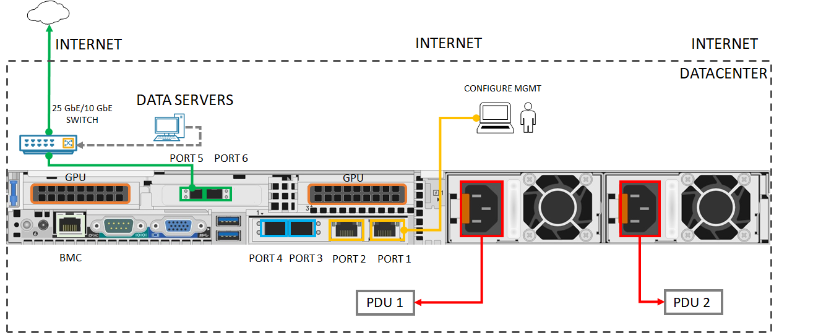

# Quickstart: Get started with Azure Stack Edge Pro with GPU 

This quickstart details the prerequisites and the steps required to deploy your Azure Stack Edge Pro GPU device. The quickstart steps are performed in the Azure portal and on the local web UI of the device. 

The total procedure should approximately take 1.5 hours to complete. For detailed step-by-step instructions, go to [Tutorial: Prepare to deploy Azure Stack Edge Pro GPU](azure-stack-edge-gpu-deploy-prep.md#deployment-configuration-checklist). 

## Prerequisites

Before you deploy, make sure that following prerequisites are in place:

1. The Azure Stack Edge Pro GPU device is delivered to your site, [unpacked](azure-stack-edge-gpu-deploy-install.md#unpack-the-device) and [rack mounted](azure-stack-edge-gpu-deploy-install.md#rack-the-device). 
1. Configure your network such that your device can reach the [listed URL patterns and ports](azure-stack-edge-gpu-system-requirements.md#networking-port-requirements). 
1. You have owner or contributor access to Azure subscription.
1. In the Azure portal, go to **Home > Subscriptions > Your-subscription > Resource providers**. Search for `Microsoft.DataBoxEdge` and register the resource provider. Repeat to register `Microsoft.Devices` if you'll create an IoT Hub resource to deploy compute workloads.
1. Make sure you have a minimum of 2 free, static, contiguous IPs for Kubernetes nodes and at least 1 static IP for IoT Edge service. For each module or external service, you deploy, you will need 1 additional IP.
1. See the [deployment checklist](azure-stack-edge-gpu-deploy-checklist.md) to get everything you'll need for device configuration. 

## Deployment steps

1. **Install**: Connect PORT 1 to a client computer via a crossover cable or USB Ethernet adapter. Connect at least one other device port for data, preferably 25 GbE, (from PORT 3 to PORT 6) to Internet via SFP+ copper cables or use PORT 2 with RJ45 patch cable. Connect the provided power cords to the Power Supply Units and to separate power distribution outlets. Press the power button on the front panel to turn on the device.  

    See [Cavium FastlinQ 41000 Series Interoperability Matrix](https://www.marvell.com/documents/xalflardzafh32cfvi0z/) and [Mellanox dual port 25G ConnectX-4 channel network adapter compatible products](https://docs.mellanox.com/display/ConnectX4LxFirmwarev14271016/Firmware+Compatible+Products) to get compatible network cables and switches.

    Here is the minimum cabling configuration needed to deploy your device:
    

2. **Connect**: Configure the IPv4 settings on the Ethernet adapter on your computer with a static IP address of **192.168.100.5** and subnet **255.255.255.0**. Open your browser and connect to the local web UI of device at https://192.168.100.10. This may take a few minutes. Continue to the webpage when you see the security certificate warning.

3. **Sign in**: Sign into the device with default password *Password1*. Change the device administrator password. The password must contain between 8 to 16 characters, and 3 of the uppercase, lowercase, numeric, and special characters.

4. **Configure network**: Accept the default DHCP configuration for connected data port if you have a DHCP server in your network. If not, provide an IP, DNS server, and default gateway. See more information on [Network settings](azure-stack-edge-gpu-deploy-configure-network-compute-web-proxy.md#configure-network).

5. **Configure compute network**: Create a virtual switch by enabling a port on your device. Enter 2 free, contiguous static IPs for Kubernetes nodes in the same network that you created the switch. Provide at least 1 static IP for IoT Edge Hub service to access compute modules and 1 static IP for each extra service or container that you want to access from outside the Kubernetes cluster. 

    Kubernetes is required to deploy all containerized workloads. See more information on [Compute network settings](azure-stack-edge-gpu-deploy-configure-network-compute-web-proxy.md#enable-compute-network).

6. **Configure web proxy**: If you use web proxy in your environment, enter web proxy server IP in `http://<web-proxy-server-FQDN>:<port-id>`. Set authentication to **None**. See more information on [Web proxy settings](azure-stack-edge-gpu-deploy-configure-network-compute-web-proxy.md#configure-web-proxy).

7. **Configure device**: Enter a device name and DNS domain or accept defaults. 

8. **Configure Update server**: Accept the default Microsoft Update server or specify a Windows Server Update Services (WSUS) server and the path to the server. 

9. **Configure time settings**: Accept the default time settings or set time zone, primary NTP server, and secondary NTP server on local network or as public servers.

10. **Configure certificates**: If you changed device name and/or DNS domain, then you must generate certificates or add certificates to activate the device. 

    - To test non-production workloads, use [Generate certificates option](azure-stack-edge-gpu-deploy-configure-certificates.md#generate-device-certificates). 
    - If you bring your own certificates including the signing chain(s), [Add certificates](azure-stack-edge-gpu-deploy-configure-certificates.md#bring-your-own-certificates) in appropriate format. Make sure to upload the signing chain first. See [Create certificates](azure-stack-edge-gpu-create-certificates-tool.md) and [Upload certificates via the local UI](azure-stack-edge-gpu-deploy-configure-certificates.md#bring-your-own-certificates).

11. **Activate**: To get the activation key 

    1. In the Azure portal, go to your **Azure Stack Edge resource > Overview > Device setup > Activate > Generate key**. Copy the key. 
    1. In the local web UI, go to **Get started > Activate** and provide the activation key. When the key is applied, the device takes a few minutes for activation. Download the `<device-serial-number>`.json file when prompted to safely store device keys needed for a future recovery. 

12. **Configure compute**: In the Azure portal, go to **Overview > Device**. Verify that the device is **Online**. In the left-pane, go to **Edge compute > Get started > Configure Edge compute > Compute**. Provide an existing or new IoT Hub service and wait for about 20 minutes for the compute to configure. See more information on [Tutorial: Configure compute on Azure Stack Edge Pro GPU device](azure-stack-edge-gpu-deploy-configure-compute.md)

You are ready to deploy compute workloads on your device [via IoT Edge](azure-stack-edge-gpu-deploy-sample-module-marketplace.md), [via `kubectl`],(azure-stack-edge-gpu-create-kubernetes-cluster.md) or [via Azure Arc enabled Kubernetes](azure-stack-edge-gpu-deploy-arc-kubernetes-cluster.md)! If you experience any issues during the setup, see troubleshooting for <!-- WHY? - [ordering issues](azure-stack-edge-troubleshoot-ordering.md),--> [certificate issues](azure-stack-edge-gpu-certificate-troubleshooting.md)<!--,--> or [IoT Edge issues](azure-stack-edge-troubleshoot-iot-edge.md). 

## Next steps

[Install Azure Stack Edge Pro GPU](./azure-stack-edge-gpu-deploy-install.md)

