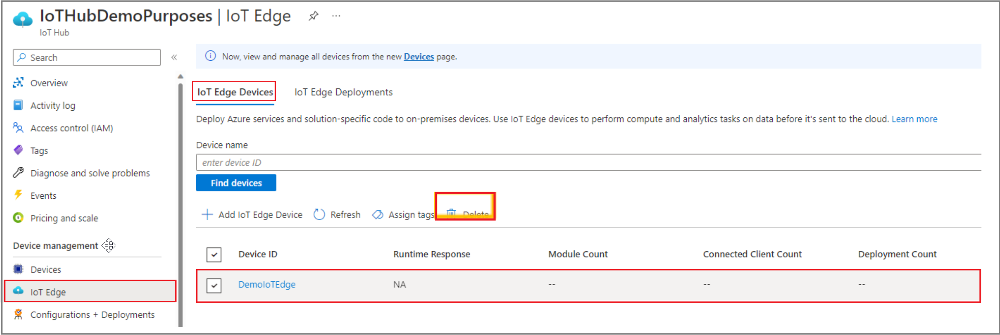

# Migrate Azure Stack Edge from managed to self-service IoT Edge Linux VM

[!INCLUDE [applies-to-GPU-and-pro-r-and-mini-r-skus](../../includes/azure-stack-edge-applies-to-gpu-pro-r-mini-r-sku.md)]

This article provides general guidance on how to move your native/managed IoT Edge workloads to the IoT Edge running on a Linux VM on Azure Stack Edge. 

> [!NOTE]
> We use an example in this article that uses an IoT Edge running on an Ubuntu VM on Azure Stack Edge. We recommend that you deploy the latest IoT Edge version in a Linux VM to run IoT Edge workloads on Azure Stack Edge.
 
> The native/managed IoT Edge on Azure Stack Edge uses an older version of IoT Edge runtime (IoT Edge version 1.1) that doesn’t have the latest features and updates. For more information, see [IoT Edge v1.1 EoL: What does that mean for me?](https://techcommunity.microsoft.com/t5/internet-of-things-blog/iot-edge-v1-1-eol-what-does-that-mean-for-me/ba-p/3662137). 

## IoT migration workflow

The high-level migration workflow is as follows:

1. From IoT Hub, create a new IoT Edge device to connect with a new IoT Edge device running on a VM. 

1. Deploy a Linux VM and install IoT Edge runtime on it. Connect the newly deployed IoT Edge runtime with the newly created IoT Edge device from the previous step.

1. From IoT Hub, re-deploy modules onto the new IoT Edge device. 

1. Once your solution is running on IoT Edge on a Linux VM, you can remove the modules running on the native/managed IoT Edge on Azure Stack Edge. From IoT Hub, delete the IoT Edge device to remove the modules running on Azure Stack Edge. 

1. Optional: If you are not using the Kubernetes cluster on Azure Stack Edge, you can delete the whole Kubernetes cluster.  

1. Optional: If you have leaf IoT devices communicating with IoT Edge on Kubernetes, this step documents how to make changes to communicate with the IoT Edge on a VM. 

## Prerequisites

[[Are there prerequisites..?? 
Else, remove this section.>>

## Step 1. Create an IoT Edge device on Linux using symmetric Keys

Create and provision an IoT Edge device on Linux using symmetric keys. For detailed steps, see [Create and provision an IoT Edge device on Linux using symmetric keys](../iot-edge/how-to-provision-single-device-linux-symmetric.md).

## Step 2. Install and provision an IoT Edge on a Linux VM

Follow the steps at [Deploy IoT Edge runtime](azure-stack-edge-gpu-deploy-iot-edge-linux-vm.md#deploy-iot-edge-runtime). To deploy other Linux VMs, see [Linux containers](../iot-edge/support.md). 

## Step 3. Deploy Azure IoT Edge modules from the Azure portal

Deploy Azure IoT modules modules to the new IoT Edge. For detailed steps, see [Deploy Azure IoT Edge modules from the Azure portal](../iot-edge/how-to-deploy-modules-portal.md). 

 With the latest IoT Edge version, you can deploy your IoT Edge modules at scale. For more information see [Deploy IoT Edge modules at scale using the Azure portal](../iot-edge/how-to-deploy-at-scale.md). 

## Step 4. Remove Azure IoT Edge modules

Once your modules are successfully running on the new IoT Edge instance running on VM, you can delete the whole IoT Edge device associated with that IoT Edge instance. From IoT Hub on the Azure portal, delete the IoT Edge device connected to the IoT Edge, as shown below.

## Step 5. Optional: Remove the IoT Edge service

If you are not using the Kubernetes cluster on Azure Stack Edge, use the following steps to [remove the IoT Edge service](azure-stack-edge-gpu-manage-compute.md#remove-iot-edge-service). This will remove modules running on the IoT Edge device, the IoT Edge runtime, and the Kubernetes cluster that hosts the IoT Edge runtime.

From the Azure Stack Edge resource on Azure portal, under the Azure IoT Edge service, there is a **Remove** button to remove the Kubernetes cluster. [[Screenshot of the UI here?]]

> [!IMPORTANT]
> Once the Kubernetes cluster is removed, there is no way to recover information from the Kubernetes cluster, IoT Edge-related or not.   

## Step 6. Optional: Configure an IoT Edge device as a transparent gateway

If your IoT Edge device on Azure Stack Edge was configured as a gateway for downstream IoT devices, you must configure the IoT Edge running on the Linux VM as a transparent gateway. For more information, see [Configure and IoT Edge device as a transparent gateway](../iot-edge/how-to-create-transparent-gateway.md).

For more information about configuring downstream IoT devices to reference a newly deployed IoT Edge running on a Linux VM, see [Connect a downstream device to an Azure IoT Edge gateway](../iot-edge/how-to-connect-downstream-device.md).

## Next steps

[Deploy VMs on your Azure Stack Edge Pro GPU device via the Azure portal](azure-stack-edge-gpu-deploy-virtual-machine-portal.md)
