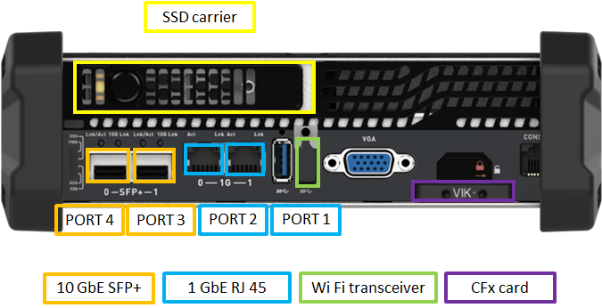
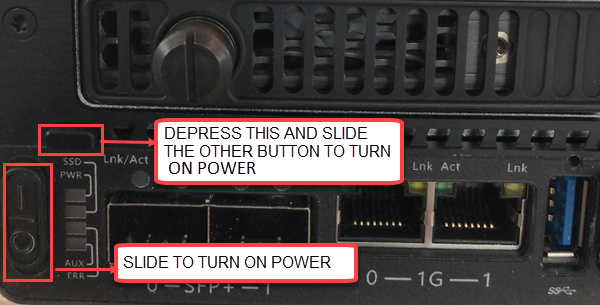
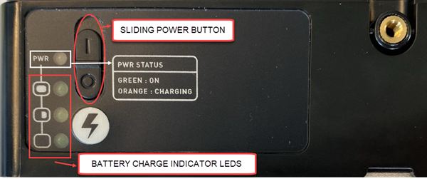
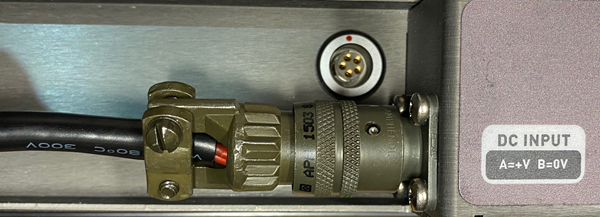
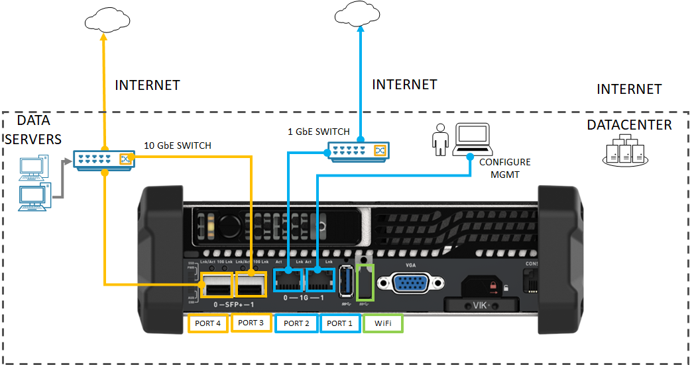

# Tutorial: Install Azure Stack Edge Mini R

This tutorial describes how to install an Azure Stack Edge Mini R physical device. The installation procedure involves cabling the device.

The installation can take around 30 minutes to complete.

In this tutorial, you learn how to:

> [!div class="checklist"]
> * Inspect the device
> * Cable the device

## Prerequisites

The prerequisites for installing a physical device as follows:

### For the Azure Stack Edge resource

Before you begin, make sure that:

* You've completed all the steps in [Prepare to deploy Azure Stack Edge Mini R](azure-stack-edge-mini-r-deploy-prep.md).
    * You've created an Azure Stack Edge resource to deploy your device.
    * You've generated the activation key to activate your device with the Azure Stack Edge resource.

 
### For the Azure Stack Edge Mini R physical device

Before you deploy a device:

- Make sure that the device rests safely on a flat, stable, and level work surface.
- Verify that the site where you intend to set up has:
    - Standard AC power from an independent source
        -OR-
    - A rack power distribution unit (PDU). 
    

### For the network in the datacenter

Before you begin:

- Review the networking requirements for deploying Azure Stack Edge Mini R, and configure the datacenter network per the requirements. For more information, see [Azure Stack Edge networking requirements](azure-stack-edge-mini-r-system-requirements.md#networking-port-requirements).

- Make sure that the minimum Internet bandwidth is 20 Mbps for the optimal functioning of the device. <!-- engg TBC -->

## Inspect the device

This device is shipped as a single unit. Complete the following steps to unpack your device.

1. Place the box on a flat, level surface.
2. Inspect the device case for any damage. Open the case and inspect the device. If the case or the device appears to be damaged, contact Microsoft Support to help you assess whether the device is in good working order.
3. After the case is opened, make sure that you have:
    - One portable Azure Stack Edge Mini R device with side bumpers attached
    - One battery and the back cover attached to the device. 
    - One power cord to connect the battery to power source 

If you didn't receive all of the items listed here, contact Azure Stack Edge support. The next step is to cable your device.

## Cable the device

The following procedures explain how to cable your Azure Stack Edge device for power and network.

Before you start cabling your device, you need the following:

- Your Azure Stack Edge Mini R physical device on the installation site.
- One power cable.
- At least one 1-GbE RJ-45 network cable to connect to the management interface. There are two 1-GbE network interfaces, one management and one data, on the device.
- One 10-GbE SFP+ cable for each data network interface to be configured. At least one data network interface from PORT 3 or PORT 4 needs to be connected to the Internet (with connectivity to Azure).

  Use of the highest-performing copper SFP+ (10 Gbps) transceiver is strongly recommended. Compatible fiber-optic transceivers can be used but have not been tested. For more information, see [Transceiver specifications](azure-stack-edge-mini-r-technical-specifications-compliance.md#transceiver) for Azure Stack Edge Mini R.
   
- Access to one power distribution unit (recommended).

> [!NOTE]
> - If you are connecting only one data network interface, we recommend that you use a 10-GbE network interface such as PORT 3 or PORT 4 to send data to Azure. 
> - For best performance and to handle large volumes of data, consider connecting all the data ports.
> - The Azure Stack Edge device should be connected to the datacenter network so that it can ingest data from data source servers. <!-- engg TBC -->

On your Azure Stack Edge device:

- The front panel has an SSD carrier. 

    - The device has 1 SSD disk in the slot. 
    - The device also has a CFx card that serves as storage for the operating system disk.
    
- The front panel has network interfaces and access to Wi-Fi.

    - 2 X 1 GbE RJ 45 network interfaces (PORT 1 and PORT 2 on the local UI of the device)
    - 2 X 10 GbE SFP+ network interfaces (PORT 3 and PORT 4 on the local UI of the device) 
    - One Wi-Fi port with a Wi-Fi transceiver attached to it.

- The front panel also has a power button. 

- The back panel includes a battery and a cover that are installed on the device. 

Take the following steps to cable your device for power and network.

1. Identify the various network and storage components on the front plane of your device.

    

2. Locate the power button on the  bottom-left corner of the front of the device. 

    

3. The battery is connected to the back plane of your device. Identify the second power button located on the battery. 

    

    Connect one end of the power cord to the battery and the other to the power outlet. 

     

    When running only on battery (battery is not connected to the source of power), both the power switch on the front and the switch on the battery should be toggled to ON position. When the battery is connected to a power source, only the power button on the front of the device should be toggled to ON position. 

4. Press the power button in the front plane to turn on the device. 
    
    > [!NOTE]
    > To turn on or turn off the power to the device, you have to depress the black button on top of the power button and then toggle the power button to ON or OFF position. 

5. If configuring Wi-Fi on this device, use the following cabling diagram:

      

    - Connect the 1-GbE network interface PORT 1 to the computer that's used to configure the physical device. PORT 1 is the dedicated management interface.

    If using a wired configuration for this device, use the following diagram:
     
         
    - Connect the 1-GbE network interface PORT 1 to the computer that's used to configure the physical device. PORT 1 is the dedicated management interface.
    - Connect one or more of PORT 2, PORT 3, or PORT 4 to the datacenter network/Internet.
    
        - If connecting PORT 2, use the RJ-45 network cable.
        - For the 10-GbE network interfaces, use the SFP+ copper cables.

## Next steps

In this tutorial, you learned about Azure Stack Edge topics such as how to:

> [!div class="checklist"]
> * Unpack the device
> * Cable the device

Advance to the next tutorial to learn how to connect, set up, and activate your device.

> [!div class="nextstepaction"]
> [Connect and set up Azure Stack Edge](./azure-stack-edge-mini-r-deploy-connect.md)
