# Tutorial: Configure network for Azure Stack Edge Pro 2

::: zone pivot="single-node"

This tutorial describes how to configure network for your Azure Stack Edge Pro 2 device by using the local web UI.

The connection process can take around 20 minutes to complete.

::: zone-end

::: zone pivot="two-node"

This tutorial describes how to configure network for your two-node Azure Stack Edge Pro 2 device by using the local web UI.

The procedure can take around 45 minutes to complete.

::: zone-end

In this tutorial, you learn about:

::: zone pivot="single-node"

> [!div class="checklist"]
> * Prerequisites
> * Configure network
> * Configure advanced networking
> * Configure web proxy

::: zone-end

::: zone pivot="two-node"

> [!div class="checklist"]
> * Prerequisites
> * Select device setup type
> * Configure network and network topology on both nodes
> * Get authentication token for prepared node
> * Configure cluster witness and add prepared node
> * Configure virtual IP settings for Azure Consistent Services and NFS
> * Configure advanced networking
> * Configure web proxy

::: zone-end

## Prerequisites

Before you configure and set up your Azure Stack Edge Pro 2 device, make sure that:

* You've installed the physical device as detailed in [Install Azure Stack Edge Pro 2](azure-stack-edge-pro-2-deploy-install.md).
* You've connected to the local web UI of the device as detailed in [Connect to Azure Stack Edge Pro 2](azure-stack-edge-pro-2-deploy-connect.md)

::: zone pivot="single-node"

## Configure network

Your **Get started** page displays the various settings that are required to configure and register the physical device with the Azure Stack Edge service. 

Follow these steps to configure the network for your device.

1. In the local web UI of your device, go to the **Get started** page. 

2. On the **Network** tile, select **Configure**.  
    
    

    On your physical device, there are four network interfaces. Port 1 and Port 2 are 1-Gbps network interfaces that can also serve as 10-Gbps network interfaces. Port 3 and Port 4 are 100-Gbps network interfaces. Port 1 is used for the intial configuration of the device. For a new device, the **Network** page is as shown below.
    
    

3. To change the network settings, select a port and in the right pane that appears, modify the IP address, subnet, gateway, primary DNS, and secondary DNS. 

    - If you select Port 1, you can see that it's preconfigured as static. 

        

    - If you select Port 2, Port 3, or Port 4, all of these ports are configured as DHCP by default.

        

    As you configure the network settings, keep in mind:

    * Port 3 and Port 4 are reserved for Network Function Manager workload deployments. For more information, see [Tutorial: Deploy network functions on Azure Stack Edge](../network-function-manager/deploy-functions.md).
    * If DHCP is enabled in your environment, network interfaces are automatically configured. An IP address, subnet, gateway, and DNS are automatically assigned.
    * If DHCP isn't enabled, you can assign static IPs if needed.
    * Serial number for any port corresponds to the node serial number.

    Once the device network is configured, the page updates as shown below.

    

     > [!NOTE]
     > We recommend that you do not switch the local IP address of the network interface from static to DCHP, unless you have another IP address to connect to the device. If using one network interface and you switch to DHCP, there would be no way to determine the DHCP address. If you want to change to a DHCP address, wait until after the device has activated with the service, and then change. You can then view the IPs of all the adapters in the **Device properties** in the Azure portal for your service.

    After you’ve configured and applied the network settings, select **Next: Advanced networking** to configure compute network.

## Configure advanced networking

Follow these steps to configure advanced network settings such as creating a switch for compute and associating it with a virtual network. 

> [!NOTE]
> There is no restriction on the number of virtual switches that you can create on your device. However, you can enable compute only on one virtual switch at a time. 

1. In the local web UI of your device, go to the **Advanced networking** page. Select **Add virtual switch** to create a new virtual switch or use an existing virtual switch. This virtual switch will be used for the compute infrastructure on the device. 

    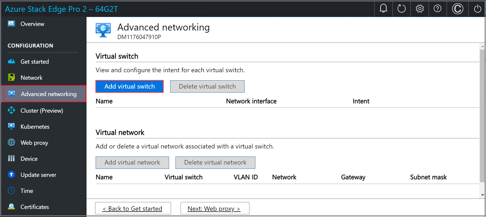

1. In **Add virtual switch** blade:

    1. Provide a name for your virtual switch.
    1. Associate a network interface on your device with the virtual switch you'll create. You can only have one virtual switch associated with a network interface on your device.
    1. Assign an intent for your virtual switch. To deploy compute workloads, you'll select compute as the intent.    
    1. Assign **Kubernetes node IPs**. These static IP addresses are for the compute VM that will be created on this virtual switch.  

        For an *n*-node device, a contiguous range of a minimum of *n+1* IPv4 addresses (or more) are provided for the compute VM using the start and end IP addresses. For a 1-node device, provide a minimum of 2 contiguous IPv4 addresses.
    
        > [!IMPORTANT]
        > Kubernetes on Azure Stack Edge uses 172.27.0.0/16 subnet for pod and 172.28.0.0/16 subnet for service. Make sure that these are not in use in your network. If these subnets are already in use in your network, you can change these subnets by running the `Set-HcsKubeClusterNetworkInfo` cmdlet from the PowerShell interface of the device. For more information, see [Change Kubernetes pod and service subnets](azure-stack-edge-gpu-connect-powershell-interface.md#change-kubernetes-pod-and-service-subnets).

    1. Assign **Kubernetes external service IPs**. These are also the load-balancing IP addresses. These contiguous IP addresses are for services that you want to expose outside of the Kubernetes cluster and you specify the static IP range depending on the number of services exposed. 
    
        > [!IMPORTANT]
        > We strongly recommend that you specify a minimum of 1 IP address for Azure Stack Edge Hub service to access compute modules. You can then optionally specify additional IP addresses for other services/IoT Edge modules (1 per service/module) that need to be accessed from outside the cluster. The service IP addresses can be updated later. 
    
    1. Select **Apply**.

    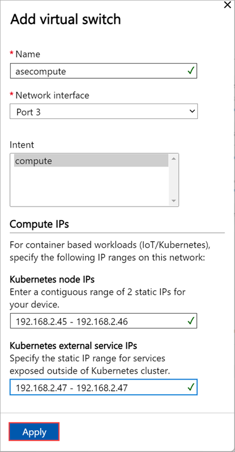

1. You'll see a warning to the effect that you may need to wait for a couple minutes and then refresh the browser. Select **OK**.

    

1. After the configuration is applied and you've refreshed the browser, you can see that the specified port is enabled for compute. 
 
    

1. Optionally you can create a virtual network and associate it with your virtual switch if you wish to route your traffic. Select **Add virtual network** and then input the following information.

    1. Select a **Virtual switch** to which you'll add a virtual network.
    1. Provide a **Name** for the virtual network.
    1. Supply a unique number from 1-4096 as your **VLAN ID**.
    1. Enter a **Subnet mask** and a **Gateway** depending on the configuration of your physical network in the environment.
    1. Select **Apply**.

    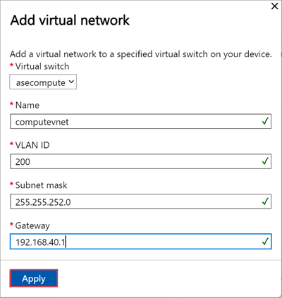
    
1. After the configuration is applied, you can see that the specified virtual network is created.

    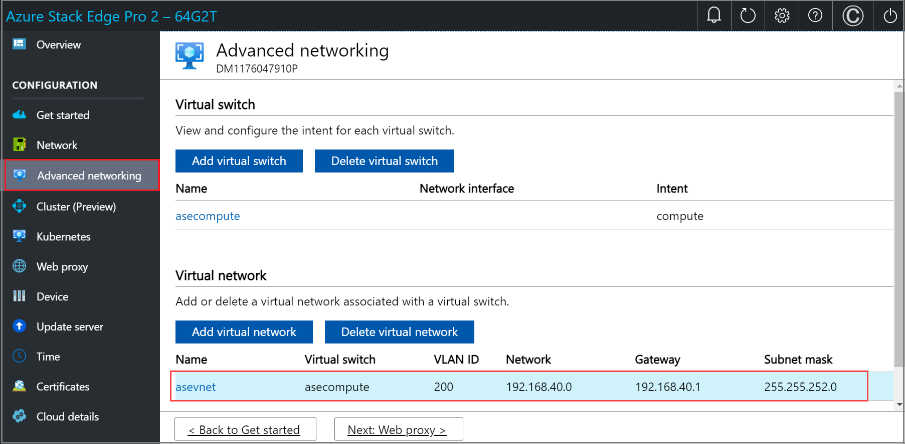

    Select **Next: Web proxy** to configure web proxy.  

::: zone-end

::: zone pivot="two-node"

## Configure setup type

1. In the local UI for one of the devices, go to the **Get started** page.
1. In the **Set up a 2-node cluster** tile, select **Start**.

    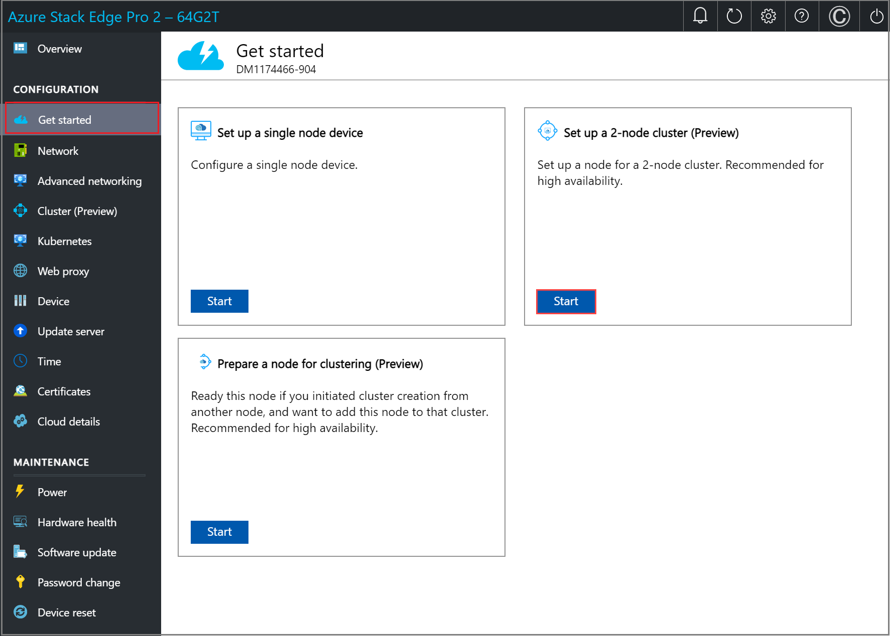 

1. In the local UI for the second device, go to the **Get started** page.
1. In the **Prepare a node** tile, select **Start**.

    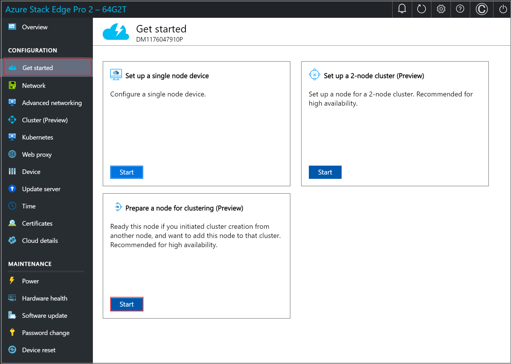 

## Configure network, topology

You'll configure network and network topology on both the nodes. These steps can be done in parallel. The cabling on both nodes should be identical and should conform with the network topology you choose.

### Configure network on first node

Follow these steps to configure the network for your device.

1. In the local web UI of your device, go to the **Get started** page. 

2. On the **Network** tile, select **Configure**.  
    
    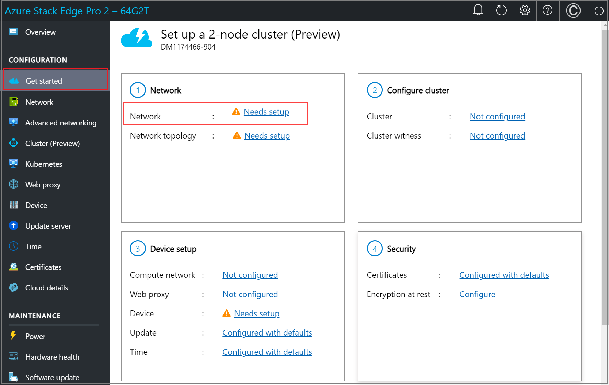

    On your physical device, there are four network interfaces. Port 1 and Port 2 are 1-Gbps network interfaces that can also serve as 10-Gbps network interfaces. Port 3 and Port 4 are 100-Gbps network interfaces. Port 1 is automatically configured as a management-only port, and Port 2 to Port 4 are all data ports.  Though Port 6 shows up in the local UI as the Wi-Fi port, the Wi-Fi functionality isn't available in this release.

    For a new device, the **Network** page is as shown below.
    
    

3. To change the network settings, select a port and in the right pane that appears, modify the IP address, subnet, gateway, primary DNS, and secondary DNS. 

    - If you select Port 1, you can see that it's preconfigured as static. 

        

    - If you select Port 2, Port 3, or Port 4, all of these ports are configured as DHCP by default.

        

    As you configure the network settings, keep in mind:

    * Make sure that Port 3 and Port 4 are connected for Network Function Manager deployments. For more information, see [Tutorial: Deploy network functions on Azure Stack Edge](../network-function-manager/deploy-functions.md).
    * If DHCP is enabled in your environment, network interfaces are automatically configured. An IP address, subnet, gateway, and DNS are automatically assigned.
    * If DHCP isn't enabled, you can assign static IPs if needed.
    * You can configure your network interface as IPv4.
    * <!--ENGG TO VERIFY --> Network Interface Card (NIC) Teaming or link aggregation isn’t supported with Azure Stack Edge. 
    * <!--ENGG TO VERIFY --> In this release, the 100-GbE interfaces aren't configured for RDMA mode.
    * Serial number for any port corresponds to the node serial number.
    * Though Port 6 shows up in the local UI as the Wi-Fi port, the Wi-Fi functionality isn't available in this release.

    Once the device network is configured, the page updates as shown below.

    

     > [!NOTE]
     > We recommend that you do not switch the local IP address of the network interface from static to DCHP, unless you have another IP address to connect to the device. If using one network interface and you switch to DHCP, there would be no way to determine the DHCP address. If you want to change to a DHCP address, wait until after the device has activated with the service, and then change. You can then view the IPs of all the adapters in the **Device properties** in the Azure portal for your service.
    

### Reconfigure Port 1 on first node

Based on the network topology you will, choose, you would need to route Port 1 to the internet via a switch and assign it IPs.

Follow these steps to reconfigure Port 1:

1. Disconnect Port 1 from the laptop by removing the connecting cable.
1. Connect to the local web UI via the IP address of the Port 2 at the following URL:

    `https://<IP address of Port 2>`

1. Sign in to the local web UI by providing the device password.
1. Connect the Port 1 via an appropriate cable. Use one of the following options corresponding to the supported network topologies.

    - **Switchless**

        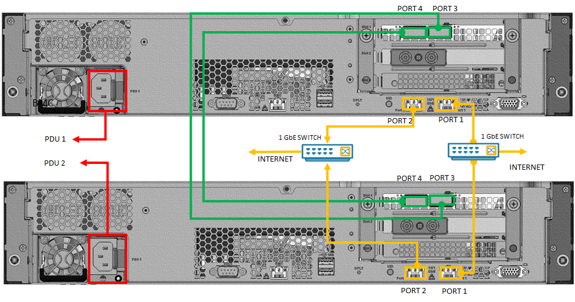

    - **Using external switches**

        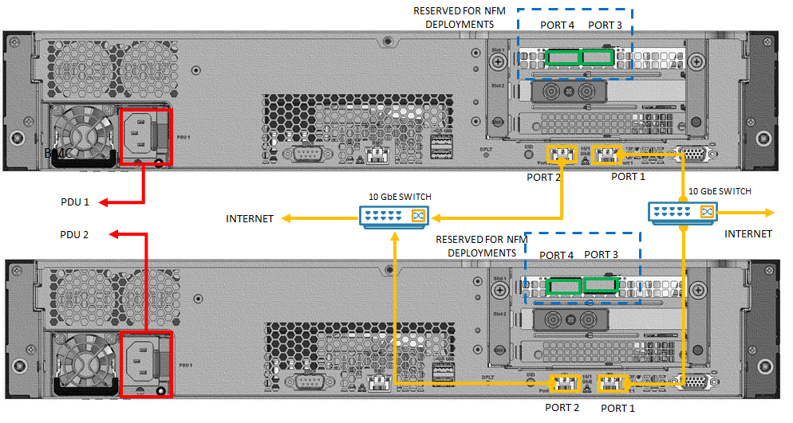
  
 
1. Go to the **Network** page for the first node.
1. Configure IPs for Port 1. Depending on the network topology that you wish to deploy:
    1. Assign Port 1 IPs that are in a different subnet as that of Port 2.
    1. Assign Port 1 IPs that are in the same subnet as that of Port 2. 

1. After Port 1 is configured, select **Next: Advanced networking >** to configure your network topology.

### Configure network topology on first node

1. In the **Advanced networking** page, choose the topology for cluster and the storage traffic between nodes from the following options: 

    - **Use external switches, Port 1 and Port 2 in the same subnet**
    - **Use external switches, Port 1 and Port 2 in different subnet**
    - **Switchless, Port 1 and Port 2 in the same subnet**
    - **Switchless, Port 1 and Port 2 in different subnet**

    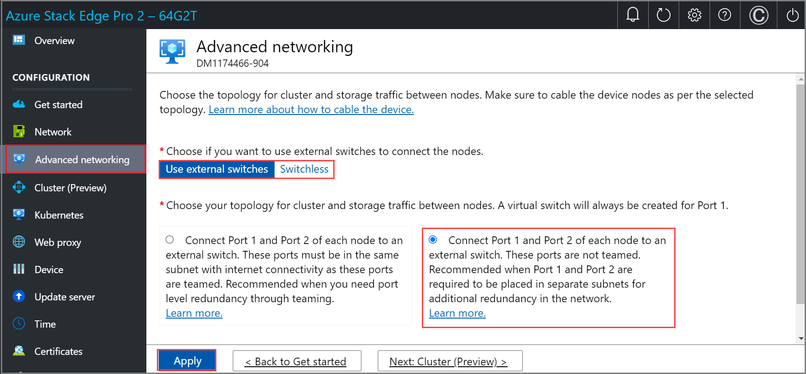

1. Make sure that your node is cabled as per the selected topology.
1. Select **Apply**.
1. You'll see a **Confirm network setting** dialog. This dialog reminds you to make sure that your node is cabled as per the network topology you selected. Once you choose the network cluster topology, you can't change this topology without a device reset. Select **Yes** to confirm the network topology. 

    

    The network topology setting takes a few minutes to apply and you see a notification when the settings are successfully applied.

1. Once the network topology is applied, the **Network** page updates. For example, if you selected network topology that uses external switches and separate virtual switches, you'll see that on the device node, a virtual switch **vSwitch1** is created at Port 1 and another virtual switch, **vSwitch2** is created on Port 2. Port 3 and Port 4 don't have any virtual switches.

    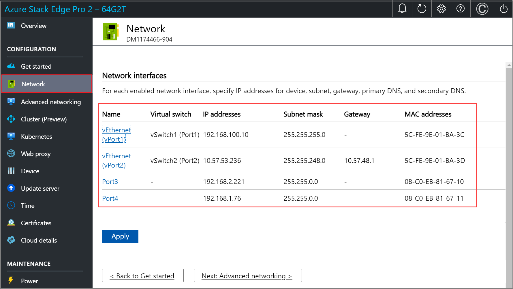

You'll now configure the network and the network topology of the second node. 

### Configure network on second node

You'll now prepare the second node for clustering. You'll first need to configure the network. Follow these steps in the local UI of the second node:

1. On the **Prepare a node for clustering** page, in the **Network** tile, select **Needs setup**.

    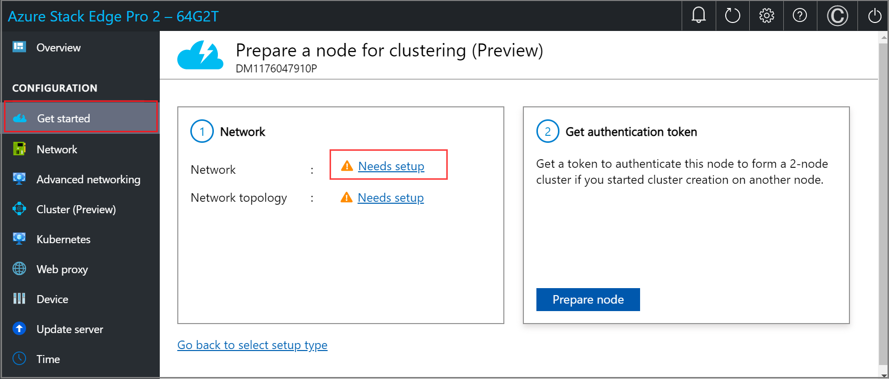

1. Configure the network on the second node in a similar way that you configured the first node.

### Reconfigure Port 1 on second node

Follow the steps to reconfigure Port 1 on second node as you did on the first node:

1. Disconnect the cable on Port 1. Sign in to the local web UI using Port 2 IP address. 
1. Connect Port 1 via an appropriate cable and a switch on the second node. 
1. Assign IPs to the Port 1 on the second node in the same way as that you did on the first node.
1. After Port 1 on the second node is configured, select **Next: Advanced networking >**.

### Configure network topology on second node

1. Make sure that the second node is cabled as per the topology you selected for the first node. In the **Advanced networking** page, choose and **Apply** the same topology that you selected for the first node.

    

1. Select **Back to get started**.

## Get authentication token

You'll now get the authentication token that will be needed when adding this node to form a cluster. Follow these steps in the local UI of the second node:

1. On the **Prepare a node for clustering** page, in the **Get authentication token** tile, select **Prepare node**.

    

1. Select **Get token**.
1. Copy the node serial number and the authentication token. You'll use this information when you add this node to the cluster on the first node.

    

## Configure cluster 

To configure the cluster, you'll need to establish a cluster witness and then add a prepared node. You'll also need to configure virtual IP settings so that you can connect to a cluster as opposed to a specific node.

### Configure cluster witness

You'll now create a cluster witness. A cluster witness helps establish quorum for a two-node device if a node goes down. To learn about quorum, see [Understanding quorum](/windows-server/failover-clustering/manage-cluster-quorum#understanding-quorum). 

A cluster witness can be: 

- **Cloud witness** if you use an Azure Storage account to provide a vote on cluster quorum. A cloud witness uses Azure Blob Storage to read or write a blob file and then uses it to arbitrate in split-brain resolution. 

    Use cloud witness when you have internet access. For more information on cloud witness, see [Deploy a cloud witness for Failover cluster](/windows-server/failover-clustering/deploy-cloud-witness).

- **File share witness** if you use a local SMB file share to provide a vote in the cluster quorum. Use a file share witness if all the servers in a cluster have spotty internet connectivity or can't use disk witness as there aren't any shared drives. 

    Use file share witness if you're in an IT environment with other machines and file shares. For more information on file share witness, see [Deploy a file share witness for Failover cluster](/windows-server/failover-clustering/file-share-witness).

Before you create a cluster witness, make sure that you've reviewed the cluster witness requirements.

Follow these steps to configure the cluster witness.

#### Configure cloud witness

1. In the local UI of the first node, go to the **Cluster (Preview)** page. Under **Cluster witness type**, select **Modify**.

    

1. In the **Modify cluster witness** blade, enter the following inputs.
    1. Choose the **Witness type** as **Cloud.**
    1. Enter the **Azure Storage account name**.
    1. Specify Storage account authentication from Access key or SAS token.
    1. If you chose Access key as the authentication mechanism, enter the Access key of the Storage account, Azure Storage container where the witness lives, and the service endpoint. 
    1. Select **Apply**.

    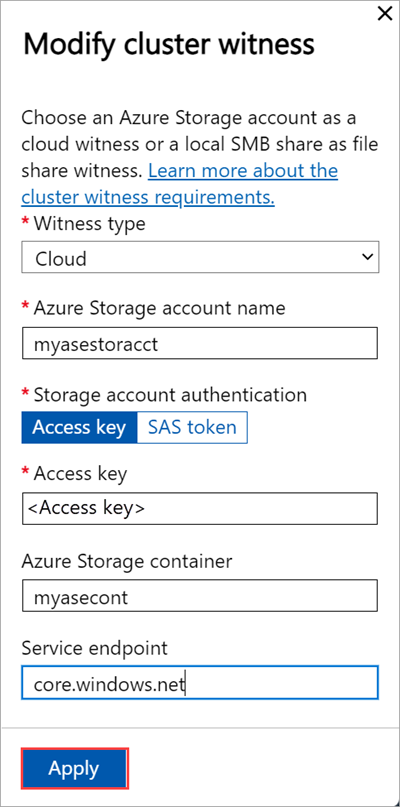

#### Configure local witness

1. In the local UI of the first node, go to the **Cluster** page. Under **Cluster witness type**, select **Modify**.

    

1. In the **Modify cluster witness** blade, enter the following inputs.
    1. Choose the **Witness type** as **Local.**
    1. Enter the file share path as *//server/fileshare* format.
    1. Select **Apply**. 

    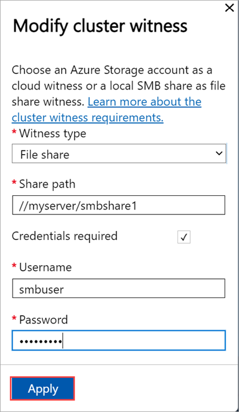

### Add prepared node to cluster

You'll now add the prepared node to the first node and form the cluster. Before you add the prepared node, make sure the networking on the incoming node is configured in the same way as that of this node where you initiated cluster creation.

1. In the local UI of the first node, go to the **Cluster** page. Under **Existing nodes**, select **Add node**.

    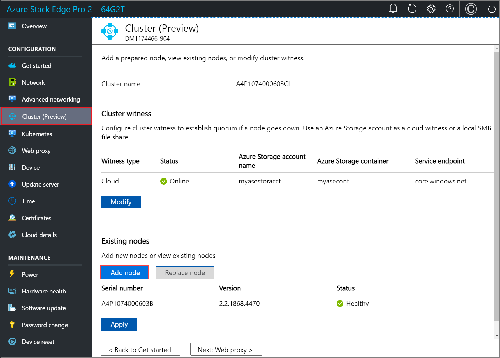

1. In the **Add node** blade, input the following information for the incoming node: 

    1. Provide the serial number for the incoming node.
    1. Enter the authentication token for the incoming node.

1. Select **Validate & add**. This step takes a few minutes. 

    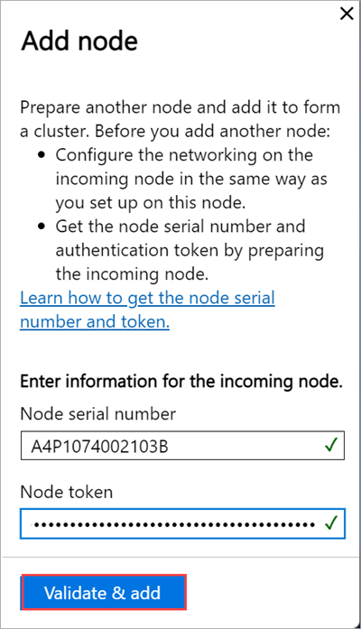

    You see a notification when the node is successfully validated.

1. The node is now ready to join the cluster. Select **Apply**. 

    

1. A dialog pops us indicating that the cluster creation could take several minutes. Press **OK** to continue. Once the cluster is created, the page updates to show both the nodes are added.

## Configure virtual IPs

For Azure consistent services and NFS, you'll also need to define a virtual IP that allows you to connect to a clustered device as opposed to a specific node. A virtual IP is an available IP in the cluster network and any client connecting to the cluster network on the two-node device should be able to access this IP.

### For Azure Consistent Services

For Azure Consistent Services, follow these steps to configure virtual IP.

1. In the local UI on the **Cluster** page, under the **Virtual IP settings** section, select **Azure Consistent Services**. 

    <!---->

1. In the **Virtual IP settings** blade, input the following.

    1. From the dropdown list, select the **Azure Consistent Services network**. 
    1. Choose IP settings from **DHCP** or **static**.
    1. If you chose IP settings as static, enter a virtual IP. This should be a free IP from within the Azure Consistent Services network that you specified. If you selected DHCP, a virtual IP is automatically picked from the Azure Consistent Services network that you selected.
1. Select **Apply**.

    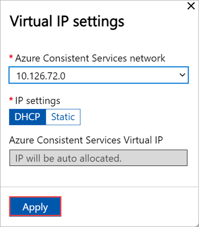

### For Network File System

For clients connecting via NFS protocol to the two-node device, follow these steps to configure virtual IP.

1. In the local UI on the **Cluster** page, under the **Virtual IP settings** section, select **Network File System**.

    <!---->

1. In the **Virtual IP settings** blade, input the following.

    1. From the dropdown list, select the **NFS network**.
    1. Choose IP settings from **DHCP** or **Static**.
    1. If you chose IP settings as static, enter a virtual IP. This should be a free IP from within the NFS network that you specified. If you selected DHCP, a virtual IP is automatically picked from the NFS network that you selected.
1. Select **Apply**.

    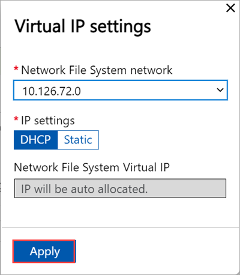

> [!NOTE]
> Virtual IP settings are required. If you do not configure this IP, you will be blocked when configuring the **Device settings** in the next step.

### Configure virtual switches and compute IPs

After the cluster is formed and configured, you'll now create new virtual switches or assign intent to the existing virtual switches that are created based on the selected network topology.

> [!IMPORTANT]
> On a two-node cluster, compute should only be configured on a virtual switch. 

1. In the  local UI, go to **Advanced networking** page. 
1. In the **Virtual switch** section, you'll assign compute intent to a virtual switch. You can select an existing virtual switch or select **Add virtual switch** to create a new switch. 

    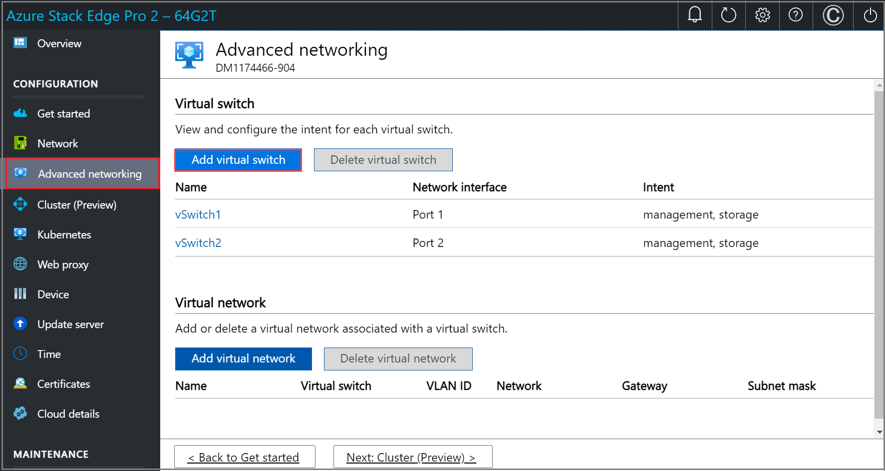

1. In the **Network settings** blade, if using a new switch, provide the following: 

    1. Provide a name for your virtual switch.
    1. Choose the network interface on which the virtual switch should be created. 
    1. If deploying 5G workloads, set **Supports accelerated networking** to **Yes**.
    1. Select the intent to associate with this network interface as **compute**. Alternatively, the switch can be used for management traffic as well. You can't configure storage intent as storage traffic was already configured based on the network topology that you selected earlier. 
    
    > [!TIP] 
    > Use *CTRL + Click* to select more than one intent for your virtual switch.
 
1. Assign **Kubernetes node IPs**. These static IP addresses are for the Kubernetes VMs.  

    For an *n*-node device, a contiguous range of a minimum of *n+1* IPv4 addresses (or more) are provided for the compute VM using the start and end IP addresses. For a 1-node device, provide a minimum of 2 contiguous IPv4 addresses. For a two-node cluster, provide a minimum of 3 contiguous IPv4 addresses.
    
    > [!IMPORTANT]
    > - Kubernetes on Azure Stack Edge uses 172.27.0.0/16 subnet for pod and 172.28.0.0/16 subnet for service. Make sure that these are not in use in your network. If these subnets are already in use in your network, you can change these subnets by running the `Set-HcsKubeClusterNetworkInfo` cmdlet from the PowerShell interface of the device. For more information, see [Change Kubernetes pod and service subnets](azure-stack-edge-gpu-connect-powershell-interface.md#change-kubernetes-pod-and-service-subnets).
    > - DHCP mode is not supported for Kubernetes node IPs. If you plan to deploy IoT Edge/Kubernetes, you must assign static Kubernetes IPs and then enable IoT role. This will ensure that static IPs are assigned to Kubernetes node VMs. 

1. Assign **Kubernetes external service IPs**. These are also the load-balancing IP addresses. These contiguous IP addresses are for services that you want to expose outside of the Kubernetes cluster and you specify the static IP range depending on the number of services exposed. 
    
    > [!IMPORTANT]
    > We strongly recommend that you specify a minimum of 1 IP address for Azure Stack Edge Hub service to access compute modules. You can then optionally specify additional IP addresses for other services/IoT Edge modules (1 per service/module) that need to be accessed from outside the cluster. The service IP addresses can be updated later. 
    
1. Select **Apply**.

    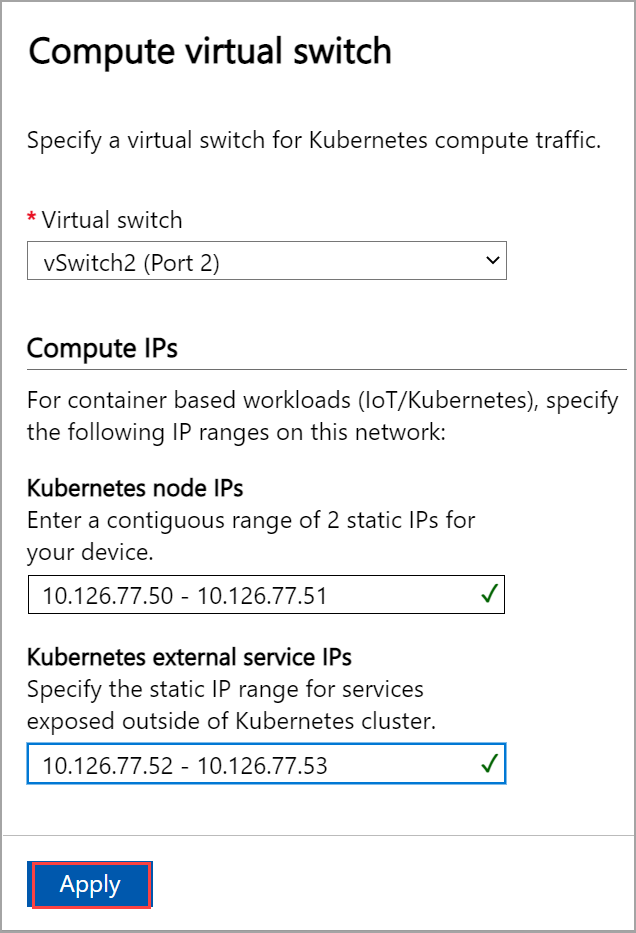

1. The configuration takes a couple minutes to apply and you may need to refresh the browser. You can see that the specified virtual switch is created and enabled for compute. 
 
    

To delete a virtual switch, under the **Virtual switch** section, select **Delete virtual switch**. When a virtual switch is deleted, the associated virtual networks will also be deleted.

> [!IMPORTANT]
> Only one virtual switch can be assigned for compute.

### Configure virtual network

You can add or delete virtual networks associated with your virtual switches. To add a virtual switch, follow these steps:

1. In the local UI on the **Advanced networking** page, under the **Virtual network** section, select **Add virtual network**.
1. In the **Add virtual network** blade, input the following information:

    1. Select a virtual switch for which you want to create a virtual network.
    1. Provide a **Name** for your virtual network.
    1. Enter a **VLAN ID** as a unique number in 1-4094 range.
    1. Specify the **Subnet mask** and **Gateway** for your virtual LAN network as per the physical network configuration.
    1. Select **Apply**.

To delete a virtual network, under the **Virtual network** section, select **Delete virtual network**. 

::: zone-end
  
## Configure web proxy

This is an optional configuration. However, if you use a web proxy, you can configure it only on this page.

> [!IMPORTANT]
> * Proxy-auto config (PAC) files are not supported. A PAC file defines how web browsers and other user agents can automatically choose the appropriate proxy server (access method) for fetching a given URL. 
> * Transparent proxies work well with Azure Stack Edge Pro 2. For non-transparent proxies that intercept and read all the traffic (via their own certificates installed on the proxy server), upload the public key of the proxy's certificate as the signing chain on your Azure Stack Edge Pro device. You can then configure the proxy server settings on your Azure Stack Edge device. For more information, see [Bring your own certificates and upload through the local UI](azure-stack-edge-gpu-deploy-configure-certificates.md#bring-your-own-certificates).  

1. On the **Web proxy settings** page, take the following steps:

   1. In the **Web proxy URL** box, enter the URL in this format: `http://host-IP address or FQDN:Port number`. HTTPS URLs aren’t supported.

   2. To validate and apply the configured web proxy settings, select **Apply**.

   

2. After the settings are applied, select **Next: Device**.

## Next steps

In this tutorial, you learned about:

> [!div class="checklist"]
> * Prerequisites
> * Configure network
> * Configure advanced networking
> * Configure web proxy

To learn how to set up your Azure Stack Edge Pro 2 device, see:

> [!div class="nextstepaction"]
> [Configure device settings](./azure-stack-edge-pro-2-deploy-set-up-device-update-time.md)
