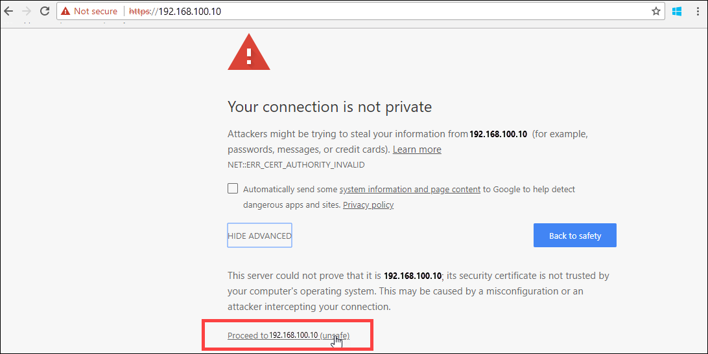
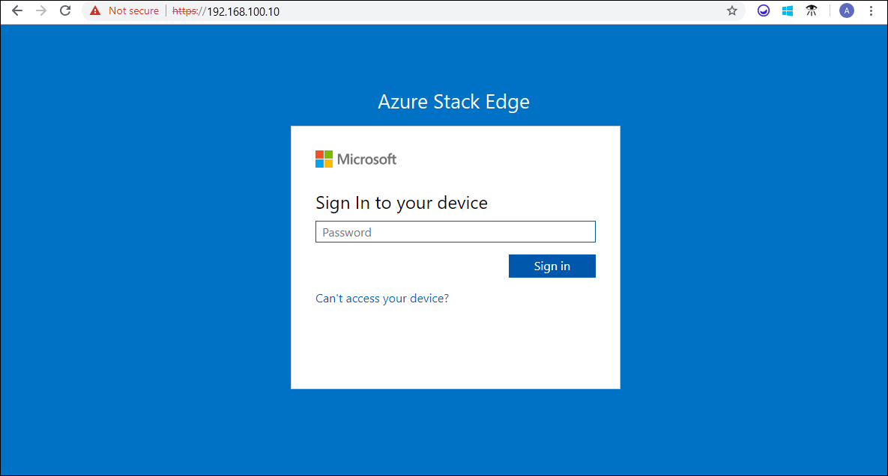

# Tutorial: Connect to Azure Stack Edge Pro 2

This tutorial describes how you can connect to your Azure Stack Edge Pro 2 device by using the local web UI.

The connection process can take around 5 minutes to complete.

In this tutorial, you learn about:

> [!div class="checklist"]
>
> * Prerequisites
> * Connect to a physical device

## Prerequisites

Before you configure and set up your Azure Stack Edge Pro device with GPU, make sure that:

* You've installed the physical device as detailed in [Install Azure Stack Edge Pro](azure-stack-edge-gpu-deploy-install.md).

## Connect to the local web UI setup

1. Configure the Ethernet adapter on your computer to connect to the Azure Stack Edge Pro device with a static IP address of 192.168.100.5 and subnet 255.255.255.0.

2. Connect the computer to PORT 1 on your device. If connecting the computer to the device directly (without a switch), use a crossover cable or a USB Ethernet adapter. Use the following illustration to identify PORT 1 on your device.

    

    The backplane of the device may look slightly different depending on the exact model you’ve received. For more information, see [Cable your device](azure-stack-edge-gpu-deploy-install.md#cable-the-device).

3. Open a browser window and access the local web UI of the device at `https://192.168.100.10`.  
    This action may take a few minutes after you've turned on the device.

    You see an error or a warning indicating that there’s a problem with the website's security certificate. 
   
    

4. Select **Continue to this webpage**.  
    These steps might vary depending on the browser you're using.

5. Sign in to the web UI of your device. The default password is *Password1*. 
   
    

6. At the prompt, change the device administrator password.  
    The new password must contain between 8 and 16 characters. It must contain three of the following characters: uppercase, lowercase, numeric, and special characters.

You're now at the **Overview** page of your device. The next step is to configure the network settings for your device.

## Next steps

In this tutorial, you learned about:

> [!div class="checklist"]
> * Prerequisites
> * Connect to a physical device

To learn how to configure network settings on your Azure Stack Edge Pro device, see:

> [!div class="nextstepaction"]
> [Configure network](./azure-stack-edge-gpu-deploy-configure-network-compute-web-proxy.md)
