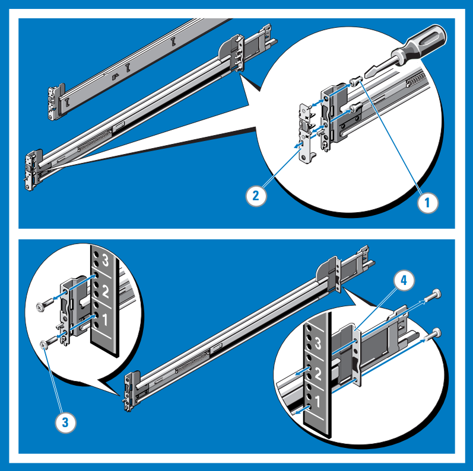
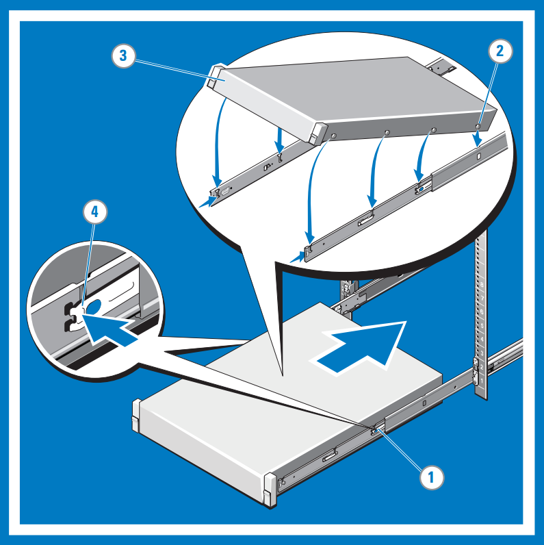
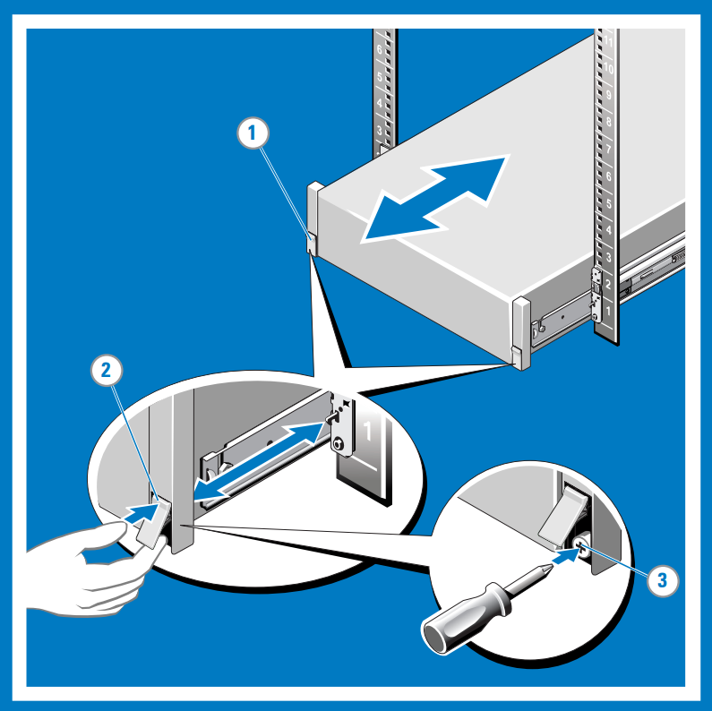
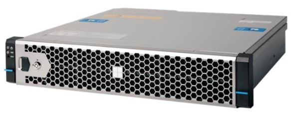

# Tutorial: Install Azure Stack Edge Pro 2

This tutorial describes how to install an Azure Stack Edge Pro 2 physical device. The installation procedure involves unpacking, rack mounting, and cabling the device. 

The installation can take around two hours to complete.

In this tutorial, you learn how to:

> [!div class="checklist"]
> * Unpack the device
> * Rack mount the device
> * Cable the device

## Prerequisites

The prerequisites for installing a physical device as follows:

### For the Azure Stack Edge resource

Before you begin, make sure that:

* You've completed all the steps in [Prepare to deploy Azure Stack Edge Pro 2](azure-stack-edge-pro-2-deploy-prep.md).
    * You've created an Azure Stack Edge resource to deploy your device.
    * You've generated the activation key to activate your device with the Azure Stack Edge resource.

 
### For the Azure Stack Edge Pro 2 physical device

Before you deploy a device:

- Make sure that the device rests safely on a flat, stable, and level work surface.
- Verify that the site where you intend to set up has:
    - Standard AC power from an independent source.

        -OR-
    - A rack power distribution unit (PDU) with an uninterruptible power supply (UPS).
    - An available 1U slot on the rack on which you intend to mount the device.

### For the network in the datacenter

Before you begin:

- Review the networking requirements for deploying Azure Stack Edge Pro, and configure the datacenter network per the requirements. For more information, see [Azure Stack Edge Pro 2 networking requirements](azure-stack-edge-system-requirements.md#networking-port-requirements).

- Make sure that the minimum Internet bandwidth is 20 Mbps for optimal functioning of the device.

## Unpack the device

This device is shipped in a single box. Complete the following steps to unpack your device. 

1. Place the box on a flat, level surface.
2. Inspect the box and the packaging foam for crushes, cuts, water damage, or any other obvious damage. If the box or packaging is severely damaged, don't open it. Contact Microsoft Support to help you assess whether the device is in good working order.
3. Unpack the box. After unpacking the box, make sure that you have:
    - One single enclosure Azure Stack Edge Pro 2 device
    - One power cord
    - One packaged bezel
    - One packaged 4-post rack  slide rail
    - A Safety, Environmental, and Regulatory Information booklet

If you didn't receive all of the items listed here, [Contact Microsoft Support](azure-stack-edge-contact-microsoft-support.md). The next step is to rack mount your device.

## Rack the device

The device must be installed on a standard 19-inch rack. Use the following procedure to rack mount your device on a standard 19-inch rack.

> [!IMPORTANT]
> Azure Stack Edge Pro 2 devices must be rack-mounted for proper operation.

### Prerequisites

- Before you begin, read the safety instructions in your Safety, Environmental, and Regulatory Information booklet. This booklet was shipped with the device.
- Begin installing the rails in the allotted space that is closest to the bottom of the rack enclosure.
- For the tooled rail mounting configuration:
    -  You need to supply eight screws: #10-32, #12-24, #M5, or #M6. The head diameter of the screws must be less than 10 mm (0.4").
    -  You need a flat-tipped screwdriver.

### Identify the rail kit contents

Locate the components for installing the rail kit assembly:
- Two A7 Dell ReadyRails II sliding rail assemblies
- Two hook and loop straps

    

### Install and remove tool-less rails (Square hole or round hole racks)

> [!TIP]
> This option is tool-less because it does not require tools to install and remove the rails into the unthreaded square or round holes in the racks.

1. Position the left and right rail end pieces labeled **FRONT** facing inward and orient each end piece to seat in the holes on the front side of the vertical rack flanges.
2. Align each end piece in the bottom and top holes of the desired U spaces.
3. Engage the back end of the rail until it fully seats on the vertical rack flange and the latch clicks into place. Repeat these steps to position and seat the front-end piece on the vertical rack flange.
4. To remove the rails, pull the latch release button on the end piece midpoint and unseat each rail.

    

### Install and remove tooled rails (Threaded hole racks)

> [!TIP]
> This option is tooled because it requires a tool (_a flat-tipped screwdriver_) to install and remove the rails into the threaded round holes in the racks.

1. Remove the pins from the front and rear mounting brackets using a flat-tipped screwdriver.
2. Pull and rotate the rail latch subassemblies to remove them from the mounting brackets.
3. Attach the left and right mounting rails to the front vertical rack flanges using two pairs of screws.
4. Slide the left and right back brackets forward against the rear vertical rack flanges and attach them using two pairs of screws.

    

### Install the system in a rack

1. Pull the inner slide rails out of the rack until they lock into place.
2. Locate the rear rail standoff on each side of the system and lower them into the rear J-slots on the slide assemblies. Rotate the system downward until all the rail standoffs are seated in the J-slots.
3. Push the system inward until the lock levers click into place.
4. Press the slide-release lock buttons on both rails and slide the system into the rack.

    

### Remove the system from the rack

1. Locate the lock levers on the sides of the inner rails.
2. Unlock each lever by rotating it up to its release position.
3. Grasp the sides of the system firmly and pull it forward until the rail standoffs are at the front of the J-slots. Lift the system up and away from the rack and place it on a level surface.

    

### Engage and release the slam latch

> [!NOTE]
> For systems not equipped with slam latches, secure the system using screws, as described in step 3 of this procedure.

1. Facing the front, locate the slam latch on either side of the system.
2. The latches engage automatically as the system is pushed into the rack and are released by pulling up on the latches.
3. To secure the system for shipment in the rack or for other unstable environments, locate the hard-mount screw under each latch and tighten each screw with a #2 Phillips screwdriver.

    

### Install the bezel

After the device is rackmounted, you can install the bezel on the device.

1. Locate two fixed pins on the right side of the bezel, and two spring loaded pins on the left side of the bezel. 
2. Insert the bezel in at an angle with fixed pins going into holes in right rack ear.
3. Push [> shaped latch to the right, move left side of bezel into place, then release the latch until the spring pins engage with holes in left rack ear. 

    

4. Lock the bezel in place using the provided security key. 

    

## Cable the device

Route the cables and then cable your device. The following procedures explain how to cable your Azure Stack Edge Pro 2 device for power and network.

Before you start cabling your device, you need the following things:

- Your Azure Stack Edge Pro 2 physical device, unpacked, and rack mounted.
- One power cable.
- At least one 1-GbE RJ-45 network cable to connect to the PORT 1. There are two 10-GbE network interfaces, one used for initial configuration and one for data, on the device. These network interfaces can also act as 10 GbE interfaces.
- One 100-GbE QSFP28 Passive Direct Attached Cable (tested in-house) for each data network interface PORT 3 and PORT 4 to be configured. At least one data network interface from among PORT 2, PORT 3, and PORT 4 needs to be connected to the Internet (with connectivity to Azure). Here is an example QSFP28 DAC connector: 

    For a full list of supported cables, modules, and switches, see [Connect-X6 DX adapter card compatible firmware](https://docs.mellanox.com/display/ConnectX6DxFirmwarev22271016/Firmware Compatible Products). 
- Access to one power distribution unit.
- At least one 100-GbE network switch to connect a 1-GbE or a 100-GbE network interface to the Internet for data. 

> [!NOTE]
> - If you are connecting only one data network interface, we recommend that you use a 100-GbE network interface such as PORT 3 or PORT 4 to send data to Azure. 
> - For best performance and to handle large volumes of data, consider connecting all the data ports.
> - The Azure Stack Edge Pro 2 device should be connected to the datacenter network so that it can ingest data from data source servers.

On your Azure Stack Edge Pro 2 device:

- The front panel has disk drives and a power button.

    - There are 6 disk slots in the front of your device.
    - Slot 0 – Slot 3 contain data disks. Slots 4 and 5 are empty.
- The back plane has four network interfaces:

    - Two 1-Gbps interfaces that can also serve as 10-Gbps interfaces.
    - Two 100-Gbps interfaces.
    - A baseboard management controller (BMC).

- The back plane has one network cards corresponding to two high speed ports and two built-in 10/1-GbE ports:

    - **Intel Ethernet X722 network adapter** - PORT 1, PORT 2.
    - **Mellanox dual port 100 GbE ConnectX-6 Dx network adapter** - PORT 3, PORT 4.

For a full list of supported cables, switches, and transceivers for these network adapter cards, see:

- GET THESE URLs.
- GET THESE URLs.  

 
Take the following steps to cable your device for power and network.

1. Identify the various ports on the back plane of your device. You may have received one of the following devices from the factory depending on the number of GPUs in your device.

    

2. Locate the disk slots and the power button on the front of the device.

    

3. Connect the power cord to the PSU in the enclosure. 
4. Attach the power cord to the rack power distribution unit (PDU). 
5. Press the power button to turn on the device.
6. Connect the 10/1-GbE network interface PORT 1 to the computer that's used to configure the physical device. PORT 1 serves as the management interface for the initial configuration of the device.
    
    > [!NOTE]
    > If connecting the computer directly to your device (without going through a switch), use a crossover cable or a USB Ethernet adapter.

7. Connect one or more of PORT 2, PORT 3, PORT 4 to the datacenter network/internet.

    - If connecting PORT 2, use the 1-GbE RJ-45 network cable.
    - For the 100-GbE network interfaces, use the QSFP28 passive direct attached cable (tested in-house).
    <!-- How should we change this ASE Pro2 -- For Network Function Manager deployments, make sure that PORT 5 and PORT 6 are connected. For more information, see [Tutorial: Deploy network functions on Azure Stack Edge (Preview)](../network-function-manager/deploy-functions.md).-->

## Next steps

In this tutorial, you learned about Azure Stack Edge Pro 2 topics such as how to:

> [!div class="checklist"]
> * Unpack the device
> * Rack the device
> * Cable the device

Advance to the next tutorial to learn how to connect to your device.

> [!div class="nextstepaction"]
> [Connect Azure Stack Edge Pro](./azure-stack-edge-pro-2-deploy-connect.md)
