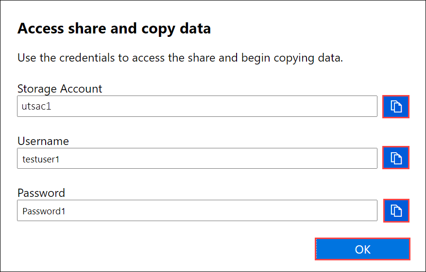
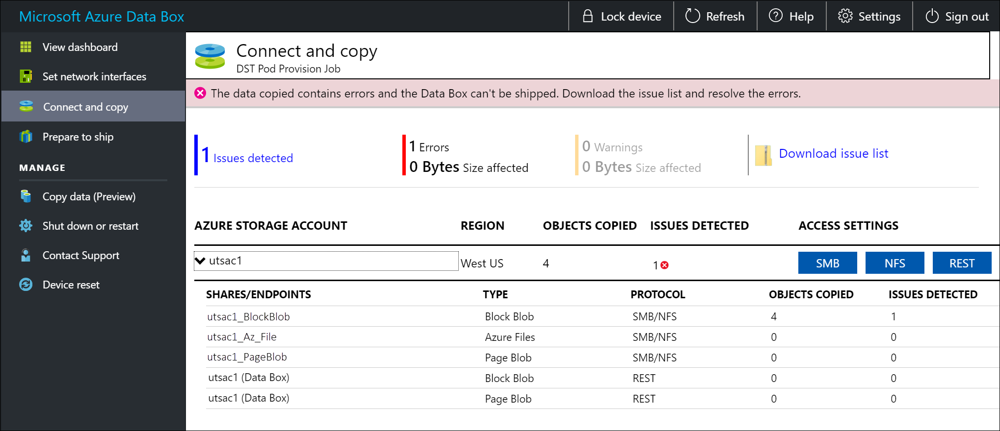
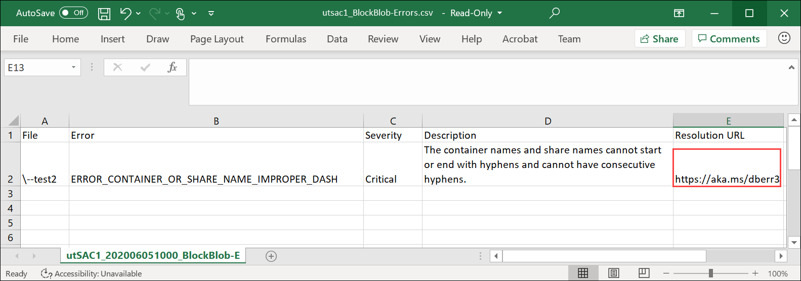

::: zone target="docs"

# Tutorial: Copy data to Azure Data Box via SMB

::: zone-end

::: zone target="chromeless"

## Copy data to Azure Data Box

::: zone-end

::: zone target="docs"

This tutorial describes how to connect to and copy data from your host computer using the local web UI.

In this tutorial, you learn how to:

> [!div class="checklist"]
>
> * Prerequisites
> * Connect to Data Box
> * Copy data to Data Box

## Prerequisites

Before you begin, make sure that:

1. You've completed the [Tutorial: Set up Azure Data Box](data-box-deploy-set-up.md).
2. You've received your Data Box and the order status in the portal is **Delivered**.
3. You have a host computer that has the data that you want to copy over to Data Box. Your host computer must
   * Run a [Supported operating system](data-box-system-requirements.md).
   * Be connected to a high-speed network. We strongly recommend that you have at least one 10-GbE connection. If a 10-GbE connection isn't available, use a 1-GbE data link but the copy speeds will be impacted.

## Connect to Data Box

Based on the storage account selected, Data Box creates up to:

* Three shares for each associated storage account for GPv1 and GPv2.
* One share for premium storage.
* One share for blob storage account.

Under block blob and page blob shares, first-level entities are containers, and second-level entities are blobs. Under shares for Azure Files, first-level entities are shares, second-level entities are files.

The following table shows the UNC path to the shares on your Data Box and Azure Storage path URL where the data is uploaded. The final Azure Storage path URL can be derived from the UNC share path.
 
|Azure Storage types  | Data Box shares            |
|-------------------|--------------------------------------------------------------------------------|
| Azure Block blobs | <li>UNC path to shares: `\\<DeviceIPAddress>\<StorageAccountName_BlockBlob>\<ContainerName>\files\a.txt`</li><li>Azure Storage URL: `https://<StorageAccountName>.blob.core.windows.net/<ContainerName>/files/a.txt`</li> |  
| Azure Page blobs  | <li>UNC path to shares: `\\<DeviceIPAddres>\<StorageAccountName_PageBlob>\<ContainerName>\files\a.txt`</li><li>Azure Storage URL: `https://<StorageAccountName>.blob.core.windows.net/<ContainerName>/files/a.txt`</li>   |  
| Azure Files       |<li>UNC path to shares: `\\<DeviceIPAddres>\<StorageAccountName_AzFile>\<ShareName>\files\a.txt`</li><li>Azure Storage URL: `https://<StorageAccountName>.file.core.windows.net/<ShareName>/files/a.txt`</li>        | 
| Azure Block blobs (Archive)   | <li>UNC path to shares: `\\<DeviceIPAddres>\<StorageAccountName_BlockBlobArchive>\<ContainerName>\files\a.txt`</li><li>Azure Storage URL: `https://<StorageAccountName>.blob.core.windows.net/<ContainerName>/files/a.txt`</li>      |     

If using a Windows Server host computer, follow these steps to connect to the Data Box.

1. The first step is to authenticate and start a session. Go to **Connect and copy**. Select **SMB** to get the access credentials for the shares associated with your storage account. 

    

2. In the Access share and copy data dialog box, copy the **Username** and the **Password** corresponding to the share. Then select **OK**.
    
    

3. To access the shares associated with your storage account (*utsac1* in the following example) from your host computer, open a command window. At the command prompt, type:

    `net use \\<IP address of the device>\<share name>  /u:<IP address of the device>\<user name for the share>`

    Depending upon your data format, the share paths are as follows:
    - Azure Block blob - `\\10.126.76.138\utsac1_BlockBlob`
    - Azure Page blob - `\\10.126.76.138\utsac1_PageBlob`
    - Azure Files - `\\10.126.76.138\utsac1_AzFile`
    - Azure Blob blob (Archive) - `\\10.126.76.138\utsac0_BlockBlobArchive`

4. Enter the password for the share when prompted. If the password has special characters, add double quotation marks before and after it. The following sample shows connecting to a share via the preceding command.

    ```
    C:\Users\Databoxuser>net use \\10.126.76.138\utSAC1_202006051000_BlockBlob /u:10.126.76.138\testuser1
    Enter the password for 'testuser1' to connect to '10.126.76.138': "ab1c2def$3g45%6h7i&j8kl9012345"
    The command completed successfully.
    ```

4. Press  Windows + R. In the **Run** window, specify the `\\<device IP address>`. Select **OK** to open File Explorer.
    
    

    You should now see the shares as folders.
    
    

    **Always create a folder for the files that you intend to copy under the share and then copy the files to that folder**. The folder created under block blob and page blob shares represents a container to which data is uploaded as blobs. You cannot copy files directly to *root* folder in the storage account.
    
If using a Linux client, use the following command to mount the SMB share. The "vers" parameter below is the version of SMB that your Linux host supports. Plug in the appropriate version in the command below. For versions of SMB that the Data Box supports see [Supported file systems for Linux clients](./data-box-system-requirements.md#supported-file-transfer-protocols-for-clients) 

```console
sudo mount -t nfs -o vers=2.1 10.126.76.138:/utsac1_BlockBlob /home/databoxubuntuhost/databox
```

## Copy data to Data Box

Once you're connected to the Data Box shares, the next step is to copy data. Before you begin the data copy, review the following considerations:

* Make sure that you copy the data to shares that correspond to the appropriate data format. For instance, copy the block blob data to the share for block blobs. Copy the VHDs to page blob. If the data format doesn't match the appropriate share type, then at a later step, the data upload to Azure will fail.
* Always create a folder under the share for the files that you intend to copy and then copy the files to that folder. The folder created under block blob and page blob shares represents a container to which the data is uploaded as blobs. You cannot copy files directly to the *root* folder in the storage account.
* While copying data, make sure that the data size conforms to the size limits described in the [Azure storage account size limits](data-box-limits.md#azure-storage-account-size-limits).
* If you want to preserve metadata (ACLs, timestamps, and file attributes) when transferring data to Azure Files, follow the guidance in [Preserving file ACLs, attributes, and timestamps with Azure Data Box](data-box-file-acls-preservation.md)  
* If data that is being uploaded by Data Box is also being uploaded by another application, outside Data Box, at the same time, this could result in upload job failures and data corruption.
* If you use both the SMB and NFS protocols for data copies, we recommend that you:
  * Use different storage accounts for SMB and NFS.
  * Don't copy the same data to the same end destination in Azure using both SMB and NFS. In these cases, the final outcome can't be determined.
  * Although copying via both SMB and NFS in parallel can work, we don't recommend doing that as it's prone to human error. Wait until your SMB data copy is complete before you start an NFS data copy.

> [!IMPORTANT]
> Make sure that you maintain a copy of the source data until you can confirm that the Data Box has transferred your data into Azure Storage.

After you connect to the SMB share, begin the data copy. You can use any SMB-compatible file copy tool, such as Robocopy, to copy your data. Multiple copy jobs can be initiated using Robocopy. Use the following command:

```console
robocopy <Source> <Target> * /e /r:3 /w:60 /is /nfl /ndl /np /MT:32 or 64 /fft /B /Log+:<LogFile>
```

The attributes are described in the following table.
    
|Attribute  |Description  |
|---------|---------|
|/e     |Copies subdirectories including empty directories.         |
|/r:     |Specifies the number of retries on failed copies.         |
|/w:     |Specifies the wait time between retries, in seconds.         |
|/is     |Includes the same files.         |
|/nfl     |Specifies that file names aren't logged.         |
|/ndl    |Specifies that directory names aren't logged.        |
|/np     |Specifies that the progress of the copying operation (the number of files or directories copied so far) will not be displayed. Displaying the progress significantly lowers the performance.         |
|/MT     | Use multithreading, recommended 32 or 64 threads. This option not used with encrypted files. You may need to separate encrypted and unencrypted files. However, single threaded copy significantly lowers the performance.           |
|/fft     | Use to reduce the time stamp granularity for any file system.        |
|/B     | Copies files in Backup mode.        |
|/z    | Copies files in Restart mode, use this if the environment is unstable. This option reduces throughput due to additional logging.      |
| /zb     | Uses Restart mode. If access is denied, this option uses Backup mode. This option reduces throughput due to checkpointing.         |
|/efsraw     | Copies all encrypted files in EFS raw mode. Use only with encrypted files.         |
|log+:\<LogFile>| Appends the output to the existing log file.|    
 
The following sample shows the output of the robocopy command to copy files to the Data Box.

```output
C:\Users>robocopy

    -------------------------------------------------------------------------------
    ROBOCOPY     ::     Robust File Copy for Windows
    -------------------------------------------------------------------------------

        Started : Thursday, March 8, 2018 2:34:53 PM
        Simple Usage :: ROBOCOPY source destination /MIR

        source :: Source Directory (drive:\path or \\server\share\path).
        destination :: Destination Dir  (drive:\path or \\server\share\path).
                /MIR :: Mirror a complete directory tree.

    For more usage information run ROBOCOPY /?

    ****  /MIR can DELETE files as well as copy them !

C:\Users>Robocopy C:\Git\azure-docs-pr\contributor-guide \\10.126.76.172\devicemanagertest1_AzFile\templates /MT:32

    -------------------------------------------------------------------------------
    ROBOCOPY     ::     Robust File Copy for Windows
    -------------------------------------------------------------------------------

        Started : Thursday, March 8, 2018 2:34:58 PM
        Source : C:\Git\azure-docs-pr\contributor-guide\
            Dest : \\10.126.76.172\devicemanagertest1_AzFile\templates\

        Files : *.*

        Options : *.* /DCOPY:DA /COPY:DAT /MT:32 /R:5 /W:60

    ------------------------------------------------------------------------------

    100%        New File                 206        C:\Git\azure-docs-pr\contributor-guide\article-metadata.md
    100%        New File                 209        C:\Git\azure-docs-pr\contributor-guide\content-channel-guidance.md
    100%        New File                 732        C:\Git\azure-docs-pr\contributor-guide\contributor-guide-index.md
    100%        New File                 199        C:\Git\azure-docs-pr\contributor-guide\contributor-guide-pr-criteria.md
                New File                 178        C:\Git\azure-docs-pr\contributor-guide\contributor-guide-pull-request-co100%  .md
                New File                 250        C:\Git\azure-docs-pr\contributor-guide\contributor-guide-pull-request-et100%  e.md
    100%        New File                 174        C:\Git\azure-docs-pr\contributor-guide\create-images-markdown.md
    100%        New File                 197        C:\Git\azure-docs-pr\contributor-guide\create-links-markdown.md
    100%        New File                 184        C:\Git\azure-docs-pr\contributor-guide\create-tables-markdown.md
    100%        New File                 208        C:\Git\azure-docs-pr\contributor-guide\custom-markdown-extensions.md
    100%        New File                 210        C:\Git\azure-docs-pr\contributor-guide\file-names-and-locations.md
    100%        New File                 234        C:\Git\azure-docs-pr\contributor-guide\git-commands-for-master.md
    100%        New File                 186        C:\Git\azure-docs-pr\contributor-guide\release-branches.md
    100%        New File                 240        C:\Git\azure-docs-pr\contributor-guide\retire-or-rename-an-article.md
    100%        New File                 215        C:\Git\azure-docs-pr\contributor-guide\style-and-voice.md
    100%        New File                 212        C:\Git\azure-docs-pr\contributor-guide\syntax-highlighting-markdown.md
    100%        New File                 207        C:\Git\azure-docs-pr\contributor-guide\tools-and-setup.md
    ------------------------------------------------------------------------------

                Total    Copied   Skipped  Mismatch    FAILED    Extras
    Dirs :         1         1         1         0         0         0
    Files :        17        17         0         0         0         0
    Bytes :     3.9 k     3.9 k         0         0         0         0
C:\Users>
```

For more specific scenarios such as using `robocopy` to list, copy, or delete files on Data Box, see [Use robocopy to list, copy, modify files on Data Box](data-box-file-acls-preservation.md#use-robocopy-to-list-copy-modify-files-on-data-box).

To optimize the performance, use the following robocopy parameters when copying the data.

|    Platform    |    Mostly small files < 512 KB                           |    Mostly medium  files 512 KB-1 MB                      |    Mostly large files > 1 MB                             |   
|----------------|--------------------------------------------------------|--------------------------------------------------------|--------------------------------------------------------|
|    Data Box         |    2 Robocopy sessions <br> 16 threads per sessions    |    3 Robocopy sessions <br> 16 threads per sessions    |    2 Robocopy sessions <br> 24 threads per sessions    |

For more information on Robocopy command, go to [Robocopy and a few examples](https://social.technet.microsoft.com/wiki/contents/articles/1073.robocopy-and-a-few-examples.aspx).

During the copy process, if there are any errors, you will see a notification.



Select **Download issue list**.


Open the list to view the details of the error and select the resolution URL to view the recommended resolution.



For more information, see [View error logs during data copy to Data Box](data-box-logs.md#view-error-log-during-data-copy). For a detailed list of errors during data copy, see [Troubleshoot Data Box issues](data-box-troubleshoot.md).

To ensure data integrity, checksum is computed inline as the data is copied. Once the copy is complete, verify the used space and the free space on your device.


::: zone-end

::: zone target="chromeless"

You can copy data from your source server to your Data Box via SMB, NFS, REST, data copy service or to managed disks.

In each case, make sure that the share and folder names, and the data size follow guidelines described in the [Azure Storage and Data Box service limits](data-box-limits.md).

## Copy data via SMB

To copy data via SMB:

1. If using a Windows host, use the following command to connect to the SMB shares:

    `\\<IP address of your device>\ShareName`

2. To get the share access credentials, go to the **Connect & copy** page in the local web UI of the Data Box.
3. Use an SMB compatible file copy tool such as Robocopy to copy data to shares. 

For step-by-step instructions, go to [Tutorial: Copy data to Azure Data Box via SMB](data-box-deploy-copy-data.md).

## Copy data via NFS

To copy data via NFS:

1. If using an NFS host, use the following command to mount the NFS shares on your Data Box:

    `sudo mount <Data Box device IP>:/<NFS share on Data Box device> <Path to the folder on local Linux computer>`

2. To get the share access credentials, go to the **Connect & copy** page in the local web UI of the Data Box.
3. Use `cp` or `rsync` command to copy your data.

For step-by-step instructions, go to [Tutorial: Copy data to Azure Data Box via NFS](data-box-deploy-copy-data-via-nfs.md).

## Copy data via REST

To copy data via REST:

1. To copy data using Data Box Blob storage via REST APIs, you can connect over *http* or *https*.
2. To copy data to Data Box Blob storage, you can use AzCopy.

For step-by-step instructions, go to [Tutorial: Copy data to Azure Data Box Blob storage via REST APIs](data-box-deploy-copy-data-via-nfs.md).

## Copy data via data copy service

To copy data via data copy service:

1. To copy data by using the data copy service, you need to create a job. In the local web UI of your Data Box, go to **Manage > Copy data > Create**.
2. Fill out the parameters and create a job.

For step-by-step instructions, go to [Tutorial: Use the data copy service to copy data into Azure Data Box](data-box-deploy-copy-data-via-copy-service.md).

## Copy data to managed disks

To copy data managed disks:

1. When ordering the Data Box device, you should have selected managed disks as your storage destination.
2. You can connect to Data Box via SMB or NFS shares.
3. You can then copy data via SMB or NFS tools.

For step-by-step instructions, go to [Tutorial: Use Data Box to import data as managed disks in Azure](data-box-deploy-copy-data-from-vhds.md).

::: zone-end

::: zone target="docs"

## Next steps

In this tutorial, you learned about Azure Data Box topics such as:

> [!div class="checklist"]
>
> * Prerequisites
> * Connect to Data Box
> * Copy data to Data Box

Advance to the next tutorial to learn how to ship your Data Box back to Microsoft.

> [!div class="nextstepaction"]
> [Ship your Azure Data Box to Microsoft](./data-box-deploy-picked-up.md)

::: zone-end
