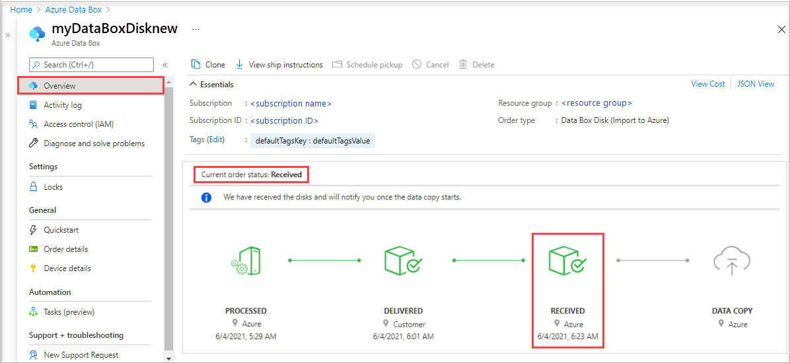
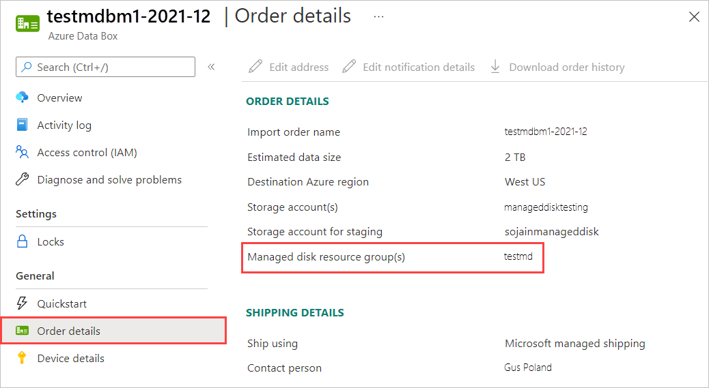
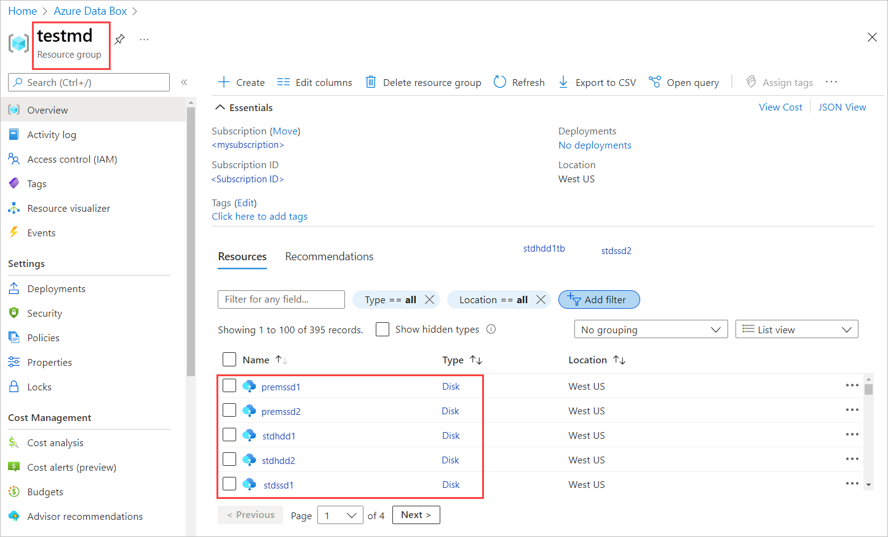

::: zone target="docs"

# Tutorial: Verify data upload from Azure Data Box Disk

This is the last tutorial of the series: Deploy Azure Data Box Disk. In this tutorial, you will learn about:

> [!div class="checklist"]
> * Verify data upload to Azure
> * Erasure of data from Data Box Disk

## Prerequisites

Before you begin, make sure that you have completed the [Tutorial: Return Azure Data Box Disk](data-box-disk-deploy-picked-up.md).

## Verify data upload to Azure

Once the disks are picked up by your carrier, the order status in the portal updates to **Picked up**. A tracking ID is also displayed.

When Microsoft receives and scans the disk, job status is updated to **Received**. 

The data automatically gets copied once the disks are connected to a server in the Azure datacenter. Depending upon the data size, the copy operation may take a few hours to days to complete. You can monitor the copy job progress in the portal.

Once the copy is complete, order status updates to **Completed**.

If the copy completes with errors, see [troubleshoot upload errors](data-box-disk-troubleshoot-upload.md).

Verify that your data is in the storage account(s) before you delete it from the source. Your data can be in:

- Your Azure Storage account(s). When you copy the data to Data Box, depending on the type, the data is uploaded to one of the following paths in your Azure Storage account.

  - For block blobs and page blobs: `https://<storage_account_name>.blob.core.windows.net/<containername>/files/a.txt`
  - For Azure Files: `https://<storage_account_name>.file.core.windows.net/<sharename>/files/a.txt`

    Alternatively, you can go to your Azure storage account in Azure portal and navigate from there.

- Your managed disk resource group(s). When creating managed disks, the VHDs are uploaded as page blobs and then converted to managed disks. The managed disks are attached to the resource groups specified at the time of order creation.

  - If your copy to managed disks in Azure was successful, you can go to the **Order details** in the Azure portal and make a note of the resource group specified for managed disks.

      

    Go to the noted resource group and locate your managed disks.

      

    > [!NOTE]
    > If a page blob isn't successfully converted to a managed disk during a data copy, it stays in the storage account and you're charged for storage.

  -  If you copied a VHDX, or a dynamic/differencing VHD, then the VHDX/VHD is uploaded to the staging storage account as a block blob. Go to your staging **Storage account > Blobs** and then select the appropriate container - StandardSSD, StandardHDD, or PremiumSSD. The  VHDX/VHDs should show up as block blobs in your staging storage account.
  

  
::: zone-end

::: zone target="chromeless"

## Verify data upload to Azure

After the data is uploaded to Azure, verify that your data is in the storage account(s) before you delete it from the source. Your data can be in:

- Your Azure Storage account(s). When you copy the data to Data Box, depending on the type, the data is uploaded to one of the following paths in your Azure Storage account.

    - **For block blobs and page blobs**: `https://<storage_account_name>.blob.core.windows.net/<containername>/files/a.txt`

    - **For Azure Files**: `https://<storage_account_name>.file.core.windows.net/<sharename>/files/a.txt`

- Your managed disk resource group(s). When creating managed disks, the VHDs are uploaded as page blobs and then converted to managed disks. The managed disks are attached to the resource groups specified at the time of order creation.

::: zone-end

To verify that the data has uploaded into Azure, take the following steps:

1. Go to the storage account associated with your disk order.
2. Go to **Blob service > Browse blobs**. The list of containers is presented. Corresponding to the subfolder that you created under *BlockBlob* and *PageBlob* folders, containers with the same name are created in your storage account.
    If the folder names do not conform to Azure naming conventions, then the data upload to Azure will fail.

3. To verify that the entire dataset has loaded, use Microsoft Azure Storage Explorer. Attach the storage account corresponding to the Data Box Disk order and then look at the list of blob containers. Select a container, click **…More** and then click **Folder statistics**. In the **Activities** pane, the statistics for that folder including the number of blobs and the total blob size is displayed. The total blob size in bytes should match the size of the dataset.

    

## Erasure of data from Data Box Disk

Once the upload to Azure is complete, the Data Box Disk erases the data on its disks as per the [NIST SP 800-88](https://csrc.nist.gov/News/2014/Released-SP-800-88-Revision-1,-Guidelines-for-Medi) standard.

::: zone target="docs"

## Next steps

In this tutorial, you learned about Azure Data Box Disk topics such as:

> [!div class="checklist"]
> * Verify data upload to Azure
> * Erasure of data from Data Box Disk

Advance to the next how-to to learn how to manage Data Box Disk via the Azure portal.

> [!div class="nextstepaction"]
> [Use Azure portal to administer Azure Data Box Disk](./data-box-portal-ui-admin.md)

::: zone-end

