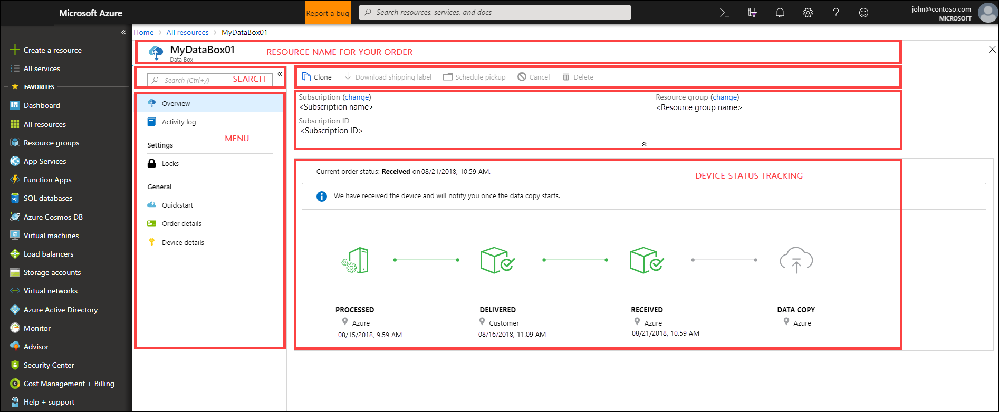
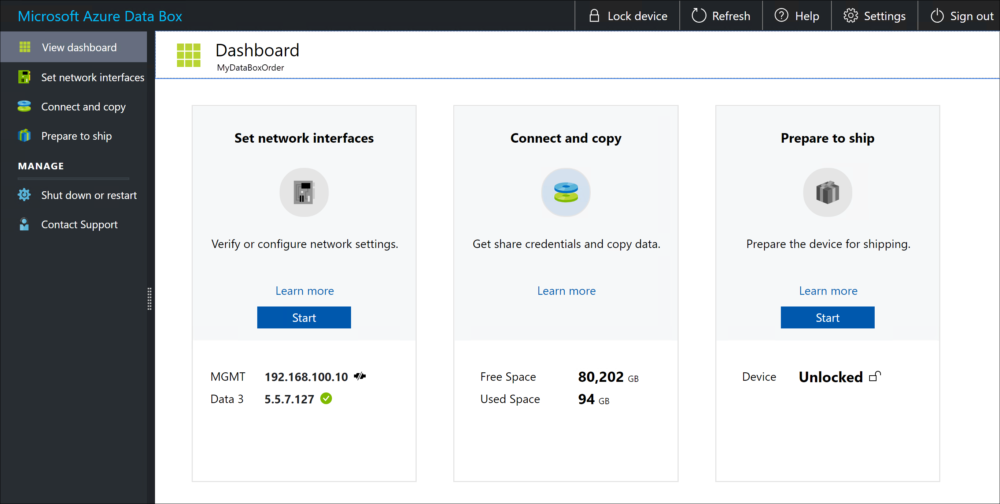

# What is Azure Data Box?

The Microsoft Azure Data Box cloud solution lets you send terabytes of data into and out of Azure in a quick, inexpensive, and reliable way. The secure data transfer is accelerated by shipping you a proprietary Data Box storage device. Each storage device has a maximum usable storage capacity of 80 TB and is transported to your datacenter through a regional carrier. The device has a rugged casing to protect and secure data during the transit.

You can order the Data Box device via the Azure portal to import or export data from Azure. Once the device is received, you can quickly set it up using the local web UI. Depending on whether you will import or export data, copy the data from your servers to the device or from the device to your servers, and ship the device back to Azure. If importing data to Azure, in the Azure datacenter, your data is automatically uploaded from the device to Azure. The entire process is tracked end-to-end by the Data Box service in the Azure portal.

## Use cases

Data Box is ideally suited to transfer data sizes larger than 40 TBs in scenarios with no to limited network connectivity. The data movement can be one-time, periodic, or an initial bulk data transfer followed by periodic transfers. 

Here are the various scenarios where Data Box can be used to import data to Azure.

 - **One time migration** - when large amount of on-premises data is moved to Azure. 
     - Moving a media library from offline tapes into Azure to create an online media library.
     - Migrating your VM farm, SQL server, and applications to Azure
     - Moving historical data to Azure for in-depth analysis and reporting using HDInsight

 - **Initial bulk transfer** - when an initial bulk transfer is done using Data Box (seed) followed by incremental transfers over the network. 
     - For example, backup solutions partners such as Commvault and Data Box are used to move initial large historical backup to Azure. Once complete, the incremental data is transferred via network to Azure storage.

- **Periodic uploads** - when large amount of data is generated periodically and needs to be moved to Azure. For example in energy exploration, where video content is generated on oil rigs and windmill farms. 

Here are the various scenarios where Data Box can be used to export data from Azure.

- **Disaster recovery** - when a copy of the data from Azure is restored to an on-premises network. In a typical disaster recovery scenario, a large amount of Azure data is exported to a Data Box. Microsoft then ships this Data Box, and the data is restored on your premises in a short time.

- **Security requirements** - when you need to be able to export data out of Azure due to government or security requirements. For example, Azure Storage is available in US Secret and Top Secret clouds, and you can use Data Box to export data out of Azure. 

- **Migrate back to on-premises or to another cloud service provider** - when you want to move all the data back to on-premises, or to another cloud service provider, export data via Data Box to migrate the workloads.

## Benefits

Data Box is designed to move large amounts of data to Azure with little to no impact to network. The solution has the following benefits:

- **Speed** - Data Box uses 1-Gbps or 10-Gbps network interfaces to move up to 80 TB of data into and out of Azure.

- **Secure** - Data Box has built-in security protections for the device, data, and the service.
  - The device has a rugged casing secured by tamper-resistant screws and tamper-evident stickers. 
  - The data on the device is secured with an AES 256-bit encryption at all times.
  - The device can only be unlocked with a password provided in the Azure portal.
  - The service is protected by the Azure security features.
  - Once the data from your import order is uploaded to Azure, the disks on the device are wiped clean in accordance with NIST 800-88r1 standards. For an export order, the disks are erased once the device reaches the Azure datacenter.
    
    For more information, go to [Azure Data Box security and data protection](data-box-security.md).

## Features and specifications

The Data Box device has the following features in this release.

| Specifications                                          | Description              |
|---------------------------------------------------------|--------------------------|
| Weight                                                  | < 50 lbs.                |
| Dimensions                                              | Device - Width: 309.0 mm Height: 430.4 mm Depth: 502.0 mm |            
| Rack space                                              | 7 U when placed in the rack on its side (cannot be rack-mounted)|
| Cables required                                         | 1 X power cable (included)   2 RJ45 cables (not included)  2 X SFP+ Twinax copper cables (not included)|
| Storage capacity                                        | 100-TB device has 80 TB or usable capacity after RAID 5 protection|
| Power rating                                            | The power supply unit is rated for 700 W.   Typically, the unit draws 375 W.|
| Network interfaces                                      | 2 X 1-GbE interface - MGMT, DATA 3.   MGMT - for management, not user configurable, used for initial setup   DATA3 - for data, user configurable, and is dynamic by default   MGMT and DATA 3 can also work as 10 GbE   2 X 10-GbE interface - DATA 1, DATA 2   Both are for data, can be configured as dynamic (default) or static |
| Data transfer                                      | Both import and export are supported.  |
| Data transfer media                                     | RJ45, SFP+ copper 10 GbE Ethernet  |
| Security                                                | Rugged device casing with tamper-proof custom screws   Tamper-evident stickers placed at the bottom of the device|
| Data transfer rate                                      | Up to 80 TB in a day over a 10-GbE network interface        |
| Management                                              | Local web UI - one-time initial setup and configuration   Azure portal - day-to-day device management        |

## Data Box components

The Data Box includes the following components:

* **Data Box device** - a physical device that provides primary storage, manages communication with cloud storage, and helps to ensure the security and confidentiality of all data stored on the device. The Data Box device has a usable storage capacity of 80 TB. 

    

    
* **Data Box service** – an extension of the Azure portal that lets you manage a Data Box device from a web interface that you can access from different geographical locations. Use the Data Box service to perform daily administration of your Data Box device. The service tasks include how to create and manage orders, view and manage alerts, and manage shares.  

    

    For more information, go to [Use the Data Box service to administer your Data Box device](data-box-portal-ui-admin.md).

* **Local web user interface** – a web-based UI that is used to configure the device so that it can connect to the local network, and then register the device with the Data Box service. Use the local web UI also to shut down and restart the Data Box device, view copy logs, and contact Microsoft Support to file a service request.

    

    The local web UI on the device currently supports the following languages with their corresponding language codes:

    | Language             | Code | Language                | Code   | Language                | Code         |
    |----------------------|------|-------------------------|--------|-------------------------|--------------|
    | English {default}    | en   |  Czech                  | cs     | German                  | de           |
    | Spanish              | es   | French                  | fr     | Hungarian               | hu           |
    | Italian              | it   | Japanese                | ja     | Korean                  | ko           |
    | Dutch                | nl   | Polish                  | pl     | Portuguese - Brazil     | pt-br        |
    | Portuguese - Portugal| pt-pt| Russian                 | ru     | Swedish                 | sv           |
    | Turkish              | tr   | Chinese - simplified    | zh-hans|    |       |    

    For information about using the web-based UI, go to [Use the web-based UI to administer your Data Box](data-box-portal-ui-admin.md).

## The workflow

A typical import flow includes the following steps:

1. **Order** - Create an order in the Azure portal, provide shipping information, and the destination Azure storage account for your data. If the device is available, Azure prepares and ships the device with a shipment tracking ID.

2. **Receive** - Once the device is delivered, cable the device for network and power using the specified cables. (You'll need to procure the data cables.) Turn on and connect to the device. Configure the device network and mount shares on the host computer from where you want to copy the data.

3. **Copy data** - Copy data to Data Box shares.

4. **Return** - Prepare, turn off, and ship the device back to the Azure datacenter.

5. **Upload** - Data is automatically copied from the device to Azure. The device disks are securely erased as per the National Institute of Standards and Technology (NIST) guidelines.

Throughout this process, you are notified via email on all status changes. For more information about the detailed flow, go to [Deploy Data Box in Azure portal](data-box-deploy-ordered.md).

A typical export flow includes the following steps:

1. **Order** - Create an export order in the Azure portal, provide shipping information, and the source Azure storage account for your data. If the device is available, Azure prepares a device. Data is copied from your Azure Storage account to the Data Box. Once the data copy is complete, Microsoft ships the device with a shipment tracking ID.

2. **Receive** - Once the device is delivered, cable the device for network and power using the specified cables. (You'll need to procure the data cables.) Turn on and connect to the device. Configure the device network and mount shares on the host computer to which you want to copy the data.

3. **Copy data** - Copy data from Data Box shares to the on-premises data servers.

4. **Return** - Prepare, turn off, and ship the device back to the Azure datacenter.

5. **Data erasure** - The device disks are securely erased as per the National Institute of Standards and Technology (NIST) guidelines.

Throughout the export process, you are notified via email on all status changes. For more information about the detailed flow, go to [Deploy Data Box in Azure portal](data-box-deploy-export-ordered.md).

## Region availability

Data Box can transfer data based on the region in which service is deployed, the country or region you ship the device to, and the target Azure storage account where you transfer the data.

### For import

- **Service availability** - When using Data Box for import or export orders, to get information on region availability, go to [Azure products available by region](https://azure.microsoft.com/global-infrastructure/services/?products=databox&regions=all).

    For import orders, Data Box can also be deployed in the Azure Government Cloud. For more information, see [What is Azure Government?](../azure-government/documentation-government-welcome.md). 

- **Destination storage accounts** - The storage accounts that store the data are available in all Azure regions where the service is available.

## Next steps

- Review the [Data Box system requirements](data-box-system-requirements.md).
- Understand the [Data Box limits](data-box-limits.md).
- Quickly deploy [Azure Data Box](data-box-quickstart-portal.md) in Azure portal.
