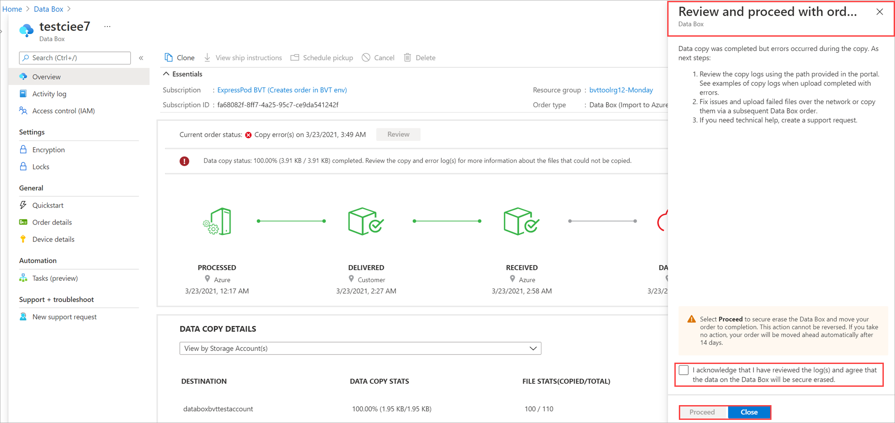

# Troubleshoot paused data uploads from Azure Data Box and Azure Data Box Heavy devices

This article details information on how to troubleshoot errors that cause a data copy to pause while data is being uploaded to the cloud from an Azure Data Box or Azure Data Box Heavy device. The information applies to import orders only; it does not apply to export orders.

When a data copy for an upload to the cloud completes with errors, you'll see the following notification in the Azure portal.

To resume the data copy, you must confirm that you want to proceed after reviewing the errors in the copy log. Or you can cancel the data copy. For more information, see [Return Azure Data Box and verify data upload to Azure](data-box-deploy-picked-up.md?tabs=in-us-canada-europe#verify-data-upload-to-azure-8).

You can't fix these errors for the current data copy. However, you can evaluate whether it's useful to proceed with the data copy, including the errors, or cancel it and start a new import order. If only a few files failed to upload, you may be able to transfer the missing files over the network after the order completes.

## Data configuration errors

The following data configuration errors require your action to proceed with a data upload to the cloud from a Data Box and Data Box Heavy device:

|Error code |Error message            |
|-----------|-------------------------|
|400        |Bad Request (Invalid file name) |
|400        |Bad Request (File property failure for Azure Files) |
|400        |The value for one of the HTTP headers is not in the correct format.|
|409        |This operation is not permitted as the blob is immutable due to a policy.|
|409        |The size of the blob being imported is invalid. The blob size is <blob-size> bytes. Supported sizes are between 20971520 Bytes and 8192 GiB|
|409        |The total provisioned capacity of the shares cannot exceed the account maximum size limit|
|409        |The blob type is invalid for this operation.|
|409        |There is currently a lease on the blob and no lease ID was specified in the request|

For information about other types of copy log entries, see [Tracking and event logging for your Azure Data Box and Azure Data Box Heavy import order](data-box-logs.md).

> [!NOTE]
> The error descriptions below give the information that you need to decide whether to proceed with the current data copy or cancel it. "Follow-up" describe how to update your data configuration before you place a new import order or perform a network transfer.

## Bad Request (Invalid file name)

**Error code:** 400 

**Description:** 

**Follow-up:** Before doing a network transfer or placing a new order, rename the files to meet XX requirements. <!--Pick up wording from Troubleshooting Data Box"-->

## Bad Request (File property failure for Azure Files)

**Error code:** 400 

**Description:** Data import will fail if the upload of file properties fails for Azure Files.  

**Follow-up:** Before you do a network transfer or place a new order, GET TROUBLESHOOTING.

## The value for one of the HTTP headers is not in the correct format

**Error code:** 400 

**Description:** The listed blobs could not be uploaded because they don't meet format or size requirements for blobs in Azure storage.

**Follow-up:** Before you do a network transfer or place a new order, ensure that:
- The page blobs are 512-byte aligned.
- The block blobs do not exceed the 4.75-TiB maximum size.

STOPPING HERE. Pick up with 409s.

## Next steps

- [Verify a data upload to Azure](data-box-deploy-picked-up.md?tabs=in-us-canada-europe#verify-data-upload-to-azure-8)
