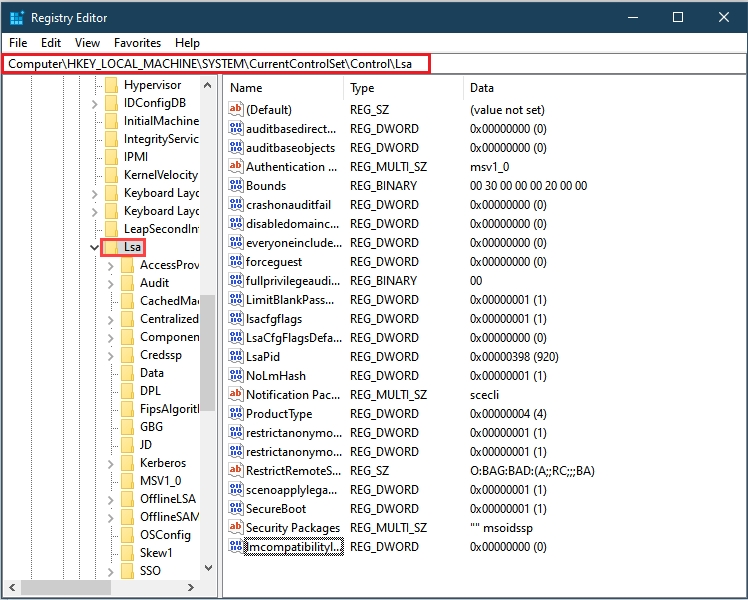
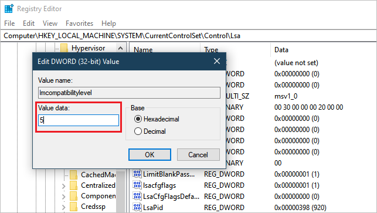

# Troubleshoot share connection issues in Azure Data Box

<!--[!INCLUDE [<title>](<filepath>)] - I will write to the Data Box SKU. Support document addresses also: Data Box Gateway, and Azure Stack Edge. Support document: https://internal.support.services.microsoft.com/en-us/help/4535661-->

This article describes how to troubleshoot network issues that can cause SMB data copy to fail on your Azure Data Box device.<!--Source KB is for Data Box, Data Box Gateway, and Azure Stack Edge devices. Make an include?-->

## Possible causes

The most common reasons for being unable to connect to an SMB share on a Data Box device are:

- a domain issue
- a group policy is preventing a connection
- a permissions issue

## Troubleshoot share connection issues

If you can't connect to an SMB share on your Data Box device from your host computer, check for the following issues in this order.

### Check for a domain issue

To find out whether a domain issue is preventing share access:

1. When you access the share, enter the share password in one of the following formats:

       - `<device IP address>\<user name>`
       - `\<user name>`

    To access a share associated with your storage account from your host computer, open a command window. At the command prompt, type the following command. You'll be prompted for a password.<!--They already know this?-->

    net use \\<IP address of the device>\<share name> /u:<IP address of the device>\<user name for the share>

    For a procedure, see [Copy data to Data Box via SMB](https://docs.microsoft.com/en-us/azure/databox/data-box-deploy-copy-data).

### Check for a blocking group policy

Check whether a group policy on your Data Box is preventing you from connecting to the share. If possible, move your Data Box to an organizational unit (OU) that doesn't have any Group Policy objects (GPOs) applied.

Group Policy allows an organization to implement specific configurations for users and computers. Group Policy settings are contained in Group Policy objects (GPOs), which are linked to sites, domains, or organizational units (OUs) in Active Directory Domain Services (AD DS) .

If your Data Box is domain-joined, GPOs can be applied to it. <!--NOT NEEDED IN THIS CONTEXT? These GPOs can install applications such as an antivirus software that can adversely impact the operation of the Data Box.-->

To ensure that no group policies are preventing your access to shares on the Data Box:

* Make sure your Data Box is in its own organizational unit (OU) for Active Directory.

* Make sure that no group policy objects (GPOs) are applied to your Data Box. You can block inheritance to ensure that the Data Box (child node) does not automatically inherit any GPOs from the parent. For more information, go to [block inheritance](/previous-versions/windows/it-pro/windows-server-2008-R2-and-2008/cc731076(v=ws.11)).

### Check for a permissions failure

If you still can't connect to the share, you may have a permissions issue. Your next step is to run diagnostics, and review the Smbserver.Security event logs for errors indicating a permissions failure.

#### Run diagnostics

To run diagnostics on your Data Box, do the following steps:

   1. In the local web UI, go to **Troubleshooting**, and then to **Diagnostic test**.

   1. Review the `Smbserver.Security` event logs in the `etw` folder one of the following errors:
      
      ```xml
      SMB Session Authentication Failure
      Client Name: \\<ClientIP>
      Client Address: <ClientIP:Port>
      User Name:
      Session ID: 0x100000000021
      Status: The attempted logon is invalid. This is either due to a bad username or authentication information. (0xC000006D)
      SPN: session setup failed before the SPN could be queried
      SPN Validation Policy: SPN optional / no validation
      ```
      
      Or this error:

      ```xml
       LmCompatibilityLevel value is different from the default.
       Configured LM Compatibility Level: 5
       Default LM Compatibility Level: 3
      ```

If you find either of these errors,  you'll need to update the LAN Manager authentication level. Use the Local Security Policy editor or by updating the Registry directly.

#### Use the Local Security Policy editor to update the policy 

To use the Local Security Policy editor<!--Short name?--> to update the policy, do these steps:
 
1. To open the Local Security Policy editor, start a PowerShell session, and run `secpol.msc`.

1. Go to **Local Policies** > **Security Options** > **Network Security: LAN Manager authentication level**.

    

1. Change the setting **Send NTLMv2 response only. Refuse LM & NTLM**.

    

#### Update the Registry to change the policy

If you can't change the LAN Manager authentication level using the Local Security Policy editor, you can update the Registry directly.

To update the Registry, do these steps:

1. To open the Registry Editor, open a command prompt, and run `regedt32`.

1. Go to **HKEY_LOCAL_MACHINE** > **SYSTEM** > **CurrentControlSet** > **Control** > **LSA**.

    

1. In the **LSA** folder, select and click **LMCompatibilityLevel** to open a window for editing the value data.

1. In **Value data**, change the setting to 5.

    

1. Restart your computer so that the Registry changes take effect.

## Next steps

- [Copy data via SMB](data-box-deploy-copy-data.md)
- [Copy data via network-attached storage (NAS)](data-box-deploy-copy-data-via-copy-service.md)