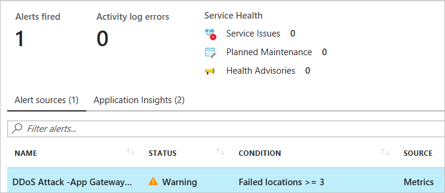
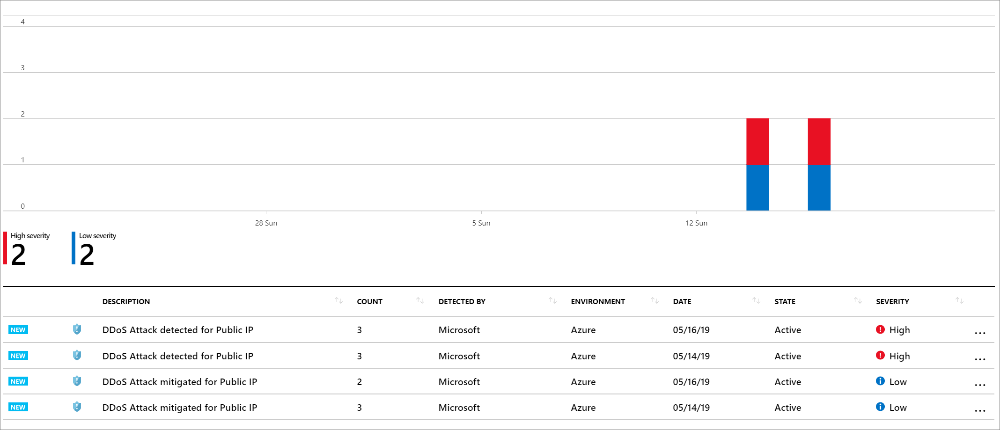

# View and configure DDoS protection alerts

Azure DDoS Protection standard provides detailed attack insights and visualization with DDoS Attack Analytics. Customers protecting their virtual networks against DDoS attacks have detailed visibility into attack traffic and actions taken to mitigate the attack via attack mitigation reports & mitigation flow logs. Rich telemetry is exposed via Azure Monitor including detailed metrics during the duration of a DDoS attack. Alerting can be configured for any of the Azure Monitor metrics exposed by DDoS Protection. Logging can be further integrated with [Azure Sentinel](../sentinel/connect-azure-ddos-protection.md), Splunk (Azure Event Hubs), OMS Log Analytics, and Azure Storage for advanced analysis via the Azure Monitor Diagnostics interface.

In this tutorial, you'll learn how to:

> [!div class="checklist"]
> * Configure alerts through Azure Monitor
> * Configure alerts through portal
> * View alerts in Azure Security Center
> * Validate and test your alerts

## Prerequisites

- If you don't have an Azure subscription, create a [free account](https://azure.microsoft.com/free/?WT.mc_id=A261C142F) before you begin.
- Before you can complete the steps in this tutorial, you must first create a [Azure DDoS Standard protection plan](manage-ddos-protection.md) and DDoS Protection Standard must be enabled on a virtual network.
- DDoS monitors public IP addresses assigned to resources within a virtual network. If you don't have any resources with public IP addresses in the virtual network, you must first create a resource with a public IP address. You can monitor the public IP address of all resources deployed through Resource Manager (not classic) listed in [Virtual network for Azure services](../virtual-network/virtual-network-for-azure-services.md#services-that-can-be-deployed-into-a-virtual-network) (including Azure Load Balancers where the backend virtual machines are in the virtual network), except for Azure App Service Environments. To continue with this tutorial, you can quickly create a [Windows](../virtual-machines/windows/quick-create-portal.md?toc=%2fazure%2fvirtual-network%2ftoc.json) or [Linux](../virtual-machines/linux/quick-create-portal.md?toc=%2fazure%2fvirtual-network%2ftoc.json) virtual machine.     

## Configure alerts through Azure Monitor

With these templates, you will be able to configure alerts for all public IP addresses that you have enabled diagnostic logging on. Hence in order to use these alert templates, you will first need a Log Analytics Workspace with diagnostic settings enabled. See [View and configure DDoS diagnostic logging](diagnostic-logging.md).

### Azure Monitor alert rule
This [Azure Monitor alert rule](https://github.com/Azure/Azure-Network-Security/tree/master/Azure%20DDoS%20Protection/Azure%20Monitor%20Alert%20-%20DDoS%20Mitigation%20Started) will run a simple query to detect when an active DDoS mitigation is occurring. This indicates a potential attack. Action groups can be used to invoke actions as a result of the alert.

### Azure Monitor alert rule with Logic App

This [template](https://github.com/Azure/Azure-Network-Security/tree/master/Azure%20DDoS%20Protection/DDoS%20Mitigation%20Alert%20Enrichment) deploys the necessary components of an enriched DDoS mitigation alert: Azure Monitor alert rule, action group, and Logic App. The result of the process is an email alert with details about the IP address under attack, including information about the resource associated with the IP. The owner of the resource is added as a recipient of the email, along with the security team. A basic application availability test is also performed and the results are included in the email alert.

## Configure alerts through portal

You can select any of the available DDoS protection metrics to alert you when there’s an active mitigation during an attack, using the Azure Monitor alert configuration. 

1. Sign in to the [Azure portal](https://portal.azure.com/) and browse to your DDoS Protection Plan.
2. Under **Monitoring**, select **Metrics**.
3. In the gray navigation bar, select **New alert rule**. 
4. Enter, or select your own values, or enter the following example values, accept the remaining defaults, and then select **Create alert rule**:

    |Setting                  |Value                                                                                               |
    |---------                |---------                                                                                           |
    | Scope                   | Select **Select resource**.   Select the **Subscription** that contains the public IP address you want to log, select **Public IP Address** for **Resource type**, then select the specific public IP address you want to log metrics for.   Select **Done**. | 
    | Condition | Select **Select condition**.   Under signal name, select **Under DDoS attack or not**.   Under **Operator**, select **Greater than or equal to**.   Under **Aggregation type**, select **Maximum**.   Under **Threshold value**, enter *1*. For the **Under DDoS attack or not** metric, **0** means you are not under attack while **1** means you are under attack.   Select **Done**. | 
    | Actions | Select **Add actions groups**.   Select **Create action group**.   Under **Notifications**, under **Notification type**, select **Email/SMS message/Push/Voice**.   Under **Name**, enter _MyUnderAttackEmailAlert_.   Click the edit button, then select **Email** and as many of the following options you require, and then select **OK**.   Select **Review + create**. | 
    | Alert rule details | Under **Alert rule name**, Enter _MyDdosAlert_. |

Within a few minutes of attack detection, you should receive an email from Azure Monitor metrics that looks similar to the following picture:

You can also learn more about [configuring webhooks](../azure-monitor/alerts/alerts-webhooks.md?toc=%2fazure%2fvirtual-network%2ftoc.json) and [logic apps](../logic-apps/logic-apps-overview.md?toc=%2fazure%2fvirtual-network%2ftoc.json) for creating alerts.

## View alerts in Azure Security Center

Azure Security Center provides a list of [security alerts](../security-center/security-center-managing-and-responding-alerts.md), with information to help investigate and remediate problems. With this feature, you get a unified view of alerts, including DDoS attack-related alerts and the actions taken to mitigate the attack in near-time.
There are two specific alerts that you will see for any DDoS attack detection and mitigation:

- **DDoS Attack detected for Public IP**: This alert is generated when the DDoS protection service detects that one of your public IP addresses is the target of a DDoS attack.
- **DDoS Attack mitigated for Public IP**: This alert is generated when an attack on the public IP address has been mitigated.
To view the alerts, open **Security Center** in the Azure portal. Under **Threat Protection**, select **Security alerts**. The following screenshot shows an example of the DDoS attack alerts.

The alerts include general information about the public IP address that’s under attack, geo and threat intelligence information, and remediations steps.

## Validate and test

To simulate a DDoS attack to validate your alerts, see [Validate DDoS detection](test-through-simulations.md).

## Next steps

In this tutorial, you learned how to:

- Configure alerts through Azure Monitor
- Configure alerts through portal
- View alerts in Azure Security Center
- Validate and test your alerts

To learn how to test and simulate a DDoS attack, see the simulation testing guide:

> [!div class="nextstepaction"]
> [Test through simulations](test-through-simulations.md)
