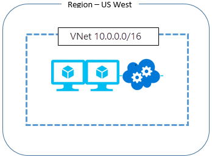

# Azure DDoS Protection – business continuity

Business continuity and disaster recovery in Azure DDoS Protection enables your business to continue operating in the face of a disruption. This article discusses availability (intra-region) and disaster recovery.

## Overview
Azure DDoS Protection protects public IP addresses in virtual networks. Protection is simple to enable on any new or existing virtual network and does not require any application or resource changes.

A Virtual Network (VNet) is a logical representation of your network in the cloud. VNets serve as a trust boundary to host your resources such as Azure Application Gateway, Azure Firewall and Azure Virtual Machines. It is created within the scope of a region. You can *create* VNets with same address space in two different regions (For example, US East and US West), but because they have the same address space, you can't connect them together. 

## Business continuity

There could be several different ways that your application could be disrupted. A region could be completely cut off due to a natural disaster, or a partial disaster, due to a failure of multiple devices or services. The impact on your protected VNets is different in each of these situations.

**Q: If an outage occurs for an entire region, what do I do? For example, if a region is completely cut off due to a natural disaster? What happens to the virtual networks hosted in the region?**

A: The virtual network and the resources in the affected region remains inaccessible during the time of the service disruption.

**Q: What can I do to re-create the same virtual network in a different region?**

A: Virtual networks are fairly lightweight resources. You can invoke Azure APIs to create a VNet with the same address space in a different region. To recreate the same environment that was present in the affected region, you make API calls to redeploy the resources in the VNets that you had. If you have on-premises connectivity, such as in a hybrid deployment, you have to deploy a new VPN Gateway, and connect to your on-premises network.

To create a virtual network, see [Create a virtual network](../virtual-network/manage-virtual-network.md#create-a-virtual-network).

**Q: Can a replica of a VNet in a given region be re-created in another region ahead of time?**

A: Yes, you can create two VNets using the same private IP address space and resources in two different regions ahead of time. If you are hosting internet-facing services in the VNet, you could have set up Traffic Manager to geo-route traffic to the region that is active. However, you cannot connect two VNets with the same address space to your on-premises network, as it would cause routing issues. At the time of a disaster and loss of a VNet in one region, you can connect the other VNet in the available region, with the matching address space to your on-premises network.

To create a virtual network, see [Create a virtual network](../virtual-network/manage-virtual-network.md#create-a-virtual-network).

## Next steps

- Learn how to [create a DDoS protection plan](manage-ddos-protection.md).
