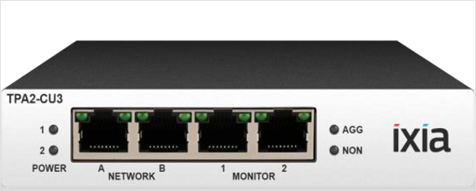
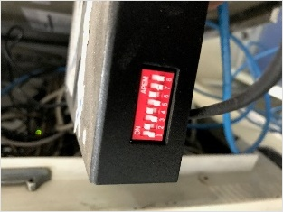
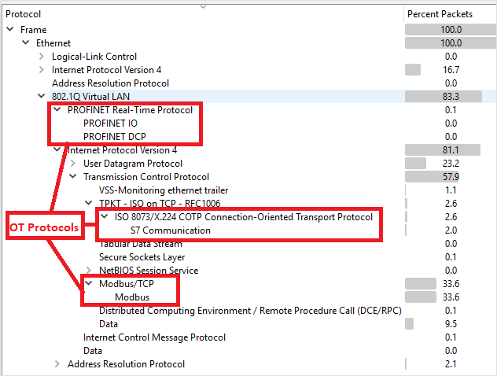
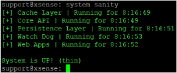
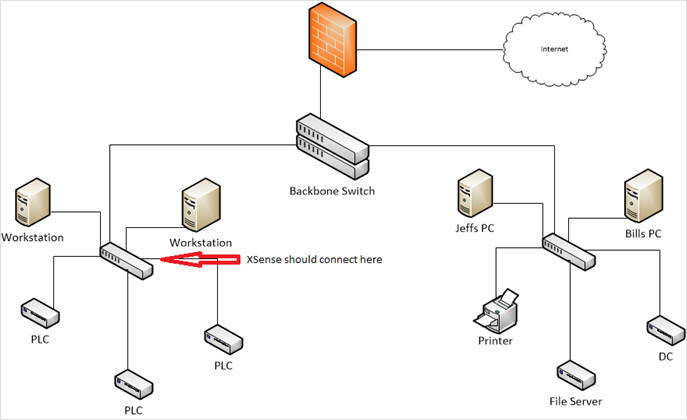

# About Azure Defender for IoT

Azure Defender for IoT delivers continuous ICS threat monitoring and asset discovery. The platform includes the following components:

**Defender for IoT sensors:** Sensors collect ICS network traffic using passive (agentless) monitoring. Passive and non-intrusive, the sensors have zero performance impact on OT and IoT networks and devices. The sensor connects to a SPAN port or network TAP and immediately begins monitoring your network. Detections are displayed in the sensor console, where they can be viewed, investigated, and analyzed in a network map, asset inventory, and an extensive range of reports, for example risk assessment reports, data mining queries and attack vectors. Read more about sensor capabilities in the [Defender for IoT Sensor User Guide](https://aka.ms/AzureDefenderforIoTUserGuide).

**Defender for IoT on-premises management console**: The on-premises management console provides a consolidated view of all network assets and delivers a real time view of key OT and IoT risk indicators and alerts across all your facilities. Tightly integrated with your SOC workflows and playbooks, it enables easy prioritization of mitigation activities and cross-site correlation of threats. Read more about management capabilities in the [On-premises Management Console User Guide](https://aka.ms/DefenderForIoTManagementConsole).

**Defender for IoT for IoT portal:** The Defender for IoT application is used to help you purchase solution appliances; install and update software and update TI packages. Read more in the [Deployment and Onboarding Guide](https://aka.ms/AzureDefenderforIoTOverview).

## Document goals

The purpose of this document is to provide information about solution architecture and provide guidance regarding preparation, pre-requisites, and information that is needed to ensure you successfully set up your network to work with Defender for IoT appliances.

### Audience

The intended audience for this document includes stakeholders experienced in operating and managing OT and IoT networks, for example automation engineers, plant managers, OT Network infrastructure service providers, cyber security teams, CISO, CIO.

### Other flows

This document describes how to connect your sensor to the network. The network setup processes described here reflect important tasks required to get your system up and running. Additional steps are also required. It is recommended that you understand these steps and familiarize yourself with information in the accompanying documents.  

Once you complete all steps, Defender for IoT will monitor network traffic and report detections via deployed sensors. Depending on how you set up your solution, detections can also be sent to the Defender for IoT application and Sentinel.

Verify that you have completed steps 1 & 2 before proceeding to step described in this document (step 3).

1. Create a Defender for IoT subscription.

2. Deploy hardware, software, and an onboard to sensor. This is described in the installation guide.

3. Perform network setup for sensor monitoring and management. This is described in this article.

4. Set up your sensor console to start discovering your network, for example define subnets, alert exclusion rules, connect sensors to an on-premises management console. See the [Defender for IoT Sensor User Guide](https://aka.ms/AzureDefenderforIoTUserGuide) and [On-premises Management Console User Guide](https://aka.ms/DefenderForIoTManagementConsole) for details.

5. Populate Sentinel with alert information (optional).

### Get more information

- To get assistance or support, contact [support.microsoft.com](https://support.microsoft.com/en-us/supportforbusiness/productselection?sapId=82c88f35-1b8e-f274-ec11-c6efdd6dd099)

- For additional documentation, visit the [Help Center](https://help.cyberx-labs.com/)

## On-site deployment tasks

Site Deployment tasks include:

- [Gather site information](#gather-site-information)

- [Prepare a configuration workstation](#prepare-a-configuration-workstation)

- [Plan rack installation](#plan-rack-installation)

### Gather site information

Record site information, for example:

- Sensor management network information

- Site network architecture

- Physical environment

- System integrations

- Planned user credentials

- Configuration workstation

- SSL certificates (optional).

- SMTP authentication (Optional). To use the SMTP server with authentication, prepare the credentials required for your server.

- DNS Server (Optional) Prepare your DNS server IP and Hostname.

#### Successful monitoring guidelines

To find the optimal place to connect the appliance in each of your production networks, it is recommended to follow the procedure below:

:::image type="content" source="media/how-to-set-up-your-network/production-network-diagram.png" alt-text="Diagram example of production network setup":::

### Prepare a configuration workstation

Prepare a Windows workstation, including the following:

- Connectivity to the sensor management interface.

- A supported browser

- Terminal software, such as Putty.

- Make sure the required firewall rules are open on the workstation. See [Network Access Requirements](#network-access-requirements) for details.

#### Supported browsers

The following browsers re supported for the sensors and on-premises management console web applications:

- Chrome 32+

- Microsoft Edge 86+

- Explorer 10+

### Network access requirements

Verify that your organizational security policy allows access to the following:

| **Purpose**	| **Protocol** | **Transport** | **In or out** | **Port** | **Category** |
| ----------- | ----------- | ------------ | ---------- | -------- | ------------ |
| **Access to the web console** | HTTPS | TCP | In or out | 443 | Central manager Defender for IoT platform web console |
| **Access to the CLI** | SSH | TCP | In or out | 22 | CLI |
| **Connection between the Defender for IoT platform and the central manager** | SSL | TCP | In or out | 443 | Sensor and central manager|
| **Central manager used as NTP to the sensor** | NTP | UDP| In to CM | 123 | Time sync | 
| **Sensor connected to external NTP server (if relevant)** | NTP | UDP | In or out| 123 | Time sync |
| **The connection between Defender for IoT platform and management platform and the mail server (if relevant)** | SMTP | TCP | Out of sensor management | 25 | Email |
| **Logs that send from central manager to Syslog server (if relevant)** | Syslog | UDP | Out of sensor management| 514 | LEEF |
| **DNS Server Port (if relevant)** | DNS | N/A | In or out| 53 | DNS |
| **The connection between Defender for IoT platform and central manager to active directory (if relevant)** | LDAPS | TCP | In or out | 636  389 | Active directory |
| **Remote SNMP collectors (if relevant)** | SNMP | UDP | Out of sensor management| 161 | Monitoring |
| **Windows endpoint monitoring (if relevant)** | WMI | UDP | Out of sensor management| 135 | Monitoring |
| **Windows endpoint monitoring (if relevant)** | WMI | TCP | Out of sensor management| 1024 and above | Monitoring |
| **Tunneling (if relevant)** | Tunneling | TCP | IN to CM | 9000 in addition to port 443 From the end-user to the central manager. Port 22 from the sensor to the Central Manager | Monitoring |
| **Outbound to the Defender for IoT hub** | HTTPS | TCP | Out of sensor management| **URL** *.azure-devices.net:443 or if wildcards are not supported {your iot hub name}.azure-devices.net:443 |

### Plan rack installation

This section describes how to plan your rack installation.

**To plan:**

1. Prepare a monitor and a keyboard for your appliance network settings.
2. Allocate the rack space for the appliance.
3. Make sure you have the AC power available for the appliance.
4. Prepare the LAN cable for connecting the management to the network switch.
5. Prepare the LAN cable(s) for connecting switch SPAN (mirror) ports and or network taps to the Defender for IoT appliance. 
6. Configure, connect, and validate SPAN port(s) in the mirrored switches as agreed in the architecture review session.
7. Connect the configured SPAN port to a computer running Wireshark and verify the port is configured correctly.
8. Open all the relevant firewall ports.

## About passive network monitoring

The appliance receives traffic from multiple sources – either by switch mirror ports (SPAN ports) and or network TAPs. The management port is connected to the business, corporate, or sensor management network with connectivity to an on-premises management console and or the Defender for IoT portal.

:::image type="content" source="media/how-to-set-up-your-network/switch-with-port-mirroring.png" alt-text="Diagram of Managed Switch with Port Mirroring.":::

### The Purdue Model

This article descries Purdue levels.

:::image type="content" source="media/how-to-set-up-your-network/purdue-model.png" alt-text="Diagram of the Purdue model.":::

####  Level 0 – cell and area  

Consists of a wide variety of sensors, actuators, and devices involved in the basic manufacturing process. These devices perform the basic functions of the industrial automation and control system, such as driving a motor, measuring variables, setting an output, and performing key functions such as painting, welding, bending, etc.

#### Level 1 – process control

Consists of embedded controllers that control and manipulate the manufacturing process whose key function is to interface with the level 0 devices. In discrete manufacturing, those devices are Programmable Logic Controllers (PLCs) or Remote Telemetry Units (RTUs). In process manufacturing, the basic controller is referred to as a distributed control system (DCS).

#### Level 2 – Supervisory

Represents the systems and functions associated with the runtime supervision and operation of an area of a production facility. These usually include the following: 

- Operator interfaces or HMIs

- Alarms or alerting systems

- Process historian and batch management systems

- Control room workstations

These systems communicate with the PLCs and RTUs in Level 1 and in some cases interface or share data with the site or enterprise (Level 4 and 5) systems and applications. These systems are primarily based on standard computing equipment and operating systems (Unix or Microsoft Windows based).

#### Level 3 and 3.5 – site level and industrial DMZ

The site level represents the highest level of industrial automation and control systems. The systems and applications that exist at this level manage site-wide industrial automation and control functions. Levels 0 through 3 are considered critical to site operations. The systems and functions that exist at this level may include the following:

- Production reporting (for example, cycle times, quality index, predictive maintenance)

- Plant historian

- Detailed production scheduling

- Site level operations management

- Asset and material management

- Patch launch server

- File server

- Industrial domain, AD, terminal server

These systems communicate with the production zone and share data with the enterprise (Levels 4 and 5) systems and applications.  

#### Levels 4 and 5 – business and enterprise networks

These levels represent the site or enterprise network where the centralized IT systems and functions exist. The services, systems, and applications at these levels are directly managed and operated by the IT organization.

## Planning for network monitoring

In the following examples, different types of industrial control network topologies will be presented, along with considerations for optimal monitoring and placement of sensors.

### What should be monitored?

Traffic that goes through layer 1 and 2.

### What should the Defender for IoT appliance connect to?

The managed switches that see the industrial communications between layer 1 and 2 (in some cases also layer 3).

Below is a general abstraction of a multi-layer, multi-tenant network, with an expansive cybersecurity ecosystem typically operated by a SOC and MSSP.

Typically, NTA sensors are deployed in layers 0-3 of the OSI model.

:::image type="content" source="media/how-to-set-up-your-network/osi-model.png" alt-text="Diagram of the OSI model.":::

#### Example: ring topology

The ring network is a network topology in which each switch or node connects to exactly two other switches, forming a single continuous pathway for the traffic.

:::image type="content" source="media/how-to-set-up-your-network/ring-topology.PNG" alt-text="Diagram of the Ring Topology.":::

#### Example linear and bus and star topology

In a star network, every host is connected to a central hub. In its simplest form, one central hub acts as a conduit to transmit messages. In the example below, lower switches are not monitored, traffic that remains local to these switches will not be seen. Devices may be identified based on ARP messages, but connection information will be missing.

:::image type="content" source="media/how-to-set-up-your-network/linear-bus-star-topology.PNG" alt-text="Diagram of the linear-bus-star topology.":::

#### Multisensor deployment

This section provides recommendations when deploying multiple sensors.

|                   |                | **Dependency** | **Number of sensors** |
| ----------------- | -------------- | -------------- | --------------------- |
| The maximum distance between switches | 80 meters | Prepared Ethernet cable | More than 1 |
| Number of OT networks | More than 1 | No physical connectivity | More than 1 |
| Number of switch’s | Can use RSPAN configuration | Up to 8 switches with local span close to the sensor by cabling distance | More than 1 |

#### Traffic mirroring  

To see only relevant information for traffic analysis, it is required to connect the Defender for IoT platform to a mirroring port on a switch or a TAP, that includes only industrial ICS and SCADA traffic​. 

Monitoring switch traffic can be accomplished with the following methods:

- [Switch SPAN Port](#switch-span-port)

- [Remote SPAN (RSPAN)](#remote span-rspan)

SPAN and RSPAN are Cisco terminology. Other brands of switches have similar functionality but may use different terminology.

- Active and passive aggregation TAP

#### Switch SPAN port

Switch port analyzer mirrors local traffic from interface(s) on the switch to interface(s) on the same switch.

- Verify that the relevant switch supports the port mirroring function.  

- The mirroring option is disabled by default.

- It is recommended to configure all of the switch's ports, even if no data is connected to them. Otherwise a rogue device could be connected to an unmonitored port and it would not be alerted on the sensor.

- On OT networks that utilize broadcast or multicast messaging, configure the switch to mirror only RX (Receive) transmissions. Otherwise, multicast messages will be repeated for as many active ports and the bandwidth is multiplied.

The following examples are for reference only and are based on a Cisco 2960 switch running IOS. They are typical only and are not to be used as instructions. Mirror ports on other Cisco operating systems and other brands of switches are configured differently.

**SPAN port** Configuration example – Cisco 2960 (24 ports)

:::image type="content" source="media/how-to-set-up-your-network/span-port-configuration-terminal.png" alt-text="Diagram of SPAN port configuration terminal.":::
:::image type="content" source="media/how-to-set-up-your-network/span-port-configuration-mode.png" alt-text="Diagram of SPAN port configuration mode.":::

##### Monitoring multiple VLANs

Defender for IoT allows monitoring VLANs configured in your network. No configuration of the Defender for IoT system is required. The user needs to ensure that the switch in your network is configured to send VLAN tags to Defender for IoT.

The following is an example configuration that shows the required commands that must be configured on the Cisco switch to enable monitoring VLANs in Defender for IoT:

Monitor session:

This command is responsible for the process of sending VLANs to the span port.

- monitor session 1 source interface Gi1/2

- monitor session 1 filter packet type good Rx

- monitor session 1 destination interface fastEthernet1/1 encapsulation dot1q

Monitor Trunk Port F.E. Gi1/1: VLANs are configured on the trunk port.

- interface GigabitEthernet1/1

- switchport trunk encapsulation dot1q

- switchport mode trunk

#### Remote SPAN (RSPAN)

Remote SPAN session mirrors traffic from multiple distributed source ports into a dedicated ‘remote VLAN’.  

:::image type="content" source="media/how-to-set-up-your-network/remote-span.png" alt-text="Diagram of Remote SPAN.":::

The data in the VLAN is then delivered through trunked ports across multiple switches to a specific switch that contains the physical destination port that connects to the Defender for IoT platform.  

##### More about RSPAN

- RSPAN is an advanced feature that requires a special VLAN to carry the traffic that is monitored by SPAN between switches. RSPAN is not supported on all switches. Verify that this switch supports the RSPAN function

- The mirroring option is disabled by default.

- The remote VLAN must be allowed on the trunked port between the source and destination switches.

- All switches that connected the same RSPAN session must be from the same vendor.

> [!NOTE]
> Make sure that the trunk port that is sharing the remote VLAN between the switches is not defined as mirror session source port
>
> The Remote VLAN increases the bandwidth on the trunked port by the size of the mirrored session bandwidth. Verify that the switch’s trunk port supports that  

:::image type="content" source="media/how-to-set-up-your-network/remote-vlan.jpg" alt-text="Diagram of remote VLAN.":::

#### RSPAN Configuration – Examples

RSPAN: Based on Cisco catalyst 2960 (24 ports)

**Source switch configuration example:**

:::image type="content" source="media/how-to-set-up-your-network/rspan-configuration.png" alt-text="Screenshote of RSPAN configuration.":::

- Enter global configuration mode

- Create dedicated VLAN

- Identify the VLAN as the RSPAN VLAN

- Return to “configure terminal” mode

- Configure all 24 ports as session source

- Configure RSPAN VLAN to be the session destination

- Return to privileged EXEC mode

- Verify the port mirroring configuration

**Destination switch configuration example:**

- Enter global configuration mode

- Configure RSPAN VLAN to be the session source

- Configure physical port 24 to be the session destination

- Return to privileged EXEC mode

- Verify the port mirroring configuration

- Save the configuration

#### Active and passive aggregation TAP

An active or passive aggregation TAP is installed inline to the network cable and duplicates both RX and TX to the monitoring sensor.

The Terminal Access Point (TAP) is a hardware device that allows network traffic to flow from ports A to B, and B to A without interruption, and creates an exact copy of both sides of the traffic flow, continuously, 24/7 without compromising network integrity. Some TAPs aggregate transmit and receive traffic using switch settings if desired. If aggregation is not supported, each tap uses two sensor ports to monitor send and receive traffic.

Taps are advantageous for a variety of reasons. They are hardware-based and thus cannot be compromised. They pass all traffic, even damaged messages, which switches often drop. They are not processor sensitive, so packet timing is exact, where switches handle the mirror function as a low-priority task that can affect the timing of the mirrored packets. For forensic purposes, a tap is the best device.

Tap aggregators may also be used for port monitoring. These devices are processor-based and hence are not as intrinsically secure as hardware taps and may also not reflect exact packet timing.

:::image type="content" source="media/how-to-set-up-your-network/active-passive-tap.PNG" alt-text="Diagram of active and passive tap.":::

##### Common tap models

These models have been tested for compatibility. Other vendors and models may also be compatible.

:::row:::
   :::column span="":::
      
      Garland
      P1GCCAS
   :::column-end:::
   :::column span="":::
      
      IXIA
      TPA2-CU3
   :::column-end:::
   :::column span="":::
      
      US Robotics
      USR 4503
   :::column-end:::
:::row-end:::

##### Special TAP configuration

| Garland TAP | US Robotics TAP |
| ----------- | --------------- |
| Make sure jumpers set as follows:  | Make sure Aggregation mode is active |

## Deployment validation

### Engineering self-review  

Reviewing your OT/ICS Network Diagram is the most efficient way to define where is the best place to connect to get the most relevant traffic for monitoring.

The site Engineers know best what their network looks like. Having a review session with the local network and operational teams will usually shed light on expectations and define where is the best place to connect the appliance.

Relevant information:

- A list of known assets (spreadsheet)  

- Estimated number of devices.  

- Vendors and industrial protocols

- Switches model – to verify that Port mirroring option is available.

- Who manages the switches? It is external resource? Is it IT?

- A list of OT networks at site

#### Common questions

- What are the overall goals of the implementation? Is a complete inventory and accurate network map important?

- Are there multiple/redundant networks in the ICS? Are all the networks being monitored?

- Are there communications between the ICS and the Enterprise (Business) network? Are these communications being monitored?

- Are there VLANs configured in the network design?

- How is maintenance of the ICS performed, with fixed or transient assets?

- Where are firewalls installed in the monitored networks?

- Is there any routing in the monitored networks?

- What OT protocols are active on the monitored network(s)?

- If we connect to this switch, will we see communication between the HMI and the PLCs?

- What is the physical distance between the ICS switches and the Enterprise firewall? 

- In case of unmanaged switches, can they be replaced with managed switches or is the use of Network TAPs an option?

- Is there any “serial” communication in the network? If “yes” please show me on the network diagram.

- In case the Defender for IoT appliance should be connected to that switch, is there physical available rack space in that cabinet?

#### Additional considerations

Defender for IoT appliance purpose is to monitor traffic from levels 1 to 2.

For some architectures, Defender for IoT appliance will also monitor layer 3 if there is the existence of OT traffic on this layer. While reviewing the site architecture, the following variables should be considered when deciding if to monitor a switch or not:

1. What is the cost-benefit vs. the importance of monitoring this switch?

2. If a switch is unmanaged, will it be possible to monitor the traffic from the higher-level switch?

3. If the ICS architecture is a ring topology, only one switch in this ring needs to be monitored

4. What is the security or operational risk in this network?

5. It is possible to monitor switch’s VLAN, is that VLAN is visible in another switch we can monitor?

#### Technical validation

Receiving a sample of recorded traffic (PCAP file) from the switch SPAN (or mirror) port can help to:

- Validate if the switch is configured properly

- If the traffic that goes through the switch is relevant for monitoring (OT traffic)

- Identify bandwidth and the estimated number of devices in this switch and

Recording a sample PCAP file (a few minutes) can be done by connecting a laptop using **Wireshark** application to already configured SPAN port

#### Wireshark validation

- Check that there is a presence of **Unicast packets** in the recording traffic. Unicast (as shown above) is from one address to another. If most of the traffic is arp messages (Who has x.x.x.x), then the switch setup is incorrect.

- Go to **Statistics -> Protocol Hierarchy.** Verify that there is a presence of industrial OT protocols.

## Appendix 1 - Troubleshooting

The following troubleshooting issues are covered:

- [Cannot Connect Using a Web Interface](#cannot-connect-using-a-web-interface)

- [The Appliance is not Responding](#the-appliance-is-not-responding)

### Cannot connect using a web interface

1. Verify that the computer that trying to connect is on the same network as the appliance.

2. Verify that the GUI network is connected to the Management port on the sensor.

3. Ping the appliance IP address. If there is no response to Ping:

    - Connect a monitor and a keyboard to the appliance.

    - Use **support** user and password to sign in.

    - Use the command **network list** to see the current IP address.

    

4. In case the network parameters are misconfigured, use the following procedure to change it:

    - Use command network edit-settings

    - To change the management network IP address, select **Y**.

    - To change the subnet mask, select **Y**.

    - To change the DNS, select **Y**.

    - To change the default gateway IP address, select **Y**.

    - (for sensor only) For the input interface change, select **N**.

    - Bridge interface, select N.

    - To apply the settings, select **Y**.

5. After reboot, connect with user Support and use the network list command to verify that the parameters were changed.

6. Try to ping and connect from GUI again.

### The appliance is not responding

1.  Connect with a monitor and keyboard to the appliance or use Putty to connect remotely to the CLI.

2. Use the Support credentials to log in.

3. Use system sanity command and check that all processes are up and running.

    

For any other issues, contact [support.microsoft.com](https://support.microsoft.com/en-us/supportforbusiness/productselection?sapId=82c88f35-1b8e-f274-ec11-c6efdd6dd099).

## Appendix 2 - Example site book

Use the Example Site Book to retrieve and review important information needed for network setup.

### Site checklist

Review this list prior to site deployment.

| **#** | **Task or Activity** | **Status** | **Comments** |
| ----- | -------------------- | ---------- | ------------ |
| 1     | Provide Global       | ☐         |              |
| 3     | Order appliance(s)   | ☐         |              |
| 4     | Prepare a list of subnets in the network | ☐    |              |
| 5     | Provide a VLAN list of the Production networks.  | ☐   |       |
| 6     | Provide a list of switch models in the network  | ☐   |       |
| 7     | Provide a list of vendors and protocols of the industrial equipment | ☐  | |
| 8     | Provide network details for sensor/s (IP, Subnet, D-GW, DNS) | ☐   |  |
| 9     | Create necessary firewall rules/access list. | ☐    |      |
| 10    | Create spanning ports on switches for port monitoring or configure network taps as desired. | ☐   |  |
| 11    | Prepare rack space for sensor/s appliances | ☐       |              |
| 12    | Prepare a workstation for personnel | ☐          |              |
| 13    | Provide keyboard, monitor, and mouse for the Defender for IoT rack devices | ☐   |     |
| 14    | Rack and cable the appliance(s) | ☐          |              |
| 15    | Allocate site resources to support deployment | ☐    |              |
| 16    | Create Active Directory groups or local users | ☐          |        |
| 17    | Training (self-learning) | ☐          |              |
| 18    | Go No Go          | ☐          |              |
| 19    | Schedule deployment date  | ☐          |              |

| **Date**                   |     | **Deployment date**   |  |
| -------------------------- | --- | --------------------- | --- |
| **Defender for IoT** |     | **Site name**         |  |
| **Name**                   |     | **Name**              |  |
| **Position**               |     | **Position**          |  |

#### Architecture review

An overview of the industrial network diagram will allow you to define the proper location for Defender for IoT equipment.

1.  A global network diagram of the industrial OT environment. For example:

 

> [!NOTE]
> Defender for IoT appliance should be connected to a lower level switch that sees the traffic between the ports on the switch.  

2. Provide approximate number of assets in the networks (Optional)

3. Provide a subnet list for the Production networks and a description (Optional)  

    |    | **Subnet Name** | **Description** |
    | -- | --------------- | --------------- |
    | 1  | |
    | 2  | |
    | 3  | |
    | 4  | |

4. Provide a VLAN list of the Production networks.

    |    | **VLAN Name** | **Description** |
    | -- | --------------- | --------------- |
    | 1  | |
    | 2  | |
    | 3  | |
    | 4  | |  

5. To verify that the switches have port mirroring capability, provide the Switch model numbers that Defender for IoT platform should connect to:

    |    | **Switch** | **Model** | **Traffic Mirroring Support (e.g SPAN/RSPAN/None)** |
    | -- | --------------- | --------------- | --------------- |
    | 1  | | |
    | 2  | | |
    | 3  | | |
    | 4  | |   |

    Does a third party manage the switches Y/N 

    If Yes, Who __________________________________ 

    What is his policy __________________________________ 

    For example:

    -  Siemens

    -  Rockwell Automation – Ethernet/IP

    - Emerson – DeltaV, Ovation

    - Etc.

6.  Specify if there are devices that communicate via a serial connection in the network: Yes/No 

    If **Yes,** specify which serial communication protocol: ________________ 

    If **Yes,** mark on the network diagram where and what are the devices that communicate with serial protocols: 
 
    <Add network diagram with marked serial connection> 

7. QOS, the default setting of the sensor is 1.5 Mbps, specify if you want to change it  
________________ 

Business Unit (BU) ________________ 

### Specifications for site equipment

#### Network  

The sensor appliance is connected to switch SPAN port using a network adapter and connected to the customer’s corporate network for Management using an additionally dedicated network adapter.

Provide address details for sensor NIC that will be connected in the corporate network: 

|                 | Appliance #1 | Appliance #2 | Appliance #3 |
| --------------- | ------------- | ------------- | ------------- |
| Appliance IP    |               |               |               |
| Subnet          |               |               |               |
| Default Gateway |               |               |               |
| DNS             |               |               |               |
| Host Name       |               |               |               |

#### iDRAC/iLO/Server management

|                 | Appliance #1 | Appliance #2 | Appliance #3 |
| --------------- | ------------- | ------------- | ------------- |
| Appliance IP    |               |               |               |
| Subnet          |               |               |               |
| Default Gateway |               |               |               |
| DNS             |               |               |               |

#### On-premises management console  

|                 | Active | Passive (when using HA) |
| --------------- | ------ | ----------------------- |
| IP              |        |                         |
| Subnet          |        |                         |
| Default Gateway |        |                         |
| DNS             |        |                         |

#### SNMP  

|                 | **Details** |
| --------------- | ------ |
| IP              |        |
| IP Address | |
| Username | |
| Password | |
| Auth Type | MD5/SHA |
| Encryption | DES/AES |
| Secret Key | |
| SNMP V2 Community String |

### CM SSL certificate

Are you planning to use SSL certificate? Yes/No

If Yes what service you use to generate it and what attributes do you include in the certificate (domain, IP, etc.)

### SMTP authentication

Are you planning to use SMTP to forward alerts to email server? Yes/No 

If Yes what authentication method, you will use  

### Active Directory or local users

Contact Active Directory administrator to create Active Directory site user/s groups or create local users. Make sure you have your users ready for the deployment day 

### IoT asset types in the network

| Asset type | # of Assets in the network | Average Bandwidth |
| --------------- | ------ | ----------------------- |
| Camera | |
| X-ray machine | |