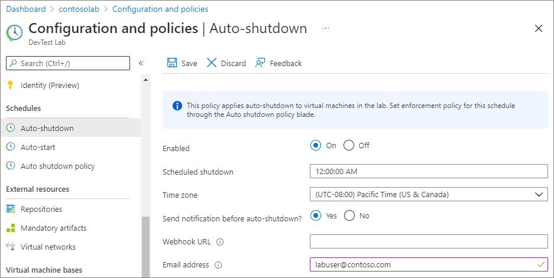
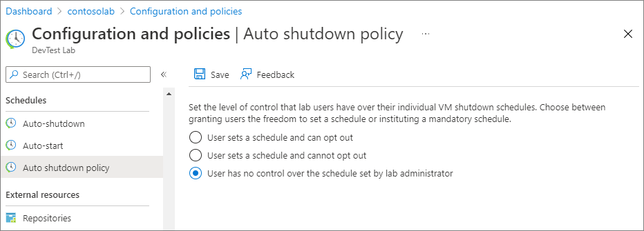
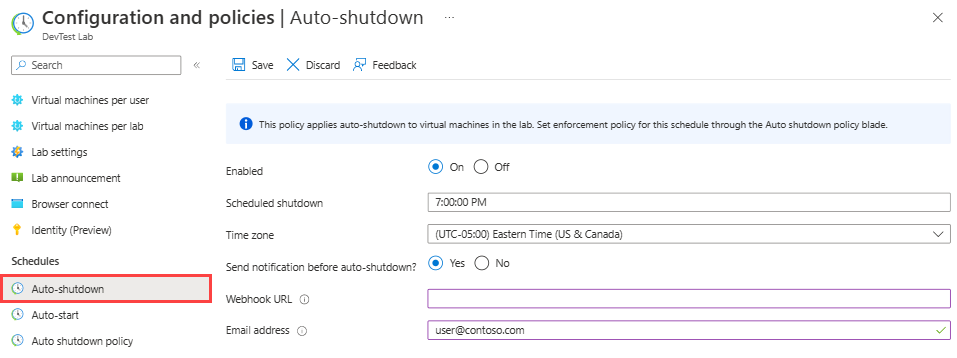
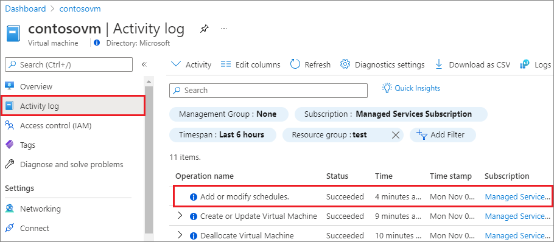
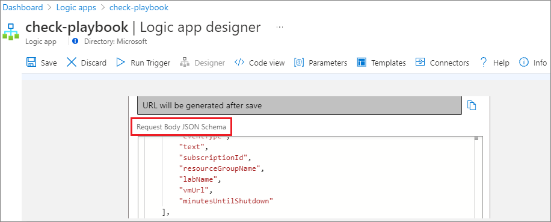
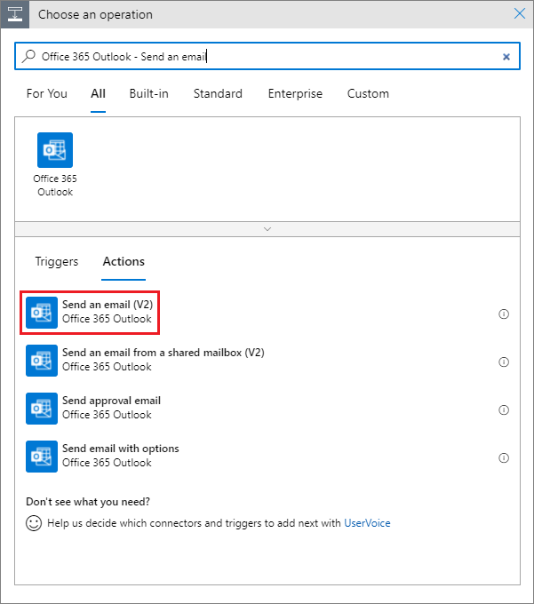

# Configure autoshutdown for labs and VMs in DevTest Labs

As an Azure DevTest Labs lab owner, you can configure a schedule to shut down all the virtual machines (VMs) in your lab at a specific time of day or night. You save the cost of running machines that aren't being used.

You can also set a central autoshutdown policy to control whether lab users can schedule autoshutdown for their own individual VMs. Autoshutdown policies range from allowing VM owners to fully control their VM's shutdown schedules to allowing them no control over the schedules.

This article explains how to set autoshutdown schedules for DevTest Labs labs and for individual lab VMs. The article also describes how to set lab autoshutdown policy, and how to configure autoshutdown notifications.

## Configure lab autoshutdown schedule

Autoshutdown helps minimize lab waste by shutting down all of a lab's VMs at a specific time of day or night. To view or change a lab's autoshutdown schedule, follow these steps:

1. On the home page for your lab, select **Configuration and policies**.
1. In the **Schedules** section of the left menu, select **Auto-shutdown**.
1. On the **Auto-shutdown** screen, for **Enabled**, select **On** to enable autoshutdown, or **Off** to disable it.
1. For **Scheduled shutdown** and **Time zone**, if you turned on autoshutdown, specify the time and time zone to shut down all lab VMs.
1. For **Send notification before auto-shutdown?**, select **Yes** or **No** for the option to send a notification 30 minutes before the specified autoshutdown time. If you choose **Yes**, enter a webhook URL endpoint under **Webhook URL** or semicolon-separated email addresses under **Email address** where you want the notification to post or be sent. For more information, see the [Autoshutdown notifications](#autoshutdown-notifications) section.
1. Select **Save**.

   

By default, this schedule applies to all VMs in the lab. To remove this setting from a specific VM, if allowed by policy, open the VM's management pane and change its **Auto-shutdown** setting.

> [!NOTE]
> If you update the autoshutdown schedule for your lab or a VM within 30 minutes of the previously scheduled shutdown time, the new shutdown time takes effect the next day.

## Configure lab autoshutdown policy

As a lab owner, you can control cost and minimize waste in your labs by managing autoshutdown policy settings for your lab. To see how to set all lab policies, see [Define lab policies in Azure DevTest Labs](devtest-lab-set-lab-policy.md). 

> [!IMPORTANT]
> Autoshutdown policy changes apply only to new VMs created in the lab, not to the already existing VMs.

1. On the home page for your lab, select **Configuration and policies**.

1. In the **Schedules** section of the left menu, select **Auto shutdown policy**.

1. Select one of the options.

   

   - **User sets a schedule and can opt out**: Lab users can override or opt out of the lab schedule. This option grants VM owners full control to set their VMs' autoshutdown schedules.

   - **User sets a schedule and cannot opt out**: Lab users can override the lab schedule, but they can't opt out of the autoshutdown policy. This option ensures that every lab VM is under an autoshutdown schedule. VM owners can update the schedule time, and set up shutdown notifications.

   - **User has no control over the schedule set by lab administrator**: Lab users can't alter or opt out of the lab autoshutdown schedule. This option gives the lab administrator complete control of the schedule for all lab VMs. VM owners can still set up autoshutdown notifications for their VMs.

1. Select **Save**.

## Configure VM autoshutdown settings

Depending on the autoshutdown policy, you can also set an autoshutdown schedule for individual lab VMs.

1. On the home page for the VM, in the **Operations** section on the left menu, select **Auto-shutdown**.
1. On the **Auto-shutdown** screen, for **Enabled**, select **On** to enable autoshutdown, or **Off** to disable it.
1. For **Scheduled shutdown** and **Time zone**, if you turned on autoshutdown, specify the time and time zone to shut down all lab VMs.
1. For **Send notification before auto-shutdown?**, select **Yes** or **No** for the option to send a notification 30 minutes before the specified autoshutdown time. If you choose **Yes**, enter a webhook URL endpoint under **Webhook URL** or semicolon-separated email addresses under **Email address** where you want the notification to post or be sent. For more information, see the [Autoshutdown notifications](#autoshutdown-notifications) section.
1. Select **Save**.

   

### View activity logs for autoshutdown updates

After you update autoshutdown settings, you can see the activity logged in the activity log for the VM.

1. On the home page for the VM, select **Activity log** from the left menu.
1. Remove the **Resource** filter, apply the appropriate **Resource group** filter, and view the entries for **Add or modify schedules**.

   

1. Select the **Add or modify schedules** operation to open a summary page that shows more details about the operation.

## Autoshutdown notifications

When you enable notifications in autoshutdown configuration, lab users receive a notification 30 minutes before autoshutdown if any of their VMs will be affected. The notification gives users a chance to save their work before the shutdown. If the autoshutdown settings specify an email address, the notification sends to that email address. If the settings specify a webhook, the notification sends to the webhook URL.

The notification can also provide links that allow the following actions for each VM if someone needs to keep working:

- Skip the autoshutdown this time
- Snooze the autoshutdown for an hour
- Snooze the autoshutdown for 2 hours

You can use webhooks to implement your own way of sending notifications. You set up integrations that subscribe to certain events. When one of those events happens, an HTTP POST payload sends to the webhook's URL.

Apps like [Azure Logic Apps](../logic-apps/logic-apps-overview.md) and Slack have extensive support for webhooks. For more information about responding to webhooks, see [Azure Functions HTTP triggers and bindings overview](../azure-functions/functions-bindings-http-webhook.md) and [Add an HTTP trigger for Azure Logic Apps](../connectors/connectors-native-http.md#add-an-http-trigger).

The following example shows you how to use Logic Apps to configure an autoshutdown notification that sends an email to VM owners.

### Create a logic app that sends email notifications

Logic Apps provides many connectors that make it easy to integrate a service with other clients, like Office 365 and Twitter. At a high level, the steps to set up a Logic App for email notification are:

1. Create a logic app.
1. Configure the built-in template.
1. Integrate with your email client.
1. Get the Webhook URL to use in autoshutdown notification settings.

To get started, create a logic app in Azure with the following steps:

1. In the Azure portal, enter *logic apps* into the top Search field, and then select **Logic apps**.

1. At the top of the **Logic apps** page, select **Add**.

1. On the **Create Logic App** page:

   - Select your Azure **Subscription**.
   - Select a **Resource Group** or create a new one.
   - Enter a **Logic App name**.
   - Select a **Region** for the logic app.

   

1. Select **Review + create**, and when validation passes, select **Create**.

1. When the deployment finishes, select **Go to resource** on the notification.

Next, configure the built-in template.

1. On the Logic App page, select **Logic app designer** under **Deployment Tools** in the left navigation.

1. Select **Templates** on the top menu.

1. Under **Templates**, select **HTTP Request/Response**.

   

1. On the **HTTP Request-Response** page, select **Use this template**.

   

1. Paste the following JSON code into the **Request Body JSON Schema** section.

   

    ```json
    {
        "$schema": "http://json-schema.org/draft-04/schema#",
        "properties": {
            "delayUrl120": {
                "type": "string"
            },
            "delayUrl60": {
                "type": "string"
            },
            "eventType": {
                "type": "string"
            },
            "guid": {
                "type": "string"
            },
            "labName": {
                "type": "string"
            },
            "owner": {
                "type": "string"
            },
            "resourceGroupName": {
                "type": "string"
            },
            "skipUrl": {
                "type": "string"
            },
            "subscriptionId": {
                "type": "string"
            },
            "text": {
                "type": "string"
            },
            "vmName": {
                "type": "string"
            },
            "vmUrl": {
                "type": "string"
            },
            "minutesUntilShutdown": {
                "type": "string"
            }
        },
        "required": [
            "skipUrl",
            "delayUrl60",
            "delayUrl120",
            "vmName",
            "guid",
            "owner",
            "eventType",
            "text",
            "subscriptionId",
            "resourceGroupName",
            "labName",
            "vmUrl",
            "minutesUntilShutdown"
        ],
        "type": "object"
    }
    ```

Now, integrate with your email client.

1. In the designer, select **New step**.

   

1. Enter *Office 365 Outlook - Send an email* in the Search field, and then select **Send an email (V2)** from **Actions**.

   

1. In the **Send an email (V2)** form, fill in the **To**, **Subject**, and **Body** fields. 

   Select **Add dynamic content** to automatically populate the notification with values that the app and connectors use. For example, for **To**, select **owner**. Populate **Subject** with **vmName** and **labName**. Add content like **skipUrl** and **delayUrl**s to the message body.

   

1. Select **Save** on the toolbar.

Now you can copy the webhook URL. Select the **When a HTTP request is received** step, and then select the copy button to copy the HTTP POST URL to the clipboard. Paste this webhook URL into the autoshutdown notification settings.


## Next steps

- [Auto startup lab virtual machines](devtest-lab-auto-startup-vm.md)
- [Define lab policies in Azure DevTest Labs](devtest-lab-set-lab-policy.md)
- [Receive and respond to inbound HTTPS requests in Azure Logic Apps](/azure/connectors/connectors-native-reqres)
