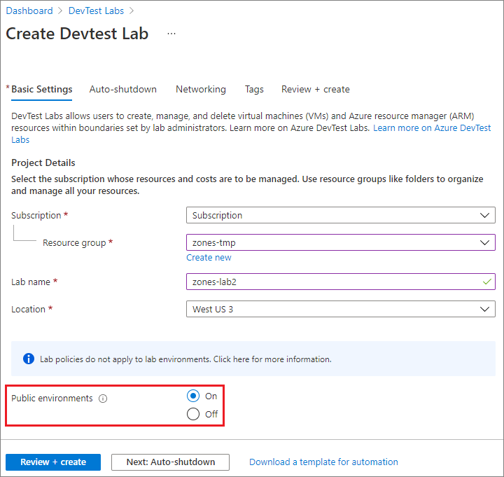
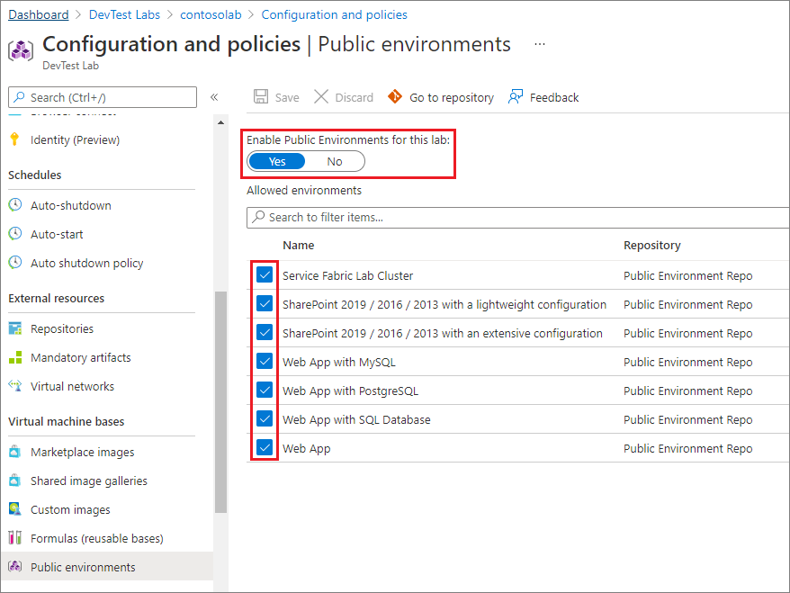
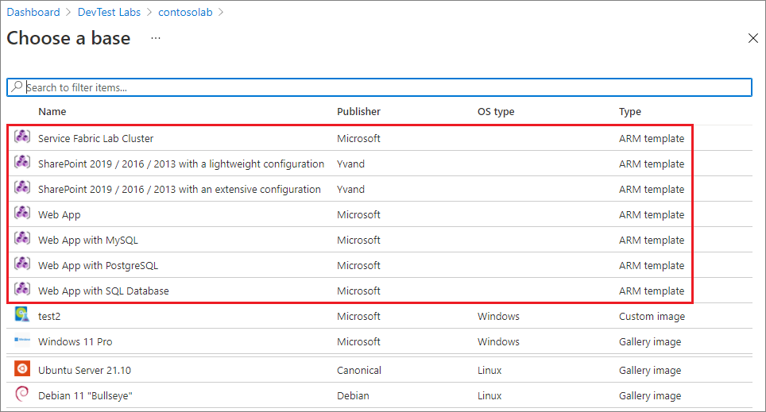
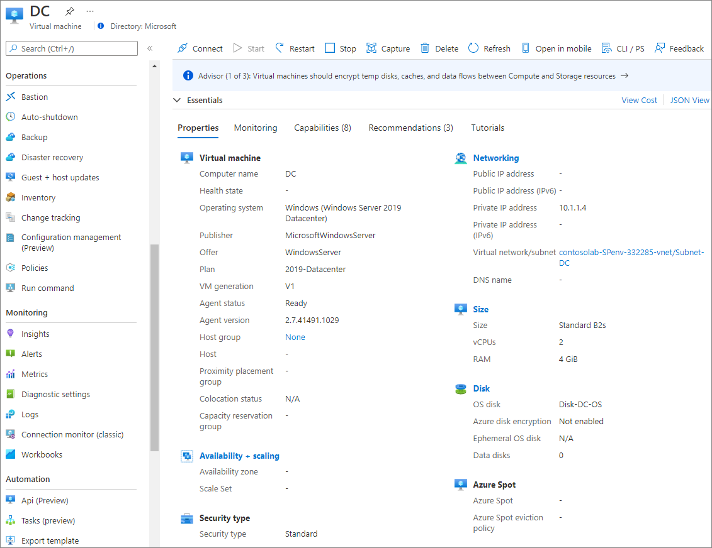
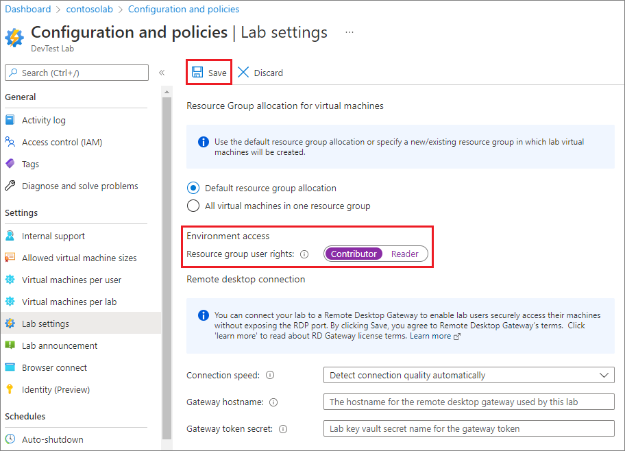

# Use ARM templates to create DevTest Labs environments

Azure multi-tier web apps or SharePoint farms use multiple virtual machines (VMs) with platform-as-a-service (PaaS) resources installed. You can provision these PaaS resources and infrastructure-as-a-service (IaaS) VMs in Azure DevTest Labs by using [Azure Resource Manager (ARM)](../azure-resource-manager/templates/syntax.md) environment templates.

[!INCLUDE [About Azure Resource Manager](../../includes/resource-manager-quickstart-introduction.md)]

Multi-VM ARM environment templates use the [Microsoft.Compute/virtualmachines](/azure/templates/microsoft.compute/virtualmachines) resource type. Lab users can use the templates to easily and consistently deploy multiple VMs with preinstalled resources as a single environment. The VMs created with this resource type appear under their environments in the lab's **My environments** list.


You can configure DevTest Labs to load ARM environment templates directly from public or private Git source control repositories. Lab users can then create environments by selecting the templates in the Azure portal, just as they select individual [VM base images](devtest-lab-comparing-vm-base-image-types.md) to create VMs.

VMs in the same environment share the same lifecycle, and lab users can manage the VMs together. You can track the cost of lab environments and PaaS resources, just as you track costs for individual lab VMs.

To learn more about the benefits of using ARM templates to deploy, update, or delete multiple lab resources and VMs as a single environment, see [Benefits of using Resource Manager templates](../azure-resource-manager/management/overview.md#the-benefits-of-using-resource-manager).

Consider these limitations when using ARM environment templates in DevTest Labs:

- VM auto-shutdown doesn't apply to PaaS resources.

- Not all lab policies are evaluated when deploying ARM templates. Policies that aren't evaluated include number of VMs per lab user, number of premium VMs per user, and number of premium desks per user. For example, your lab policy might limit users to only five VMs apiece. However, a user can deploy an ARM environment template that creates dozens of VMs.

<a name="create-your-own-template-repositories"></a>
<a name="configure-your-own-template-repositories"></a>
## Use public and private template repositories

Azure DevTest Labs has a [public ARM template repository](https://github.com/Azure/azure-devtestlab/tree/master/Environments) that includes pre-authored environment templates for Azure Web Apps, an Azure Service Fabric cluster, and development SharePoint farms. The templates have minimal input parameters, for a smooth getting started experience with PaaS resources.

You can use the public environment templates as-is, or customize them to suit your needs. To suggest revisions or additions to the public templates, submit pull requests against the open-source [GitHub public template repository](https://github.com/Azure/azure-devtestlab/tree/master/Environments) 

You can also [store environment templates in your own Git repositories](devtest-lab-use-resource-manager-template.md#store-arm-templates-in-git-repositories), and [connect those repositories to your lab](devtest-lab-use-resource-manager-template.md#add-template-repositories-to-labs) to make your templates available to all lab users.

## Enable and configure public environments

DevTest Labs users don't have to connect to the public template repository externally to use the environment templates. You can enable and configure lab access to the public repository so lab users can access the templates directly from the Azure portal.

### Enable public environments when you create a lab

To enable public environment repository access for a lab, make sure **On** is selected in the **Public environments** field when you create the lab. The setting is **On** by default.



### Enable or disable public environments for existing labs

Existing labs, and labs you create with some ARM templates, might not have public environments enabled. To enable or disable the public environment repository for existing labs:

1. From the lab's **Overview** page in the Azure portal, select **Configuration and policies** in the left navigation.
1. On the **Configuration and policies** page, select **Public environments** under **Virtual machine bases** in the left navigation.
1. Under **Enable Public Environments for this lab**, select **Yes** to enable or **No** to disable public environments.

### Select available public environment templates

If you enable public environments, all the environment templates in the repository are available by default. Deselect specific environments to make them unavailable to lab users.



<a name="create-environments-from-templates-in-the-azure-portal"></a>
## Create environments from templates

Once you enable the public environment repository or [add a private template repository](devtest-lab-use-resource-manager-template.md#add-template-repositories-to-labs) to your lab, lab users can use the repository templates to create environments.

To create an environment from a template:

1. On the lab's **Overview** page, select **Add** from the top toolbar.

1. On the **Choose a base** page, select the ARM environment template to use. The available environment templates appear first in the list of bases.

   

1. On the **Add** screen, enter an **Environment name**. The ARM template defines the rest of the input fields. As necessary, enter values for input fields that the template *azuredeploy.parameters.json* file defines as blank or default.

   - For `secure string` parameters, you can use secrets from Azure Key Vault. To learn how to store secrets in a key vault and use them when creating lab resources, see [Store secrets in Azure Key Vault](devtest-lab-store-secrets-in-key-vault.md).

   - In ARM template files, the `GEN-UNIQUE`, `GEN-UNIQUE-[N]`, `GEN-SSH-PUB-KEY`, and `GEN-PASSWORD` parameter values generate blank input fields for users to input values.

   

1. Select **Add** to create the environment.

   The environment starts provisioning immediately. You can see the provisioning status under **My environments** on the lab **Overview** page. Provisioning an environment can take a long time.

1. Once the environment is created, expand the environment under **My environments** to see the list of VMs that the template provisioned.

   

   The deployment creates a new resource group to provision all the environment resources that the ARM template defined. Select the environment name under **My environments** to view the resource group and all the resources the template created.

   

1. Select an environment VM to see available actions for the VM, such as managing configuration, schedules, and policies.

   

## Configure environment user rights

By default, lab users have **Reader** role in environments, so they can't change environment resources. For example, users can't stop or start resources. To give lab users **Contributor** role so they can edit environment resources:

1. On the lab's **Overview** page, select **Configuration and policies** from the left navigation.
1. On the **Configuration and policies** page, select **Lab settings** in the left navigation.
1. In the **Lab settings** pane, under **Environment access** > **Resource group user rights**, select **Contributor**, and then select **Save**.

   

<a name="automate-deployment-of-environments"></a>
## Automate environment creation

If you need to create multiple environments for development or testing scenarios, you can automate environment deployment with Azure PowerShell or Azure CLI.

You can use the Azure CLI command [az deployment group create](/cli/azure/deployment/group#az_deployment_group_create) to create environments. For more information, see [Deploy resources with Resource Manager templates and Azure CLI](../azure-resource-manager/templates/deploy-cli.md).

Lab owners and administrators can use Azure PowerShell to create VMs and environments from ARM templates.

[!INCLUDE [updated-for-az](../../includes/updated-for-az.md)]

To automate ARM environment template deployment with Azure PowerShell:

1. Have an ARM environment template [checked in to a Git repository](devtest-lab-use-resource-manager-template.md#configure-your-own-template-repositories), and the repository [added to the lab](devtest-lab-use-resource-manager-template.md#add-template-repositories-to-labs).

1. Save the following PowerShell script to your computer as *deployenv.ps1*. This script calls the ARM template to create the environment in the lab.

   ```powershell
   #Requires -Module Az.Resources

   [CmdletBinding()]

   param (
   # ID of the Azure subscription for the lab
   [string] [Parameter(Mandatory=$true)] $SubscriptionId,

   # Name of the lab in which to create the environment
   [string] [Parameter(Mandatory=$true)] $LabName,

   # Name of the template repository connected to the lab
   [string] [Parameter(Mandatory=$true)] $RepositoryName,

   # Name of the template (folder name in the Git repository)
   [string] [Parameter(Mandatory=$true)] $TemplateName,

   # Name of the environment to create in the lab
   [string] [Parameter(Mandatory=$true)] $EnvironmentName,

   # The parameters to be passed to the template. Each parameter is prefixed with "-param_".
   # For example, if the template has a parameter named "TestVMName" with a value of "MyVMName",
   # the string in $Params will be "-param_TestVMName MyVMName".
   # This convention allows the script to dynamically handle different templates.
   [Parameter(ValueFromRemainingArguments=$true)]
       $Params
   )

   # Sign in to Azure, or comment out this statement to completely automate environment creation.
   Connect-AzAccount

   # Select the subscription that has the lab.  
   Set-AzContext -SubscriptionId $SubscriptionId | Out-Null

   # Get the user ID to use later in the script.
   $UserId = $((Get-AzADUser -UserPrincipalName ((Get-AzContext).Account).Id).Id)

   # Get the lab location.
   $lab = Get-AzResource -ResourceType "Microsoft.DevTestLab/labs" -Name $LabName
   if ($lab -eq $null) { throw "Unable to find lab $LabName in subscription $SubscriptionId." }

   # Get information about the repository connected to the lab.
   $repository = Get-AzResource -ResourceGroupName $lab.ResourceGroupName `
       -ResourceType 'Microsoft.DevTestLab/labs/artifactsources' `
       -ResourceName $LabName `
       -ApiVersion 2016-05-15 `
       | Where-Object { $RepositoryName -in ($_.Name, $_.Properties.displayName) } `
       | Select-Object -First 1
   if ($repository -eq $null) { throw "Unable to find repository $RepositoryName in lab $LabName." }

   # Get information about the ARM template base for the environment.
   $template = Get-AzResource -ResourceGroupName $lab.ResourceGroupName `
       -ResourceType "Microsoft.DevTestLab/labs/artifactSources/armTemplates" `
       -ResourceName "$LabName/$($repository.Name)" `
       -ApiVersion 2016-05-15 `
       | Where-Object { $TemplateName -in ($_.Name, $_.Properties.displayName) } `
       | Select-Object -First 1
   if ($template -eq $null) { throw "Unable to find template $TemplateName in lab $LabName." }

   # Build the template parameters by using parameter names and values.
   $parameters = Get-Member -InputObject $template.Properties.contents.parameters -MemberType NoteProperty | Select-Object -ExpandProperty Name
   $templateParameters = @()

   # Extract the custom parameters from $Params and format them as name/value pairs.
   $Params | ForEach-Object {
       if ($_ -match '^-param_(.*)' -and $Matches[1] -in $parameters) {
           $name = $Matches[1]                
       } elseif ( $name ) {
           $templateParameters += @{ "name" = "$name"; "value" = "$_" }
           $name = $null #reset name variable
       }
   }

   # Create an object to hold the necessary template properties.
   $templateProperties = @{ "deploymentProperties" = @{ "armTemplateId" = "$($template.ResourceId)"; "parameters" = $templateParameters }; }

   # Deploy the environment in the lab by using the New-AzResource command.
   New-AzResource -Location $Lab.Location `
       -ResourceGroupName $lab.ResourceGroupName `
       -Properties $templateProperties `
       -ResourceType 'Microsoft.DevTestLab/labs/users/environments' `
       -ResourceName "$LabName/$UserId/$EnvironmentName" `
       -ApiVersion '2016-05-15' -Force

   Write-Output "Environment $EnvironmentName completed."
   ```

1. Run the script, using your own values to replace the example values for:
   - `SubscriptionId`
   - `LabName`
   - `ResourceGroupName`
   - `RepositoryName`
   - `TemplateName` (template folder in the Git repository)
   - `EnvironmentName`

   ```powershell
   ./deployenv.ps1 -SubscriptionId "000000000-0000-0000-0000-0000000000000" -LabName "mydevtestlab" -ResourceGroupName "mydevtestlabRG000000" -RepositoryName "myRepository" -TemplateName "ARM template folder name" -EnvironmentName "myNewEnvironment"
   ```

## Next steps

- [Public ARM environment template repository](https://github.com/Azure/azure-devtestlab/tree/master/Environments)
- [Azure quickstart template gallery](https://github.com/Azure/azure-quickstart-templates)
