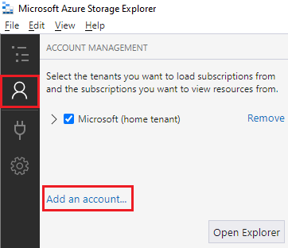
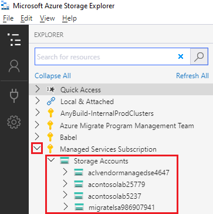
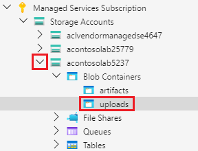
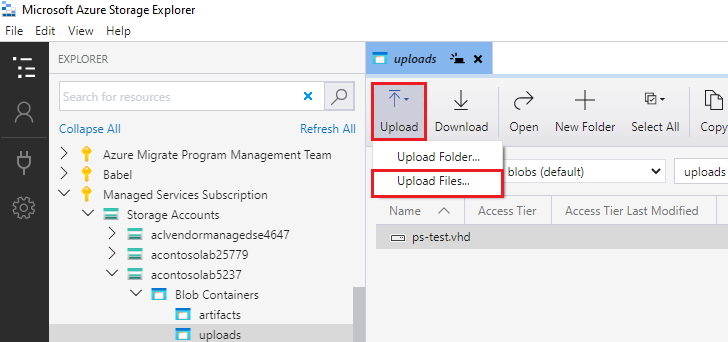
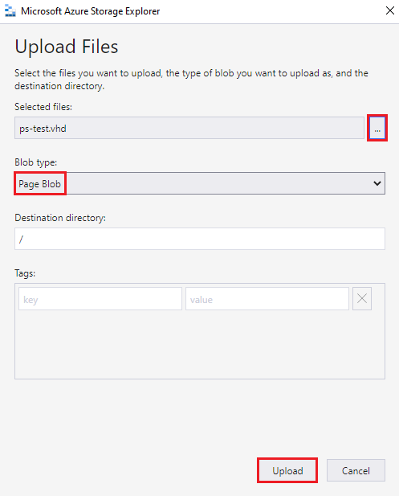

# Upload a VHD file to a lab's storage account by using Storage Explorer

[!INCLUDE [devtest-lab-upload-vhd-selector](../../includes/devtest-lab-upload-vhd-selector.md)]

In Azure DevTest Labs, you can use VHD files to create custom images for provisioning virtual machines. This article describes how to use [Microsoft Azure Storage Explorer](../vs-azure-tools-storage-manage-with-storage-explorer.md) to upload a VHD file to a lab's storage account. Once you upload the VHD file to DevTest Labs, you can [create a custom image](devtest-lab-create-custom-image-from-vhd-using-powershell.md) from the uploaded file. For more information about disks and VHDs in Azure, see [Introduction to managed disks](../virtual-machines/managed-disks-overview.md).

Storage Explorer supports several connection options. This article describes connecting to a storage account associated with your Azure subscription. For information about other Storage Explorer connection options, see [Getting started with Storage Explorer](../vs-azure-tools-storage-manage-with-storage-explorer.md).

## Prerequisites

- [Download and install the latest version of Microsoft Azure Storage Explorer](https://www.storageexplorer.com).

- Get the name of the lab's storage account by using the Azure portal:

  1. In the [Azure portal](https://go.microsoft.com/fwlink/p/?LinkID=525040), search for and select **DevTest Labs**, and then select your lab from the list.
  1. On the lab page, select **Configuration and policies** from the left navigation. 
  1. On the **Configuration and policies** page, under **Virtual machine bases**, select **Custom images**.
  1. On the **Custom images** page, select **Add**. 
  1. On the **Custom image** page, under **VHD**, select the **Upload a VHD using PowerShell** link.
     
  1. On the **Upload an image using PowerShell** page, in the call to the **Add-AzureVhd** cmdlet, the `Destination` parameter shows the lab's storage account name in the following format:
     `https://<STORAGE-ACCOUNT-NAME>.blob.core.windows.net/uploads/`.
  1. Copy the storage account name to use in the following steps.

## Step-by-step instructions

1. When you open Storage Explorer, the left **Explorer** pane shows all the Azure subscriptions you're signed in to. If you need to add a different account, select the **Account Management** icon, and in the **Account management** pane, select **Add an account**. Follow the prompts to sign in with the Microsoft account associated with your Azure subscription.

   

1. After you sign in, the **Explorer** pane shows the Azure subscriptions associated with your account. Select the dropdown arrow next to the Azure subscription you want to use. The left pane shows the storage accounts associated with the selected Azure subscription.

   

1. Select the dropdown arrow next to the lab storage account name you saved earlier.

1. Expand the **Blob Containers** node, and then select **uploads**.

   

1. In the Storage Explorer right pane, on the blob editor toolbar, select **Upload**, and then select **Upload Files**. 

   

1. In the **Upload Files** dialog box, select **...** next to the **Selected files** field, browse to your VHD file, select it, and then select **Open**.

1. Under **Blob type**, change **Block Blob** to **Page Blob**.

1. Select **Upload**.

   

1. The **Activities** pane at the bottom shows upload status. Uploading the VHD file can take a long time, depending on the size of the VHD file and your connection speed.

   

## Next steps

- [Create a custom image in Azure DevTest Labs from a VHD file using the Azure portal](devtest-lab-create-template.md)
- [Create a custom image in Azure DevTest Labs from a VHD file using PowerShell](devtest-lab-create-custom-image-from-vhd-using-powershell.md)

