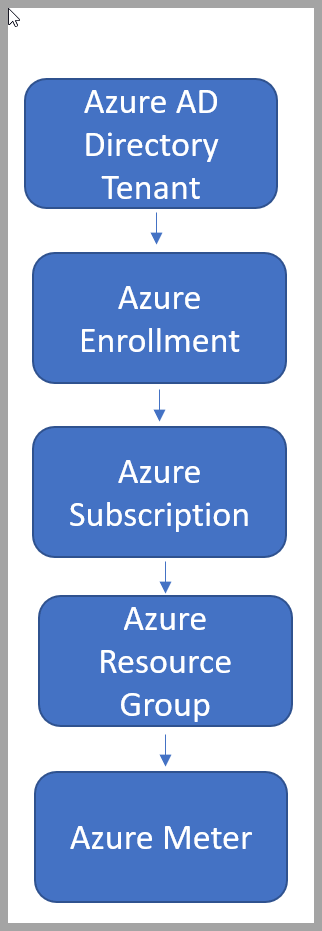

# Add users to your Azure credit subscription  

To manage and access subscription resources, you must be a user within the directory. In the subscriptions themselves, the hierarchy is controlled by the Azure Active Directory (Azure AD) tenancies. Azure AD is a lightweight directory protocol (LDAP) that stores account names and passwords.  

Before adding users, you need to determine your business hierarchy and what level of access they need within your subscription.  

## Why do I need to add users?

Step 1 is determining whether you need to add a new user to your subscription. Here are some examples of why you would need to add new users:  

- Working on a project and need to give IT access to monitor for security  
- Working on new API protocols that could be beneficial to another member of an organization  
- Need to give access at the subscription level so they can access all resource groups  
- At the business level, a single resource group needs to sign in to one computer but they don’t need access to the subscription  
- Provides more visibility and transparency for projects you're working on but still isolates certain parts of work if necessary  
- Add a consultant as a user or within a group to contribute  
- You want to collaborate with someone to test and monitor pre-production  

## Where do I add users and their roles within my subscription?

Within Azure AD access management is a critical function. [Azure role-based access control](../../role-based-access-control/overview.md) \(Azure RBAC\) is the authorization system that provides fine-grained access management of Azure resources.  

Once you’ve determined you need to add a user, you must understand where you're adding them and what resources they need access to. The set of resources that a user can access is referred to as scope.  

If the project and tasks you're working on need to be monitored by IT to enable security protocols, you'll need that user to have an Admin role within the Management group to have full access and permissions within the subscription.  

However, if you're collaborating with another developer or a colleague, they may only need access at the resource or resource group level.  

Read through the [Azure RBAC overview](../../role-based-access-control/overview.md) to better understand how Azure RBAC works and the purpose it serves within your subscription.  

How to Add Users or delete users using Azure Active Directory  

- [Add or delete users - Azure Active Directory | Microsoft Docs](../../active-directory/fundamentals/add-users-azure-active-directory.md)  

- [Steps to assign an Azure role - Azure RBAC | Microsoft Docs](../../role-based-access-control/role-assignments-steps.md)  
